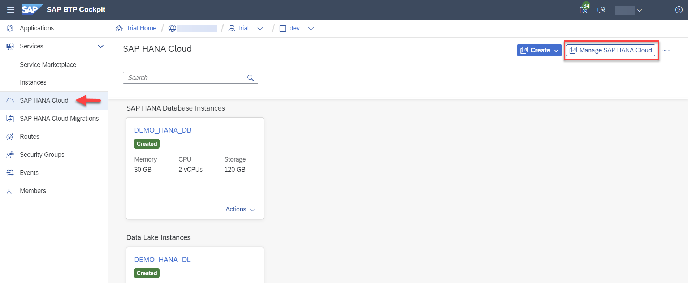
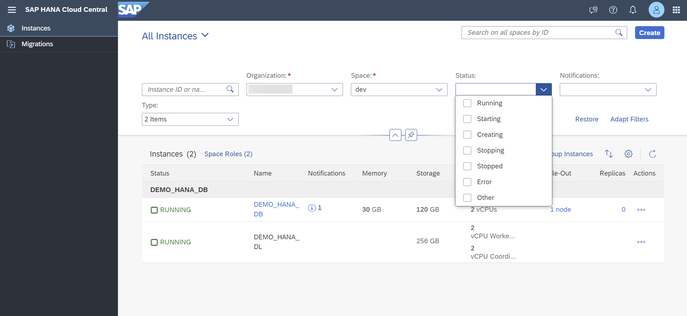
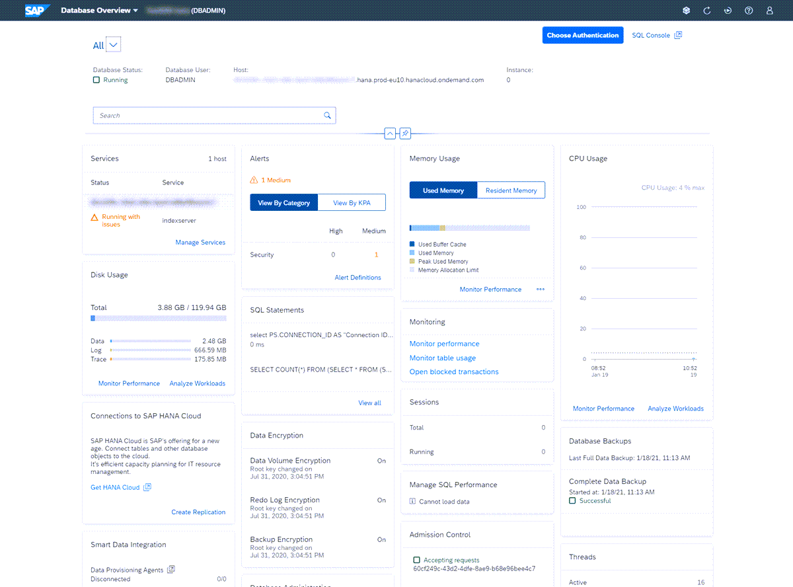
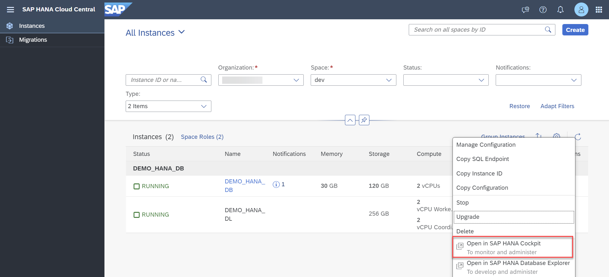
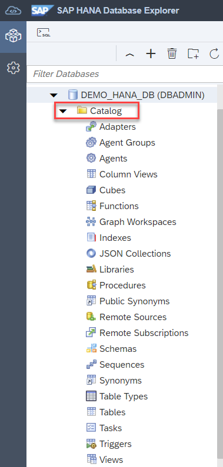
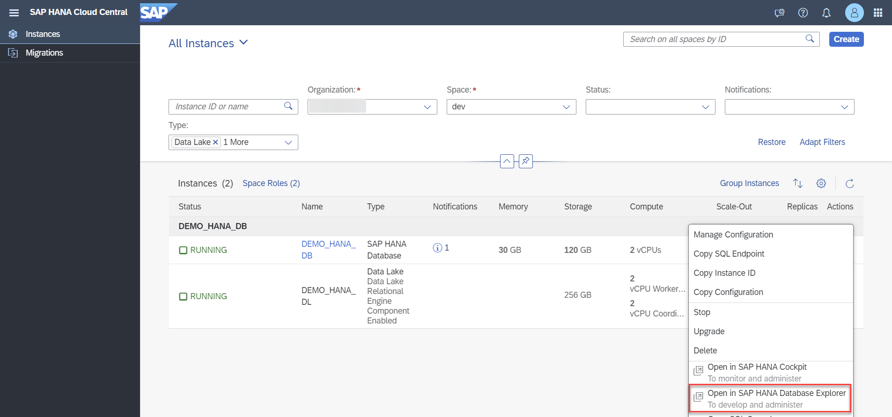

# Tools to Manage and Access the SAP HANA Cloud, SAP HANA Database
<!-- description --> To get started with SAP HANA Cloud, SAP HANA database, you will need to use a few different tools. Learn here what you can use them for.

## Prerequisites
- [Sign up](https://www.sap.com/cmp/td/sap-hana-cloud-trial.html) for the [SAP HANA Cloud trial](hana-cloud-mission-trial-1).
- [Provision an instance of SAP HANA Cloud, SAP HANA database](hana-cloud-mission-trial-2).
- If you have a free tier model or production environment of SAP HANA Cloud, SAP HANA database, you may also follow the steps described in this tutorial.

## You will learn
- How to use SAP HANA Cloud Central
- How to access SAP HANA cockpit
- How to access SAP HANA Database Explorer
- How to access SAP Business Application Studio
- How to obtain the SQL Endpoint of your instance

## Intro
>
> 
>
> Reminder: This tutorial is part of a mission, in which you will help Alex, the CEO of Best Run Travel, to answer a concrete business question with SAP HANA Cloud, SAP HANA database.
>
> *Alex needs to know the top 5 partners of their agency and wants to find out the days with maximum booking of each partner.*

This mission consists of 9 modules that contain the necessary steps you need to follow in your mission to help Alex:

1.	Start using SAP HANA Cloud free tier model or trial in SAP BTP Cockpit

2.	Provision an instance of SAP HANA Cloud, SAP HANA database

3.	You are here <sub-style="font-size:30px">&#9755; **Tools to manage and access the SAP HANA Cloud, SAP HANA Database**

4.	Create users and manage roles and privileges

5.	Import data into SAP HANA Cloud, SAP HANA Database

6.	Query the database using SQL statements

7.	Create a development project in SAP Business Application Studio

8.	Create a calculation view

9.	Grant access to Calculation Views

In this tutorial, you will get to know the tools you need when interacting with your SAP HANA database in SAP HANA Cloud.

> You can follow the steps in this tutorial also by watching this video:
>
<iframe width="560" height="315" src="https://microlearning.opensap.com/embed/secure/iframe/entryId/1_64dk2ry6/uiConfId/43091531" frameborder="0" allowfullscreen></iframe>
>
> ### About this video
>
> This video is meant as additional support material to complete the tutorial. However, we recommend that you only use it for visual guidance but primarily focus on the written steps in this tutorial.

---

### Get to know SAP HANA Cloud Central

SAP HANA Cloud Central is your main administration area for all SAP HANA Cloud instances. Here you can provision new instances, scale your existing instances, deal with alerts and issues in existing instances, and more.

**How to open SAP HANA Cloud Central**

-	In SAP BTP cockpit, in your space where you see your instances, click on **Manage SAP HANA Cloud** at the top right corner of the screen.

    <!-- border -->

-	SAP HANA Cloud Central will open in a new tab, where you can manage this instance.

**What you can do in SAP HANA Cloud Central**

-	*Get an overview of all SAP HANA Cloud instances that you can access*

-	*Create SAP HANA Cloud instances*

-	*Find an instance using the instance ID*

-	*Check the status of an instance*

-	*Review notifications and alerts*

-	*Check the memory, compute, and storage consumption*

-	*Start and stop instances*

-	*Edit and delete instances*

-	*Open the SAP HANA database instance in SAP HANA cockpit and SAP HANA database explorer*

-	*Open the SAP HANA Cloud, data lake instance in SAP HANA database explorer*

**How to find your instances**

-	In SAP HANA Cloud Central you can see all your instances. If you want to manage and maintain multiple instances, you can use the filters and search options on the top center area of the screen.

    <!-- border -->

**Manage your instances**

-	You can open many options by clicking on the **three dots** next to each instance on the list. This includes options to edit, start or stop, or even delete an instance. From this menu, you can also open the other tools you can use with your instances, such as the SAP HANA Database Explorer.

-	One of the most important options you can get from here is the **SQL Endpoint** of your instance. To do so, just click **Copy SQL Endpoint**. You will need this for multiple tasks, such as connecting to other systems.

    <!-- border -->

To learn about more options to create and manage instances with SAP HANA Cloud Central, you can refer to the [**SAP HANA Cloud Administration with SAP HANA Cloud Central Guide**](https://help.sap.com/viewer/9ae9104a46f74a6583ce5182e7fb20cb/LATEST/en-US/48e1b509c9494d61a6f90e7eaa6f225b.html). There, you can also find instructions how to create and manage SAP HANA Cloud instances using the Cloud Foundry command line interface.

### Get to know SAP HANA Cockpit

SAP HANA Cockpit is a tool that can be used to **monitor and manage SAP HANA databases**. Through the SAP HANA Cockpit, for example, it is possible to monitor the amount of CPU and storage that is being used in your SAP HANA Cloud instance. Based on this information, you can make important decisions on how to manage your storage and optimize performance.

Another important feature of the SAP HANA Cockpit is **User Management**, where you can create customized access roles and assign them to new users that should access the SAP HANA Cloud instance.

> **Two cockpits?**
>
> SAP HANA cockpit and SAP BTP Cockpit have similar names but are different tools for different purposes:
>
> - **SAP BTP Cockpit** is the place where you can globally manage instances of different SAP HANA Cloud components and your account, but it also contains many other cloud services.
>
> - **SAP HANA Cockpit** is specific to SAP HANA Cloud, SAP HANA databases and used to only monitor and manage SAP HANA databases in SAP HANA Cloud.    

**What you can do in SAP HANA Cockpit**

<!-- border -->

In SAP HANA Cockpit, you can monitor…

-	*overall database health*

-	*status and resource usage of individual database services*

-	*database performance across a range of key performance indicators related to memory, disk, and CPU usage*

-	*comparative memory utilization of column tables*

-	*memory statistics of the components of database services*

-	*alerts occurring in the database to analyze patterns of occurrence*

Furthermore, you can administer and manage…

-	*Security settings*

-	*Database users and roles*

-	*Replication services*

-	*Performance improvements*

**How to open SAP HANA Cockpit**

1.	To open the SAP HANA Cockpit, go to SAP HANA Cloud Central.

2.	In the row of the instance you want to open in SAP HANA Cockpit, click on the **three dots** in the column **Actions** on the right.

3.	Then, click on **Open in SAP HANA Cockpit**.

    <!-- border -->

4.	The SAP HANA Cockpit will open on a new tab. If this is the first time you are accessing it, you will need to enter the credentials of your DBADMIN user.

You can check out the [technical documentation on all details about SAP HANA Cockpit](https://help.sap.com/viewer/9630e508caef4578b34db22014998dba/LATEST/en-US/6a42679ed8574fb79e94f3e03e6d57bf.html).

### Get to know the SAP HANA Database Explorer

SAP HANA Database Explorer is a tool used to interact with SAP HANA databases, as well as use the SAP Graph and Spatial engines. In the HANA Database Explorer, you can also access the SQL console.

**What you can do in SAP HANA Database Explorer**

<!-- border -->

The SAP HANA Database Explorer offers a graphical interface and the SQL console, giving you choices on how you want to access and manage your data. Among the actions you can do in the Database Explorer are:

-	*Adding and managing remote sources*

-	*Querying the database*

-	*Modeling data*

-	*Accessing, importing, and exporting data*

Whenever you want to view, add or manage any of the items in the catalog, just right click on the item and choose from the options available there.

An important part of the SAP HANA Database Explorer is the **Catalog**. Each database on the SAP HANA Database Explorer has its own catalog, via which it is possible to view data, execute SQL commands and manage remote sources, among other tasks.

<!-- border -->

**How to open SAP HANA Database Explorer**

1.	Go to SAP HANA Cloud Central.

2.	In the row of the instance you want to open in SAP HANA Database Explorer, click on the **three dots** in the column **Actions** on the right.

3.	Then, click on **Open in SAP HANA Database Explorer**.

    <!-- border -->

4.	The SAP HANA Database Explorer will open on a new tab. If this is the first time you are accessing it, you will need to enter the credentials of your DBADMIN user.

> In this mission, you will use the SAP HANA Database Explorer for many tasks, so we recommend you bookmark it for easy access.

For more information on how to use the SAP HANA Database Explorer, you can also check out the tutorial group [Get Started with the SAP HANA Database Explorer](group.hana-cloud-get-started) or refer to the [technical documentation](https://help.sap.com/viewer/a2cea64fa3ac4f90a52405d07600047b/LATEST/en-US/7fa981c8f1b44196b243faeb4afb5793.html).

### Get to know SAP Business Application Studio

SAP Business Application Studio is a development environment available for users with SAP HANA Cloud, SAP HANA database. There, you can create your development projects and model your data, including creating calculation views. This is also the tool you can use to build custom applications that connect and make use of your SAP HANA Cloud databases.

Using SAP Business Application Studio is not strictly necessary to use your trial instance, but if you would like to use calculation views and create applications it is strongly recommended. In this mission, you will learn to use it.

> To use SAP Business Application Studio, you need be subscribed to this service within the SAP BTP cockpit.
>
> If you are using a *trial account*, you can subscribe automatically via the **quick tool access**.
>
> If you are *not* using a trial account or if you have added SAP HANA Cloud to an existing SAP BTP trial, you need to **subscribe manually**.
>
> Select the option that applies to you by clicking on the options below the step title.

[OPTION BEGIN [Quick tool access]]

**Quick tool access in trial**

1.	Go to the SAP BTP Cockpit trial home page.

    <!-- border -->

2.	After logging in, click on the **SAP Business Application Studio** button under the **Quick Tool Access** area.

5.	A new tab will open, and you will be able to use the SAP Business Application Studio.

6.	Click on **OK** to accept the privacy statement if this is your first time accessing SAP Business Application Studio.

7.	We recommend that you bookmark this URL, so you can easy return to the SAP Business Application Studio.

[OPTION END]
[OPTION BEGIN [Subscribe manually]]

**Manually subscribe to SAP Business Application Studio**

1.	Enter your **Subaccount**.

2.	Click on **Service Marketplace** on the right side of the screen

    <!-- border -->

3.	Scroll down or use the search bar to find **SAP Business Application Studio**.

4.	On the SAP Business Application Studio tile, click on the **three dots** and select **Create** to add a subscription. If you can see the option **Go to Application**, you are already subscribed and can click on this option to open SAP Business Application Studio.

    <!-- border -->

5.	A new tab will open, and you will be able to use the SAP Business Application Studio.

6.	Click on **OK** to accept the privacy statement if this is your first time accessing SAP Business Application Studio.

7.	We recommend that you bookmark this URL, so you can easy return to the SAP Business Application Studio.

[OPTION END]

Well done!

You have completed the third tutorial of this mission! Now you know how to access the tools you need to make the best use of your SAP HANA Cloud, SAP HANA database instances. Learn in the next tutorial how create and manage users and privileges.

### Test yourself

---
