# Tools to Manage and Access the SAP HANA Cloud, SAP HANA Database

<!-- description --> To get started with SAP HANA Cloud, SAP HANA database, you will need to use a few different tools. Learn here what you can use them for.

## Prerequisites

- You have completed the tutorial to [provision an instance of SAP HANA Cloud, SAP HANA database](hana-cloud-mission-trial-3)

## You will learn

- How to use SAP HANA Cloud Central
- How to access SAP Business Application Studio

## Intro
>
> 
>
> Reminder: This tutorial is part of a mission, in which you will help Alex, the CEO of Best Run Travel, to answer a concrete business question with SAP HANA Cloud, SAP HANA database.
>
> *Alex needs to know the top 5 partners of their agency and wants to find out the days with maximum booking of each partner.*

In this tutorial, you will get to know the tools you need when interacting with your SAP HANA database in SAP HANA Cloud.

---

### Get to know SAP HANA Cloud Central

SAP HANA Cloud Central is your main administration tool for all SAP HANA Cloud instances. Here you can provision, scale, perform migrations, deal with alerts and issues, and browse and query your instances.

**How to open SAP HANA Cloud Central**

- In SAP BTP cockpit, open SAP HANA Cloud Central by clicking on the subscription to SAP HANA Cloud in the Subscriptions tab.

    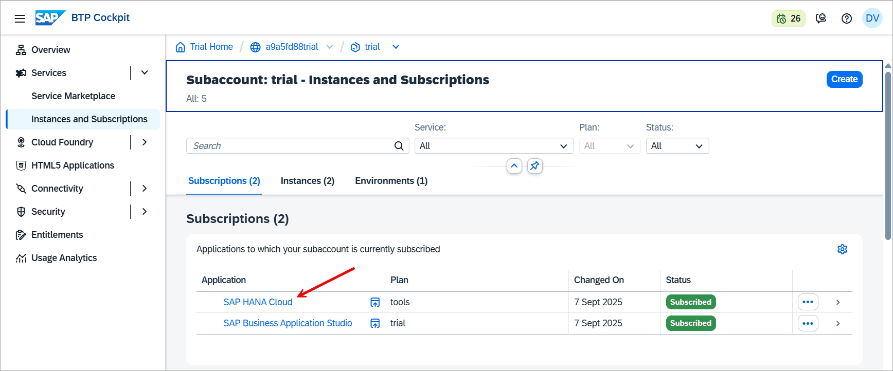

- SAP HANA Cloud Central will open in a new tab, where you can manage this instance.

**What you can do in SAP HANA Cloud Central**

- Find an instance using using various filters such as the name, instance ID, state, or type
- Get an overview of all SAP HANA Cloud instances in a subaccount
- Create SAP HANA Cloud instances
- Check the status of an instance
- Review notifications
- Examine the memory, compute, and storage consumption
- Start and stop instances
- Manage and delete instances
- Perform SAP HANA database migrations
- View alerts in the Alerts app
- Run queries in the SQL console tab
- Explore the schema of the database using the database objects app

**How to find your instances**

- In SAP HANA Cloud Central you can see all your instances. If you want to manage and maintain multiple instances, you can use the filters and search options on the top center area of the screen. Use **Adapt Filters** to modify the types of filters displayed.

    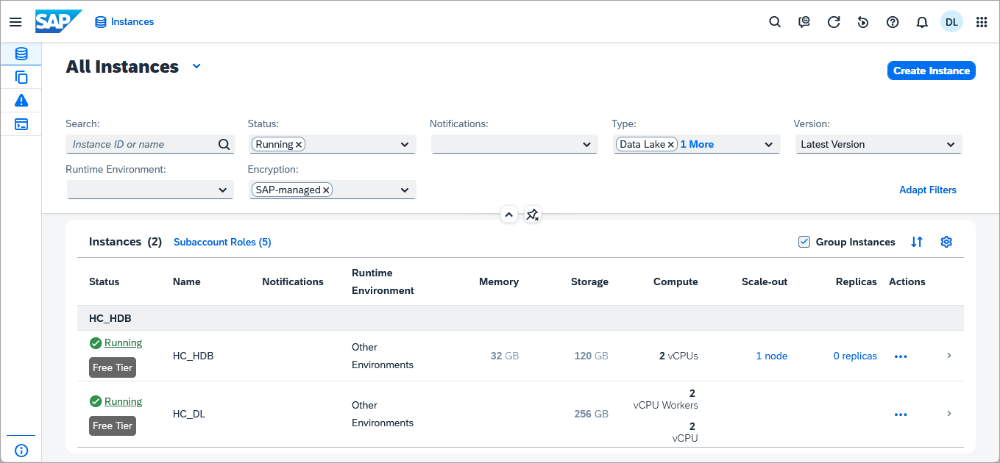

**Manage your instances**

- You can open many options by clicking on the **three dots** under the **Actions** column to each instance on the list. This includes options to manage configurations, start or stop the instance, or delete it.

- One important option is to obtain the **SQL Endpoint** of your instance. To do so, click **Copy SQL Endpoint**. You will need this when you wish to connect to this instance from another application.

    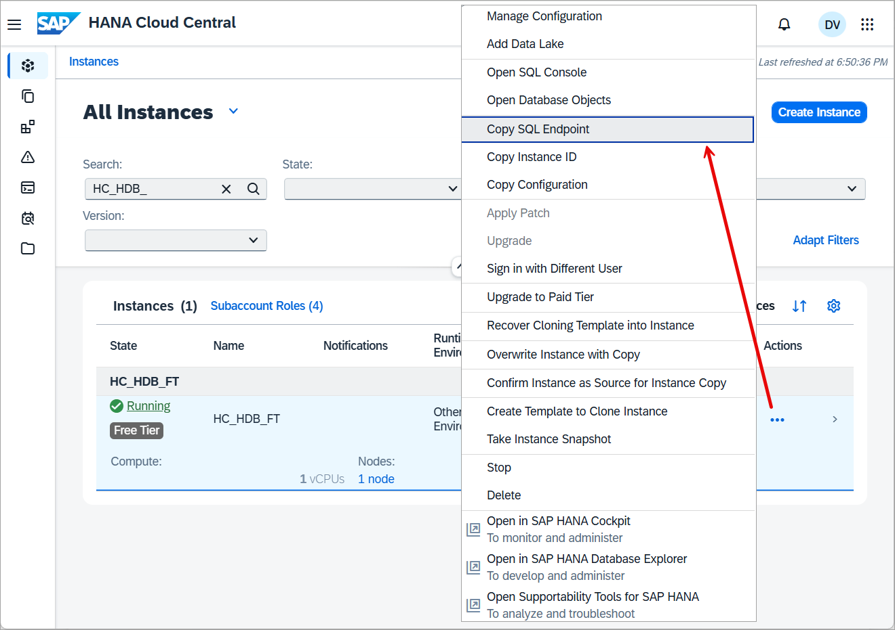

    To learn about more options to create and manage instances with SAP HANA Cloud Central, you can refer to the [**SAP HANA Cloud Administration with SAP HANA Cloud Central Guide**](https://help.sap.com/docs/hana-cloud/sap-hana-cloud-administration-guide/sap-hana-cloud-administration-guide).

**View details of an instance**

- Click on an instance to see further details of an instance including:

    - Memory
    - Compute
    - Network
    - Storage
    - Consumption
    - User & Authorization Management
    - Workload Management
    - Data Replication
    - Auditing
    - Performance Details including expensive statements

    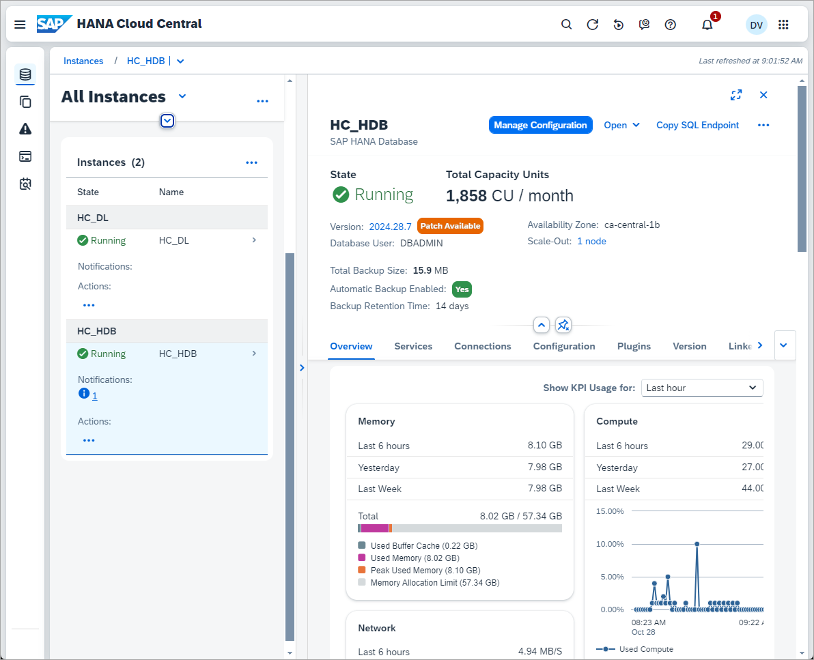

    Based on this information, you can make important decisions on how to manage and optimize your instances.

**Provide database authentication**

- Initially, you are signed in with the DBADMIN database user and the password specified during the instance provisioning wizard.  Should you wish to change this, you can do so using the **Choose Authentication** menu item.

    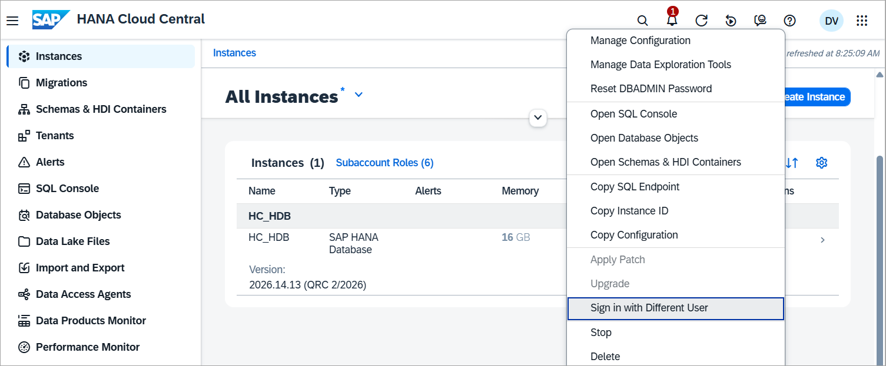

**Browse the database objects**

- In the database objects app, you can:

    - Search for objects in the database
    - Browse the metadata for each object such as the number of rows in a table and the columns and column types
    - View the create statements for objects
    - Generate SQL select statements to view the data of tables or views
    - Generate SQL statements to call functions or procedures
    - Import and export data
    - Add, remove, or manage remote sources

    From the instances action menu, select **Open Database Objects**.

    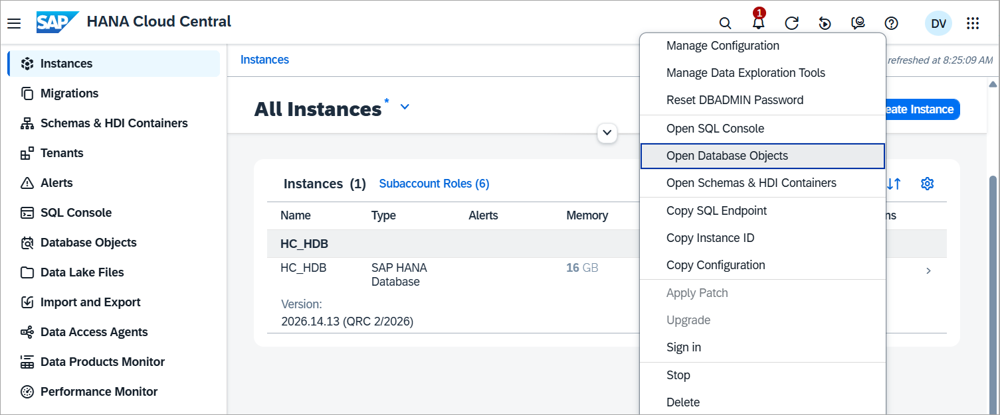

    Select Views, set the schema to be **SYS**, and search for **M_**.

    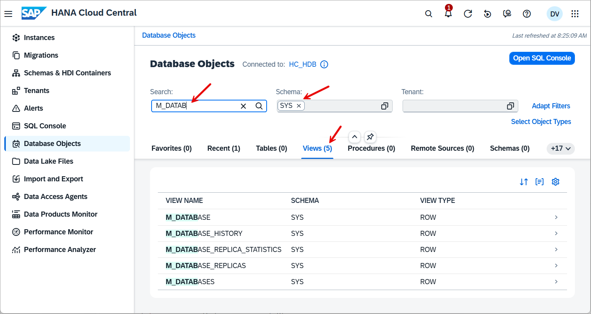

    Above you can see the list of monitoring views in the SYS schema that contain M_ in their name.

    Open the monitoring view **M_DATABASE** and examine its metadata.

    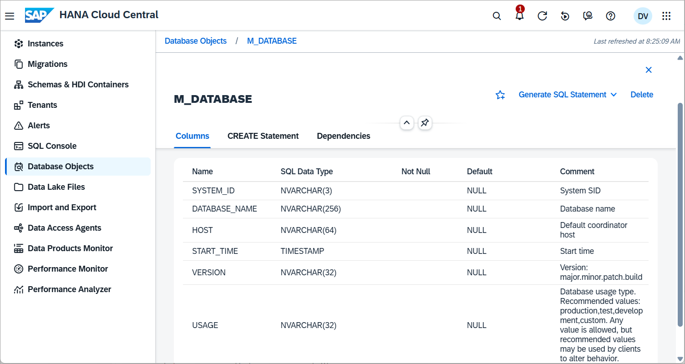

    Using the database objects app you can quickly locate and examine database objects.

**Run queries in the SQL console**

- The SQL console app can be used to write and run SQL queries.

    From the instances page action menu or from the database objects app, select **Open SQL Console**.  

    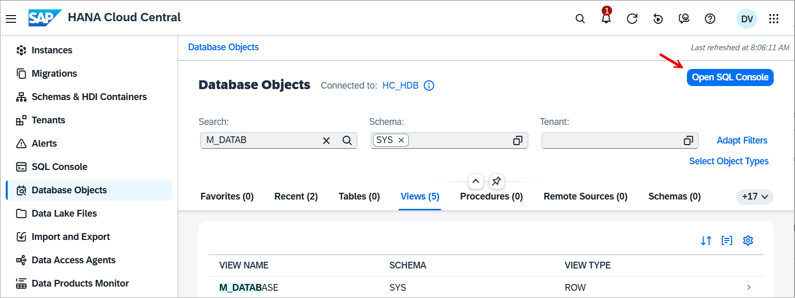

    Once the SQL Console app opens, notice that details can be seen about the current schema, the connected instance, and that further details can be seen in the instance information dialog such as the user being used, and the instance's SQL endpoint.

    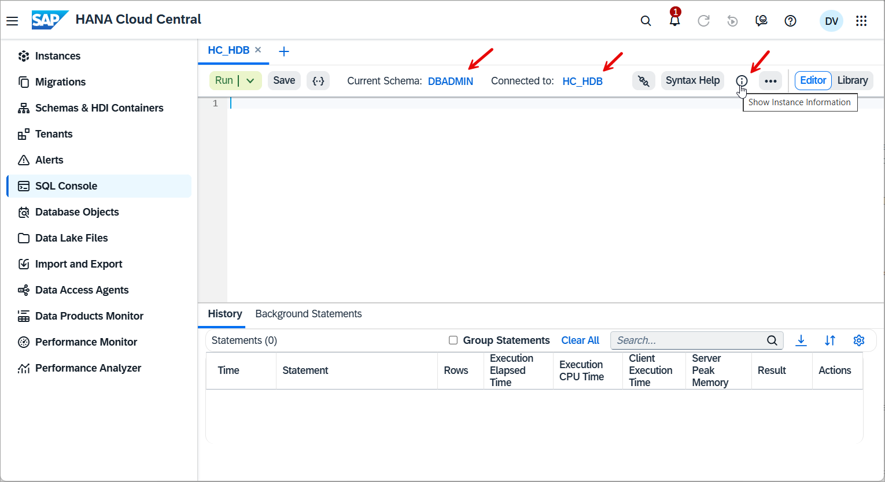
    
    Execute the below SQL query to see the database details.

    ```SQL
    SELECT * FROM SYS.M_DATABASE;
    ```
    
    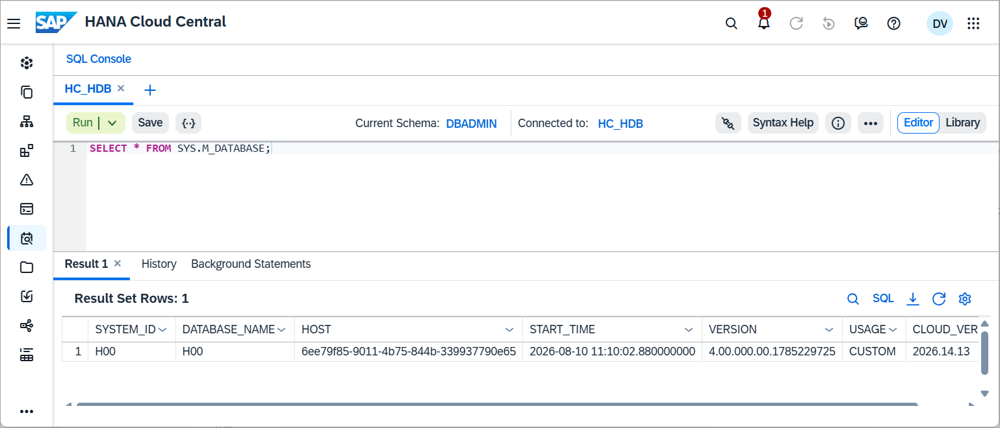

### Get to know SAP Business Application Studio

SAP Business Application Studio is a development environment available for users with SAP HANA Cloud, SAP HANA database. There, you can create your development projects and model your data, including calculation views. This is also the tool you can use to build custom applications that connect and make use of your SAP HANA Cloud databases.

Using SAP Business Application Studio is not strictly necessary to use your SAP HANA Cloud instance, but if you would like to use calculation views and create applications it is strongly recommended. In this mission, you will learn to use it.

**What you can do in SAP Business Application Studio**

The SAP Business Application Studio provides tools specific to building business applications within the SAP ecosystem, covering the end-to-end development cycle. You can:

- Create development spaces
- Clone an existing project
- Create a new project using a template
- Use editors for SAP-specific technologies
- Test your application while consuming services from remote sources
- Build and deploy you application as a multi-target application  

> To use SAP Business Application Studio, you need be subscribed to this service within the SAP BTP Cockpit. You must also have Cloud Foundry enabled to add the SAP Business Application Studio entitlement.
>
> Select the option that applies to you by clicking on the options below the step title.

[OPTION BEGIN [Quick tool access]]

**Quick tool access**

1. Go to the [SAP BTP Cockpit trial home page](https://account.hanatrial.ondemand.com/trial/#/home/trial).

    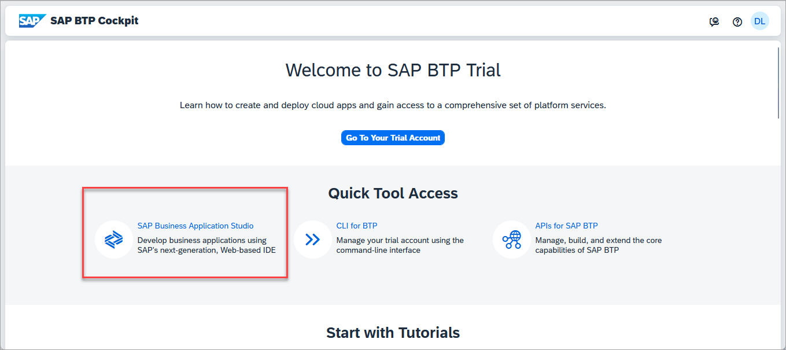

2. After logging in, click on the **SAP Business Application Studio** button under the **Quick Tool Access** area.

3. A new tab will open with SAP Business Application Studio.

4. Click **OK** to accept the privacy statement if this is your first-time accessing SAP Business Application Studio.

5. We recommend that you bookmark this URL so you can easily return to the SAP Business Application Studio.

    > You can learn more about the SAP Business Application Studio by visiting the documentation [here](https://help.sap.com/docs/bas/sap-business-application-studio/what-is-sap-business-application-studio).

[OPTION END]
[OPTION BEGIN [Subscribe manually]]

**Manually subscribe to SAP Business Application Studio**

1. Navigate to your **Subaccount**.

2. Click on **Service Marketplace** on the left side of the screen.

3. Scroll down or use the search bar to find **SAP Business Application Studio** and click on the three dots and choose **Create** to add a subscription.  If you can see the option **Go to Application**, you are already subscribed.

    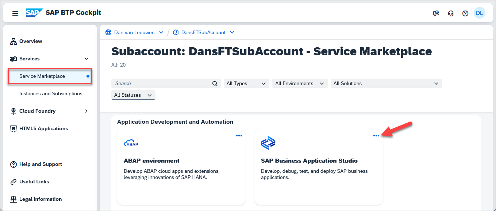

4. Click on **Security** and then **Users**.

    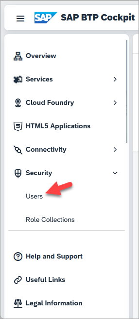

     Select the user that will be using the Business Application Studio and add the role collection **`Business_Application_Studio_Developer`**.

     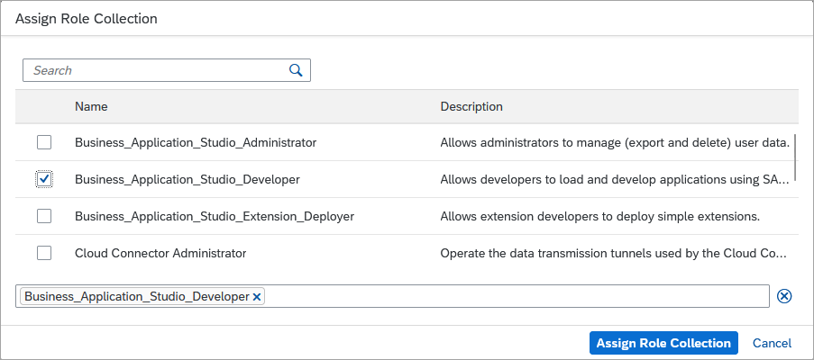

5. Open the SAP Business Application Studio.

    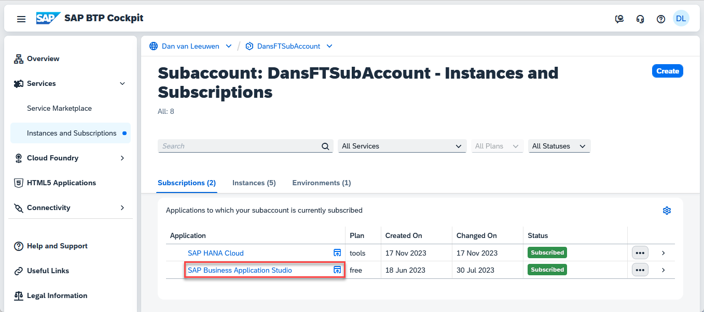

6. Click on **OK** to accept the privacy statement if this is your first-time accessing SAP Business Application Studio.

7. We recommend that you bookmark this URL so you can easily return to the SAP Business Application Studio.

    > You can learn more about SAP Business Application Studio [here](https://help.sap.com/docs/bas/sap-business-application-studio/what-is-sap-business-application-studio).

[OPTION END]

Well done!

You have completed the fourth tutorial of this mission! Now you know how to access the tools you need to make the best use of your SAP HANA Cloud, SAP HANA database instances. Learn in the next tutorial how to import data into your SAP HANA Cloud database.

### Knowledge Check
