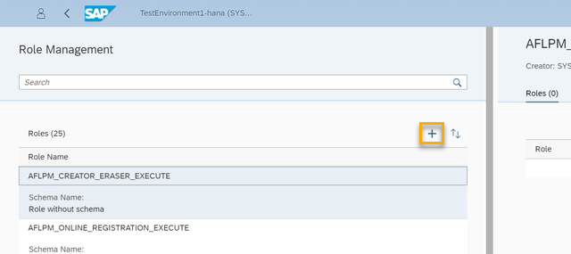
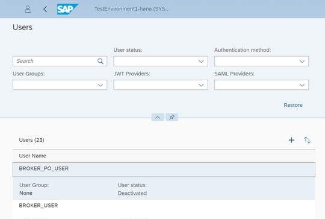

# Create Users and Manage Roles and Privileges
<!-- description --> Learn how to create users and assign roles and privileges in SAP HANA Cloud, SAP HANA database using SAP HANA Cockpit or SQL statements.

## Prerequisites
- [Sign up](https://www.sap.com/cmp/td/sap-hana-cloud-trial.html) for the SAP HANA Cloud trial.
- [Provision an instance of SAP HANA Cloud, SAP HANA database](hana-cloud-mission-trial-2).
- If you have a production environment of SAP HANA Cloud, SAP HANA database, you may also follow the steps described in this tutorial.


## You will learn
- The basics about the role-based security model in SAP HANA Cloud, SAP HANA database
- How to create users in SAP HANA cockpit
- How to assign roles in SAP HANA cockpit
- How to create users, and assign roles and privileges using SQL statements in SAP HANA Database Explorer

## Intro
>
> 
>
> Reminder: This tutorial is part of a mission, in which you will help Alex, the CEO of Best Run Travel, to answer a concrete business question with SAP HANA Cloud, SAP HANA database.
>
> *Alex needs to know the top 5 partners of their agency and wants to find out the days with maximum booking of each partner.*


This mission consists of 9 modules that contain the necessary steps you need to follow in your mission to help Alex:

1.	Start using an SAP HANA Cloud trial in SAP BTP Cockpit

2.	Provision an instance of SAP HANA Cloud, SAP HANA database

3.	Tools to manage and access the SAP HANA Cloud, SAP HANA Database

4.	You are here <sub-style="font-size:30px">&#9755;</sub> **Create users and manage roles and privileges**

5.	Import data into SAP HANA Cloud, SAP HANA Database

6.	Query the database using SQL statements

7.	Create a development project in SAP Business Application Studio

8.	Create a calculation view

9.	Grant access to Calculation Views

In this tutorial, you will learn how to create users and assign roles and privileges in SAP HANA Cloud, SAP HANA database using SAP HANA Cockpit or SQL statements.

---

### Understand roles and privileges


SAP HANA Cloud, SAP HANA database defines user permissions and privileges using a **role-based security model**.

Roles and privileges can be granted to users or revoked from users. A role is a set of privileges that can, as a group, be assigned to a user. Then, as the role's privileges change, the user's privileges change accordingly. Roles can be broken down as follows:

-	**User-Defined Roles** are a custom collection, often created to group privileges and tasks
-	**System Roles** are build-in and automatically created with a new database

A privilege provides the ability to perform an operation on the system. A permission, on the other hand, is that ability in the given environment. A user may not have permission to perform a task if they have the privilege, but not on the currently acted on object. Privileges are broken down as follows:

-	**System privileges** give you the right to perform the action
-	**Object-level privileges** restrict your right to perform the action to the specified objects, on which the privilege is granted.

When a new object is created, the owner can be defined, otherwise, the creator becomes the owner. This gives privileges to modify the structure of the table and grant other privileges to other database users.

Ownership of a table is not sufficient to load the table with data. The user must also have `INSERT` permission on the table.


### Create users and roles and manage privileges


Before you add users to an instance, you should create user roles that fit your needs. You can leverage some of the default user roles, edit them, or create completely customized ones.

There are two ways of creating roles you need to know: First, you can use the SAP HANA cockpit and use the user interface there to create and edit roles. Secondly, you can create roles in the SQL console of the SAP HANA Database Explorer.

In this step, you can find instructions on both of these options. Click on **SAP HANA Cockpit** or **SAP HANA Database Explorer** under the headline of this step to select the option you prefer.

[OPTION BEGIN [SAP HANA Cockpit]]

**Create users and roles in SAP HANA Cockpit**

1.	Open SAP HANA cockpit for your instance from SAP BTP cockpit or SAP HANA Cloud Central.

    > If this is the first time you are opening the SAP HANA cockpit, you will need to insert the initial database username and the instance password.

2.	In SAP HANA cockpit, select the **Security** menu item on the top left-hand side of the screen.

    <!-- border -->

3.	Next, under User & Role Management, click on **Role Management** to get started.

    <!-- border -->

4.	On this screen, you can see a list of all existing user roles on the left-hand side of the screen. If you click on one of them, you will see the details of this role on the right-hand side of the screen. Clicking on one of the roles allows you to edit them, for example, you can assign System, Object and Analytic Privileges and more.

    <!-- border -->

5.	To create a new user role, however, click on the **plus icon** on the top left-hand side of the screen.

    <!-- border -->

6.	This opens the role creation wizard on the right-hand side of the screen. After specifying your new role, click on **Create** at the bottom right corner of the screen.

    <!-- border -->

7.	Now that you created the role, it's time to assign privileges to it. Click on **Edit** at the top right corner when viewing your new role. You have a few options here. First, you can add some of the existing roles into this one, combining the privileges into one single role.

    <!-- border -->

8.	Next, you can select individual privileges, be it system, object, or analytic privileges. For more technical details on creating roles and deciding on privileges, please see our [technical documentation here](https://help.sap.com/viewer/c82f8d6a84c147f8b78bf6416dae7290/LATEST/en-US/dec8d273bb571014b4c2b771d3e0f166.html).

9.	Just click on each of these categories. If you want to add anything, first click on **Edit** on the right-hand side of the screen. Next, click on **Add** and select the privileges.

10.	On this screen, you can also see which users already are assigned to this role or whether this role is being used by any other roles.

    *Your first big step is done! Now it's time to create individual users.*

11.	To get started, click on **Role Management** on the very top center of the screen.

12.	Select **User Management** from the pop-up.

13.	This screen works just like the previous one, so click on the **plus icon** to add a new user.

    <!-- border -->

14.	Next, you can choose between creating a user or creating a restricted user. To know more about what that means, please [click here](https://help.sap.com/viewer/9630e508caef4578b34db22014998dba/LATEST/en-US/b3db382e906646849e227156bd4e0c6e.html).

15.	You can follow the steps on our technical documentation to create each user and make decisions about the roles, privileges and authorizations to give them: [Creating a Database User](https://help.sap.com/viewer/9630e508caef4578b34db22014998dba/LATEST/en-US/0c27278700ea47f9944db7f1b569e7dd.html).

[OPTION END]
[OPTION BEGIN [SAP HANA Database Explorer]]

**Create users and roles in SAP HANA Database Explorer**

To use SQL statements in the SAP HANA Database Explorer to create users, roles and grant privileges, your current user must have the `USERGROUP OPERATOR` privilege for the user group they are in.

> If you are using the `DBADMIN` user for this mission, you already have this privilege.

1.	Open your instance in SAP HANA Database Explorer from SAP BTP cockpit or SAP HANA Cloud Central.

2.	Right click on your database connection in the catalog and select **Open SQL Console**.

3.	To create a user, you can use this simplified statement. Instead of the `<placeholders>`, enter your information to this statement, delete the `< >` characters and run the statement. The username must be unique in the database and the password must contain lower case, upper case, digit, and special characters.

```
CREATE USER <username> PASSWORD "<password>";
```

> Please note that this statement is simplified for an easy start, you have many more options to create the user the way you need it. For example, you can choose different authentication options, validity specifications, optional user parameter options or specify users to be restricted.

To grant this user roles and privileges, you can use the `GRANT` statement. To use this statement to grant a certain privilege, you must have the privilege and permissions required to grant this privilege.

The `GRANT` statement can also be used to grant privileges to roles.

This is the generic structure to use the `GRANT` statement for granting privileges on a certain schema or object to a user:

```SQL
GRANT <privilege> ON <SCHEMA_or_OBJECT> <schema_or_object_name> TO <user_name>
```

For example, to grant the SELECT privilege for the schema SFLIGHT to a user, you would adjust the statement as follows:

```SQL
GRANT SELECT ON SCHEMA SFLIGHT TO <user_name>
```

When granting roles to users, the statement needs to be adjusted as follows:
```SQL
GRANT <role_name> TO <user_name>
```

To allow a user to grant a privilege to other users themselves, you need to add `WITH GRANT OPTION` to the end of the statement. For roles and system privileges, you need to add `WITH ADMIN OPTION` to the statement.

> You can find all the details about syntax elements and all available privileges to grant in the [technical documentation here](https://help.sap.com/viewer/c1d3f60099654ecfb3fe36ac93c121bb/LATEST/en-US/20f674e1751910148a8b990d33efbdc5.html).

[OPTION END]

Well done!

You have completed the fourth tutorial of this mission! Now you know how you can manage access rights in your instance by creating users, and granting roles and privileges using SAP HANA cockpit and the SAP HANA Database Explorer.

You now know all the basics to start working with our sample data and help Alex gain business insights about their company **Best Run Travel**.


Learn in the next tutorial how to import sample data to your SAP HANA Cloud, SAP HANA database.


### Test yourself


---
