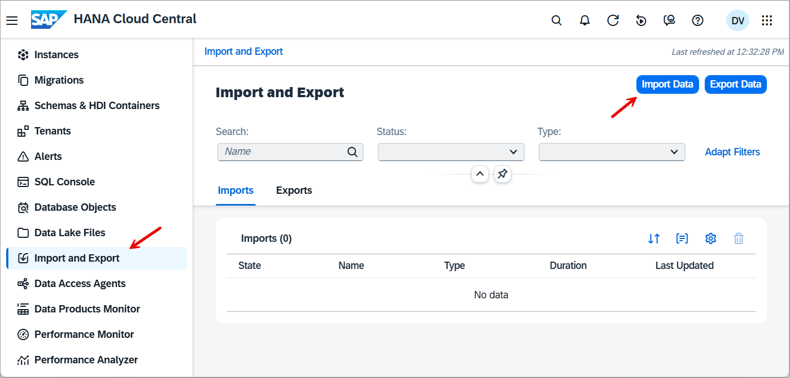
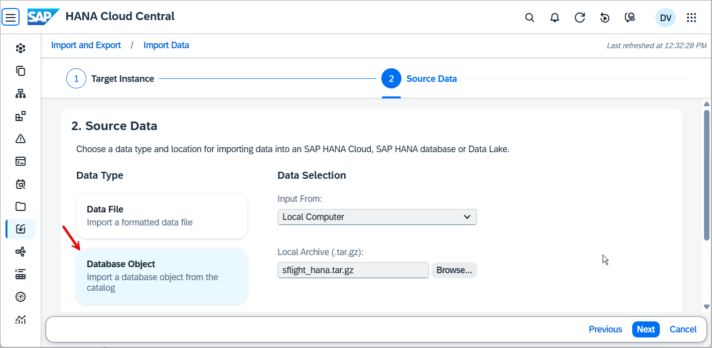
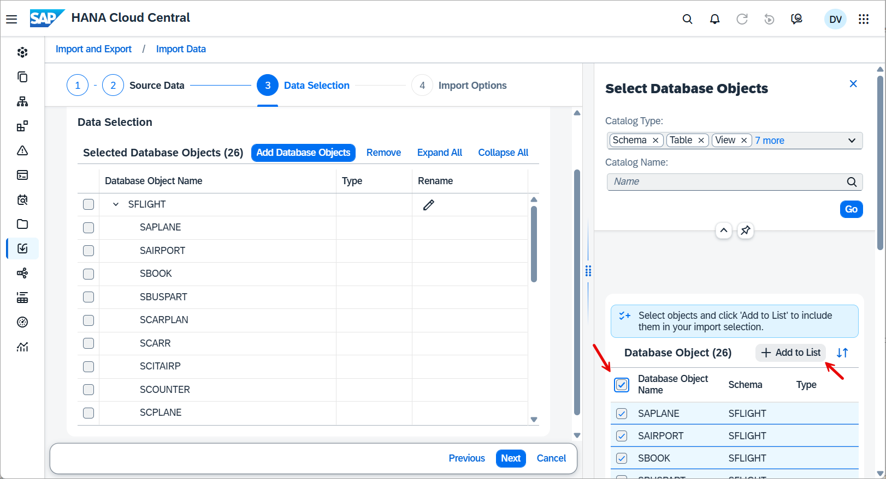
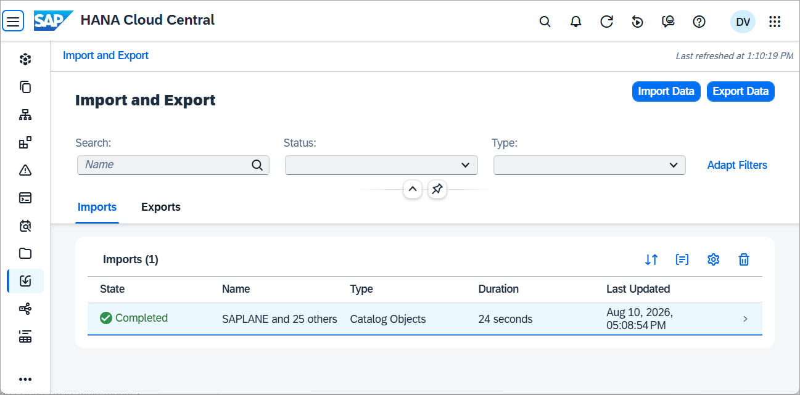
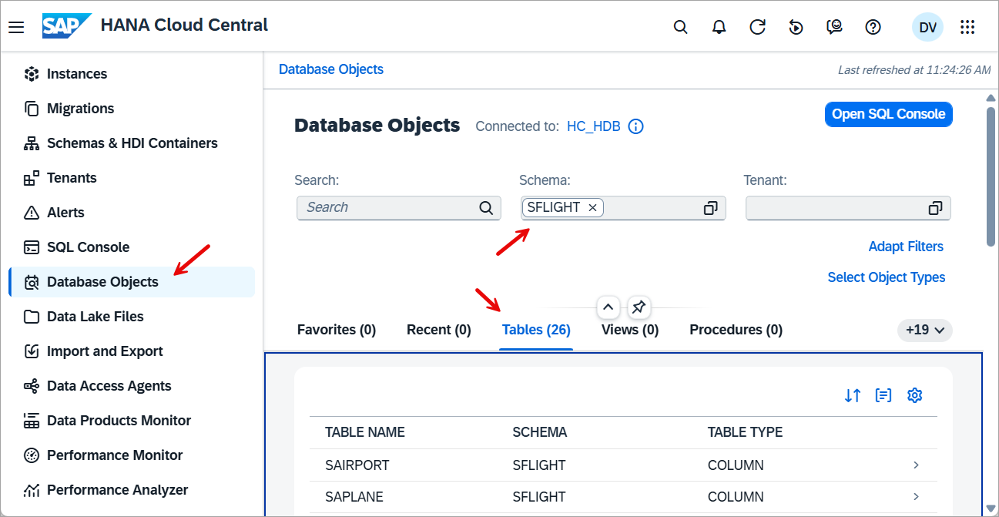
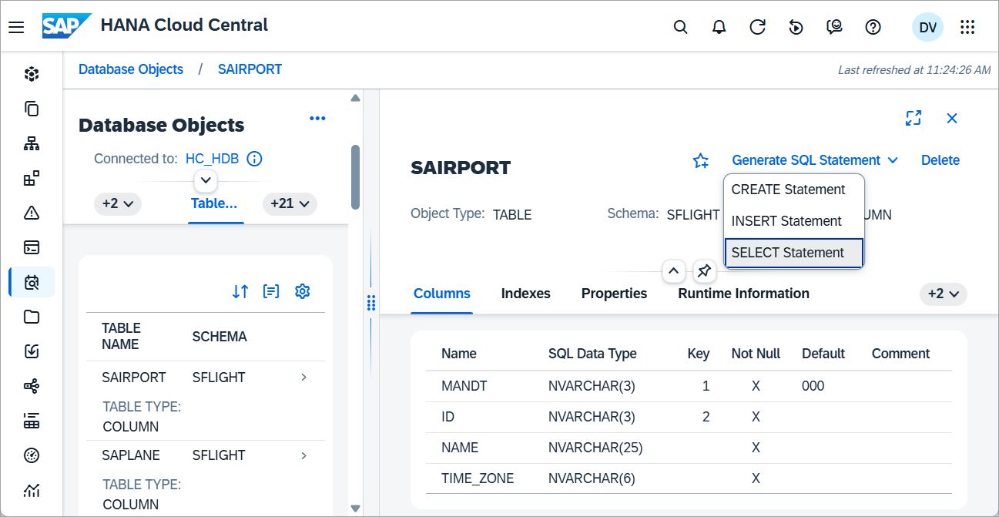
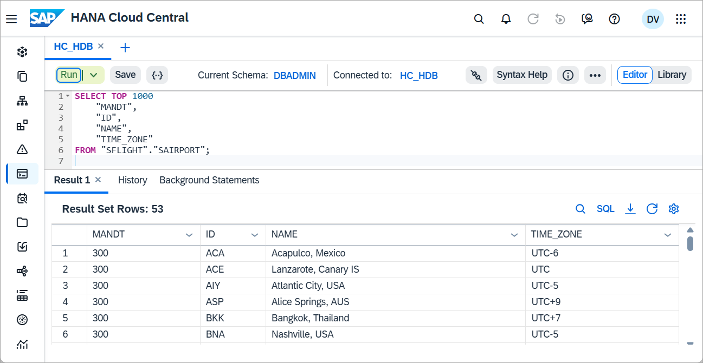

# Import Data into SAP HANA Cloud, SAP HANA Database

<!-- description --> Learn in this tutorial how to import the sample data needed for this mission from a tar.gz file.

## Prerequisites

- You have completed the tutorial to [provision an instance of SAP HANA Cloud, SAP HANA database](hana-cloud-mission-trial-3)

## You will learn

- How to import catalog objects from your local machine to your database using the import and export application

## Intro
>
> 
>
> Reminder: This tutorial is part of a mission, in which you will help Alex, the CEO of Best Run Travel, to answer a concrete business question with SAP HANA Cloud, SAP HANA database.
>
> *Alex needs to know the top 5 partners of their agency and wants to find out the days with maximum booking of each partner.*

---

### Download the sample data set

SAP provides a free data model focused on flight data for anyone to use. We're going to import this sample data and use it to help you complete the mission for Best Run Travel.

1. Download the [SFLIGHT sample data](https://github.com/SAP/hana-xsa-opensap-hana7/raw/snippets_2.3.2/ex2/sflight_hana.tar.gz) from the public SAP GitHub repository and save it on your local machine.

    Note the location of the file.

### Import the data to your catalog

The Import and Export application in SAP HANA Cloud Central simplifies operations involving getting data into or out of your SAP HANA Cloud instance.  The following steps demonstrate how it can be used to import a sample dataset.

1. In the pane on the left, select the **Import and Export** application and click on **Import**.

    

2. Select the instance that the data will be imported to and click next.

3. Choose to import catalog objects, specify that the import will be from a local file (as opposed to a file on a cloud storage provider), and browse to the previously downloaded file and click next.

    

4. The list of available objects to be imported is shown.  Select them all and click **Add to List**.  It is possible at this point to optionally rename the schema that these object will be imported.  Click next.

    

5. The options for the import are shown next.  Click Import to start the import operation.

6. Once the import is completed, the state will change to completed.  

    

### Preview the data

Once the data is imported, you can take a look at the imported tables in the database objects app and execute SQL queries against the tables in the SQL Console.

1. Open the database objects app, connect to the instance, specify a schema filter of **SFLIGHT**, and click on tables.

    

2. Select a table such as SAIRPORT, and choose **SELECT Statement** from the Generate SQL Statement dropdown.

    

    The data of the table will now appear in the SQL Console.

    

You can browse the dataset to get a better overview of the data available.

*Well done!*

You have completed the fifth tutorial of this mission! Now you know how to import tar.gz files to your database.

Learn in the next tutorial how to create and manage users and privileges.

### Knowledge Check