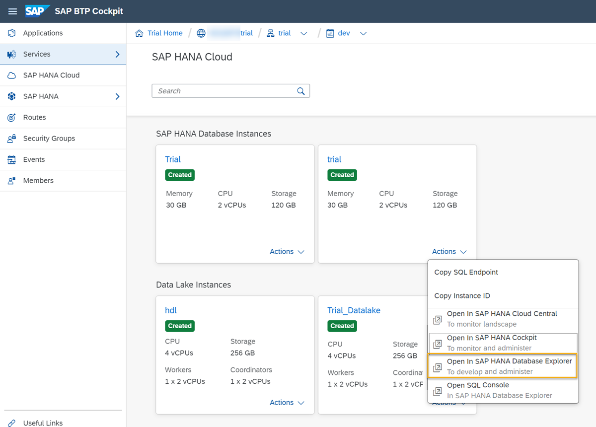
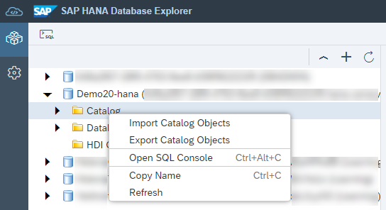
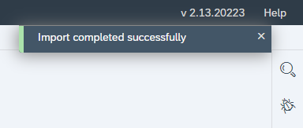
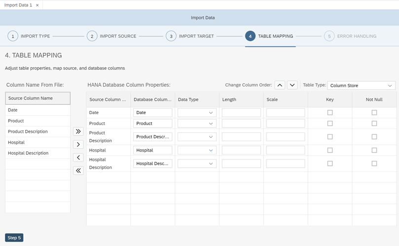

# Import Data into SAP HANA Cloud, SAP HANA Database
<!-- description --> Learn in this tutorial how to use the SAP HANA Database Explorer to import the sample data needed for this mission from a tar.gz file.

## Prerequisites
- [Sign up](https://www.sap.com/cmp/td/sap-hana-cloud-trial.html) for the [SAP HANA Cloud trial](hana-cloud-mission-trial-1).
- [Provision an instance of SAP HANA Cloud, SAP HANA database](hana-cloud-mission-trial-2).
- If you have a production environment of SAP HANA Cloud, SAP HANA database, you may also follow the steps described in this tutorial.

## You will learn
- How to import catalog objects from your local machine to your database using the SAP HANA Database Explorer

## Intro
>
> 
>
> Reminder: This tutorial is part of a mission, in which you will help Alex, the CEO of Best Run Travel, to answer a concrete business question with SAP HANA Cloud, SAP HANA database.
>
> *Alex needs to know the top 5 partners of their agency and wants to find out the days with maximum booking of each partner.*

This mission consists of 9 modules that contain the necessary steps you need to follow in your mission to help Alex:

1.	Start using an SAP HANA Cloud trial in SAP BTP Cockpit

2.	Provision an instance of SAP HANA Cloud, SAP HANA database

3.	Tools to manage and access the SAP HANA Cloud, SAP HANA Database

4.	Create users and manage roles and privileges

5.	You are here <sub-style="font-size:30px">&#9755; **Import data into SAP HANA Cloud, SAP HANA Database**

6.	Query the database using SQL statements

7.	Create a development project in SAP Business Application Studio

8.	Create a calculation view

9.	Grant access to Calculation Views

In this tutorial, you will learn how to import data to your SAP HANA database in SAP HANA Cloud.

> You can follow the steps in this tutorial also by watching this video:
>
<iframe width="560" height="315" src="https://microlearning.opensap.com/embed/secure/iframe/entryId/1_tkv59xbu/uiConfId/43091531" frameborder="0" allowfullscreen></iframe>
>
> ### About this video
>
> This video is meant as additional support material to complete the tutorial. However, we recommend that you only use it for visual guidance but primarily focus on the written steps in this tutorial.

---

### Download the sample data set

SAP provides a free data model focused on flight data for anyone to use. We're going to import this sample data and use it to help you complete the mission for Best Run Travel.

Download the [SFLIGHT sample data](https://github.com/SAP/hana-xsa-opensap-hana7/raw/snippets_2.3.2/ex2/sflight_hana.tar.gz) from the public SAP GitHub repository and save it on your local machine.

Note the location of the file.

### Open the SAP HANA Database Explorer

1.	Open SAP BTP cockpit or SAP HANA Cloud Central.

2.	Click on your instance and select the option to **Open the SAP HANA Database Explorer**.

    <!-- border -->

3.	The SAP HANA Database Explorer will open in a new tab.

### Import the data to your catalog

1.	In the pane on the left, expand your database and right-click on **Catalog**.

2.	Click on **Import Catalog Objects**.

    <!-- border -->

3.	Where it says **Local archive**, click on **Browse** and select the `SFLIGHT` file you previously downloaded to your local machine.

    <!-- border -->

4.	Wait until the archive is uploaded completely. You can see the status of the upload next to the **Browse** button.

    <!-- border -->

5.	Once the upload is completed, you will see a list of **Catalog Objects**. All of the objects will be automatically selected for import.

    <!-- border -->

6.	Keep all options as they are and then click on **Import**.

7.	Once the import is completed, you will see a confirmation notification on the top right-hand side of the screen.

    <!-- border -->

> - Note that you can also import individual `.csv` files in a similar manner. Simply right click on Tables in your catalog and select **Import Data**.
>
>     <!-- border -->

> - A wizard will guide you through the steps. You can select to add the data to an existing or new table and which schema the import should happen in.
>
>     <!-- border -->

> - You will then be asked to specify the column mappings as well as how errors should be handled.
>
>     <!-- border -->

### Preview the data

Once the data is imported, you can take a look at it.

Click on **Tables** to view all your newly imported tables. Please note that your data will be automatically stored in a new schema, called `SFLIGHT`.

To make sure you can see your new tables, click on the **Choose Schema** button next to the schema name on the bottom left-hand side panel.

<!-- border -->

Then select the schema `SFLIGHT`. You can uncheck the default `DBADMIN` schema to see only the `SFLIGHT` tables you just imported.

<!-- border -->

Click **OK** and the list of available tables will be displayed on the same side panel.

<!-- border -->

If you want to see the data inside any of your tables, you can right click on any of them and then click on **Open Data**.

<!-- border -->

This will open the table on the main panel.

<!-- border -->

Feel free to browse the dataset now to get an overview of the data available.

*Well done!*

You have completed the fifth tutorial of this mission! Now you know how to import tar.gz files to your database using the SAP HANA Database Explorer.

Learn in the next tutorial how to query the data.

### Test yourself

---
