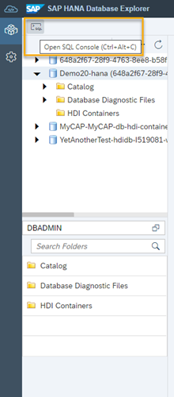
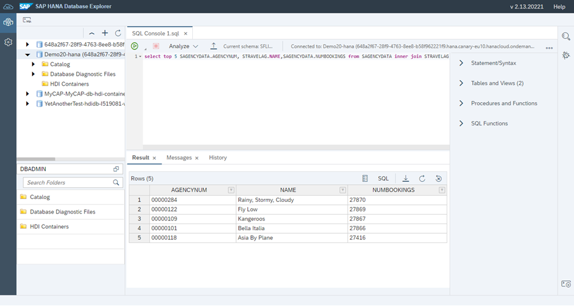
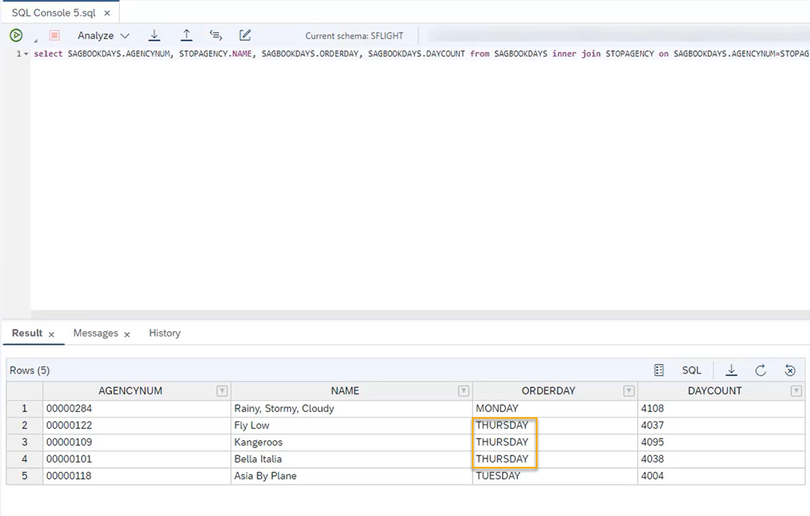

# Query the Database Using SQL Statements
<!-- description --> Learn how to create new tables, view table details, join tables and extract specific data from tables using SQL statements in the SAP HANA Database Explorer.

## Prerequisites
-  [Sign up](https://www.sap.com/cmp/td/sap-hana-cloud-trial.html) for the SAP HANA Cloud trial.
-  If you have a production environment of SAP HANA Cloud, SAP HANA database, you may also follow the steps described in this tutorial.
- [Provision an instance of SAP HANA Cloud, SAP HANA database](hana-cloud-mission-trial-1).
- [Import the sample data needed for this mission](hana-cloud-mission-trial-5).
- Optional: You can [download the code snippets](https://github.com/SAP-samples/hana-cloud-learning/blob/4ac0be770033d3425cc30a2f22f8f5c0823bb810/Mission:%20SAP%20HANA%20Database%20in%20SAP%20HANA%20Cloud/Tutorial%206/Tutorial%206%20Queries.txt) used in this tutorial from our public GitHub repository.


## You will learn
- How to query your database using the SAP HANA Database Explorer using SQL statements
- How to create new tables
- How to join tables
- How to extract specific data from tables


## Intro
> 
> Reminder: This tutorial is part of a mission, in which you will help Alex, the CEO of Best Run Travel, to answer a concrete business question with SAP HANA Cloud, SAP HANA database.
>
> *Alex needs to know the top 5 partners of their agency and wants to find out the days with maximum booking of each partner.*


This mission consists of 9 modules that contain the necessary steps you need to follow in your mission to help Alex:

1.	Start using an SAP HANA Cloud trial in SAP BTP Cockpit

2.	Provision an instance of SAP HANA Cloud, SAP HANA database

3.	Tools to manage and access the SAP HANA Cloud, SAP HANA Database

4.	Create users and manage roles and privileges

5.	Import data into SAP HANA Cloud, SAP HANA Database

6.	You are here <sub-style="font-size:30px">&#9755;</sub> **Query the database using SQL statements**

7.	Create a development project in SAP Business Application Studio

8.	Create a calculation view

9.	Grant access to Calculation Views

In this tutorial, you will learn how to query data in your instance using the SAP HANA Database Explorer.

> You can follow the steps in this tutorial also by watching this video:
>
<iframe width="560" height="315" src="https://microlearning.opensap.com/embed/secure/iframe/entryId/1_6r8ike0s/uiConfId/43091531" frameborder="0" allowfullscreen></iframe>
>
> ### About this video
>
> This video is meant as additional support material to complete the tutorial. However, we recommend that you only use it for visual guidance but primarily focus on the written steps in this tutorial.

---

### Open the SQL console and set the schema


1.	Once you're in the SAP HANA Database Explorer, the first step is to open the SQL Console on the left-hand top corner.

    <!-- border -->

2.	Once the SQL console loads, please make sure that the current schema is `SFLIGHT`. You can check this on the top right-hand side of the console.

3.	If not, copy and paste the following statement to the console and run it:

    ```SQL
set schema SFLIGHT
```

    <!-- border -->


### Query the most popular travel agents


First, let's find out which of the Best Run Travel agents are most popular. For this, we will need the agency number and the booking details. This means we need to use the tables `SBOOK` and `STRAVELAG`.

1.	First, our goal is to extract the total number of bookings made per agency. To achieve this, we will start by creating a new table `SAGENCYDATA` from the existing tables `SBOOK` and `STRAVELAG`.

2.	The following query will create a new table and order the agencies based on their number of bookings. Copy and paste query to the console and then click on the **Run** button:

    ```SQL
create table SAGENCYDATA as (select SBOOK.AGENCYNUM, count(SBOOK.AGENCYNUM) as NUMBOOKINGS from SBOOK, STRAVELAG where SBOOK.AGENCYNUM=STRAVELAG.AGENCYNUM group by SBOOK.AGENCYNUM order by count(SBOOK.AGENCYNUM) desc)
```

3.	You can view the contents of this table by running the following query:

    ```SQL
SELECT * FROM SAGENCYDATA
```

This will show you the contents of the new table:

<!-- border -->


### Join tables to find out which agency makes the most bookings


Next, join the tables `STRAVELAG` and `SAGENCYDATA` based on the column `AGENCYNUM` and extract the top 5 agencies from the result. This will give you the list of agency numbers, names and the number of bookings for the top 5 agencies.

You can use the following query that will join the tables and select the top 5 entries:

```SQL
select top 5 SAGENCYDATA.AGENCYNUM, STRAVELAG.NAME,SAGENCYDATA.NUMBOOKINGS from SAGENCYDATA inner join STRAVELAG on SAGENCYDATA.AGENCYNUM = STRAVELAG.AGENCYNUM
```

In the results panel, you can now see that the travel agency that makes the maximum bookings is `Rainy, Stormy, Cloudy` with a total of **27870 bookings**.

<!-- border -->


### Find out which days have the most bookings


Since Alex also wants to know on which **days of the week** the top 5 travel agencies make most bookings, we need to use a few more queries.

To find the top booking days, we will first create two new tables:

-	`STOPAGENCY`: name, agency number, and count of the bookings made by top 5 agencies
-	`SAGBOOKDAYS`: details on the number of bookings made per day for each of the agencies

1.	First create the `STOPAGENCY` table by storing the result of the previous query in a new table. Run this query in your console:

    ```SQL
create table STOPAGENCY as (select top 5 SAGENCYDATA.AGENCYNUM, STRAVELAG.NAME,SAGENCYDATA.NUMBOOKINGS from SAGENCYDATA inner join STRAVELAG on SAGENCYDATA.AGENCYNUM = STRAVELAG.AGENCYNUM)
```

2.	To view all contents of this table, just copy and paste the following query into the SQL console and run it:

    ```SQL
SELECT * FROM STOPAGENCY
```

3.	Next, create the table `SAGBOOKDAYS` to store the daily bookings for each of the agencies. Use the following query:

    ```SQL
create table SAGBOOKDAYS as (select AGENCYNUM, dayname(ORDER_DATE) as ORDERDAY, count(dayname(ORDER_DATE)) as DAYCOUNT from SBOOK group by AGENCYNUM, dayname(ORDER_DATE))
```

4.	To view all contents of this new table, you can again use the `SELECT * FROM` query:

    ```SQL
SELECT * FROM SAGBOOKDAYS
```

5.	Now that you have created the 2 tables, join these tables based on the agency number (column `AGENCYNUM`). You also need to extract only the day with maximum number of bookings for each of the top 5 agencies. For this, use the following nested queries:

    ```SQL
select SAGBOOKDAYS.AGENCYNUM, STOPAGENCY.NAME, SAGBOOKDAYS.ORDERDAY, SAGBOOKDAYS.DAYCOUNT from SAGBOOKDAYS inner join STOPAGENCY on SAGBOOKDAYS.AGENCYNUM=STOPAGENCY.AGENCYNUM where SAGBOOKDAYS.DAYCOUNT in (select max(DAYCOUNT) from SAGBOOKDAYS group by AGENCYNUM)
```

6.	Now you can see that the most bookings for the top 5 agencies have been done on **Thursdays**.

    <!-- border -->

*Well done!*

You have completed the sixth tutorial of this mission! You learned how to create new tables, view table details, join tables and extract specific data from tables using SQL statements in the SAP HANA Database Explorer. This way you were able to help Alex get the business inside they were looking for.

Since Alex needs to make these insights available to other departments in Best Run Travel, the next step is to create a calculation view to share these findings with other departments.  

Learn in the next tutorial how to get started with SAP Business Application Studio to start creating a calculation view.


### Test yourself


---
