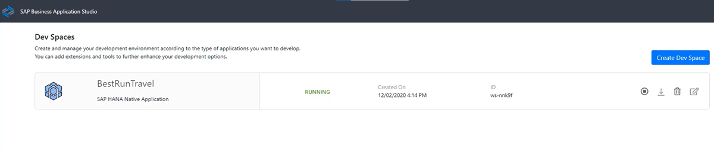
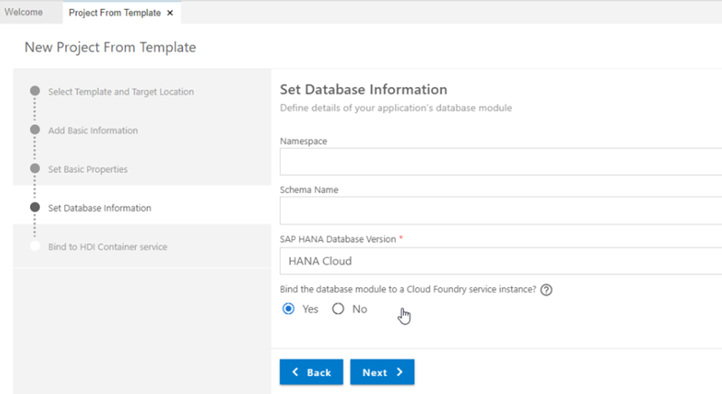
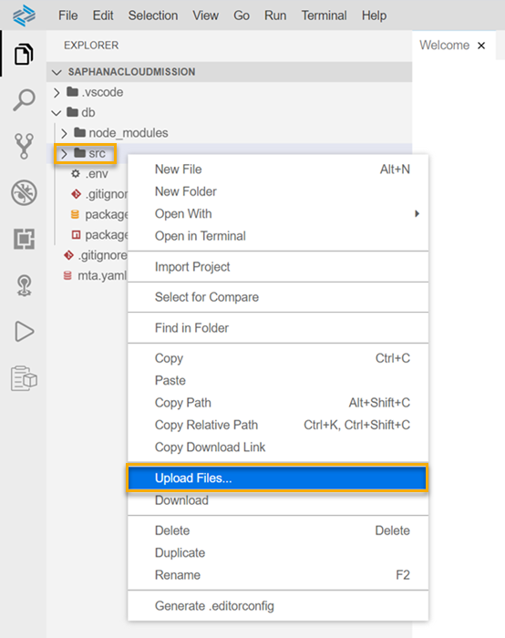

## Prerequisites
- [Sign up](https://www.sap.com/cmp/td/sap-hana-cloud-trial.html) for the SAP HANA Cloud trial.
- If you have a production environment of SAP HANA Cloud, SAP HANA database, you may also follow the steps described in this tutorial.
- [Provision an instance of SAP HANA Cloud, SAP HANA database](hana-cloud-mission-trial-1).
- [Import the sample data needed for this mission](hana-cloud-mission-trial-5).
- [Download the sample code](https://github.com/SAP-samples/hana-cloud-learning/blob/4ac0be770033d3425cc30a2f22f8f5c0823bb810/Mission:%20SAP%20HANA%20Database%20in%20SAP%20HANA%20Cloud/Tutorial%206/Tutorial%206%20Queries.txt) files from our public GitHub repository.


## Details
### You will learn
- How to create a development space and project in SAP Business Application Studio
- How to establish a connection to your database
- How to create a user-provided service
- How to create an `.hdbgrants` file
- How to deploy a project


> 
> Reminder: This tutorial is part of a mission, in which you will help Alex, the CEO of Best Run Travel, to answer a concrete business question with SAP HANA Cloud, SAP HANA database.
>
> *Alex needs to know the top 5 partners of their agency and wants to find out the days with maximum booking of each partner.*

This mission consists of 9 modules that contain the necessary steps you need to follow in your mission to help Alex:

1.	Start using an SAP HANA Cloud trial in SAP BTP Cockpit

2.	Provision an instance of SAP HANA Cloud, SAP HANA database

3.	Tools to manage and access the SAP HANA Cloud, SAP HANA Database

4.	Create users and manage roles and privileges

5.	Import data into SAP HANA Cloud, SAP HANA Database

6.	Query the database using SQL statements

7.	You are here **`->`Create a development project in SAP Business Application Studio**

8.	Create a calculation view

9.	Grant access to Calculation Views

In this tutorial, you will learn how to start preparations to create a calculation view by setting up a project in SAP Business Application Studio and establishing a connection to your database.

You can follow the steps in this tutorial also by watching this video.

<iframe width="560" height="315" src="https://microlearning.opensap.com/embed/secure/iframe/entryId/1_rwt2s12t/uiConfId/43091531" frameborder="0" allowfullscreen></iframe>

---

[ACCORDION-BEGIN [Step 1: ](Create your development space)]

> **Reminder:** What is SAP Business Application Studio?
>
> SAP Business Application Studio is a service within SAP Business Technology Platform that provides a development environment for SAP Cloud Foundry. This is an important tool to any kind of development with SAP HANA Cloud, SAP HANA database, including creating calculation views.
>
> SAP Business Application Studio is already included in your trial account. You can access it on the Trial home page. If you are unsure how to open it, please check out [Tutorial 3](hana-cloud-mission-trial-3) of this mission.

The first step in the SAP Business Application Studio is to create your development space. Development spaces are like isolated virtual machines in the cloud containing tailored tools and pre-installed runtimes per business scenario, such as an SAP HANA development project.

To create your first development space, follow these steps:

1.	Open SAP Business Application Studio.

2.	On the top right-hand corner, click on **Create Dev Space**.

    !

3.	Give your development space a name. You can choose any name you prefer, but you cannot use spaces in this name.

4.	Under the name, you need to choose the kind of application you will create. To use SAP HANA tools, such as calculation views, please make sure to check **SAP HANA Native Application** in the list.

    !

5.	On the right-side of the screen, you will see a list of the pre-defined extensions included in this project. You can also choose to select additional extensions to your project, if necessary.

6.	Then, click on **Create Dev Space** on the bottom right-side of the screen. You will return to the list of existing development spaces. Your newly created space is now on the list and you can see the status as Starting. This should take no more than a few seconds to start.

7.	Once the status changes to **Running**, you can click on the name of the development space to open it.

    !


[DONE]
[ACCORDION-END]

[ACCORDION-BEGIN [Step 2: ](Create your development project)]

Now you can create a development project within your new space. Follow these steps:

1.	On the **Welcome** page in the middle of the screen, click on **Start from template**.

    !

2.	Next, click on **SAP HANA Database Project**, and then click on **Start** at the very bottom of the screen.

    !

3.	Give your project a name and then click on **Next**.

4.	Now you can change the name of your database module, but you can also choose the default name, which is `db`.

5.	In the step **Set Database Information**, you can choose to determine a **Namespace** and a **Schema Name**. These are not mandatory and for the purpose of this mission, *we recommend you leave these fields empty*.

6.	Make sure the **SAP HANA database version** is set to `SAP HANA Cloud`.

7.	Then, click on **Yes** under **Bind the database module to a Cloud Foundry service instance**.

8.	Finally, click on **Next**.

    !

9.	To bind your project to your SAP HANA Cloud, SAP HANA database, you must login with your SAP BTP credentials in the next step. Insert your email address and your password. On the right corner of the password field, click on the  icon to login.

10.	Once the login is complete, your organization and space are automatically selected. If you are part of multiple organizations or spaces, you can adjust the preselected options via the drop-down menus.

11.	Under **Create a new HDI service instance** select **Yes**.

12.	Then, enter a unique name for your service instance. You can keep the default name.

13.	You can leave the last option **Use the default database instance of the selected Cloud Foundry space?** checked as **Yes**.

14.	Click on **Finish** to create the project.

    !

Your project will be generated, which takes a few minutes to complete. You can follow the status of your project creation on the bottom right corner of the screen.

Once the project is complete, you will see a notification on the bottom right-corner of the screen. Click on Open in New Workspace. Your project will open, and you can see the structure on the left-hand panel.

!


[DONE]
[ACCORDION-END]


[ACCORDION-BEGIN [Step 3: ](Get to know the SAP HANA Project Panel)]

On the left panel, you can now see your workspace where you have your files, and the **SAP HANA Project** panel underneath where you can deploy your project and open the HDI container in the SAP HANA Database Explorer.

> **What is an HDI container?**
>
> Applications are bound to an SAP HANA Cloud instance through a schema or an HDI container. HDI containers ensure isolation, and within an SAP HANA database you can define an arbitrary number of HDI containers. HDI containers are isolated from each other by means of schema-level access privileges. You can read more in this [technical documentation](https://help.sap.com/viewer/db19c7071e5f4101837e23f06e576495/LATEST/en-US/9988e476278d408db084a407dff314af.html) .

Whenever you add a new database object that can be deployed to your HDI container, it will appear in this panel and you can deploy it. In this area you can also check the database connections of your project.

!

Moving your cursor to the name of an object, folder, or connection in this panel, you will see different icons:

-	This icon  will open the HDI container in SAP HANA Database Explorer
-	This icon  will deploy an object, folder or the whole project to the HDI container or other connected database.
-	This icon  (only on the Database Connections level) allows you to create a new database connection.
-	This icon  /   allows you to bind (green color) or unbind (grey color) a database connection.

**Find command**

An important function that can help you get the commands you need, is the `Find command` prompt.
When you click on **View** on the top menu and select **Find command**, a prompt will open at the top center of the screen. In this field, you can search for all commands available and select the one you need.

!

The most important one for SAP HANA Cloud, SAP HANA database development is the command **Create SAP HANA Database Artifact**. This command will open a UI that allows you to create many database objects, like tables, roles, services and many more.

!

> To open the **Find command** prompt, you can also use the key combination `Ctrl + Shift + P`.


[DONE]
[ACCORDION-END]

[ACCORDION-BEGIN [Step 4: ](Create a user-provided service)]

Now that your project is created and you know the basics of how to navigate SAP Business Application Studio, your next step is to create a **user-provided service**, which will allow the project to access the data within the database.


1.	In the SAP HANA Projects Panel, expand your project.

2.	Hover your cursor over the section **Database Connections**, and a plus icon () will appear. This option allows you to add a new database connection. Click on the  icon.

    !

3.	In the field **Select connection type**, choose the option **Create user-provided service instance** from the drop-down menu.

4.	Enter a name for your service, for example `MyConnection`.

5.	Now you have two options to establish the connection to the database. Selecting **Use deployment target container database** only requires you to provide the credentials of the database your HDI container is in. In this case, enter **DBADMIN** and the **password** for this user and click on **Add**.

    !

6.	If you select the other option **Provide database information**, you can manually enter the database you want to connect to. In this case, you need to enter host name host port.

    > **Where can I find host name and host port of my database?**
>
> Go to SAP HANA Cloud Central, select your database, click on the three dots in the **Actions** column and select **Copy SQL Endpoint**.
>
> 
>
> Not sure where to find SAP HANA Cloud Central? Please revisit [Tutorial 3](hana-cloud-mission-trial-3) of this mission.
>
> When you copy the endpoint, it will look something like this:
>
> `xxxxxxxx-xxxxx-xxxx-xxxx-xxxxxxxxxxxx.hana.trial-eu10.hanacloud.ondemand.com:443`
>
> The sequence of characters before the `:` represent your host name. `443` is the SAP HANA Cloud host port.

    !

7.	Once you entered all your database information, click on **Add**. The user-provided service will be created.

    !


[DONE]
[ACCORDION-END]

[ACCORDION-BEGIN [Step 5: ](Creating an hdbgrants file)]

Now that you have a connection to your database, it is important to grant privileges to the object owner and application users so they can access the data in the database. You could do that by creating individual roles, which are `.hdbroles` database objects that you would have to assign to users in the SAP HANA Database Explorer.

A more convenient option to assign a set of privileges to many users directly from your project is an `.hdbgrants` file. This file will specify that the user-provided service will be used to grant the privileges entered in the `.hdbgrants` file in the connected database.

> Note: This step only has to be done once in the beginning for a project. You will only have to modify the file if you need additional privileges.

We have prepared an `.hdbgrants` file that is ready for you to use and import to your project but also added instructions here to create an `.hdbgrants` file yourself. Select one of the options below this step title:

-	**Upload `.hdbgrants`** to import a ready-made `.hdbgrants` file to your project.
-	**Create `.hdbgrants`** to learn how to create it yourself.

[OPTION BEGIN [Upload `.hdbgrants`]]

**Upload our file**

1.	First, [download](https://github.com/SAP-samples/hana-cloud-learning/blob/e776385d3d2d21c7a888344a82aa15a8f8d308bd/Mission:%20SAP%20HANA%20Database%20in%20SAP%20HANA%20Cloud/Tutorial%207/SFLIGHT.hdbgrants.zip) the `.hdbgrants` file we have prepared for you from our public GitHub repository to your local machine and unzip it.

2.	In SAP Business Application Studio, expand the `db` folder on the left-side panel. Then right-click on the `src` folder. Click on **Upload Files**.

    !

3.	Find the `.hdbgrants` file you downloaded and unpacked and select it for upload.

4.	Once the file is there, click on it to open it. You can see that this file grants the privilege `SELECT` for the schema `SFLIGHT`.

5.	In line 2, `MyConnection` is a placeholder for the user-provided service instance name. Change the name of the user provided service if you have named it differently in the previous step.

    !

[OPTION END]
[OPTION BEGIN [Create `.hdbgrants`]]

**Create your own file**

1.	Open the Find command prompt and search for **Create SAP HANA Database Artifact**.

2.	Make sure that in the first field, the `src` folder of your project is selected. This should happen automatically, when you click on the `src` folder in the file explorer previously to starting the command.

3.	Choose the database version **HANA Cloud**.

4.	From the drop-down menu, select **`Grants (hdbgrants)`**.

5.	Enter a name for the file, for example `SFLIGHT`.

6.	Click on **Create**. The file will be created, and you can see it in your `src` folder.

    !

7.	Click on the file in the File explorer and the code of this file will open. Here, you can see a template of all different types of privileges you could grant to different user groups. There is a dedicated section for object owner users and application users.

8.	For the purposes of this tutorial, we would like to grant the schema privilege `SELECT` on the schema `SFLIGHT` to both the object owner and application user.

9.	That means, we will not need the lines for system privileges, global roles, object privileges, and global object privileges. So, you can **remove lines** `4-15` and `23-45` in the section **object owner**.

    !

10.	In the section **application user**, remove the lines `48`, `49`, and ` 51-53`. The only privileges you want are `schema_privileges`. Lastly, remove the `,` after the last `]` of each section.

    !

11.	This is what the file should look like after removing the lines you do not need:

    !

12.	Now, in `line 6`, enter the schema name `SFLIGHT` since we want to grant privileges on this schema.

13.	Our goal is to grant privileges **with** grant option, so, you can **remove** `line 7` as well.

14.	Since the `SELECT` privileges should also be granted to the application user, copy `lines 5-8` and paste it in `line 12` between the `[]`.

15.	To clean up the formatting, right click anywhere in the file and select **Format document**.

    !

16.	Your last step is to enter the name of your user-provided service instead of the placeholder `<UPS>`. In step 4, we named our user-provided service `MyConnection`.

17.	At the end, your file should look like this:

    ```JSON
{
    "MyConnection": {
        "object_owner": {
            "schema_privileges": [
                {
                    "schema": "SFLIGHT",
                    "privileges_with_grant_option": [
                        "SELECT"
                    ]
                }
            ]
        },
        "application_user": {
            "schema_privileges": [
                {
                    "schema": "SFLIGHT",
                    "privileges_with_grant_option": [
                        "SELECT"
                    ]
                }
            ]
        }
    }
}
```

[OPTION END]


[DONE]
[ACCORDION-END]

[ACCORDION-BEGIN [Step 6: ](Deploy your project)]

Now that the connection to your database is established and the grants file is created, you can deploy the project.

1.	Go to the lower left corner of the screen, where you can see the **SAP HANA Projects** pane.

2.	Expand the items under your project name. Next to the name of the user provided service you see the plug icon (). Click on it to bind your user provided service.

3.	When the prompt in the top of the screen comes up, select **Bind a user provided service**.

4.	Then, select the name of your user provided service from the list. Press `Enter`.

5.	Next to your project name, you will see a small icon in the shape of a rocket(). Click on it to deploy your project.

Once the deployment is successfully completed, you will see the completion message in the bottom area of your screen.

!

*Well done!*

You have completed the seventh tutorial of this mission! You learned how to set up a development project in SAP Business Application Studio and connecting it to your database with a user-provided service and an `.hdbgrants` file. You are all set now to create a calculation view.
Learn in the next tutorial how to create a calculation view to achieve your mission objective.


[DONE]
[ACCORDION-END]

[ACCORDION-BEGIN [Step 7: ](Test yourself)]


[VALIDATE_7]
[ACCORDION-END]

---
