# Create a Calculation View
<!-- description --> Learn how to create your own calculation views in SAP HANA Cloud, SAP HANA database with SAP Business Application Studio using Join and Rank nodes.

## Prerequisites
-  [Sign up](https://www.sap.com/cmp/td/sap-hana-cloud-trial.html) for the SAP HANA Cloud trial.
-  If you have a production environment of SAP HANA Cloud, SAP HANA database, you may also follow the steps described in this tutorial.
- [Provision an instance of SAP HANA Cloud, SAP HANA database](hana-cloud-mission-trial-2).
- [Import the sample data needed for this mission](hana-cloud-mission-trial-5).
- [Set up a development project in SAP Business Application Studio and connect it to your database](hana-cloud-mission-trial-7).

## You will learn
- How to create a calculation view in SAP Business Application Studio
- How to use join nodes
- How to use rank nodes
- How to preview the output

## Intro
> 
> Reminder: This tutorial is part of a mission, in which you will help Alex, the CEO of Best Run Travel, to answer a concrete business question with SAP HANA Cloud, SAP HANA database.
>
> *Alex needs to know the top 5 partners of their agency and wants to find out the days with maximum booking of each partner.*

This mission consists of 9 modules that contain the necessary steps you need to follow in your mission to help Alex:

1.	Start using an SAP HANA Cloud trial in SAP BTP Cockpit

2.	Provision an instance of SAP HANA Cloud, SAP HANA database

3.	Tools to manage and access the SAP HANA Cloud, SAP HANA Database

4.	Create users and manage roles and privileges

5.	Import data into SAP HANA Cloud, SAP HANA Database

6.	Query the database using SQL statements

7.	Create a development project in SAP Business Application Studio

8.	You are here <sub-style="font-size:30px">&#9755; **Create a calculation view**

9.	Grant access to Calculation Views

In this tutorial, you will learn how to create a calculation in SAP Business Application Studio, in which you will join tables and rank results to get Alex the business insights they need.

> You can follow the steps in this tutorial also by watching this video:
>
<iframe width="560" height="315" src="https://microlearning.opensap.com/embed/secure/iframe/entryId/1_sxorir18/uiConfId/43091531" frameborder="0" allowfullscreen></iframe>
>
> ### About this video
>
> This video is meant as additional support material to complete the tutorial. However, we recommend that you only use it for visual guidance but primarily focus on the written steps in this tutorial.

---

### Create the calculation view

1.	Within your project in the SAP Business Application Studio, click on **View** on the top menu. Then click on **Find command**. Alternatively, use `Ctrl+Shift+P` to access it.

2.	Type **SAP HANA: Create HANA database artifact** and press `Enter` or click on the right option.

3.	You will see a form appear on the right-side of the screen. Select **Calculation View** as your artifact type.

4.	Type a name for your calculation view.

5.	Under **Path**, change the path so the calculation view is created inside the `src` folder of your project.

6.	Finally, click on **Create**.

### Create a join node

1.	Once your calculation view is ready, you will see it on the left-side panel, inside the `src` folder. Simply click on the file to open it.

2.	Now you can see the calculation view editor on the right-side panel.

3.	In this example, start with a join node to join two tables. Click on the join icon on the sidebar of the editor and then click on the canvas.

    <!-- border -->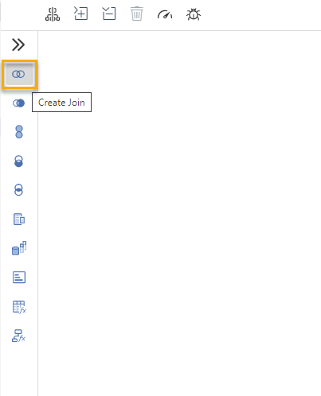

4.	The join node appears. Next to the node, click on the plus icon to add the tables.

    <!-- border -->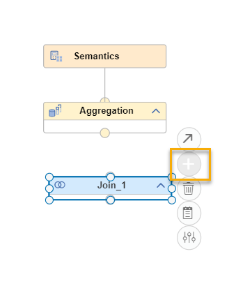

5.	On the pop-up, start by selecting the user-provided service on the **Services** drop-down list.

6.	Type in the first few letters of the table names. Let's start with the `SAGENCYDATA` table, which we created in a previous module.

    > If you want to see all objects available via the connection service, enter `**` in the search field.

7.	To find out the top 5 partners for Best Run Travel, we need to join the `SAGENCY` table with the `STRAVELAG` table. So, let's also add the `STRAVELAG` table to the join node.

8.	Check both objects on the list, then click on **Create Synonym**.

9.	Click on **Finish** without selecting any other options.

10.	You can see that in your file explorer, a new file appeared ending on `.hdbsynonym`. In this file, your synonyms are defined and stored. Click on the file and click on the deploy icon () at the top right corner.

11.	Go back to the calculation view editor and you should see the two tables in the join node.

    <!-- border -->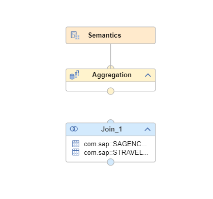

### Define the mapping of the join node

1.	To properly join the two tables, you need to define how they relate to each other. This is done by editing the join node.

2.	Double click the join node to open the settings.

3.	Under **Join Definition**, click on the column `AGENCYNUM` from one of the tables and drag and drop it on top of the same column from the second table. This determines the key column.

    <!-- border -->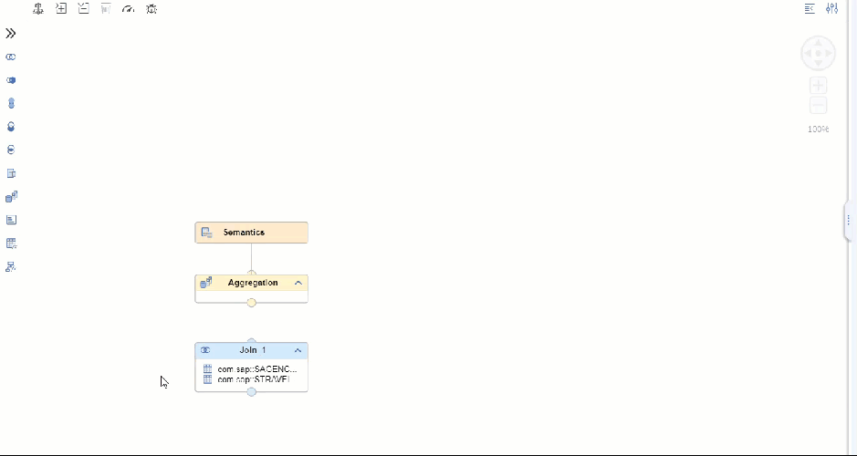

4.	Now click on **Mapping**. Here you can select which columns will be part of the output. Select the columns `AGENCYNUM`, `NUMBOOKING` and `NAME` by double clicking on them. You can see they are added to the output section on the right.

    <!-- border -->

5.	Now close the join settings by clicking on the `X` icon at the top right corner.

6.	Now **connect** the join node to the aggregation node above it. Just click on the arrow icon of the join node and drag and drop it on the aggregation node.

    <!-- border -->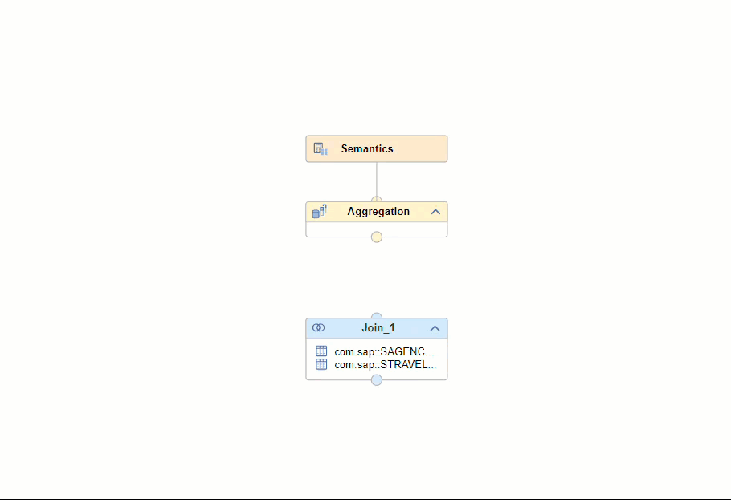

### Add a rank node

1.	Since we want to see the top 5 results from this join, we will add a **Rank** node next. Click on the rank icon () then click **on the link** between Join node and Aggregation node. This will add a Rank node in between them.

2.	To make it easier to view the nodes, click on the **Auto Layout** icon () to rearrange the canvas.

    <!-- border -->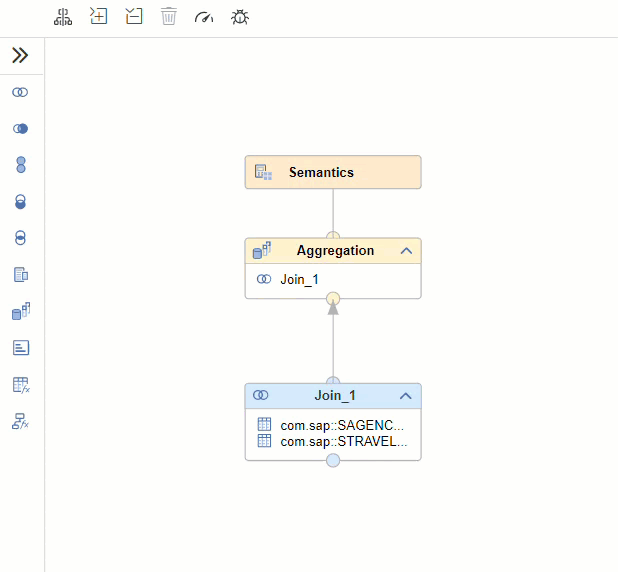

3.	Next, double click the Rank node to open the settings.

4.	Under **Mapping**, make sure all 3 columns are included in the output.

5.	Click on **Definition**. Choose the **Aggregation Function** as `Rank`.

6.	Set the **Result Set Direction** as `Top`. This will order the results descending from highest to lowest.

7.	Set the **Result Set Type** as `Absolute`. This setting determines the unit of values given out by the rank. You could, for example, also select `Percentage` here to get the top 10% of results.

8.	On the **Target Value**, type `5`. This will determine the number of values given out as a result.

9.	The **Offset** should be `0`. Offset determines a number of values that are skipped in the result, for example, with an `Offset = 1` the first value of the rank result would not be reported.

10.	Then click on **Sort Column** to expand this area.

11.	Click on the plus icon to add a **Sort Setting**. Select the column `NUMBOOKINGS` and the direction as **Descending**.

    <!-- border -->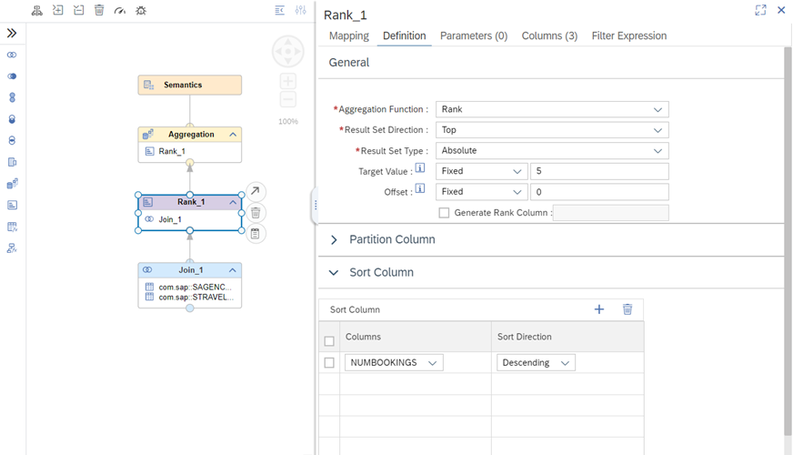

12.	Now close the Rank node panel and double click on the **Aggregation** node.

13.	Under **Mapping**, make sure all columns are selected as part of the output. If a column is not mapped to the output, double click it to add it.

    <!-- border -->

### Deploy the calculation view

1.	Now deploy the calculation view. On the SAP HANA Project panel next to the calculation view name or on the top right corner of the screen, click on the deploy icon (). This will deploy the calculation view. Once this is successfully completed, it's time to check the output so far.

2.	To access the data preview, click on the HDI container icon () next to the name of the project. This will open a new tab with the SAP HANA Database Explorer.

3.	On the list of databases, you will now see the HDI container that represents your calculation view. Expand the catalog of that HDI container, then click on **Column Views**.

4.	Next, click on the name of your calculation view on the panel below the catalog and click on **Open Data**.

    <!-- border -->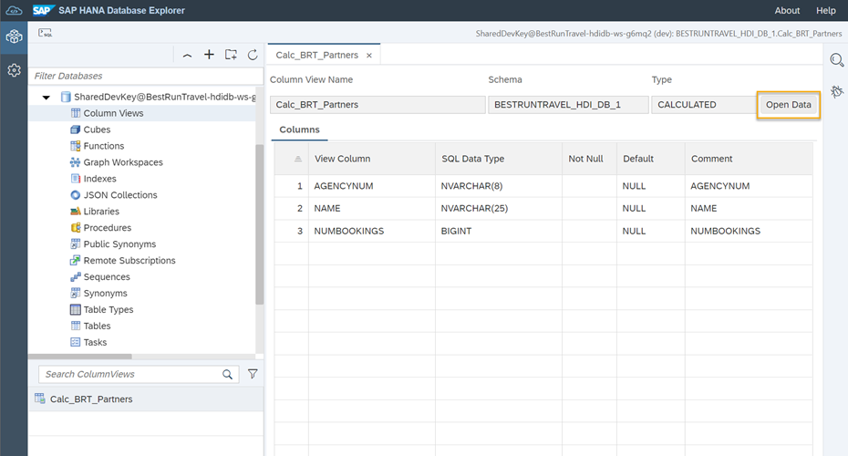

5.	Then, click on **Raw Data** to see the output of this calculation view so far.

6.	This shows you the top 5 partners of Best Run Travel.

    <!-- border -->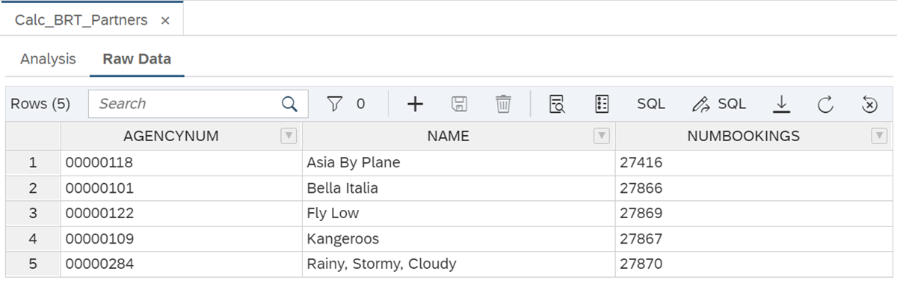

> You can also preview the results of your calculation view directly in the calculation view editor in SAP Business Application Studio. Right-click on the aggregation node and select **Data Preview**. This will open the data preview inside the calculation view editor.
>
> 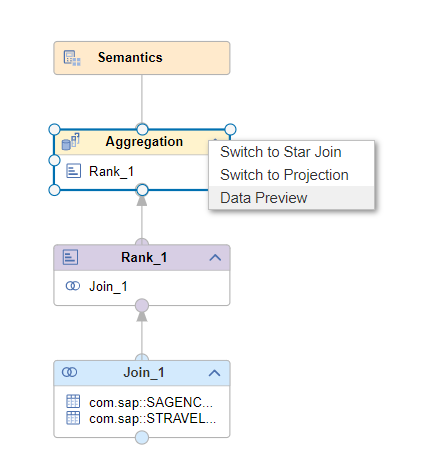

### Add a third table to the view

Now that we know the top 5 partners, we need to next find out on which days the top 5 travel agencies have the most bookings. To achieve this, we will add the table `SAGBOOKDAYS` to our view.

1.	Continue working on the same calculation view.

2.	We will join the output of our rank node to the table `SAGBOOKDAYS`, which we previously created, by adding a join node **between** the rank node and the aggregation node. Remember, you can use the **Auto Layout** icon () to keep the canvas tidy.

    <!-- border -->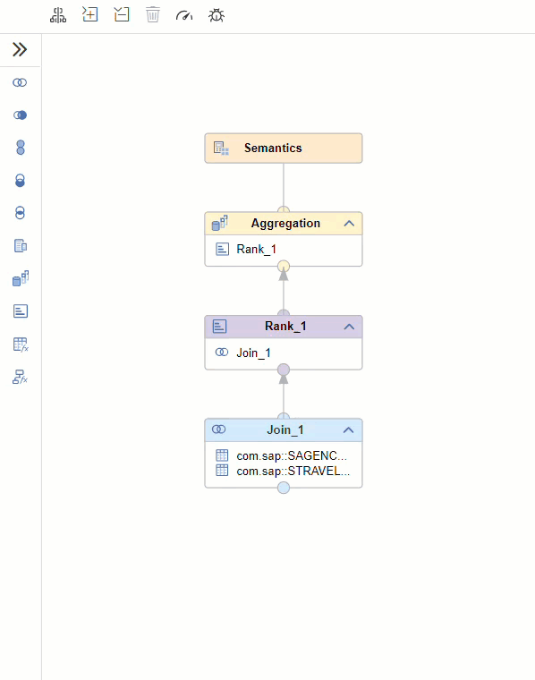

3.	Since the Join node is connected to **Rank 1**, its output is already added to the join node. So, you only need to add the `SAGBOOKDAYS` table by clicking on the plus icon. Follow the steps you previously took to add a table and create a synonym.

4.	After the table is there, double click on the second join node.

5.	Under **Definition**, connect the column `AGENCYNUM` from **Rank 1** to the `AGENCYNUM` column from the `SAGBOOKDAYS` table.

    <!-- border -->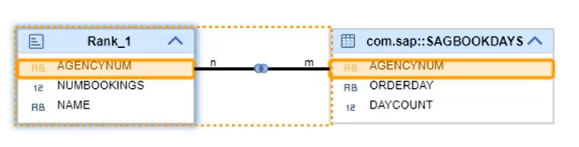

6.	On the same panel, under **Mapping**, make sure the following columns are selected for the output: `AGENCYNUM`, `NUMBOOKING`, `NAME`, `ORDERDAY` and `DAYCOUNT`.

    <!-- border -->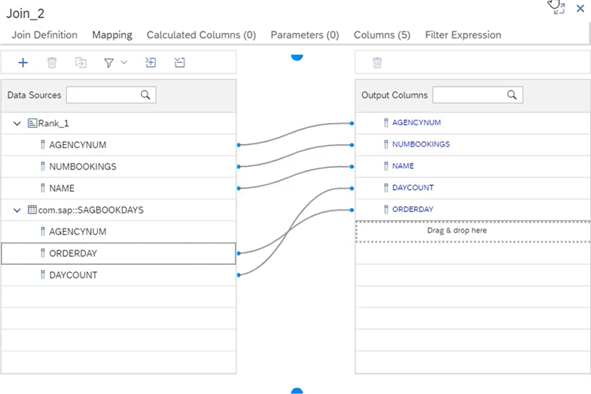

### Add another rank node

1.	To find the days with the most bookings, add another rank node **between** Join 2 and the Aggregation node. Click on the rank icon () and then on the connection between the Join 2 and the Aggregation nodes. Remember, you can use the **Auto Layout** icon () to keep the canvas tidy.

    <!-- border -->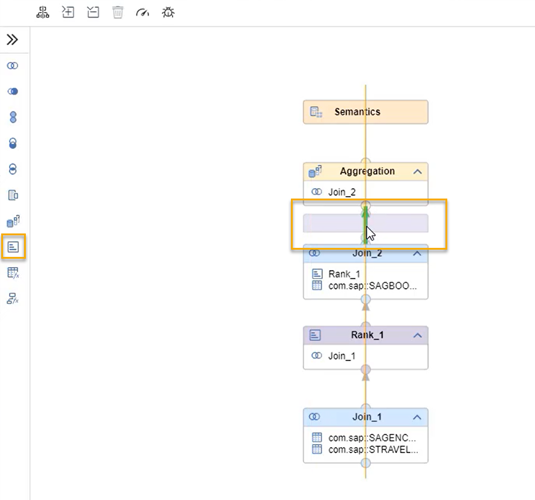

2.	Double click the rank node to open it.

3.	Under Mapping, make sure all 5 columns are selected.

    <!-- border -->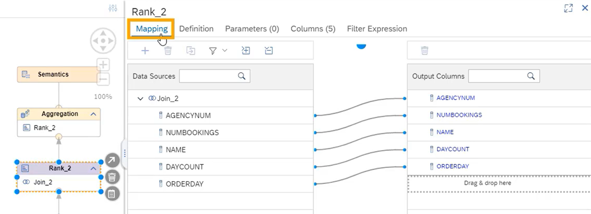

4.	Then, click on **Definition**. Adjust the settings similar to STEP 4:

      *	**Aggregation Function**: `Rank`
      *	**Result Set Direction**: `Top`
      *	**Result Set Type**: `Absolute`
      *	**Target Value**: `1` (this is different from STEP 4)
      *	**Offset**: `0`

    <!-- border -->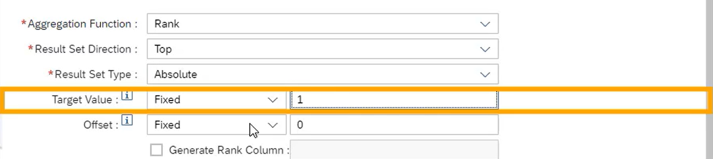

5.	Now click on the Partition Column area, and then click on the plus icon.

    > **What does a partition column do?**
>
> Defining a partition column will group the rows of the output based on a specific column.

    <!-- border -->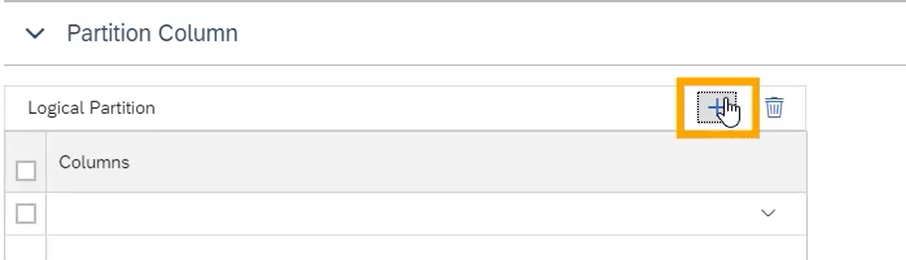

6.	Add the column `AGENCYNUM` to group the rows based on this column.

7.	Click on **Sort Column** and click on the **plus** icon. Add the column `DAYCOUNT` and select the sort direction as **Descending**. You can now close the rank settings.

    <!-- border -->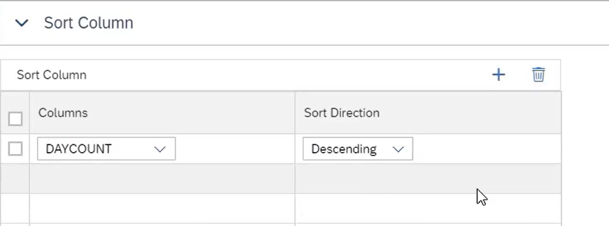

8.	Double click the Aggregation node. Under **Mapping**, make sure all the columns under Rank are selected for the output. To add a column to the output, simply double click it.

### Deploy the view and access the output

You are almost done!

1.	On the SAP HANA Project panel, click on the deploy icon() next to the calculation view name. This will deploy the calculation view. Once this is successfully completed, it's time to check the output again.

2.	To access the Data Preview in the SAP HANA Database Explorer, click on the HDI container icon() next to the name of the project or access it directly

3.	On the list of databases, you will now see the HDI container that represents your project. Expand the catalog of that HDI container, then click on **Column Views** to find your calculation view.

4.	Next, click on the name of your calculation view on the panel below the catalog.

5.	From here, you can click on **Raw Data** to see the output of this calculation view. This shows you the top 5 partners of Best Run Travel and the day in which they have the most bookings.

    <!-- border -->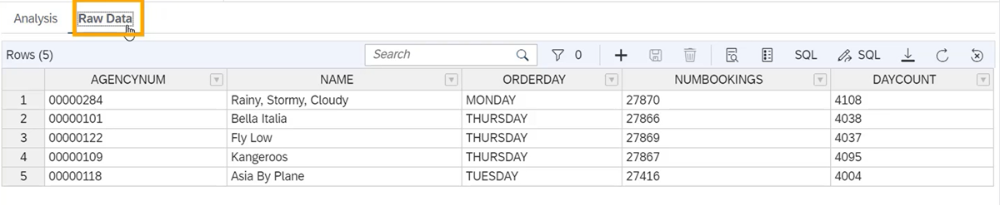

Well done!

You have completed the eighth tutorial of this mission! You learned how to create a calculation view in SAP Business Application Studio using the graphical calculation view editor. You used join and rank nodes to get Alex the business insights they were looking for. Now, all that's left to do is make this calculation view available to others in Alex organization. Learn in the last tutorial how to do that!

### Test yourself

---
