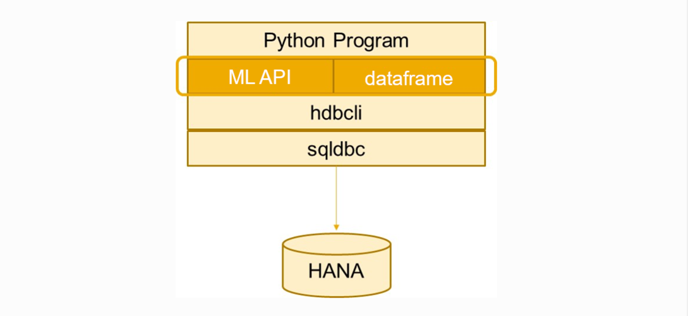
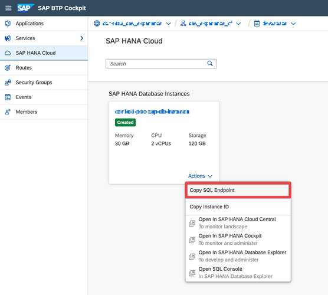
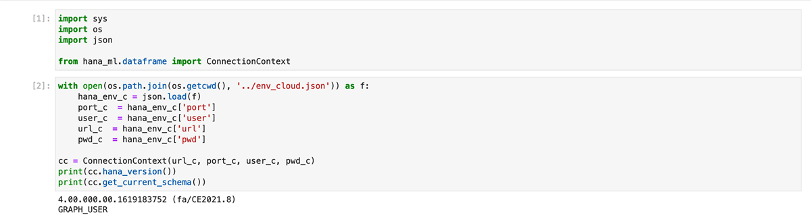

# Connect SAP HANA Database in SAP HANA Cloud to Python
<!-- description --> Learn to set up a connection between SAP HANA database in SAP HANA Cloud and Jupyter Notebook.

## Prerequisites
- Access to SAP HANA Cloud, either with a [free trial account](https://www.sap.com/cmp/td/sap-hana-cloud-trial.html) or with a production account.
- [Provision an SAP HANA Cloud, SAP HANA database instance](hana-cloud-mission-trial-2) and ensure that it's **running**.

## You will learn
- What the hana-ml library is
- What an SAP HANA data-frame is
- How to set up your Jupyter Notebook connection for an SAP HANA database in SAP HANA Cloud
- What a connection context is


## Intro
This tutorial is part of a tutorial group, in which you will learn how to use the new enhanced features of hana-ml library that support the multi-model capabilities of SAP HANA Cloud, SAP HANA database. This tutorial group will focus on creation, visualization, and analysis of a Graph Workspace in the database using sample data based on Wellington's storm water network.

The goal is to introduce you to various algorithms in the hana-ml library that can help to visualize and analyze the data in the form of graphs.

In this tutorial, you will create a connection between your database instance and your Python environment based on the data from Wellington Water Open Data Portal.

> The following terms are used in specific contexts:
>
> **data-frame** : when referring to the logical concept of a data frame
>
> **`dataframe`** : when referring to a Python Object


---

### Introduction to hana-ml library

The hana-ml package allows you to create an SAP HANA data-frame, as well as create a connection to your database instance. The SAP HANA data-frame  represents a database query as a data-frame. This package enables Python users to access the data-frame, build various machine learning models and run graph algorithms using the data directly from the database.

The Python machine learning client (hana-ml) for SAP HANA Cloud consists of four main parts:

* SAP HANA data-frame, which provides a set of methods for accessing and querying data in SAP HANA without bringing the data to the client.

* A set of machine learning APIs for developing machine learning models.

* A selection of data science tools for deployment, operation, and visualization.

* **Integration of multi-model capabilities for geo-spatial and graph analysis**

This tutorial will focus on exploring the integration of multi-modal capabilities for geo-spatial and graph analysis.

> This hana-ml library uses SAP HANA Python driver (`hdbcli`) to connect to and access SAP HANA Cloud.

A figure of this architecture is shown below:

<!-- border -->


### What is an SAP HANA data-frame?

[SAP HANA data-frame](https://help.sap.com/doc/cd94b08fe2e041c2ba778374572ddba9/2021_01_QRC/en-US/hana_ml.html#sap-hana-dataframe) provides a way to interact with the data stored in the database without transferring any of the physical data. The hana-ml library makes use of the data-frame as the input for training and scoring purposes.

The data-frame in essence holds a SQL statement, providing users with a Python interface similar to the popular Pandas data-frame that allows to view and modify data. **To use an SAP HANA data-frame, you need to initially create a connection to SAP HANA database in  SAP HANA Cloud**. Then you can use the methods provided in the library to create the `dataframe`. This `dataframe` is only available while the connection to the database is open and is inaccessible once the connection is closed.

> Remember, an SAP HANA data-frame is a way to view the data stored within the database and does not contain any data.

If you want to use other Python libraries on the client along with an SAP HANA data-frame, you need to convert that `dataframe` to a Pandas `dataframe` using the `collect()` method. For example, you could convert an SAP HANA `dataframe` to a Pandas `dataframe` as follows:

```Python
pandas_df = hana_df.collect()
```


### Set up your Python environment


1. You need a Python environment that is operational, for example, Jupyter Notebook or JupyterLab. This tutorial will be using a **Jupyter Notebook environment**. You can find the appropriate installation files for your system from this [link](https://jupyter.org/install).

2. Next, you need to install the [hana-ml library](https://pypi.org/project/hana-ml/) from PyPI with pip install hana-ml. Also, ensure that the version you have installed is **not older than 2.9.21070902**.

    > The Python Package Index (PyPI) is a repository of software for the Python programming language.

3. Finally, **download the sample data** we prepared from [Wellington Water Open Data Portal](https://github.com/SAP-samples/hana-graph-examples/tree/main/NOTEBOOKS/WELLINGTON_STORMWATER/datasets). You must store the data in a system that can be accessed using your Jupyter Notebook.


### Create login data of database instance in Jupyter Notebook


1. To start, copy your database instance URL into a text file from the SAP BTP cockpit as shown below:

    <!-- border -->

    > Instance URL is the SQL Endpoint

2. Now, you need to create a new empty notebook in your Jupyter Notebook.

3. Then, create a new text file in the same directory. You can name it **`env_cloud.json`**.

    > You can have the login information in this text file, so that you don't have to save it in the notebook itself. Thus, you can push the notebook to a file repository like GitHub without revealing your credentials.

    Add the following content into the file:

    ```Python
{
  "user": "YourUserName",
  "pwd": "YourPassword",
  "url": "database instance URL from above",
  "port": 443
}
```

> **Attention: Replace the username and password fields with the login data to your database instance**.


### Import libraries for connecting to database


Next, there are some libraries that need to be imported to run the notebook. To do that, you need to create a new cell and add the following content into it:

```Python
import sys
import os
import json

from hana_ml.dataframe import ConnectionContext
```

 


### Establish connection to the database

To establish the connection, you need to create a **connection context** that represents the physical connection to your database instance. This connection context is used to let the hana-ml library know which database instance to connect to. The `ConnectionContext` is part of the hana-ml library.


```Python
with open(os.path.join(os.getcwd(), 'env_cloud.json')) as f:
    hana_env_c = json.load(f)
    port_c = hana_env_c['port']
    user_c = hana_env_c['user']
    url_c  = hana_env_c['url']
    pwd_c  = hana_env_c['pwd']

cc = ConnectionContext(url_c, port_c, user_c, pwd_c)
print(cc.hana_version())
print(cc.get_current_schema())
```

When you execute the cell, you will get a result as seen in the image shown below.

<!-- border -->

You can easily identify your **SAP HANA version** and **schema name** from the above result. **Verify these details to confirm a successful connection**.

> You have completed the first tutorial of this tutorial group. Learn in the next tutorial how to visualize a Graph Workspace using Kepler.gl


### Test yourself


---
