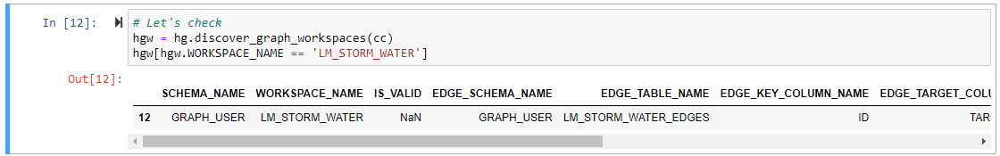
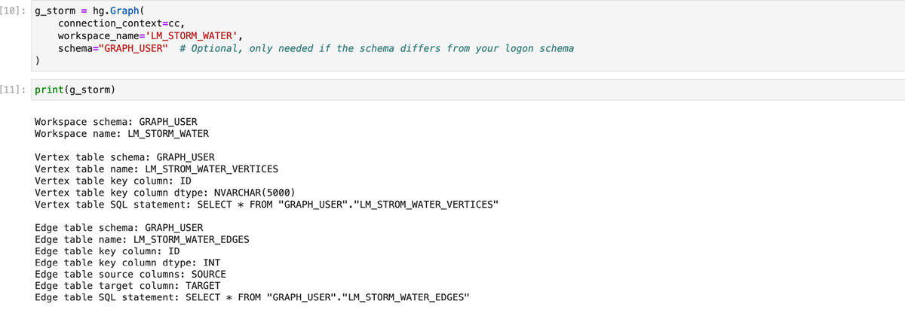
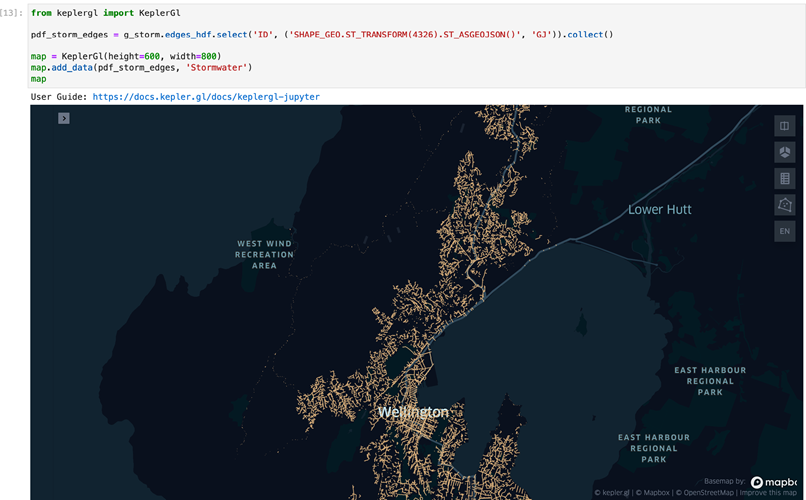

# Create Graph Workspace Visualization in SAP HANA Cloud, SAP HANA Database
<!-- description --> Learn to visualize a Graph Workspace in SAP HANA Cloud, SAP HANA database using Kepler.gl.

## Prerequisites
- You have established a [connection to SAP HANA Cloud, SAP HANA database using Python](hana-cloud-python-analysis-multimodel-2).
- Make sure your SAP HANA Cloud, SAP HANA database instance is **running** before you start.
- You require access to the [Wellington's Storm water Network data](https://github.com/SAP-samples/hana-graph-examples/tree/main/NOTEBOOKS/WELLINGTON_STORMWATER/datasets) (sample data).


## You will learn
- About some graph functions that are available in the hana-ml library
- How to create a Graph Workspace using Wellington's Storm water Network data
- How to visualize the graph with Kepler.gl


## Intro
In this tutorial, you will create a Graph Workspace based on imported vertices and edges. You will use the Wellington's Storm water Network data stored as a graph to create a visualization in Kepler.gl.

> The following terms are used in specific contexts:
>
> **data-frame** : when referring to the logical concept of a data frame
>
> **`dataframe`** : when referring to a Python Object


---

### What is a Graph Workspace?

A Graph is a **data model** used to represent networks – social networks, supply chains, power grids etc.
A graph is a set of vertices and edges in SAP HANA Cloud, SAP HANA database. **Each edge has a direction and connects two vertices**. One vertex is denoted as the source and the other as the target. You can have any number of edges connecting the same two vertices. Vertices and edges can have an arbitrary number of attributes. **An attribute consists of a name that is associated with a data type and a value**.

> You can store a graph as two relational objects that can be tables or views. These objects are called the vertex table and edge table. Learn more about SAP HANA Graph Data Model from the [technical documentation](https://help.sap.com/viewer/11afa2e60a5f4192a381df30f94863f9/LATEST/en-US/7734f2cfafdb4e8a9d49de5f6829dc32.html).

A graph workspace is a **catalog object that defines a graph in terms of tables and columns**. It is uniquely identified by the database schema it resides in and the workspace name. A database instance can contain multiple graph workspaces in the same schema with different workspace names or different database schemas.


### Overview of graph functions in hana-ml library


The hana-ml library offers different functions to create a graph:

- **`create_graph_from_dataframes()`** : Creates a graph either based on HANA data-frames or Pandas data-frames. Requires **data in the form of vertices and edges**.

- **`create_graph_from_edges_dataframe()`** : Similar to the above function, but only requires **data in the form of edges**. A minimal vertex table is created which only contains the vertex keys found in the edges table.

- **`create_graph_from_hana_dataframes()`** : This is a special version of first function which **only accepts HANA data-frames**, but gives you more control on how they are processed.


### What is hana_ml.dataframe module?


A `hana_ml.dataframe` module represents a **database query as a data-frame** which is conceptually similar to a Pandas data-frame. Thus, it seamlessly fits into the tool set familiar to a data scientist. The SAP HANA data-frame is designed to not bring data back from the database unless explicitly requested, also known as lazy evaluation. That means all operations such as column filter, where clauses, etc. are performed on the query level.

The data gets materialized and transferred to the client only if a method such as **`collect()`** is used. All materialized data is returned as Pandas data-frames so that it can directly be used for further processing. The hana-ml library also provides functions to create data-frames from local data and store this data to a database table. Learn more about the `hana_ml.dataframe` from the [technical documentation](https://help.sap.com/doc/cd94b08fe2e041c2ba778374572ddba9/2021_01_QRC/en-US/hana_ml.dataframe.html).

In this tutorial, the data-frame's geospatial support becomes handy. You will see in the next step that during the data import, you can specify which columns from our source are geometries. When you query the data and use them on the client, the geometries from database tables are directly converted to objects, which can be used in `GeoPandas` or other spatial libraries. As you will see, these geometries can be directly used with geospatial functions on the database layer.


### Store sample data in the database using Pandas


In this tutorial, you create the graph based on CSV data and therefore use Pandas to import the data.

Open your Jupyter Notebook to **create a new cell**, and add the following content:

```Python
from hana_ml.dataframe import create_dataframe_from_pandas
import pandas as pd
# example SHAPE column: POINT (1752440.6821975708 5439964.327102661)
v_hdf = create_dataframe_from_pandas(
    connection_context=cc,
    pandas_df=pd.read_csv("./datasets/wwc_stormwater_vertices.csv"),
    table_name="CML_WASTE_WATER_VERTICES",
    primary_key="ID",
    geo_cols=["SHAPE"],
    srid=2193,
    force=True)
# example SHAPE column: LINESTRING (1749169.286201477 5422260.568099976, 1749162.987197876 5422242.643096924)
e_hdf = create_dataframe_from_pandas(
    connection_context=cc,
    pandas_df=pd.read_csv("./datasets/wwc_stormwater_edges.csv"),
    table_name="CML_WASTE_WATER_EDGES",
    primary_key="ID",
    not_nulls=["SOURCE", "TARGET"],
    geo_cols=["SHAPE"],
    srid=2193,
    force=True)
```

You use the `create_dataframe_from_pandas()` function of the hana-ml library to upload the data from a Pandas data-frame to a new database table. These stored datasets include a `SHAPE` column that contains the spatial data in a **Well-Known-Text format**. The hana-ml directly convert WKT columns to geometries resulting in a column with the suffix `_GEO` (in this case, `SHAPE_GEO`) in the table. You could even generate a geometry out of longitude and latitude columns. Learn more about the hana-ml function from the [technical documentation](https://help.sap.com/doc/1d0ebfe5e8dd44d09606814d83308d4b/2.0.05/en-US/html/hana_ml.dataframe.html#hana_ml.dataframe.create_dataframe_from_pandas).

> **Attention: Depending on where you stored the sample data, you must adjust the path for `read_csv` function.**


### Create the graph in the database


In a new cell execute the following code to create the graph in SAP HANA Cloud, SAP HANA database:

```Python
import hana_ml.graph as hg
g_storm = hg.create_graph_from_dataframes(
	connection_context=cc,
	vertices_df=v_hdf,
	vertex_key_column="ID",
	edges_df=e_hdf,
	edge_source_column="SOURCE",
	edge_target_column="TARGET",
	edge_key_column="ID",
	workspace_name="LM_STORM_WATER",
	)
```

You can check whether the graph was created using the `discover_graph_workspaces(cc)` function which **displays all the graphs available in your instance**.

To display only the graph you require, you can use the help of the below image:

<!-- border -->


### Display object representation of graph in Python


> **This step is optional**. Continue with this step if you want to learn how to display object representation of a graph, else skip this step.
You can easily create an object representation of your graph in Python just by its name. Create a new cell with the following content:

```Python
g_storm = hg.Graph(
    connection_context=cc,
    workspace_name='LM_STORM_WATER',
    schema="GRAPH_USER"  # Optional, only needed if the schema differs from your logon schema
)
```

When you print a graph using `g_storm`, you get **technical information about the graph**. You can see the database tables and columns that are used to define the start and target vertices.


### Visualize the graph using Kepler.gl


Kepler.gl is a popular framework to **visualize geospatial data**. You will use it here to display the graph data you're working with. Check [this link](https://docs.kepler.gl/docs/keplergl-jupyter#install) to know how to install Kepler.gl.

Create a new cell with the following content:

```Python
from keplergl import KeplerGl
pdf_storm_edges = g_storm.edges_hdf.select('ID', ('SHAPE_GEO.ST_TRANSFORM(4326).ST_ASGEOJSON()', 'GJ')).collect()
map = KeplerGl(height=600, width=800)
map.add_data(pdf_storm_edges, 'Stormwater')
map
```

Let's take a closer look at the key parts of this statement:

* **`g_storm.edges_hdf`** : A graph object provides direct access to several graph properties. The most important ones are `edges_hdf` and `vertices_hdf`, both of which represent an SAP HANA data-frame referring to the respective table in the database. In this example, we use the edges data-frame of our graph.

* **`select('ID', ('SHAPE_GEO.ST_TRANSFORM(4326).ST_ASGEOJSON()', 'GJ'))`** : SAP HANA data-frame provides the select method  to specify the columns you want to query. It can also be used to create new calculated columns on the fly. In this case, you create a column `GJ` that is based on the column `SHAPE_GEO`. Initially, you transform the data into the **SRS 4326** as expected by Kepler.gl for visualization. Then you transform the data into the `GeoJSON` format which can be interpreted directly by Kepler.gl. This gives you a data-frame with two columns: `ID` and `GJ`.

> Reminder: `SHAPE_GEO` was automatically generated as a geometry when you imported the CSV data. Also, remember that the source data used the **SRS 2193**.

The calculated column (`GJ`) does not persist along with the database. It's lifespan is restricted to the lifespan of the `dataframe` object. However you could `save()` the `dataframe` to a catalog object either as a new table or a view. Learn more about this from the API documentation.

* **collect()** : This method materializes the data of an SAP HANA data-frame and transfers them to the client by returning the data as a Pandas data-frame.

Now your notebook should look like this:

<!-- border -->

<!-- border -->

> In this tutorial, you have learned how to visualize a Graph Workspace in SAP HANA Cloud, SAP HANA database using Kepler.gl. In the next tutorial, you will see the how to analyze a Graph Workspace using various algorithms in the hana-ml library.


### Test yourself


---
