# Analyze Graph Workspace in SAP HANA Cloud, SAP HANA Database
<!-- description --> Learn to use algorithms to analyze and process a Graph Workspace in SAP HANA Cloud, SAP HANA database.

## Prerequisites
- You have established a [connection to SAP HANA Cloud, SAP HANA database using Python](hana-cloud-python-analysis-multimodel-1).
- Make sure your database instance is **running** before you start.
- You have completed the tutorial [Create Graph Workspace Visualization in database using Kepler.gl](hana-cloud-python-analysis-multimodel-2).


## You will learn
- How to analyze and process your graph using algorithms
- How to create visualization for sub-graphs of components in a Graph Workspace
- How to perform dependency analysis using a graph

## Intro
The hana-ml library provides functionalities to analyze and process the graph. In this tutorial, you will learn about algorithms that can help you create sub-graphs of components in a Graph Workspace. Through a dependency analysis of a sample problem, you can also learn about a few special algorithms that assist analysis and visualization of graphs.

> The following terms are used in specific contexts:
>
> **data-frame** : when referring to the logical concept of a data frame
>
> **`dataframe`**: when referring to a Python Object


---

### Find the information visualized in the graph


Execute `g_storm.describe()` in a new cell of your Jupyter Notebook. This gives you statistical information about the graph like the node's degree, number of triangles, density, etc.

In this example, let's focus on `IS_CONNECTED`, which indicates that you don't have one connected graph, but multiple independent ones.

<!-- border -->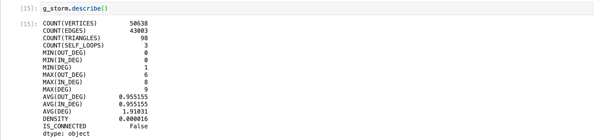


### Analyze and process your graph using Algorithms


The hana-ml library provides algorithms that can be executed on the graph like the shortest path, neighbors, topological sort or weakly connected components. You can find them in the `hana_ml.graph.algorithms` package. The execution pattern for these algorithms is always the same as given below:

```Python
result = hana_ml.graph.algorithms.<algorithm_name>(graph=<graph_instance>).execute(<parameters>)
```

Every algorithm is implemented in a separate Python class which you can instantiate using `<algorithm_name>`. This class expects the graph instance as a constructor parameter specified by `graph=<graph_instance>`, so that it knows on which graph to perform the algorithms. Finally, every algorithm class implements an `execute()` method which triggers the execution of the algorithm. The result gives you access to the results of the algorithm execution. The properties available depend on the algorithm you execute.


### Store components of the graph in the database


In this case, you will use the `WeaklyConnectedComponents` algorithm to evaluate which connected components you have.

> Each weakly connected component represents a sub-graph that is not connected to the other components.

Execute the following code in a new cell:

```Python
import hana_ml.graph.algorithms as hga

wcc = hga.WeaklyConnectedComponents(graph=g_storm).execute()

print(f'There are {wcc.components_count} components in the Graph.')
```
<!-- border -->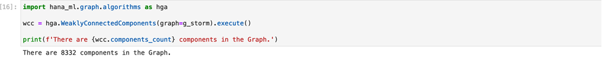

The result here indicates that you have **8332 independent components in the graph**. Let's have a closer look at the algorithm as it also exposes other details about these components.

The above result contains a property called components. Run the following command in a new cell:

```Python
# Which are the largest components (i.e. sub networks)?
wcc.components.sort_values(by='NUMBER_OF_VERTICES', ascending=False).head(5)
```

Since these components exist as Pandas `dataframe` (every object that materializes data from the database is represented as a Pandas `dataframe` in hana-ml), you need to use Pandas capabilities to only **return the five largest components**.

> Every object that materializes data from the database is represented as a Pandas `dataframe` in hana-ml.

Notice the two components- number **25** and number **5**. They look interesting.

<!-- border -->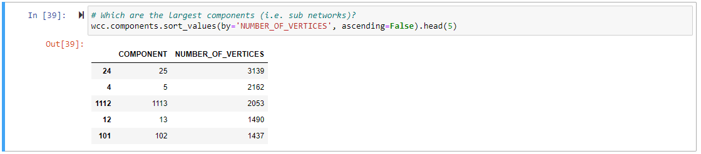

The algorithm `wcc.vertices` provides a data-frame that maps each vertex to the component it belongs to. So far, you only have the information about the components of a vertex and therefore can't visualize a graph without the missing edges. So, let's store the components to the database and use the `subgraph()` method for the visualization.

You can use the same method to upload the data to the database that you used to create the graph. Run the following code in a new cell:

```Python
hdf_wcc = create_dataframe_from_pandas(
    connection_context=cc,
    pandas_df=wcc.vertices,
    drop_exist_tab=True,
    table_name='LM_STORMWATER_WCC',
    force=True,
    allow_bigint=True,
    primary_key='ID')
```

Now, you have uploaded the algorithm results to your database.

<!-- border -->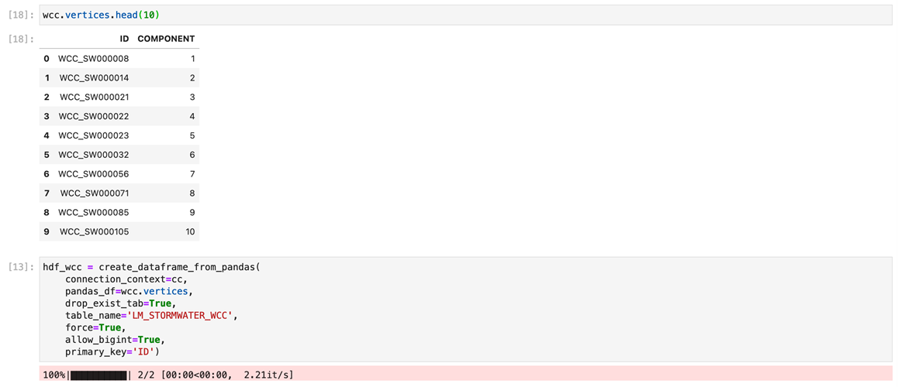


### Create visualization for subgraphs of components


You will visualize the **two biggest components in the graph** - number **25** and number **5**, to gain further insights. The Graph object provides a method to create sub-graphs based on filter criteria on vertices or edges. Let's run the following in a new cell:

```Python
g_storm_comp1 = g_storm.subgraph(
    workspace_name = "LM_STORMWATER_COMP1",
    vertices_filter='ID IN (SELECT ID FROM LM_STORMWATER_WCC WHERE COMPONENT = 25)',
    force = True
)
```

This creates a new graph with the name `LM_STORMWATER_COMP1` based on a vertex filter. The filter selects only vertices from the components you selected in the step before which belongs to **component 25**. In other words, you now have a new graph representing the vertices and edges belonging to **component 25**.

Let's do the same for the vertices of **component 5**:

```Python
g_storm_comp2 = g_storm.subgraph(
    workspace_name = "LM_STORMWATER_COMP2",
    vertices_filter='ID IN (SELECT ID FROM LM_STORMWATER_WCC WHERE COMPONENT = 5)',
    force = True
)
```
<!-- border -->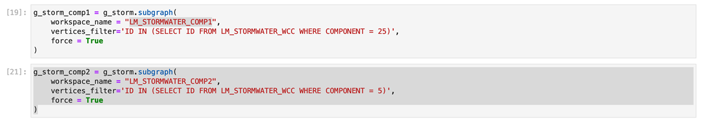

Since you have two complete graphs now, you can visualize them like you did before:

```Python
pdf_storm_comp1_edges = g_storm_comp1.edges_hdf \
    .select('ID', 'SOURCE', 'TARGET', ('SHAPE_GEO.ST_TRANSFORM(4326).ST_ASGEOJSON()', 'GJ')).collect()
pdf_storm_comp2_edges = g_storm_comp2.edges_hdf \
    .select('ID', 'SOURCE', 'TARGET', ('SHAPE_GEO.ST_TRANSFORM(4326).ST_ASGEOJSON()', 'GJ')).collect()
map = KeplerGl(height=600, width=800)
map.add_data(pdf_storm_comp1_edges, 'Stormwater Component 1')
map.add_data(pdf_storm_comp2_edges, 'Stormwater Component 2')
map
```

After completion, your notebook should look like this:

<!-- border -->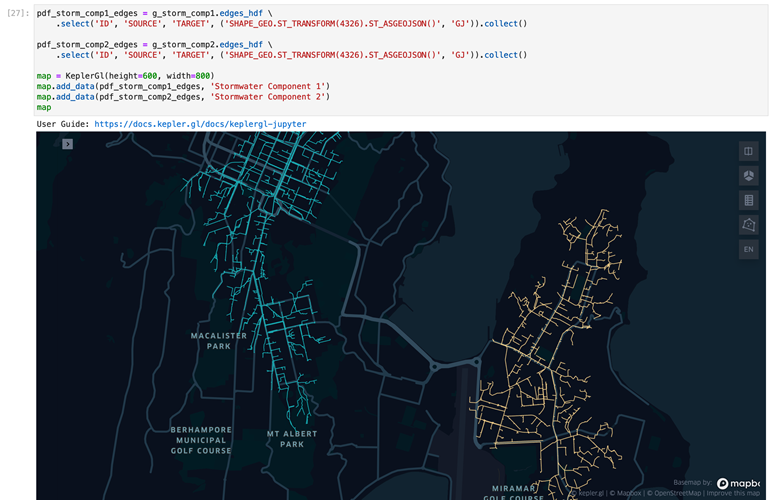

In the next step, you learn how to evaluate which sections of the water network could be the causal factor of a problem reported on a specific access point (i.e. vertex). In that step you will get to know the algorithms `Neighbors`, `NeighborsSubgraphs` and `ShortestPath`.


### Dependency analysis: Collect information about a reported problem 


Let's assume somebody reported a **problem with the node `WCC_SW002719`**. Suppose there is a reduced flow rate which might indicate a broken pipe somewhere else. You will want to analyze the scenario further.

First, let's load the vertex itself. You can use the same procedure used before. Since you want to visualize it, you must materialize the position as a `GeoJSON` string. Run the following in a new cell:

```Python
start_vertex_id = 'WCC_SW002719'
# Get the details of that vertex
start_vertex = g_storm_comp2.vertices_hdf \
    .filter(f"ID = '{start_vertex_id}'") \
    .select('ID', ('SHAPE_GEO.ST_TRANSFORM(4326).ST_ASGEOJSON()', 'GJ')).collect()
start_vertex
```
<!-- border -->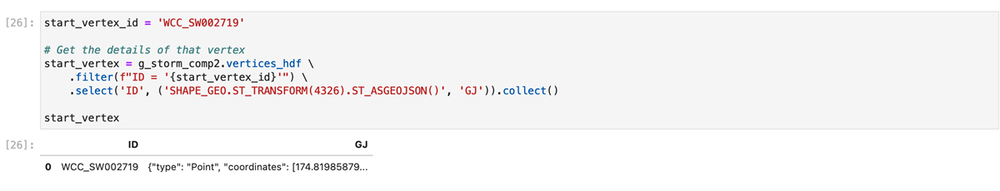


### Dependency analysis: Display the nearest vertices to the problem vertex


Let's use the `Neighbors` algorithm to find all neighbors to the problem vertex.
To display the 5 closest vertices:

```Python
neighbors = hga.Neighbors(graph=g_storm_comp2).execute(
    start_vertex=start_vertex_id,
    direction='ANY',
    lower_bound=1,
    upper_bound=5)

neighbors.vertices.head(5)
```
<!-- border -->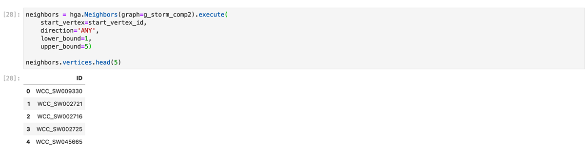

If you want to display the vertices on the map, you need one additional step. Here, the vertices data-frame can only return vertex IDs. So, you must read the additional columns you need for visualizing separately from the database. To do so, you can use the `filter()` method of the HANA data-frame:

```Python
vkc=g_storm_comp2.vertex_key_column
in_list = neighbors.vertices.ID.str.cat(sep="','")
filter = f"{vkc} IN ('{in_list}')"  # Dynamically build the filter condition as SQL WHERE
print(filter)
pdf_storm_comp2_neighbors = g_storm_comp2.vertices_hdf \
    .filter(filter) \
    .select('ID', ('SHAPE_GEO.ST_TRANSFORM(4326).ST_ASGEOJSON()', 'GJ')).collect()
```

<!-- border -->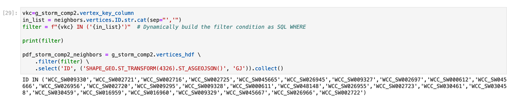

With that, you query and materialize all positions of all the vertices which are 5 hops away from the start vertex. Visualizing follows the well-known pattern:

```Python
map = KeplerGl(height=600, width=800)
map.add_data(pdf_storm_comp2_neighbors, '5-hop neighbors')
map.add_data(start_vertex, 'Start Vertex')
map
```

The final view of the Notebook should look like this:

<!-- border -->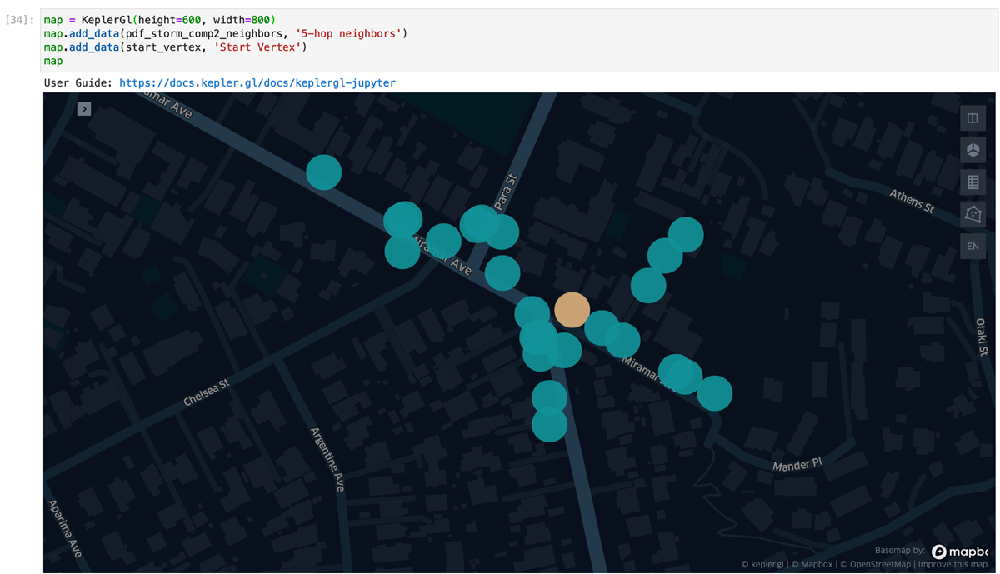


### Visualize a subgraph to find the dependent factors of the problem


The image in the last step only reveals the vertices directly surrounding the start vertex. However, when you want to find out what the dependent factors of your reported problem is, you **need to know where to start looking and how these vertices are connected**.

The water network is a directed graph. This means that you're only interested in upstream nodes assuming that a reduced rate of flow must be caused by an issue along the upstream region. Therefore, instead of individual points let's look at sub-graphs again:

```Python
g_neighbors_upstream = hga.NeighborsSubgraph(graph=g_storm_comp2).execute(
    start_vertex=start_vertex_id, direction='INCOMING',
    lower_bound=0, upper_bound=10000)
```

This creates a sub-graph that only evaluates the incoming edges (upstream) starting from a given vertex. Same is the case for a sub-graph evaluating only outgoing edges (downstream), as shown below:

```Python
g_neighbors_downstream = hga.NeighborsSubgraph(graph=g_storm_comp2).execute(
    start_vertex=start_vertex_id, direction='OUTGOING',
    lower_bound=0, upper_bound=10000)
```

<!-- border -->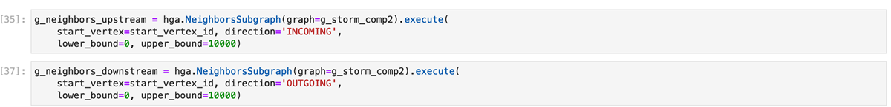

You can see from the above code that you will get only the source and target IDs without the additional information, for example, `g_neighbors_downstream.edges.head(5)`. Therefore, you've got to load the spatial information of the edges in the same way you did in the above sections.

```Python
ekc = g_storm_comp2.edge_key_column

in_list = g_neighbors_upstream.edges.ID.astype(str).str.cat(sep=',' )
pdf_storm_comp2_neighbors_upstream_edges = g_storm_comp2.edges_hdf \
    .filter(f"{ekc} IN ({in_list})") \
    .select('ID', ('SHAPE_GEO.ST_TRANSFORM(4326).ST_ASGEOJSON()', 'GJ')).collect()

in_list = g_neighbors_downstream.edges.ID.astype(str).str.cat(sep=',' )
pdf_storm_comp2_neighbors_downstream_edges = g_storm_comp2.edges_hdf \
    .filter(f"{ekc} IN ({in_list})") \
    .select('ID', ('SHAPE_GEO.ST_TRANSFORM(4326).ST_ASGEOJSON()', 'GJ')).collect()
```

<!-- border -->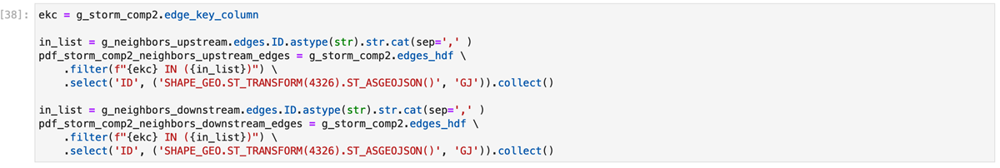

With that information you can visualize it again:

```Python
map = KeplerGl(height=600, width=800)
map.add_data(start_vertex, 'Start Vertex')
map.add_data(pdf_storm_comp2_neighbors_upstream_edges, 'Upstream')
map.add_data(pdf_storm_comp2_neighbors_downstream_edges, 'Downstream')
map
```

<!-- border -->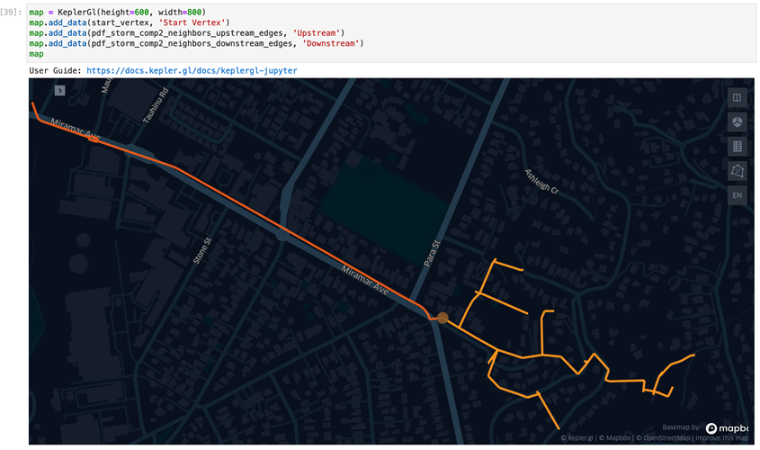

Now you understand which vertices are upstream of your problem. Moving on, the next question is- **In which order should you check the incoming vertices to find the one which is the dependent factor?** You will use another algorithm in the next step to solve this question.


### Complete the dependency analysis 


The algorithm `ShortestPathsOneToAll` creates a **list of the shortest paths from one vertex to all the other vertices in the graph**.

```Python
# The Shortest Path One to All, could give an indication about what to check first
spoa = hga.ShortestPathsOneToAll(graph=g_storm_comp2).execute(source=start_vertex_id, direction='INCOMING', weight='LENGTH_M')
spoa.vertices.sort_values('DISTANCE')
```

<!-- border -->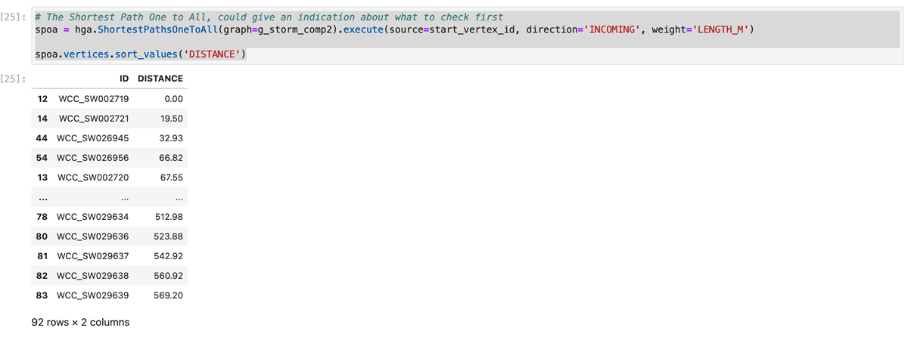

By having `direction`= `INCOMING` you specify that you're **only interested in the upstream (i.e. incoming) vertices**. By having `weight`=`LENGTH_M` you **specify what information (i.e. column) is used to calculate the** `DISTANCE`. In this case, you are taking the length of a segment while if let unspecified, the algorithm takes the number of hops.

With this information you could traverse through your graph along the nodes, assuming that the issue is close to the reported intake. Hence, you can **check the upstream nodes one-by-one in the order of their distances from the problem node**.

In this tutorial, you have explored the SAP HANA Cloud, SAP HANA database smart multi-model features of the hana-ml library for Python. Hopefully, you've are curious to learn more about these features. If you want to use them in your daily work, you can find the [complete notebook here](https://github.com/SAP-samples/hana-graph-examples/blob/main/NOTEBOOKS/WELLINGTON_STORMWATER/Wellington%20Stormwater%20Network%20Analysis.ipynb).

For more learning materials on **SAP HANA Cloud**, [click here](https://community.sap.com/topics/hana-cloud). Follow our tag in the [**SAP Community**](https://blogs.sap.com/tags/73554900100800002881/) to stay up-to-date on the latest updates and newest content!

Related content:

-	[SAP HANA Spatial Reference Guide](https://help.sap.com/viewer/bc9e455fe75541b8a248b4c09b086cf5/LATEST/en-US/e1c934157bd14021a3b43b5822b2cbe9.html)
-	[SAP HANA Graph Reference Guide](https://help.sap.com/viewer/11afa2e60a5f4192a381df30f94863f9/LATEST/en-US/30d1d8cfd5d0470dbaac2ebe20cefb8f.html)


### Test yourself


---
