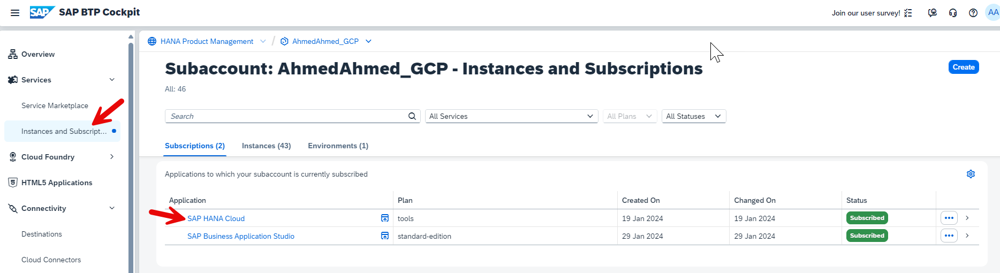
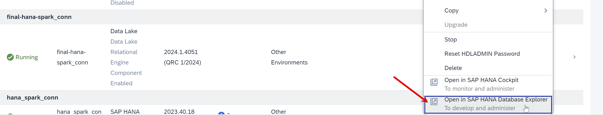
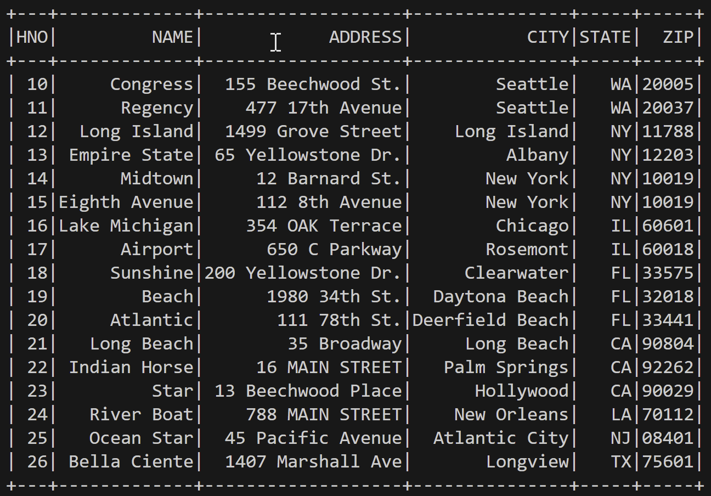

# Accessing SAP HANA Data lake Relational Engine using Apache Spark
<!-- description --> Learn how to access an SAP HANA Cloud Data lake Relational Engine instance using Apache Spark.  

## Prerequisites
- An SAP BTP account
- An SAP HANA Cloud Data lake Files instance with Relational Engine Enabled
- Python is installed 
- A JDK is installed, one can be found [here](https://sap.github.io/SapMachine/#download), with detailed steps [here](https://github.com/SAP/SapMachine/wiki/Installation)
- Install pyspark using pip install pyspark 
- Install the SAP HANA Data lake Client by follwing these [steps](https://help.sap.com/docs/hana-cloud-data-lake/client-interfaces/download-sap-hana-data-lake-client) 
- If on a windows system make sure WSL is installed

## You will learn
  - How to write a script to access an SAP HANA Data lake Relational Engine using Apache spark

---

### Create a User, Tables, and Import Data
1. Open up SAP HANA Cloud Central from SAP BTP Cockpit 


    


2. Click on the **3 dots under Actions** and click on **Open in SAP Database explorer** 


    


3. If it prompts you to login provide the username (e.g. HDLADMIN) and the password 


4. Right click on the instance and open up an SQL console


    


5. Copy the below code and run it 


    ```sql
    CREATE TABLE HOTEL(
        HNO INTEGER PRIMARY KEY,
        NAME VARCHAR(50) NOT NULL,
        ADDRESS VARCHAR(40) NOT NULL,
        CITY VARCHAR(30) NOT NULL,
        STATE VARCHAR(2) NOT NULL,
        ZIP VARCHAR(6)
    );

    CREATE TABLE ROOM(
        HNO INTEGER,
        TYPE VARCHAR(6),
        FREE NUMERIC(3),
        PRICE NUMERIC(6, 2),
        PRIMARY KEY (HNO, TYPE),
        FOREIGN KEY (HNO) REFERENCES HOTEL
    );

    CREATE TABLE CUSTOMER(
        CNO INTEGER PRIMARY KEY,
        TITLE VARCHAR(7),
        FIRSTNAME VARCHAR(20),
        NAME VARCHAR(40) NOT NULL,
        ADDRESS VARCHAR(40) NOT NULL,
        ZIP VARCHAR(6)
    );

    CREATE TABLE RESERVATION(
        RESNO INTEGER NOT NULL default autoincrement,
        RNO INTEGER NOT NULL,
        CNO INTEGER,
        HNO INTEGER,
        TYPE VARCHAR(6),
        ARRIVAL DATE NOT NULL,
        DEPARTURE DATE NOT NULL,
        PRIMARY KEY (
            "RESNO", "ARRIVAL"
        ),
        FOREIGN KEY(CNO) REFERENCES CUSTOMER,
        FOREIGN KEY(HNO) REFERENCES HOTEL
    );

    CREATE TABLE MAINTENANCE(
        MNO INTEGER PRIMARY KEY,
        HNO INTEGER,
        DESCRIPTION VARCHAR(100),
        DATE_PERFORMED DATE,
        PERFORMED_BY VARCHAR(40),
        FOREIGN KEY(HNO) REFERENCES HOTEL
    );

    CREATE OR REPLACE FUNCTION AVERAGE_PRICE(room_type CHAR(6))
    RETURNS NUMERIC(6, 2)
    BEGIN
        DECLARE avg_price NUMERIC(6,2);  
        SELECT CAST(ROUND(sum(PRICE)/COUNT(*), 2) as NUMERIC(6,2)) INTO avg_price FROM ROOM WHERE TYPE = room_type GROUP BY TYPE;
        RETURN avg_price;
    END;

    CREATE OR REPLACE PROCEDURE SHOW_RESERVATIONS(
        IN IN_HNO INTEGER, IN IN_ARRIVAL DATE)
        RESULT (RESNO INTEGER, ARRIVAL DATE, NIGHTS INTEGER, HOTEL_NAME VARCHAR(50),TITLE VARCHAR(7), FIRST_NAME VARCHAR(20), LAST_NAME VARCHAR(40))
        BEGIN
            MESSAGE IN_HNO TO CLIENT;
            MESSAGE IN_ARRIVAL TO CLIENT;
        SELECT
            R.RESNO,
            R.ARRIVAL,
            DATEDIFF(DAY, R.ARRIVAL, R.DEPARTURE) as "Nights",
            H.NAME,
            CUS.TITLE,
            CUS.FIRSTNAME AS "FIRST NAME",
            CUS.NAME AS "LAST NAME"
        FROM
            RESERVATION AS R
            LEFT OUTER JOIN
            HOTEL AS H
            ON H.HNO = R.HNO
            LEFT OUTER JOIN
            CUSTOMER AS CUS
            ON CUS.CNO = R.CNO
            WHERE R.ARRIVAL = IN_ARRIVAL AND
            H.HNO = IN_HNO
            ORDER BY CUS.NAME ASC;

    INSERT INTO HOTEL VALUES(10, 'Congress', '155 Beechwood St.', 'Seattle', 'WA', '20005');
    INSERT INTO HOTEL VALUES(11, 'Regency', '477 17th Avenue', 'Seattle', 'WA', '20037');
    INSERT INTO HOTEL VALUES(12, 'Long Island', '1499 Grove Street', 'Long Island', 'NY', '11788');
    INSERT INTO HOTEL VALUES(13, 'Empire State', '65 Yellowstone Dr.', 'Albany', 'NY', '12203');
    INSERT INTO HOTEL VALUES(14, 'Midtown', '12 Barnard St.', 'New York', 'NY', '10019');
    INSERT INTO HOTEL VALUES(15, 'Eighth Avenue', '112 8th Avenue', 'New York', 'NY', '10019');
    INSERT INTO HOTEL VALUES(16, 'Lake Michigan', '354 OAK Terrace', 'Chicago', 'IL', '60601');
    INSERT INTO HOTEL VALUES(17, 'Airport', '650 C Parkway', 'Rosemont', 'IL', '60018');
    INSERT INTO HOTEL VALUES(18, 'Sunshine', '200 Yellowstone Dr.', 'Clearwater', 'FL', '33575');
    INSERT INTO HOTEL VALUES(19, 'Beach', '1980 34th St.', 'Daytona Beach', 'FL', '32018');
    INSERT INTO HOTEL VALUES(20, 'Atlantic', '111 78th St.', 'Deerfield Beach', 'FL', '33441');
    INSERT INTO HOTEL VALUES(21, 'Long Beach', '35 Broadway', 'Long Beach', 'CA', '90804');
    INSERT INTO HOTEL VALUES(22, 'Indian Horse', '16 MAIN STREET', 'Palm Springs', 'CA', '92262');
    INSERT INTO HOTEL VALUES(23, 'Star', '13 Beechwood Place', 'Hollywood', 'CA', '90029');
    INSERT INTO HOTEL VALUES(24, 'River Boat', '788 MAIN STREET', 'New Orleans', 'LA', '70112');
    INSERT INTO HOTEL VALUES(25, 'Ocean Star', '45 Pacific Avenue', 'Atlantic City', 'NJ', '08401');
    INSERT INTO HOTEL VALUES(26, 'Bella Ciente', '1407 Marshall Ave', 'Longview', 'TX', '75601');

    INSERT INTO ROOM VALUES(10, 'single', 20, 135.00);
    INSERT INTO ROOM VALUES(10, 'double', 45, 200.00);
    INSERT INTO ROOM VALUES(12, 'single', 10, 70.00);
    INSERT INTO ROOM VALUES(12, 'double', 13, 100.00);
    INSERT INTO ROOM VALUES(13, 'single', 12, 45.00);
    INSERT INTO ROOM VALUES(13, 'double', 15, 80.00);
    INSERT INTO ROOM VALUES(14, 'single', 20, 85.00);
    INSERT INTO ROOM VALUES(14, 'double', 35, 140.00);
    INSERT INTO ROOM VALUES(15, 'single', 50, 105.00);
    INSERT INTO ROOM VALUES(15, 'double', 230, 180.00);
    INSERT INTO ROOM VALUES(15, 'suite', 12, 500.00);
    INSERT INTO ROOM VALUES(16, 'single', 10, 120.00);
    INSERT INTO ROOM VALUES(16, 'double', 39, 200.00);
    INSERT INTO ROOM VALUES(16, 'suite', 20, 500.00);
    INSERT INTO ROOM VALUES(17, 'single', 4, 115.00);
    INSERT INTO ROOM VALUES(17, 'double', 11, 180.00);
    INSERT INTO ROOM VALUES(18, 'single', 15, 90.00);
    INSERT INTO ROOM VALUES(18, 'double', 19, 150.00);
    INSERT INTO ROOM VALUES(18, 'suite', 5, 400.00);
    INSERT INTO ROOM VALUES(19, 'single', 45, 90.00);
    INSERT INTO ROOM VALUES(19, 'double', 145, 150.00);
    INSERT INTO ROOM VALUES(19, 'suite', 60, 300.00);
    INSERT INTO ROOM VALUES(20, 'single', 11, 60.00);
    INSERT INTO ROOM VALUES(20, 'double', 24, 100.00);
    INSERT INTO ROOM VALUES(21, 'single', 2, 70.00);
    INSERT INTO ROOM VALUES(21, 'double', 10, 130.00);
    INSERT INTO ROOM VALUES(22, 'single', 34, 80.00);
    INSERT INTO ROOM VALUES(22, 'double', 78, 140.00);
    INSERT INTO ROOM VALUES(22, 'suite', 55, 350.00);
    INSERT INTO ROOM VALUES(23, 'single', 89, 160.00);
    INSERT INTO ROOM VALUES(23, 'double', 300, 270.00);
    INSERT INTO ROOM VALUES(23, 'suite', 100, 700.00);
    INSERT INTO ROOM VALUES(24, 'single', 10, 125.00);
    INSERT INTO ROOM VALUES(24, 'double', 9, 200.00);
    INSERT INTO ROOM VALUES(24, 'suite', 78, 600.00);
    INSERT INTO ROOM VALUES(25, 'single', 44, 100.00);
    INSERT INTO ROOM VALUES(25, 'double', 115, 190.00);
    INSERT INTO ROOM VALUES(25, 'suite', 6, 450.00);

    INSERT INTO CUSTOMER VALUES(1000, 'Mrs', 'Jenny', 'Porter', '1340 N. Ash Street, #3', '10580');
    INSERT INTO CUSTOMER VALUES(1001, 'Mr', 'Peter', 'Brown', '1001 34th St., APT.3', '48226');
    INSERT INTO CUSTOMER VALUES(1002, 'Company', NULL, 'Datasoft', '486 Maple St.', '90018');
    INSERT INTO CUSTOMER VALUES(1003, 'Mrs', 'Rose', 'Brian', '500 Yellowstone Drive, #2', '75243');
    INSERT INTO CUSTOMER VALUES(1004, 'Mrs', 'Mary', 'Griffith', '3401 Elder Lane', '20005');
    INSERT INTO CUSTOMER VALUES(1005, 'Mr', 'Martin', 'Randolph', '340 MAIN STREET, #7', '60615');
    INSERT INTO CUSTOMER VALUES(1006, 'Mrs', 'Sally', 'Smith', '250 Curtis Street', '75243');
    INSERT INTO CUSTOMER VALUES(1007, 'Mr', 'Mike', 'Jackson', '133 BROADWAY APT. 1', '45211');
    INSERT INTO CUSTOMER VALUES(1008, 'Mrs', 'Rita', 'Doe', '2000 Humboldt St., #6', '97213');
    INSERT INTO CUSTOMER VALUES(1009, 'Mr', 'George', 'Howe', '111 B Parkway, #23', '75243');
    INSERT INTO CUSTOMER VALUES(1010, 'Mr', 'Frank', 'Miller', '27 5th St., 76', '95054');
    INSERT INTO CUSTOMER VALUES(1011, 'Mrs', 'Susan', 'Baker', '200 MAIN STREET, #94', '90018');
    INSERT INTO CUSTOMER VALUES(1012, 'Mr', 'Joseph', 'Peters', '700 S. Ash St., APT.12', '92714');
    INSERT INTO CUSTOMER VALUES(1013, 'Company', NULL, 'TOOLware', '410 Mariposa St., #10', '20019');
    INSERT INTO CUSTOMER VALUES(1014, 'Mr', 'Antony', 'Jenkins', '55 A Parkway, #15', '20903');

    INSERT INTO RESERVATION(rno, cno, hno, type, arrival, departure) VALUES(100, 1000, 11, 'single', '2020-12-24', '2020-12-27');
    INSERT INTO RESERVATION(rno, cno, hno, type, arrival, departure) VALUES(110, 1001, 11, 'double', '2020-12-24', '2021-01-03');
    INSERT INTO RESERVATION(rno, cno, hno, type, arrival, departure) VALUES(120, 1002, 15, 'suite', '2020-11-14', '2020-11-18');
    INSERT INTO RESERVATION(rno, cno, hno, type, arrival, departure) VALUES(130, 1009, 21, 'single', '2019-02-01', '2019-02-03');
    INSERT INTO RESERVATION(rno, cno, hno, type, arrival, departure) VALUES(150, 1006, 17, 'double', '2019-03-14', '2019-03-24');
    INSERT INTO RESERVATION(rno, cno, hno, type, arrival, departure) VALUES(140, 1013, 20, 'double', '2020-04-12', '2020-04-30');
    INSERT INTO RESERVATION(rno, cno, hno, type, arrival, departure) VALUES(160, 1011, 17, 'single', '2020-04-12', '2020-04-15');
    INSERT INTO RESERVATION(rno, cno, hno, type, arrival, departure) VALUES(170, 1014, 25, 'suite', '2020-09-01', '2020-09-03');
    INSERT INTO RESERVATION(rno, cno, hno, type, arrival, departure) VALUES(180, 1001, 22, 'double', '2020-12-23', '2021-01-08');
    INSERT INTO RESERVATION(rno, cno, hno, type, arrival, departure) VALUES(190, 1013, 24, 'double', '2020-11-14', '2020-11-17');
    INSERT INTO MAINTENANCE VALUES(10, 24, 'Replace pool liner and pump', '2019-03-21', 'Discount Pool Supplies');
    INSERT INTO MAINTENANCE VALUES(11, 25, 'Renovate the bar area.  Replace TV and speakers', '2020-11-29', 'TV and Audio Superstore');
    INSERT INTO MAINTENANCE VALUES(12, 26, 'Roof repair due to storm', null, null);
    COMMIT;
    ```


6. Run the following SQL command in the console, and if the last step was done right, you will get 15 as the result 

    ```sql
    SELECT COUNT(*) FROM CUSTOMER
    ```


### Accessing SAP HANA Database Using Apache Spark

1. Copy the below code into a local python file, in this case I will name the file spark_re_conn.py, change host to the sql endpoint of your relational engine, change pwd to your password and uid to the username (e.g. HDLADMIN)

    ```python
    from pyspark.sql import SparkSession
    # Create SparkSession
    spark = SparkSession.builder \
              .appName('SparkByExamples.com') \
              .getOrCreate()

    # Query table using jdbc()
    df = spark.read \
        .jdbc("jdbc:sqlanywhere:uid=<CHANGE_TO_UID>;pwd=<CHANGE_TO_PWD>;Host=<CHANGE_TO_HOST>", "hotel",
              properties={  "driver": "sap.jdbc4.sqlanywhere.IDriver"})
    
    # show DataFrame
    df.show()
    ```


2. Open up a terminal and go onto wsl, by typing the command 

    ```SHELL
    wsl 
    ```


3. Run the python file using the following command, and replace the path with the path to the hdl client (e.g. /home/hdl_dev/hdlclient/IQ-17_1/java/sajdbc4.jar)

    ```SHELL
    spark-submit --jars <Path to HDL Client>/sajdbc4.jar spark_re_conn.py 
    ```


4. The result should look like this: 

    


### Knowledge check

Congratulations! You have now accessed a data lake Relational Engine using Apache Spark through a JDBC connection!