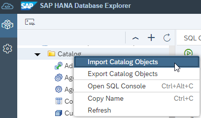
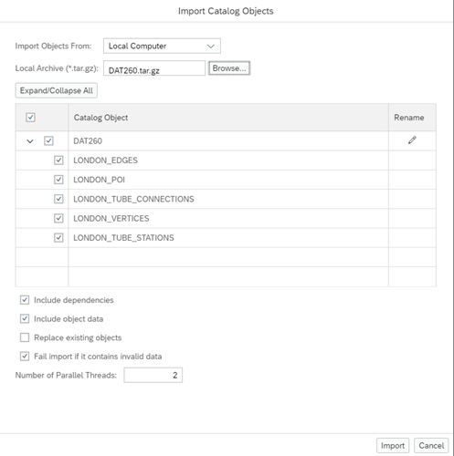
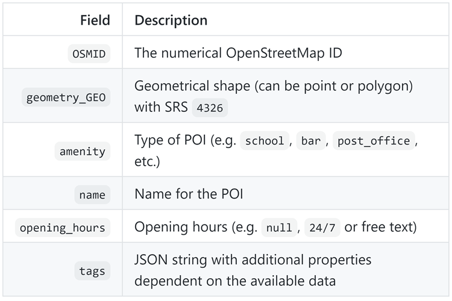
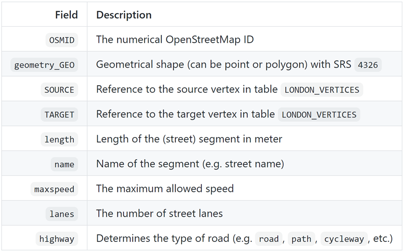
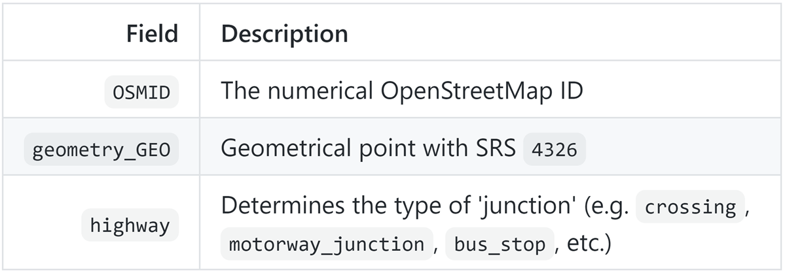
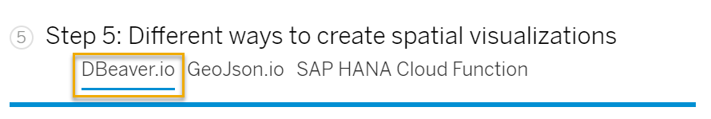
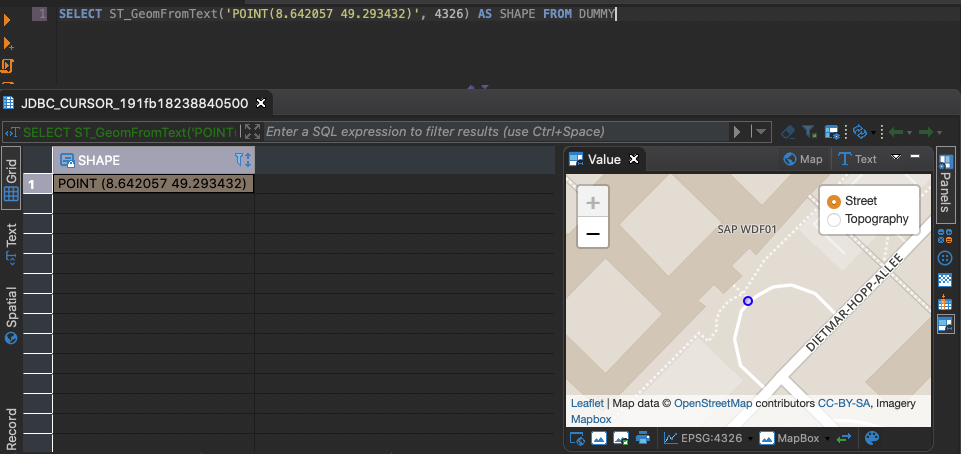
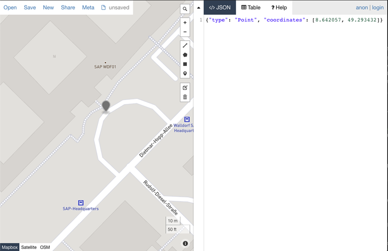

# Explore Visualization Options for Spatial Data in SAP HANA Cloud
<!-- description --> Get an overview about the exercises in this tutorial group and prepare your SAP HANA Cloud, SAP HANA database. You will also learn about the different options for visualization of spatial data in SAP HANA Cloud.

## Prerequisites
- A basic understanding of SQL is helpful.
- An [SAP HANA Cloud trial account](https://www.sap.com/cmp/td/sap-hana-cloud-trial.html).
- A **running** instance of SAP HANA Cloud, SAP HANA database.

## You will learn
- How to prepare your SAP HANA database instance in SAP HANA Cloud
- How to import the sample spatial data to your database instance
- About options which you have, to visualize spatial data


## Intro
In this tutorial group, you will get to know the multi-model data processing capabilities of SAP HANA database in SAP HANA Cloud. You will get your hands on this feature with your own (trial).This tutorial group consists of ten hands-on tutorials that illustrate the possibilities of this feature.

These tutorials are designed to give you insights into spatial and graph processing with SAP HANA Cloud, SAP HANA database. You will use sample data to experiment with SAP HANA Cloud and experience the advantages of the multi-model engine.

In tutorials 2-6 you will primarily work with the geometries of the dataset and focus on the SAP HANA Cloud **Spatial Engine**. This includes the handling of spatial data in HANA tables, distance calculation, and a spatial way to 'snap' POI's to the street network. In tutorials 7-10 we will focus on the SAP HANA Cloud **Graph Engine** and explore different paths in this network, generate `isochrones`, and calculate a simple centrality measure.

This first tutorial will give you an overview of the upcoming tutorials and show you all the necessary preparations to follow along.

> The order of tutorials in this learning track is carefully thought out for you and is designed for someone who does not have a lot of prior knowledge about the multi-model processing capabilities of SAP HANA Cloud, SAP HANA database. However, you can complete these tutorials in whatever order you prefer or that fits your prior knowledge.

If you are new to spatial and graph modeling and processing, you can have a look at these helpful resources to get some background information:

- [SAP HANA Spatial Reference Guide](https://help.sap.com/viewer/bc9e455fe75541b8a248b4c09b086cf5/LATEST/en-US/e1c934157bd14021a3b43b5822b2cbe9.html)
- [SAP HANA Graph Reference Guide](https://help.sap.com/viewer/11afa2e60a5f4192a381df30f94863f9/LATEST/en-US/30d1d8cfd5d0470dbaac2ebe20cefb8f.html)
- [SAP HANA Multi-model @ `Devtoberfest`](https://www.youtube.com/embed/videoseries?list=PL6RpkC85SLQA8za7iX9FRzewU7Vs022dl)

---

### Introduction

For the exercises in this tutorial, a basic understanding of SQL is helpful. To get the most out of the content, we advise to take some time to read and understand the SQL statements and procedures - not just copy/paste and execute. Some of the concepts explained can be re-used in many different scenarios.

You need to set up your own environment to run the exercises. By following the instructions in this section, you will have everything that you need for the exercises presented in the next articles.

These are the requirements to follow along:

1. Prepare your SAP HANA database instance in SAP HANA Cloud.

2. Import the sample data to your instance.

3. Choose one of the options to visualize spatial data depending on your system.


### Prepare your database in SAP HANA Cloud

1. Sign-up for the SAP HANA Cloud trial. If you already have a trial account with SAP Cloud Platform, check your trial entitlements to add SAP HANA Cloud.

2. [Provision an SAP HANA Cloud, SAP HANA database in trial](hana-cloud-mission-trial-2).

3. Make sure your SAP HANA Cloud, SAP HANA database is running in your trial account.

4. Create a user and assign this user the privileges **CREATE SCHEMA** and **IMPORT**. If you are unsure how to create users and assign privileges, [you can read more here](https://github.com/SAP-samples/teched2020-DAT260/tree/main/exercises/ex0#setup-sap-hana-cloud-trial-instance-).

5. From BTP cockpit or SAP HANA Cloud Central, open your trial instance in the SAP HANA Database Explorer and log in with this user's credentials.


### Import the sample data to your instance

We have prepared sample data from OpenStreetMap that we will use throughout the following tutorials. This includes **street network** and point of interest ( **POI** ) data from the London area. The sample data was prepared using the [`osmnx python package`(*)](https://github.com/gboeing/osmnx) and loaded into SAP HANA Cloud, SAP HANA database using the [Python Machine Learning Client for SAP HANA](https://pypi.org/project/hana-ml/).

You can find the sample data in a public GitHub repository: [SAP-samples/teched2020-DAT260](https://github.com/SAP-samples/teched2020-DAT260)

The data for the exercises is packaged as an SAP HANA database export. The export file is in the [data folder of the GitHub repository](https://github.com/SAP-samples/teched2020-DAT260/blob/main/exercises/data/DAT260.tar.gz). Follow these steps:

1. Download the file to your local computer.

2. Once you have downloaded the export file, you can use the SAP HANA Database Explorer to connect to your SAP HANA Cloud system.

3. Right-click on the **Catalog** and select **Import Catalog Objects** to start the wizard.

    <!-- border -->

4. You can keep all the default settings in the **Import Catalog Objects** wizard and click **Import**.

    <!-- border -->


### Explore the contents of sample data

After import, you will find five tables in the schema DAT260. There is `LONDON_POI` which contains 90k points of interest in the London area. This includes pubs and bike repair shops. The street network data is in `LONDON_EDGES`, which represents the actual 1.5 million street segments, and `LONDON_VERTICES`, which describes the 800,000 road junctions. Finally, there are two tables containing data of the London Tube system - `LONDON_TUBE_STATIONS` and `LONDON_TUBE_CONNECTIONS`.


The most important tables will be `LONDON_POI`, `LONDON_EDGES` and `LONDON_VERTICES`. Here you can have a look at some of the important columns in these tables:

1. **POI Data (Table `LONDON_POI`)**

    The Table `LONDON_POI` contains points of interest. Other than the naming suggests these POI's can also be represented by polygon (e.g. the ground view of a house). There are different categories of POI's. A POI may be a park bench as well as a hospital or school. The field amenity can be used to filter the type of POI.

    <!-- border -->

2. **Edge Data (Table `LONDON_EDGES`)**

    The Table `LONDON_EDGES` contains street (or path) segments. If you understand the streets and pathways as a network or graph, you may consider a street the edge of a graph. Intersections between streets would then be vertices (nodes) in this graph.

    <!-- border -->

3. **Vertex Data (Table `LONDON_VERTICES`)**

    The Table `LONDON_VERTICES` contains all the vertices, that can be inferred from the street network in table `LONDON_EDGES`. So, each vertex is essentially a point where at least two street segments come together.

    <!-- border -->


### Different ways to create spatial visualizations

> **For this step, select your preferred method by clicking on the options under the step title.**
>
><!-- border -->

Especially when working with Spatial data it can be extremely valuable to visualize the results - ideally on a map. Without proper visualization, you will just receive geometries described by latitude/longitude pairs, which is hard to interpret.

Depending on your local restrictions to install software, you can consider one of the following three alternatives to visualize the results of a spatial query.

We will use a reference query to show how each option works. To visualize a simple point, the query generates a point by using a select on table DUMMY that calls the spatial function [`ST_GeomFromText`(*)](https://help.sap.com/viewer/bc9e455fe75541b8a248b4c09b086cf5/LATEST/en-US/7a194a8e787c1014bed49b5134e6b930.html).

```SQL
SELECT ST_GeomFromText('POINT(8.642057 49.293432)', 4326) AS SHAPE FROM DUMMY;
```

> **In this step, you can get to know three visualization options by clicking on the three different tabs.**

[OPTION BEGIN [DBeaver.io]]
> DBeaver.io - Open Source DB Client with built-in Spatial Visualizations

DBeaver.io is an open source database client with support for SAP HANA Cloud. The free community edition can be downloaded on [dbeaver.io](https://dbeaver.io/download/).

Refer to this [blog post](https://blogs.sap.com/2020/01/08/good-things-come-together-dbeaver-sap-hana-spatial-beer/) on how to set up the connection to your system.
The example query above will simply return the results while showing a map preview of the geometries.

<!-- border -->

[OPTION END]
[OPTION BEGIN [GeoJson.io]]
> GeoJson.io - Online Service to Visualize `GeoJSON`

If you have restrictions with installing local software, there are online services that you can use for visualization of geometries. An example is [GeoJson.io](http://geojson.io/). This service can visualize geometries, that are represented as a `GeoJSON` with SRID 4326. You need to use function [`ST_Transform`(*)](https://help.sap.com/viewer/bc9e455fe75541b8a248b4c09b086cf5/LATEST/en-US/e2b1e876847a47de86140071ba487881.html) and function [`ST_AsGeoJson`(*)](https://help.sap.com/viewer/bc9e455fe75541b8a248b4c09b086cf5/LATEST/en-US/7a157dd1787c1014a5d8d88e3811bcc8.html) to generate this representation on SAP HANA Cloud.

The example query above becomes:
```SQL
SELECT SHAPE.ST_Transform(4326).ST_AsGeoJson()
FROM
(
  -- example query
  SELECT ST_GeomFromText('POINT(8.642057 49.293432)', 4326) AS SHAPE FROM DUMMY
);
```


The resulting `GeoJSON` can be copy and pasted into the web form:
```
{"type": "Point", "coordinates": [8.642057, 49.293432]}
```


You can then see the visualization of this point on a map:

<!-- border -->


[OPTION END]
[OPTION BEGIN [SAP HANA Cloud Function]]
> `ST_AsSVGAggr` - SAP HANA Cloud Function to Generate a Scalable Vector Graphic

In case that internet access is restricted on your machine, you can use SAP HANA Cloud's build-in function [`ST_AsSVGAggr`(*)](https://help.sap.com/viewer/bc9e455fe75541b8a248b4c09b086cf5/LATEST/en-US/b995aa41e2334478ba8351d6ecaa9467.html) to generate a scalable vector graphic, and then display it in your browser. With this approach, you will simply see the shapes of the geometries without any base map visualization.
This, of course, is the least helpful visualization for exploring the data. Some details on how to do it nonetheless, will be given in [Tutorial 5, Step 2 - Create a Scalable Vector Graphic (SVG) to Visualize Cycleways](hana-cloud-smart-multi-model-5).

[OPTION END]

You should now have an overview of the technical pre-requisites as well as the necessary background information to master the exercises in this tutorial group. When starting with the exercises keep in mind that the data is residing in the schema ´DAT260´. Make sure to set the context to this schema by executing:

```SQL
SET SCHEMA DAT260;
```


> You are ready to start with the first exercise in the next tutorial. There, you will learn how to add Planar Geometries Based on the tables you have imported.


### Test yourself


---
