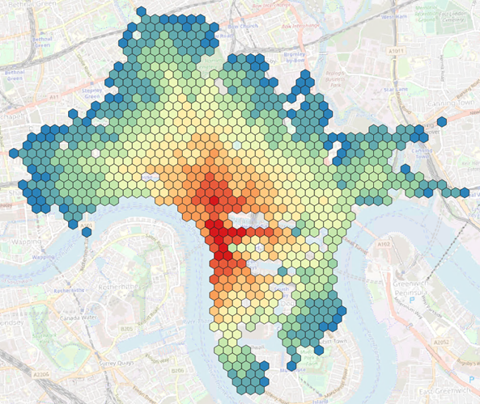
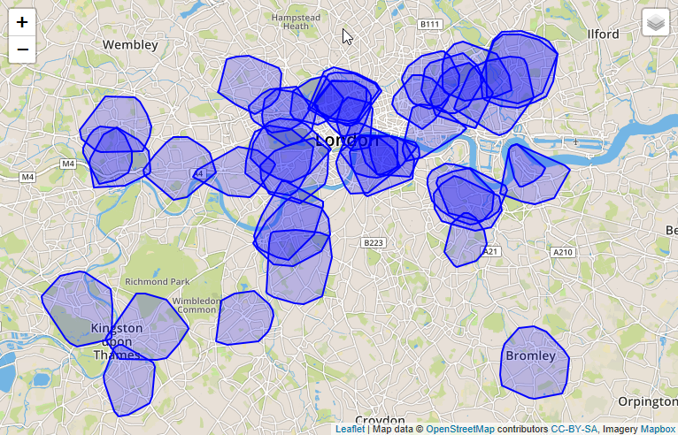
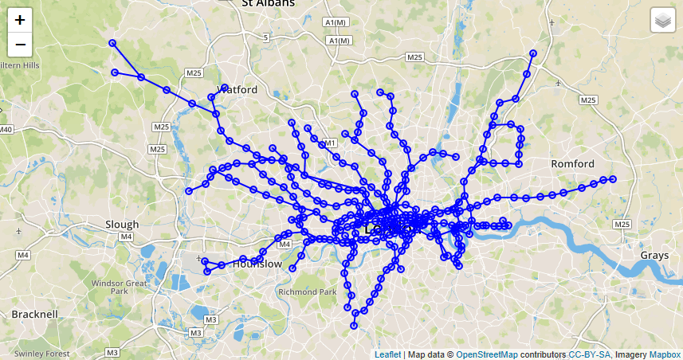
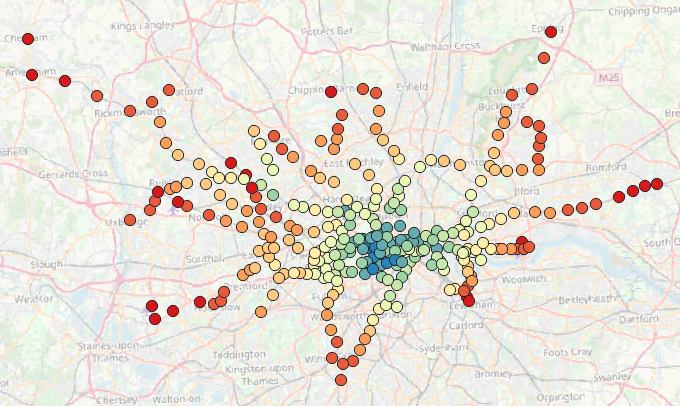

# Calculate Isochrones and Closeness Centrality
<!-- description --> Learn how to use Shortest Paths One-To-All (SPOA) and Breadth First Search (BFS) functions, which allow you to calculate isochrones and closeness centrality.

## Prerequisites
- You have already created a Graph Workspace using the tutorial [First steps with the SAP HANA Graph Engine](hana-cloud-smart-multi-model-7).
- You have access to the [sample graph data](https://github.com/SAP-samples/teched2020-DAT260/blob/main/exercises/data/DAT260.tar.gz) used in this tutorial group.
- Make sure your database instance is **running** before you start.


## You will learn
- How to use Shortest Path One-to-All (SPOA) function to calculate minimum distance
- How to use Breadth First Search (BFS) function to implement Closeness Centrality


## Intro
In this tutorial, you will explore two more fundamental functions: **Shortest Path One-to-All (SPOA)** and **Breadth First Search (BFS)**. The first one does the obvious - given a start vertex, it calculates the distance/cost to every other vertex in the graph. SPOA can be used to calculate [**`Isochrones`** (*)](https://wiki.openstreetmap.org/wiki/Isochrone), i.e. areas with the same drive time distance. While [BFS](https://en.wikipedia.org/wiki/Breadth-first_search) is a fundamental building block for many graph algorithms, including [**Closeness Centrality**](https://en.wikipedia.org/wiki/Closeness_centrality) - one of the multiple standard centrality algorithms to identify the importance of a vertex in a network.

This tutorial consists of two steps:

- Calculate minimum distance using **SPOA** function
- Implement closeness centrality using **BFS** function


---

### Calculate minimum distance using SPOA function

The `Shortest_Path_One_To_All` function is like the `Shortest_Path` that you have used in the previous tutorials. As the name suggests, it calculates the minimum distances/costs from a start vertex to all other vertices in the network. The result is not a single `WeigthedPath`, but a Graph which contains edges of shortest paths only. The **vertices of the output Graph have an attribute `CALCULATED_COST` which indicates the minimum distance/cost required to reach the vertex**.

The SPOA statement is constructed like this:

```SQL
GRAPH g_spoa = SHORTEST_PATHS_ONE_TO_ALL(:g, :v_start, "CALCULATED_COST",
(EDGE e, DOUBLE current_path_cost) => DOUBLE {
IF(:current_path_cost < :i_max) { RETURN :e."length"/DOUBLE(:e."SPEED_MPH"); }
ELSE { END TRAVERSE; }
});
```


1. Here is the complete statement that you can run in your example. As previously, first you create a **table type** and then the **GRAPH procedure**:

    ```SQL
CREATE TYPE "TT_SPOA_VERTICES" AS TABLE ("osmid" BIGINT, "CALCULATED_COST" DOUBLE);
CREATE OR REPLACE PROCEDURE "GS_SPOA"(
	IN i_startVertex BIGINT, 		-- the key of the start vertex
	IN i_max DOUBLE,				-- the maximum distance/cost
	OUT o_vertices "TT_SPOA_VERTICES"
	)
LANGUAGE GRAPH READS SQL DATA AS
BEGIN
	GRAPH g = Graph("DAT260", "LONDON_GRAPH");
	VERTEX v_start = Vertex(:g, :i_startVertex);
	-- Running shortest paths one to all, which returns a subgraph. The WEIGHT based path length to a vertex is stored in the attribute CALCULATED_COST
	GRAPH g_spoa = SHORTEST_PATHS_ONE_TO_ALL(:g, :v_start, "CALCULATED_COST",
		(EDGE e, DOUBLE current_path_cost) => DOUBLE{
  			IF(:current_path_cost < :i_max) { RETURN :e."length"/(DOUBLE(:e."SPEED_MPH")*0.44704); }
            ELSE { END TRAVERSE; }
  		});
	o_vertices = SELECT :v."osmid", :v."CALCULATED_COST" FOREACH v IN Vertices(:g_spoa);
END;
```

2. As an example, what to do with the SPOA method, you can calculate, where you can go in 300 seconds from your starting point Canary Wharf with this statement:

    ```SQL
CALL "GS_SPOA" (1433737988, 300, ?);
```

3. To visualize the data, let's wrap it in a function and do some post-processing to our graph results. With `resultType` = `POINTS` the function will **return the raw data**, i.e. the individual street intersections that are reachable given a certain maximum of travel time. With `resultType` = `CONVEXHULL` the function will **calculate a convex hull of the points and return a single shape**. Finally, with `resultType` = `HEXAGON` a spatial clustering is applied, and **travel times are averaged for each cluster cell**.

    ```SQL
CREATE OR REPLACE FUNCTION "F_SPOA_VERTICES"(
	IN i_startVertex BIGINT, 		-- the key of the start vertex
	IN i_max DOUBLE,				-- the maximum distance/cost
	IN i_resultType VARCHAR(20)	-- indicates if the result should be POINTS, CONVEXHULL, or HEXAGON
	)
    RETURNS TABLE("ID" BIGINT, "SHAPE" ST_GEOMETRY(32630), "CALCULATED_COST" DOUBLE)
LANGUAGE SQLSCRIPT READS SQL DATA AS
BEGIN
    CALL "GS_SPOA"(:i_startVertex, :i_max, o_path_vertices);
	IF (:i_resultType = 'POINTS') THEN
		RETURN SELECT pv."osmid" AS "ID", lv."SHAPE", pv."CALCULATED_COST"
		FROM :o_path_vertices AS pv
		LEFT JOIN "LONDON_VERTICES" lv ON pv."osmid" = lv."osmid";
	ELSEIF (:i_resultType = 'CONVEXHULL') THEN
		RETURN SELECT i_startVertex AS "ID", ST_CONVEXHULLAGGR("SHAPE") AS "SHAPE", :i_max AS "CALCULATED_COST" FROM (
		SELECT pv."osmid", lv."SHAPE", pv."CALCULATED_COST"
		FROM :o_path_vertices AS pv
		LEFT JOIN "LONDON_VERTICES" lv ON pv."osmid" = lv."osmid");
	ELSEIF (:i_resultType = 'HEXAGON') THEN
		RETURN SELECT ST_CLUSTERID() AS "ID", ST_CLUSTERCELL() AS "SHAPE", CAST(AVG("CALCULATED_COST") AS DOUBLE) AS "CALCULATED_COST" FROM (
		SELECT pv."osmid", lv."SHAPE", pv."CALCULATED_COST"
		FROM :o_path_vertices AS pv
		LEFT JOIN "LONDON_VERTICES" lv ON pv."osmid" = lv."osmid")
		GROUP CLUSTER BY "SHAPE" USING HEXAGON X CELLS 50;
	END IF;
END;
```

4. You can use these three statements to explore from your starting point Canary Wharf:

    ```SQL
SELECT * FROM "F_SPOA_VERTICES"(1433737988, 60, 'POINTS') ORDER BY "CALCULATED_COST" DESC;
SELECT * FROM "F_SPOA_VERTICES"(1433737988, 60, 'CONVEXHULL') ORDER BY "CALCULATED_COST" DESC;
SELECT * FROM "F_SPOA_VERTICES"(1433737988, 240, 'HEXAGON') ORDER BY "CALCULATED_COST" DESC;
```

5. Using a GIS application like [`Esri ArcGIS Pro`(*)](https://www.esri.com/en-us/arcgis/products/arcgis-pro/overview) or [`QGIS`(*)](https://qgis.org/en/site/about/index.html), the HEXAGON result can be **color-coded** by the average `CALCULATED_COST`, resulting in a map visualization like below. Areas with the same color can be reached with the same drive time - so called `isochrones`.

    <!-- border -->

6. Let's say you next want to do business with cyclists in London. Your goal is to open a new bike repair shop. To find the right location for your shop, you could look at the existing repair stations and their reach. Maybe you can **find white spots on the map where there is not a lot of competition**.

    So let's calculate 3 min drive time areas around all the bike repair shops in London. You'll use the `MAP_MERGE` operation to digest multiple POI's:

    ```SQL
CREATE OR REPLACE FUNCTION "F_SPOA_VERTICES_MULTI" (IN i_filter VARCHAR(5000), IN i_max DOUBLE, IN i_resultType VARCHAR(20))
	RETURNS TABLE("ID" BIGINT, "SHAPE" ST_GEOMETRY(32630), "CALCULATED_COST" DOUBLE)
LANGUAGE SQLSCRIPT READS SQL DATA AS
BEGIN
	startPOIs = APPLY_FILTER("LONDON_POI", :i_filter);
	res = MAP_MERGE(:startPOIs, "F_SPOA_VERTICES"(:startPOIs."VERTEX_OSMID", :i_max, :i_resultType));
	RETURN SELECT * FROM :res;
END;
SELECT * FROM "F_SPOA_VERTICES_MULTI"(' "amenity" = ''bicycle_repair_station'' ', 180, 'CONVEXHULL');
```

The result is a set of `CONVEXHULL` polygons which indicate "**good repair shop coverage**".

<!-- border -->


### Implement closeness centrality using BFS function

For this step, you will use a different network, the London Tube network. It is a simple dataset in which the **tube stations represent vertices**, the **sequence of stations along a tube line are the edges**.

<!-- border -->

1. First, select the tables and then create a **GRAPH workspace** with these statements:

    ```SQL
SELECT * FROM "LONDON_TUBE_STATIONS";
SELECT * FROM "LONDON_TUBE_CONNECTIONS";
CREATE GRAPH WORKSPACE "TUBE_GRAPH"
	EDGE TABLE "LONDON_TUBE_CONNECTIONS"
		SOURCE COLUMN "SOURCE"
		TARGET COLUMN "TARGET"
		KEY COLUMN "ID"
	VERTEX TABLE "LONDON_TUBE_STATIONS"
		KEY COLUMN "ID";
```


    When you traverse a network in a breadth first search manner, you explore the vertices level by level. Starting at a vertex, you first visit all its direct neighbors, then the neighbors of the neighbors and so forth. BFS is a fundamental building block for many custom graph algorithms. In SAP HANA Cloud, SAP HANA database you can "hook" into the vertex/edge "visit" events, executing any logic.

    ```SQL
TRAVERSE BFS ('ANY') :g FROM :v_start
ON VISIT VERTEX (Vertex v_visited, BIGINT lvl) {
[any logic goes here]
};
```

    In the example below, you will **hook into the `VISIT VERTEX` event and calculate a count and a cost**. These numbers are then used to derive multiple closeness centrality measures.

2. As usual, create the **table type** first:

    ```SQL
CREATE TYPE "TT_RESULT_CC" AS TABLE (
    "ID" BIGINT, "CLOSENESS_CENTRALITY" DOUBLE, "NORMALIZED_CLOSENESS_CENTRALITY" DOUBLE, "HARMONIC_CENTRALITY" DOUBLE, "NORMALIZED_HARMONIC_CENTRALITY" DOUBLE
);
```

3. Then, create the **GRAPH procedure**:

    ```SQL
CREATE OR REPLACE PROCEDURE "GS_CC_SINGLE_SOURCE"(
	IN i_start BIGINT,
	OUT o_vertices "TT_RESULT_CC")
LANGUAGE GRAPH READS SQL DATA AS
BEGIN
	GRAPH g = Graph("DAT260","TUBE_GRAPH");
  -- you need to add attributes to the vertices to store the data
	ALTER g ADD TEMPORARY VERTEX ATTRIBUTE (DOUBLE "CLOSENESS_CENTRALITY");
	ALTER g ADD TEMPORARY VERTEX ATTRIBUTE (DOUBLE "NORMALIZED_CLOSENESS_CENTRALITY");
	ALTER g ADD TEMPORARY VERTEX ATTRIBUTE (DOUBLE "HARMONIC_CENTRALITY");
	ALTER g ADD TEMPORARY VERTEX ATTRIBUTE (DOUBLE "NORMALIZED_HARMONIC_CENTRALITY");
  -- initialize the start vertex and some variables
	VERTEX v_start = Vertex(:g, :i_start);
	BIGINT v_sumNodes = 0L;
	BIGINT v_sumCost = 0L;
	DOUBLE v_sumReciprocCost = 0.0;
  -- now you are traversing the graph from the start vertex, following the edges in any direction.
  -- when a vertex is visited, the vertex is accessible as "v_visited". The "level" information is stored in "lvl".
  -- within the vertex visit event, you increase the sum of visited nodes and the sum of costs.
	TRAVERSE BFS ('ANY') :g FROM :v_start ON VISIT VERTEX (Vertex v_visited, BIGINT lvl) {
	    IF (:lvl > 0L){
	    	v_sumNodes = :v_sumNodes + 1L;
		    v_sumCost = :v_sumCost + :lvl;
		    v_sumReciprocCost = :v_sumReciprocCost + 1.0/DOUBLE(:lvl);
		}
	};
  -- if the traversal is finished, you derive the final measures
	IF (:v_sumCost > 0L AND :v_sumReciprocCost > 0.0 AND :v_sumNodes > 1L){
		v_start."CLOSENESS_CENTRALITY" = 1.0/DOUBLE(:v_sumCost);
		v_start."NORMALIZED_CLOSENESS_CENTRALITY" = DOUBLE(:v_sumNodes)/DOUBLE(:v_sumCost);
		v_start."HARMONIC_CENTRALITY" = :v_sumReciprocCost;
		v_start."NORMALIZED_HARMONIC_CENTRALITY" = :v_sumReciprocCost/DOUBLE(:v_sumNodes);
	}
	MULTISET<Vertex> m_v = v IN Vertices(:g) WHERE :v."CLOSENESS_CENTRALITY" >= 0.0;
	o_vertices = SELECT :v."ID", :v."CLOSENESS_CENTRALITY", :v."NORMALIZED_CLOSENESS_CENTRALITY", :v."HARMONIC_CENTRALITY", :v."NORMALIZED_HARMONIC_CENTRALITY" FOREACH v IN :m_v;
END;
```

4. Once the procedure is created, you can call it:

    ```SQL
CALL "GS_CC_SINGLE_SOURCE"(117, ?);
```

    **The closeness centrality measure for a single vertex in a network is not very meaningful**. You need to calculate the centrality for all vertices to find the most important one. You can do this by adding a loop into your GRAPH program. A nice way to implement such loops in a parallel way is by using the `MAP_MERGE` operator in `SQLScript`. For this, you need to wrap the procedure in a function like you did in [tutorial 9, step 4](hana-cloud-smart-multi-model-9).

5. Create the **function** like this:

    ```SQL
CREATE OR REPLACE FUNCTION "F_CC_SINGLE_SOURCE"(IN i_start BIGINT)
    RETURNS "TT_RESULT_CC"
LANGUAGE SQLSCRIPT READS SQL DATA AS
BEGIN
    CALL "GS_CC_SINGLE_SOURCE"(:i_start, result);
    RETURN :result;
END;
```

6. Next, you can invoke this function on a set input parameter in a parallel way.

    ```SQL
CREATE OR REPLACE FUNCTION "F_CC_MAP_MERGE" ()
	RETURNS "TT_RESULT_CC"
LANGUAGE SQLSCRIPT READS SQL DATA AS
BEGIN
	startVertices = SELECT DISTINCT "ID" FROM "LONDON_TUBE_STATIONS";
	result = MAP_MERGE(:startVertices, "F_CC_SINGLE_SOURCE"(:startVertices."ID"));
	RETURN :result;
END;
```

7. Then you can select from it:

    ```SQL
SELECT * FROM "F_CC_MAP_MERGE"() ORDER BY "NORMALIZED_CLOSENESS_CENTRALITY" DESC;
```

8. Again, you can mix the results from a graph function with other SQL operations, like a JOIN.

    ```SQL
SELECT *
  FROM "F_CC_MAP_MERGE"() AS C
	LEFT JOIN "LONDON_TUBE_STATIONS" AS S
  ON C."ID" = S."ID"
	ORDER BY "NORMALIZED_CLOSENESS_CENTRALITY" DESC;
```

    Using a GIS application for advanced visualization, you see the tube stations, where the **blue ones are most important/central to the network**.

    <!-- border -->

> In this tutorial, you got to know more about complex procedures and functions that offer you helpful visualization approaches for your spatial data.

That is all for this tutorial group. You got to know various methods to work with spatial and graph data.

Thanks for reading!

Follow our tag in the [**SAP Community**](https://blogs.sap.com/tags/73554900100800002881/) to stay up-to-date on the latest updates and newest content! For more learning materials on **SAP HANA Cloud**, [click here](https://community.sap.com/topics/hana-cloud).

Related content:

-	[SAP HANA Spatial Reference Guide](https://help.sap.com/viewer/bc9e455fe75541b8a248b4c09b086cf5/LATEST/en-US/e1c934157bd14021a3b43b5822b2cbe9.html)
-	[SAP HANA Graph Reference Guide](https://help.sap.com/viewer/11afa2e60a5f4192a381df30f94863f9/LATEST/en-US/30d1d8cfd5d0470dbaac2ebe20cefb8f.html)


### Test yourself


---
