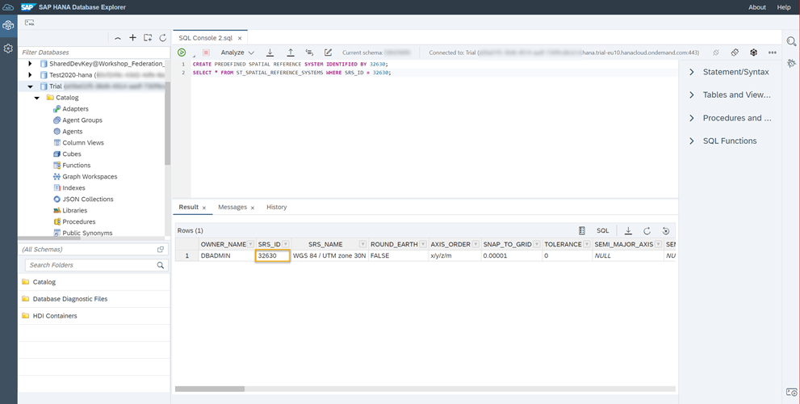

# Add Planar Geometries to SAP HANA Database in SAP HANA Cloud
<!-- description --> Learn about what Spatial Reference Systems are and how to add planar geometries based on WGS84 geometries to a table in SAP HANA Cloud, SAP HANA database.

## Prerequisites
- You have completed the tutorial [Explore Visualization Options for Spatial Data in SAP HANA Cloud](hana-cloud-smart-multi-model-1).
- You have access to the [sample spatial data](https://github.com/SAP-samples/teched2020-DAT260/blob/main/exercises/data/DAT260.tar.gz) used in this tutorial group.
- Make sure your database instance is **running** before you start.


## You will learn
- How to add planar geometries
- How to create a column using planar Spatial Reference System (SRS)
- How to transform geometries from one spatial reference system to another


## Intro
In this tutorial, you will learn how to add planar geometries based on `WGS84` geometries. This includes three steps:

-	Create Planar Spatial Reference System
-	Add Column with Type `ST_Geometry`
- Persist Projected Geometries

---

### Representing geometries in Spatial Reference Systems

In our current dataset, we have a column of type [`ST_Geometry` (*)](https://help.sap.com/viewer/bc9e455fe75541b8a248b4c09b086cf5/LATEST/en-US/7a1f0883787c101495ac9074d9bf3923.html) holding latitude and longitude values.
We can view latitude and longitude as double values by selecting [`ST_X()` (*)](https://help.sap.com/viewer/bc9e455fe75541b8a248b4c09b086cf5/LATEST/en-US/7a290e0d787c10149429b3677c80c5a5.html) and [`ST_Y()` (*)](https://help.sap.com/viewer/bc9e455fe75541b8a248b4c09b086cf5/LATEST/en-US/7a295b1d787c1014b19cb803454504b4.html) from our geometry column.

```SQL
SELECT
	"geometry_GEO".ST_X() AS LONGITUDE,
	"geometry_GEO".ST_Y() AS LATITUDE
FROM LONDON_VERTICES;
```

Geometries can be represented in different [Spatial Reference Systems (SRS)](https://help.sap.com/viewer/bc9e455fe75541b8a248b4c09b086cf5/LATEST/en-US/7a2ea357787c101488ecd1b725836f07.html). The given latitude and longitude values are based on a round-earth model and the corresponding spatial reference system is [**WGS84 (id 4326)**](https://help.sap.com/viewer/bc9e455fe75541b8a248b4c09b086cf5/LATEST/en-US/7a2ea357787c101488ecd1b725836f07.html).

For performance reasons, it is recommended to use a projected spatial reference system instead of a round-earth model. This way Euclidean geometry can be used for spatial calculations, which is less expensive than calculations on the sphere. The second general recommendation when dealing with spatial data is to persist the base geometries. This way, in-database optimizations such as spatial indices can be leveraged.

Check out this brief [YouTube Video](https://www.youtube.com/embed/s48iAbBrYBI) to get an overview of the concept of Spatial Reference Systems.

Now that you know the basics, your first step in this exercise will be to create a planar spatial reference system in SAP HANA Cloud, SAP HANA database.


### Create planar Spatial Reference System with id 32630

SAP HANA is already aware of more than 9000 spatial reference systems - including the spatial reference system defined by [EPSG](https://epsg.org/). A suitable projected spatial reference system for UK is the [SRS with id 32630](http://epsg.io/32630).

Before, we can create our first column using this SRS, we need to install it on SAP HANA Cloud, SAP HANA database. Installation has to be done only the first time we are using this SRS. Since `32630` is part of EPSG and already known to SAP HANA Cloud, we can issue our [creation statement](https://help.sap.com/viewer/bc9e455fe75541b8a248b4c09b086cf5/LATEST/en-US/9ebcad604e8d4c43a802d08cfdbe8ab2.html) referencing only the `id` of the SRS.

1. In SAP HANA Database Explorer, open a SQL Console.

2. Set the schema `DAT260` by executing this statement:

    ```SQL
SET SCHEMA DAT260;
```

3. Paste this statement to the console and execute it:

    ```SQL
CREATE PREDEFINED SPATIAL REFERENCE SYSTEM IDENTIFIED BY 32630;
```

4. A list of all installed Spatial Reference Systems can be found in the table [`ST_SPATIAL_REFERENCE_SYSTEMS`(*)](https://help.sap.com/viewer/bc9e455fe75541b8a248b4c09b086cf5/LATEST/en-US/7a2ea357787c101488ecd1b725836f07.html). To confirm that the above statement has installed `SRS 32630`, you can check the result by executing this statement:

    ```SQL
SELECT * FROM ST_SPATIAL_REFERENCE_SYSTEMS WHERE SRS_ID = 32630;
```

    <!-- border -->

5. You should now see one record in the **Results** panel. Next, we will add a column to store geometric data in our tables.


### Add column with geometry type

Before we can persist the geometry data with the now installed SRS, we need to create a column for storing this data. We will add a column to all our tables, name it `SHAPE` and specify the type to be `ST_Geometry` with the `SRS 32630`. We will enhance the existing tables by using the [ALTER TABLE](https://help.sap.com/viewer/c1d3f60099654ecfb3fe36ac93c121bb/LATEST/en-US/20d329a6751910149d5fdbc4800f92ff.html) statement. Paste these statements to your SQL console and execute them:

```SQL
ALTER TABLE LONDON_POI ADD (SHAPE ST_Geometry(32630));

ALTER TABLE LONDON_EDGES ADD (SHAPE ST_Geometry(32630));
ALTER TABLE LONDON_VERTICES ADD (SHAPE ST_Geometry(32630));

ALTER TABLE LONDON_TUBE_CONNECTIONS ADD (SHAPE ST_Geometry(32630));
ALTER TABLE LONDON_TUBE_STATIONS ADD (SHAPE ST_Geometry(32630));
```

Once that is done, you can check if the column has been added successfully by opening the tables in your catalog.


### Persist projected geometries

Next, you can fill the column `SHAPE` with geometries in `SRS 32630` by transforming the existing WGS84 geometries.

You can transform geometries from one spatial reference system to another with the function [`ST_Transform`(*)](https://help.sap.com/viewer/bc9e455fe75541b8a248b4c09b086cf5/LATEST/en-US/e2b1e876847a47de86140071ba487881.html).

To transform the existing geometries to `SRS 32630` and persist the result in column `SHAPE`, execute these statements:

```SQL
UPDATE LONDON_POI SET SHAPE = "geometry_GEO".ST_Transform(32630);

UPDATE LONDON_EDGES SET SHAPE = "geometry_GEO".ST_Transform(32630);
UPDATE LONDON_VERTICES SET SHAPE = "geometry_GEO".ST_Transform(32630);

UPDATE LONDON_TUBE_CONNECTIONS SET SHAPE = SHAPE_4326.ST_Transform(32630);
UPDATE LONDON_TUBE_STATIONS SET SHAPE = SHAPE_4326.ST_Transform(32630);
```

You can check if the data has been added successfully to the column by right-clicking on the tables in your catalog and selecting **Open Data**. There, you should now see the transformed data.
You have now enhanced the existing data model by a planar projection of the WGS84 geometries.

> In the next tutorial, learn how to determine distances to target Points of Interest (POI).


### Test yourself


---
