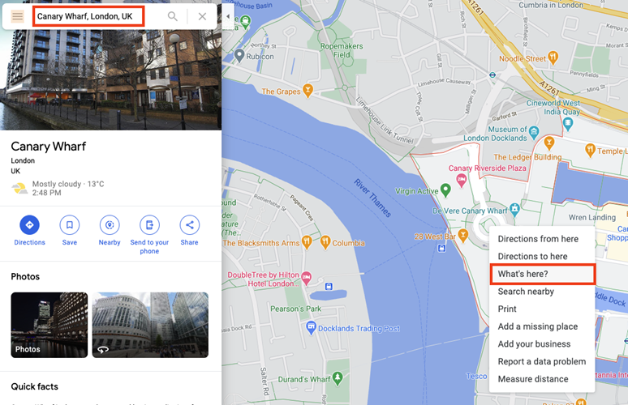
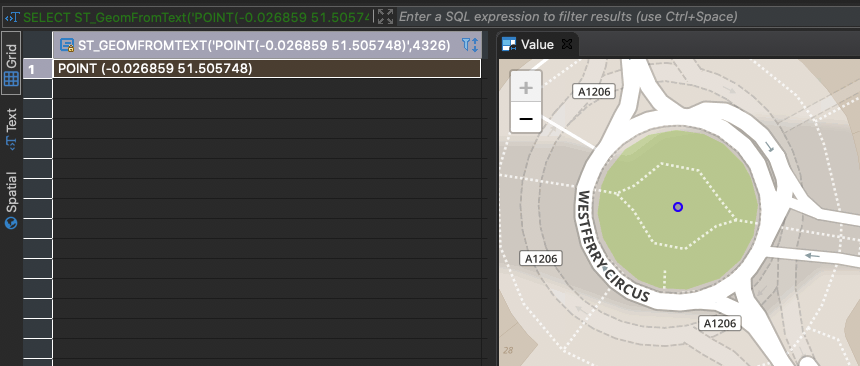
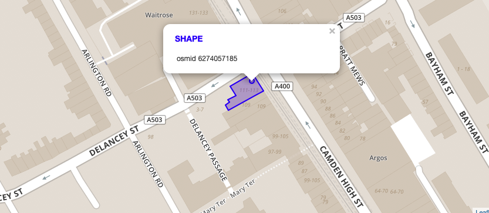

# Determine the Distance to a Target POI
<!-- description --> Learn how you can select specific location points via SQL and determine the distance between two points in SAP HANA Cloud, SAP HANA database.

## Prerequisites
- You have completed the tutorial [Adding Planar Geometries to SAP HANA database in SAP HANA Cloud](hana-cloud-smart-multi-model-2).
- You have access to the [sample spatial data](https://github.com/SAP-samples/teched2020-DAT260/blob/main/exercises/data/DAT260.tar.gz) used in this tutorial group.
- Make sure your database instance is **running** before you start.


## You will learn
- How to transform your location point to a Spatial Reference System
- How to select a target POI from the sample data
- How to determine the distance between two location points


## Intro
In this tutorial, you will learn how to determine the distance to a target **Point of Interest (POI)**. This includes three steps:

-	Select a Location via SQL
-	Select a Target POI
-	Determine distance between two points

Imagine you are done working for today, step out of the office and want to go to a bar in London to grab your well-deserved home-made iced tea.

In this exercise, you will calculate the distance between your location and a POI of the type **`bar`** in the table **`LONDON_POI`**.


---

### Select a location via SQL

You are starting your trip at Canary Wharf in London. In this step, you will use a select statement reflecting your starting point location as type **`ST_Geometry`**.

1. First, you will need to find the latitude and longitude of your location. Web mapping services like Google Maps can help here. Visit [maps.google.com](https://www.google.com/maps) and zoom-in to **Canary Wharf** in London. **Right-click** on the big round-about and select **What's here?**.

    <!-- border -->

2. You can retrieve the coordinates from the small overlay at the bottom of the window or copy and paste from the current URL.

    <!-- border -->

3. Next, you need to bring these coordinates into SAP HANA Cloud, SAP HANA database. To do that, you can use the function [`ST_GeomFromText`(*)](https://help.sap.com/viewer/bc9e455fe75541b8a248b4c09b086cf5/LATEST/en-US/7a194a8e787c1014bed49b5134e6b930.html). This constructor for geometries expects a [ **Well-known Text (WKT)** ](https://en.wikipedia.org/wiki/Well-known_text_representation_of_geometry) as well as the associated spatial reference system as input. Latitude and longitude can be easily assembled to match the expected WKT string. The associated spatial reference system in this case has `id 4326 (WGS84)`.

    ```SQL
SELECT ST_GeomFromText('POINT(-0.026859 51.505748)', 4326) FROM DUMMY;
    ```

4. If you use a SQL editor with built-in spatial visualization, like `DBeaver`, you will be able to preview the location and double-check that it matches your previously selected location.

    <!-- border -->

5. To make the following exercises more convenient, it is a good idea to transform this point to the same spatial reference system as our data from OpenStreetMap (SRS with `id 32630`). We can extract the Well-known Text representation by using the function [`ST_AsWKT`(*)](https://help.sap.com/viewer/bc9e455fe75541b8a248b4c09b086cf5/LATEST/en-US/7a169dff787c1014a095b86992806f14.html).

    ```SQL
SELECT ST_GeomFromText('POINT(-0.026859 51.505748)', 4326) .ST_Transform(32630) .ST_AsWKT() FROM DUMMY;
    ```

6. In the Results Panel you should now see the transformed coordinates:

    ```
POINT (706327.107445 5710259.94449)
```


7. Next, you need to select this point with Spatial Reference System `32630` by executing the following statement.

    ```SQL
SELECT ST_GeomFromText('POINT (706327.107445 5710259.94449)', 32630) FROM DUMMY;
    ```


### Select a target POI

Now that your starting point coordinate has been transformed and selected, you need to select the target POI from the table `LONDON_POI`.

1. Your target destination is a bar called **Blues Kitchen** in Camden. All points of interest are stored in the table `LONDON_POI`. You can search our POI based on field name and amenity. The latter describes the type of POI. In our case we would like to filter for value **bar** by executing this statement:

    ```SQL
SELECT *
FROM LONDON_POI lp
WHERE LOWER("name") LIKE '%blues kitchen%' AND "amenity" = 'bar'
    ```

2. You should receive 4 records in the **Results** panel.

3. You can use a visualization tool to see the location of these records. If you do not have a visualization tool installed, you can use online tools such as [Wicket](https://arthur-e.github.io/Wicket/sandbox-gmaps3.html). Wicket is able to visualize geometries in WKT format in spatial reference system 4326. To obtain these geometries from SAP HANA Cloud we can use [`ST_Transform`(*)](https://help.sap.com/viewer/bc9e455fe75541b8a248b4c09b086cf5/LATEST/en-US/e2b1e876847a47de86140071ba487881.html)  in combination with [`ST_AsWKT`(*)](https://help.sap.com/viewer/bc9e455fe75541b8a248b4c09b086cf5/LATEST/en-US/7a169dff787c1014a095b86992806f14.html).

    ```SQL
SELECT "osmid", SHAPE.ST_Transform(4326).ST_AsWKT()
FROM LONDON_POI lp
WHERE LOWER("name") LIKE '%blues kitchen%' AND "amenity" = 'bar';
    ```

4. When you copy over the geometries in WKT format to your (online) visualizer, you will see that two records are not located in Camden and the two other records are actually referring to the same location - one being a polygon depicting the outline of the building and the other being a point depicting the location of the building.

    <!-- border -->

5. In the next step we will work with the POI with OSM ID (field `osmid`) **6274057185**. Select it by executing this statement:

    ```SQL
SELECT * FROM LONDON_POI lp WHERE "osmid" = 6274057185;
    ```


### Determine distance between two points 

Now that you have selected starting point and target point, you can determine the direct distance between your location the selected POI.

You can use the function [`ST_Distance`(*)](https://help.sap.com/viewer/bc9e455fe75541b8a248b4c09b086cf5/LATEST/en-US/7a182aa3787c101481f996e3d419c720.html) to determine the direct distance between both points:

```SQL
SELECT SHAPE.ST_Distance(
        ST_GeomFromText('POINT (706327.107445 5710259.94449)', 32630)
    )
FROM LONDON_POI lp
WHERE "osmid" = 6274057185;
```

Triggering the query above, you can see in the **Results** that the direct distance to reach your home-made iced tea is around 8670 meters.

You have successfully created a geometry using a `WKT` string. Furthermore, you have visualized points of interest by either using `DBeaver` or an online visualization tool like Wicket. With the spatial function `ST_Distance` you have determined the direct distance between two points.

> Learn in the next tutorial how to identify a relevant area for a transportation network.


### Test yourself


---
