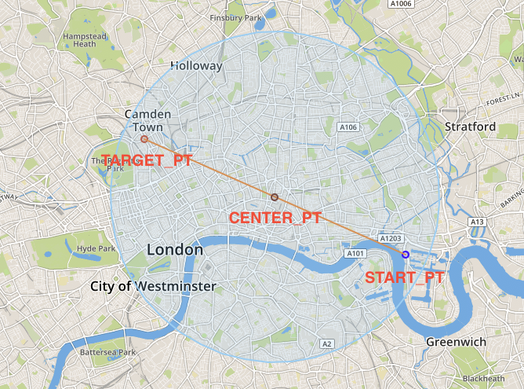

# Identify Relevant Networks in Spatial Data
<!-- description --> Learn how to identify a relevant area in your spatial data in SAP HANA Cloud, SAP HANA database.

## Prerequisites
- You have completed the tutorial [Determine the Distance to a Target POI](hana-cloud-smart-multi-model-4).
- You have access to the [sample spatial data](https://github.com/SAP-samples/teched2020-DAT260/blob/main/exercises/data/DAT260.tar.gz) used in this tutorial group.
- Make sure your database instance is running before you start.


## You will learn
- How to identify a sub-network that represents only the area relevant to your route
- How to create a circle to identify a relevant area in your spatial data
- How to flag nodes of the transportation network located in a circle

 
In this tutorial, you will learn how to identify a relevant area in your spatial data.
Now that you know the distance from your location to the target destination you want to go to, your next task is to find a route in the transportation network. Instead of finding the path while considering the whole transportation network, it is more useful to first select a meaningful sub-network that represents only the area of the network relevant to your route.

## Intro
We will show you how to do that in these two steps:

-	Create a Circle for the Relevant Area
-	Add Flags for all Nodes in the Circle


---

### Create a circle for the relevant area

First, you need to construct a circle to identify the relevant area for the transportation network. The circle should have a minimal size and should contain origin and destination with a buffer of 500 meters around it. To illustrate how the query is being built we will use step-by-step queries with sub-SELECT statements.

Note, that generally, the center point of the smallest circle, which includes two points, is the center point of their direct connection line.

You can see in this image the circle you will create:

<!-- border -->

1. First, select the two points from the previous tutorials using this statement:

    ```SQL
SELECT
	ST_GeomFromText('POINT (706327.107445 5710259.94449)', 32630) AS START_PT,
	SHAPE AS TARGET_PT
FROM LONDON_POI lp
WHERE "osmid" = 6274057185;
    ```


2. To create a line geometry, which is connecting both points, you can then use the function [`ST_MakeLine`(*)](https://help.sap.com/viewer/bc9e455fe75541b8a248b4c09b086cf5/LATEST/en-US/57758b2af95346db9a478a53ec2c4ccb.html).

    ```SQL
SELECT ST_MakeLine(START_PT, TARGET_PT) AS CONN_LINE
FROM
(
	-- previous statement
);
    ```

3. To retrieve an arbitrary point on this line, we need to use function [`ST_LineInterpolatePoint`(*)](https://help.sap.com/viewer/bc9e455fe75541b8a248b4c09b086cf5/LATEST/en-US/c8efe60825514403865090fdf1dc1550.html), which takes a fraction of the line as argument. For retrieving the center point of the line, we pass the value 0.5.

    ```SQL
SELECT CONN_LINE.ST_LineInterpolatePoint(0.5) AS CENTER_PT
FROM
(
	-- previous statement
);
    ```

4. As a final step, we would like to draw a circle with radius distance (start, target)/2 + 500 around `CENTER_PT`. The respective function, which takes the radius as an input, is called [`ST_Buffer`(*)](https://help.sap.com/viewer/bc9e455fe75541b8a248b4c09b086cf5/LATEST/en-US/010c53e227a94966bb009d52d9ec47a2.html).

    ```SQL
SELECT CENTER_PT.ST_Buffer(4835) AS AREA
FROM
(
    -- previous statement
);
    ```

5. The above steps can be combined into a single select using method chaining.

    ```SQL
SELECT
    ST_MakeLine(
        ST_GeomFromText('POINT (706327.107445 5710259.94449)', 32630),
        SHAPE
    )
    .ST_LineInterpolatePoint(0.5)
    .ST_Buffer(5000) AS AREA
FROM LONDON_POI
WHERE "osmid" = 6274057185;
    ```


### Add flags for all nodes in a circle

Next, you need to flag all nodes of the transportation network located in the circle, by setting `in_scope`= true.

1. First, we need to enhance the existing vertex table by column `in_scope`.

    ```SQL
ALTER TABLE LONDON_VERTICES ADD (IN_SCOPE INTEGER);
```

2. Second, we fill the column with 0 or 1 based on the intersection with the identified area. We can use function [`ST_Intersects`(*)](https://help.sap.com/viewer/bc9e455fe75541b8a248b4c09b086cf5/LATEST/en-US/7a19e197787c1014a13087ee8f970cce.html) to determine if two geometries intersect or not.

3. Instead of using an [UPDATE](https://help.sap.com/viewer/c1d3f60099654ecfb3fe36ac93c121bb/LATEST/en-US/20ff268675191014964add3d17700909.html) statement, we will use [MERGE INTO](https://help.sap.com/viewer/c1d3f60099654ecfb3fe36ac93c121bb/LATEST/en-US/3226201f95764a57810dd256c9524d56.html), which allows a more complex update logic.

    ```SQL
MERGE INTO LONDON_VERTICES lv
USING
(
	-- previous statement begin --
	SELECT
    	ST_MakeLine(
        	ST_GeomFromText('POINT (706327.107445 5710259.94449)', 32630),
        	SHAPE
    	)
    	.ST_LineInterpolatePoint(0.5)
    	.ST_Buffer(5000) AS AREA
	FROM LONDON_POI
	WHERE "osmid" = 6274057185
    	-- previous statement end --
) circle ON 1=1
WHEN MATCHED THEN UPDATE SET lv.IN_SCOPE = CIRCLE.AREA.ST_Intersects(SHAPE);
```

4. You can confirm that you properly selected the nodes by using your preferred tool for visualizing the result set with this query:

    ```SQL
SELECT SHAPE FROM LONDON_VERTICES WHERE IN_SCOPE = 1;
    ```

    <!-- border -->

By creating a circle in your relevant area and flagging nodes in this circle, you have successfully identified a sub-network for transportation, which you will consider for finding your path through London in the following exercises.

> Learn in the next tutorial how to check if this area is suitable for riding a bike by visualizing edges and using `Voronoi` cells.


### Test yourself


---
