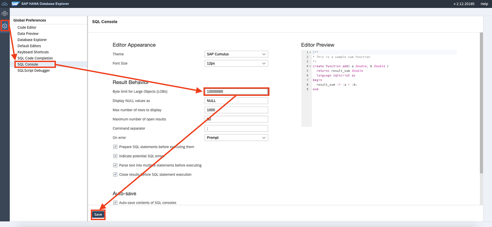
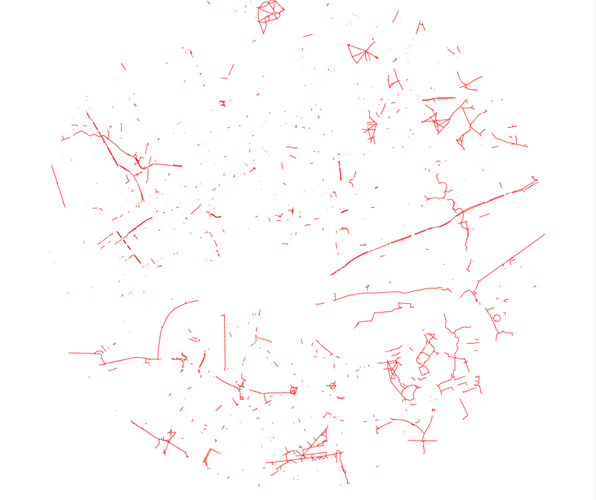
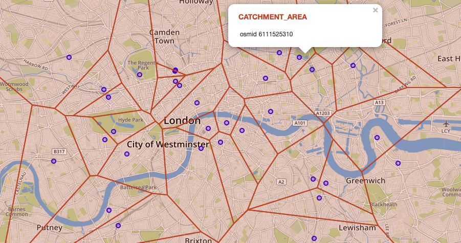

# Visualize a Voronoi Cell Using a Scalable Vector Graphic
<!-- description --> Learn how you can visualize edges and use Voronoi cells to check parameters in an area in your spatial data in SAP HANA Cloud, HANA database.

## Prerequisites
- You have completed the tutorial [Identify Relevant Networks in Spatial Data](hana-cloud-smart-multi-model-4).
- You have access to the [sample spatial data](https://github.com/SAP-samples/teched2020-DAT260/blob/main/exercises/data/DAT260.tar.gz) used in this tutorial group.
- Make sure your database instance is **running** before you start.


## You will learn
- How to use filters to identify relevant areas of interest
- How to create a Scalable Vector Graphic (SVG) to visualize the area of interest
- How to use **`Voronoi`** cells to determine a suitable cycleway based on a criterion


## Intro
After you have identified a relevant area based on your starting and target locations, you will learn in this tutorial how you can check for certain parameters in that area. In this scenario, your plan is to go to the bar by bike. So, next you will check the suitability of the network for bike rides. You will learn how to visualize certain edges based on filter queries and how to use `Voronoi` cells. This includes three steps:

-	Identify cycleways within the area of interest
-	Create a Scalable Vector Graphic (SVG) to visualize Cycleways
-	Use `Voronoi` cells to determine a suitable cycleway


---

### Identify cycleways within the area of interest

Your first step is to select edges with the property `highway` = `cycleway` in the previously identified area. In addition to the filter `highway` = `cycleway`, you need to check if both associated vertices are within the scope of our area of interest. If only one connected vertex is within the scope of your circle, this would mean that you would leave the area of interest by passing this edge (i.e. street). To avoid doing so, execute this statement:

```SQL
SELECT le.*
FROM LONDON_EDGES le
JOIN LONDON_VERTICES u ON le.SOURCE = u."osmid"
JOIN LONDON_VERTICES v ON le.TARGET = v."osmid"
WHERE u.IN_SCOPE = 1 AND v.IN_SCOPE = 1 AND le."highway" = 'cycleway'
```

In the results, you will see all cycleways that fit the parameters in this query.


### Create a Scalable Vector Graphic to visualize cycleways

Next, you need to aggregate the cycleways found in the previous query, create a vector graphic (SVC) to then display the structure of the cycleways in the area. You will construct a query that does all these steps in one execution.

One of the output formats for geometries in SAP HANA Cloud is [**Scalable Vector Graphic (SVG)**](https://en.wikipedia.org/wiki/Scalable_Vector_Graphics). The appropriate function for generating an SVG representation of a geometry is called [`ST_AsSVG`(*)](https://help.sap.com/viewer/bc9e455fe75541b8a248b4c09b086cf5/LATEST/en-US/ef447b3e0a964cd5bbe82074f4225f84.html). You can handover optional parameters for custom styling of the SVG.

Before creating the query, you need to make an adjustment in the SAP HANA Database Explorer. Otherwise you would not be able to see and copy the whole SVG output.

1. Click on the cogwheel on the left side of the screen to open the **Settings**.

2. Select the submenu **SQL console** and in the section **Result Behavior**, find the field '**Byte limit for Large Objects (LOB)**'.

3. You can set the value to **0**, which will be automatically converted to the highest possible value.

    <!-- border -->

4. Now that this setting has been adjusted, you can start with your query. To perform a spatial union operation and construct one geometry out of the result set of the above query, use the function [`ST_UnionAggr`(*)](https://help.sap.com/viewer/bc9e455fe75541b8a248b4c09b086cf5/LATEST/en-US/601aa9fb93e241af96faafcb8f01b12e.html). The following query creates the SVG as a CLOB:

    ```SQL
SELECT ST_UnionAggr(le.SHAPE).ST_AsSVG(Attribute=>'stroke="red" stroke-width="0.1%"')
FROM LONDON_EDGES le
JOIN LONDON_VERTICES u ON le.SOURCE = u."osmid"
JOIN LONDON_VERTICES v ON le.TARGET = v."osmid"
WHERE u.IN_SCOPE = 1 AND v.IN_SCOPE = 1 AND le."highway" = 'cycleway';
```

5. To view the SVG, simply copy & paste the output into a file and give it a name with the ending **`.svg`**. You can view the SVG file by opening it with your browser.

    You can find our SVG file here: [Link](https://github.com/SAP-samples/teched2020-DAT260/blob/main/exercises/ex4/images/cycle_ways.svg).

    <!-- border -->


### Use `Voronoi` cells to determine a suitable cycleway

To evaluate how suitable the area is for bike riding, let's say you want to find bicycle repair stations and their catchment area next. To do that, you will **select all bicycle repair stations and determine their catchment area using a [`Voronoi`(*)](https://en.wikipedia.org/wiki/Voronoi_diagram) cell**.

You can easily find all stations since the field **amenity** carries the value **`bicycle_repair_station`** for such POI's. You can access this information using a select statement with a WHERE filter:

```SQL
SELECT *
FROM LONDON_POI
WHERE "amenity" = 'bicycle_repair_station';
```

Next, you will use a `Voronoi` cell (also known as `Thiessen polygon`) to determine which is the closest bicycle repair station to any location in the city. A `Voronoi` cell of a POI covers the area that is closer to the POI than to any other POI in the list. The spatial windows function [`ST_VoronoiCell`(*)](https://help.sap.com/viewer/bc9e455fe75541b8a248b4c09b086cf5/LATEST/en-US/901a780341dc41c5b4c2e8c58975d2af.html) lets you create `Voronoi` cells on the database level using this statement:

```SQL
SELECT
	"osmid" ,
    SHAPE,
	ST_VoronoiCell(SHAPE, 10.0) OVER () AS CATCHMENT_AREA
FROM LONDON_POI
WHERE "amenity" LIKE 'bicycle_repair_station';
```

Here you can see the resulting `Voronoi` cells on the map:

<!-- border -->

And now you know how you can check areas for certain attributes by visualizing certain edges based on a filter and using `Voronoi` cells. To determine the suitability of the area for bike rides, you have visualized the coverage with cycle ways as well as bicycle repair stations.

> In the next tutorial, learn how to enhance your tables to hold `Voronoi` cells, centroids, and node references, which will then allow you to calculate shortest paths between POI's.


### Test yourself


---
