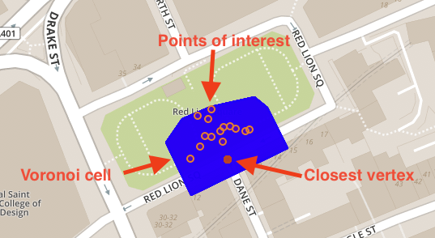

# Connect Nodes, Centroids and Voronoi Cells to POI
<!-- description --> Learn how you can enhance a table with POI's by adding columns that hold Voronoi cells, Centroids and Node references that can be used for calculating shortest paths between POI's.

## Prerequisites
- You have completed the tutorial [Visualize a **`Voronoi`** cell using a Scalable Vector Graphic](hana-cloud-smart-multi-model-5).
- You have access to the [sample spatial data](https://github.com/SAP-samples/teched2020-DAT260/blob/main/exercises/data/DAT260.tar.gz) used in this tutorial group.
- Make sure your database instance is **running** before you start.


## You will learn
- How to assign **`Voronoi`** cells to nodes of a transportation network
- How to assign a centroid to a Point of Interest
- How to add a node reference to a POI table


## Intro
In your dataset, you have points of interest (table `LONDON_POI`) as well as nodes of the transportation network (table `LONDON_VERTICES`). Of course, there is a spatial relation between both (e.g. distance measured by `ST_Distance`). In this tutorial, you will learn how to assign each POI to its closest node in the transportation network. You can think of example- assigning a bar to its closest street corner.

This way, you will later be able to calculate shortest paths between points of interest. These are the steps involved:

-	Assign `Voronoi` cells to all Nodes
-	Assign a centroid to each Point of Interest
-	Enhance the POI table with node reference


---

### Assign Voronoi cells to all nodes

The first thing you need to do is to enhance the table `LONDON_VERTICES` by a column `VORONOI_CELL` that holds the `Voronoi` cell of the respective vertex/node as an `ST_Geometry`.

To enhance the existing table, execute this statement:

```SQL
ALTER TABLE LONDON_VERTICES ADD (VORONOI_CELL ST_Geometry(32630));
```

Then use [MERGE INTO](https://help.sap.com/viewer/c1d3f60099654ecfb3fe36ac93c121bb/LATEST/en-US/3226201f95764a57810dd256c9524d56.html) to update the values and assign it with the respective `Voronoi` cell using this statement:

```SQL
MERGE INTO LONDON_VERTICES
USING
(
	SELECT "osmid", ST_VoronoiCell(shape, 10.0) OVER () AS CELL
	FROM LONDON_VERTICES
) v ON LONDON_VERTICES."osmid" = v."osmid"
WHEN MATCHED THEN UPDATE SET LONDON_VERTICES.VORONOI_CELL = v.CELL;
```


### Assign a centroid to each Point of Interest

Now you can enhance the table `LONDON_POI` by a column `SHAPE_CENTROID` that holds the centroid of the respective point of interest. Note, that many POI's are polygons.


Enhance the table `LONDON_POI` by another geometry with spatial reference system **32630**.

```SQL
ALTER TABLE LONDON_POI ADD (SHAPE_CENTROID ST_GEOMETRY(32630));
```

Since POI's in the OpenStreetMap data can contain points as well as polygon (i.e. storing the shape of a house), the column `SHAPE` in table `LONDON_POI` contains a mixture of points and polygons. You need to copy over the points to column `SHAPE_CENTROID` and - in case of polygons - calculate their centroid and assign the resulting point to column `SHAPE_CENTROID`.

Use the function [`ST_GeometryType`(*)](https://help.sap.com/viewer/bc9e455fe75541b8a248b4c09b086cf5/LATEST/en-US/7a190326787c10148831cde7ab32410d.html) to determine if the record contains a point or polygon and the function [`ST_Centroid`(*)](https://help.sap.com/viewer/bc9e455fe75541b8a248b4c09b086cf5/LATEST/en-US/7a2b9111787c1014926c93c8506930b1.html) to calculate the centroid of the latter.

```SQL
UPDATE LONDON_POI
SET SHAPE_CENTROID =
    CASE
        WHEN SHAPE.ST_GeometryType() = 'ST_Point'
        THEN SHAPE
        ELSE SHAPE.ST_Centroid()
    END;
```


### Enhance the POI table with node reference

Now that you added the two columns, you need to connect each POI with its closest vertex in the transportation network. For this, enhance the table `LONDON_POI` with a column `VERTEX_OSMID` and fill in the `osmid` of the closest vertex.

For physically enhancing the table, you need to consider that the referenced `osmid` in the table `LONDON_VERTICES` is of type **BIGINT**.

```SQL
ALTER TABLE LONDON_POI ADD (VERTEX_OSMID BIGINT);
```

You have learnt in the previous tutorial about the definition and usage of `Voronoi` cells. You will use the already assigned `Voronoi` cells to determine the closest vertex for each POI. Note, that if a POI is within the `Voronoi` cell of a specific vertex, that means that this vertex is closer to the POI than any other vertex.

With that knowledge, you can use the spatial function [`ST_Intersects`(*)](https://help.sap.com/viewer/bc9e455fe75541b8a248b4c09b086cf5/LATEST/en-US/7a19e197787c1014a13087ee8f970cce.html) to assign a vertex to each POI in the dataset.

```SQL
MERGE INTO LONDON_POI lp
USING LONDON_VERTICES lv
ON lv.VORONOI_CELL.ST_Intersects(lp.SHAPE_CENTROID) = 1
WHEN MATCHED THEN UPDATE SET lp.VERTEX_OSMID = lv."osmid";
```

This picture illustrates the snapping logic.
<!-- border -->

You have now connected each point of interest to a node/vertex in the transportation network. This will allow you to calculate shortest paths between POI's in the following tutorials.

> In the next tutorial, learn how to prepare the data for the SAP HANA Cloud Graph Engine and how to create a Graph workspace.


### Test yourself


---
