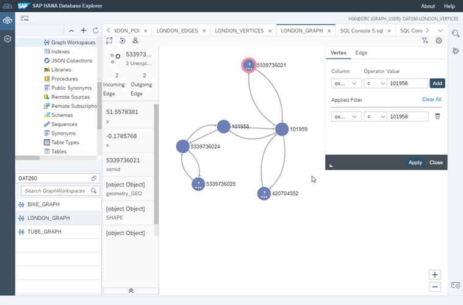

# Take Your First Steps with the SAP HANA Graph Engine
<!-- description --> Learn how to prepare your data for the SAP HANA Cloud, SAP HANA database Graph Engine how to create a Graph Workspace.

## Prerequisites
- You have completed the tutorial [Explore Visualization Options for Spatial Data in SAP HANA Cloud](hana-cloud-smart-multi-model-1).
- You have access to the [sample graph data](https://github.com/SAP-samples/teched2020-DAT260/blob/main/exercises/data/DAT260.tar.gz) used in this tutorial group.
- Make sure your database instance is **running** before you start.


## You will learn
- What a Graph Workspace is
- How to define constraints on sample data tables
- How to create a Graph Workspace


## Intro
Learn in this tutorial how to get ready to work in a Graph Workspace. This includes two steps:

-	Define required constraints on sample data tables
-	Create a Graph Workspace


---

### Introduction to the sample graph data

Our graph dataset describes the London street network. Formally, a graph consists of **nodes/vertices** and **edges/links/connections**. In this case, you have street segments stored in the `LONDON_EDGES` table, and junctions in the `LONDON_VERTICES` table. The edges in the graph are **"directed"**, they have a `SOURCE` and a `TARGET`.

Most streets in the real world are **bi-directional** and so most of the segments are represented as two edges in the graph - one for each direction.

The **SAP HANA Graph engine** requires a **key** on both tables, and the source and target of the edges must not contain NULLs.

To ensure the graph's consistency, it is also good practice to have a foreign key relationship defined on source and target column. Doing so will prevent "dangling edges", i.e. edges without vertices.

Once your data is prepared, you expose it to the SAP HANA Graph engine via a GRAPH WORKSPACE.


### Define required constraints on sample data tables

Add **primary keys** on the tables `LONDON_EDGES` and `LONDON_VERTICES` using these statements:

```SQL
ALTER TABLE "LONDON_EDGES" ADD PRIMARY KEY("ID");
ALTER TABLE "LONDON_VERTICES" ADD PRIMARY KEY("osmid");
```


Then, add **foreign keys** on the `SOURCE` and `TARGET` column of the table `LONDON_EDGES` by executing these statements:

```SQL
ALTER TABLE "LONDON_EDGES" ALTER("SOURCE" BIGINT NOT NULL REFERENCES "LONDON_VERTICES" ("osmid") ON UPDATE CASCADE ON DELETE CASCADE);
ALTER TABLE "LONDON_EDGES" ALTER("TARGET" BIGINT NOT NULL REFERENCES "LONDON_VERTICES" ("osmid") ON UPDATE CASCADE ON DELETE CASCADE);
```


### Create a Graph Workspace

The Graph Workspace exposes your data to the SAP HANA graph engine. It is a kind of a "view" into your data. In this case, the Graph Workspace is defined directly on the tables. Note that you can also use SQL views, table functions, and remote tables as data sources. You can define multiple Graph Workspaces in one system.

Create the Graph Workspace on the tables `LONDON_EDGES` and `LONDON_VERTICES` by executing this statement:

```SQL
CREATE GRAPH WORKSPACE "LONDON_GRAPH"
	EDGE TABLE "LONDON_EDGES"
		SOURCE COLUMN "SOURCE"
		TARGET COLUMN "TARGET"
		KEY COLUMN "ID"
	VERTEX TABLE "LONDON_VERTICES"
		KEY COLUMN "osmid";
```

To get a glimpse of your network, you can right-click the `LONDON_GRAPH` workspace to launch the Graph Viewer.

<!-- border -->

You now have successfully defined constraints on your tables `LONDON_VERTICES` and `LONDON_EDGES` and created a `GRAPH WORKSPACE`. You are all set up to start working with the Graph Engine now!

> In the next tutorial, learn how to use a GRAPH Procedure to calculate Shortest Paths on the street network.


### Test yourself


---
