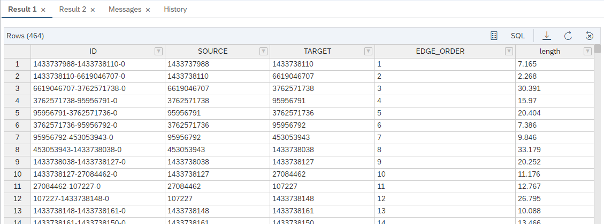

# Calculate Shortest Path Using a GRAPH Procedure
<!-- description --> Learn how to use a GRAPH Procedure to calculate shortest paths on the Street Network.

## Prerequisites
- You have already created a Graph Workspace using the tutorial [First steps with the SAP HANA Graph Engine](hana-cloud-smart-multi-model-7).
- You have access to the [sample graph data](https://github.com/SAP-samples/teched2020-DAT260/blob/main/exercises/data/DAT260.tar.gz) used in this tutorial group.
- Make sure your database instance is **running** before you start.


## You will learn
- How to define the required Table Type for the database procedure
- How to create a GRAPH procedure for shortest path calculation
- How to use anonymous blocks approach for shortest path calculation


## Intro
Once you have defined a Graph Workspace, you can run [`openCypher`(*)](https://www.opencypher.org/) queries for [pattern matching](https://help.sap.com/viewer/11afa2e60a5f4192a381df30f94863f9/LATEST/en-US/4c3ee700e7a8458baed3f1141d9380f3.html) workload or create GRAPH procedures for network analysis. In this tutorial you will learn how to create a database procedure that uses the built-in function to calculate a shortest path between two vertices. This includes three steps:

-	Define the required Table Type for database procedure
-	Create a GRAPH procedure for shortest path calculation
-	Run a GRAPH code using anonymous blocks


---

### Define the required Table Type for database procedure

If you are familiar with SAP HANA database procedures using `SQLScript`, you already know how to handle table-like results. A clean way to do this is defining and using **TABLE TYPES**. The same approach is valid for GRAPH procedures. Our `TABLE TYPE TT_SPOO_EDGES` describes the structure of the path result. It includes the `ID` of the edge and the `ORDER` in which the edges are traversed.

First you need to create a `TABLE TYPE` that describes the output table of the procedure, containing `ID`, `SOURCE`, `TARGET`, `EDGE_ORDER` (BIGINT), and `length` (DOUBLE). Execute this statement:

```SQL
CREATE TYPE "TT_SPOO_EDGES" AS TABLE (
    "ID" NVARCHAR(5000), "SOURCE" BIGINT, "TARGET" BIGINT, "EDGE_ORDER" BIGINT, "length" DOUBLE)
;
```


### Create a GRAPH procedure for shortest path calculation

The GRAPH procedure has a similar structure to a `SQLScript` procedure:

-	The header describes input and output variables, followed by the actual code.

-	The code below is a graph specific programming language called GRAPH. Instead of working with relational objects and operations like tables and SQL, GRAPH procedures operate on vertices and edges.

-	The core of this procedure is the call of the built-in graph algorithm:

    ```
WeightedPath<BIGINT> p = Shortest_Path(:g, :v_start, :v_end, :i_direction);
```


-	In this algorithm, **`g`** is our **graph**, **`v_start`** and **`v_end`** are the **start/end vertices of the path** we are searching, and **`i_direction`** indicates the **direction in which edges can be traversed** (OUTGOING, INCOMING, or ANY). The result is assigned to a path object p.

This is the complete statement to create the procedure. Paste it to your SQL console and run it:

```SQL
CREATE OR REPLACE PROCEDURE "GS_SPOO"(
	IN i_startVertex BIGINT,       -- INPUT: the ID of the start vertex
	IN i_endVertex BIGINT,         -- INPUT: the ID of the end vertex
	IN i_direction VARCHAR(10),   -- INPUT: the direction of the edge traversal: OUTGOING (default), INCOMING, ANY
	OUT o_path_length BIGINT,      -- OUTPUT: the hop distance between start and end
	OUT o_edges "TT_SPOO_EDGES" -- OUTPUT: a table containing the edges that make up a shortest path between start and end
	)
LANGUAGE GRAPH READS SQL DATA AS BEGIN
	-- Create an instance of the graph, referring to the graph workspace object
	GRAPH g_all = Graph("DAT260", "LONDON_GRAPH");
    -- Using the IN_SCOPE attribute created in "Exercise 3 Identify Relevant Area for Transportation Network" to narrow down the search scope
    GRAPH g = SubGraph(:g_all, v IN Vertices(:g_all) WHERE :v."IN_SCOPE" == 1);
	-- Create an instance of the start/end vertex
	VERTEX v_start = Vertex(:g, :i_startVertex);
	VERTEX v_end = Vertex(:g, :i_endVertex);
	-- Runnning shortest path one-to-one based hop distance, i.e. the minimum number of edges between start and end
	WeightedPath<BIGINT> p = Shortest_Path(:g, :v_start, :v_end, :i_direction);
	o_path_length = LENGTH(:p);
	o_edges = SELECT :e."ID", :e."SOURCE", :e."TARGET", :EDGE_ORDER, :e."length" FOREACH e IN Edges(:p) WITH ORDINALITY AS EDGE_ORDER;
END;
```

If you remember, we have used the `IN_SCOPE` attribute created in [tutorial 4](hana-cloud-smart-multi-model-4) to focus on the relevant area. For this we "induced" a sub-graph by filtering the complete `LONDON_GRAPH g_all`.
The database procedure is executed like any other - using a CALL statement providing the input parameters. As we have assigned the POI data to nodes in the street network (in [tutorial 6](hana-cloud-smart-multi-model-6)), we can now lookup the `VERTEX_OSMID` for our start and end POI's: Canary Wharf snaps to **1433737988**, and Blues Kitchen to **1794145673**.

```SQL
-- Look up VERTEX_OSMID of POI Blues kitchen
SELECT VERTEX_OSMID FROM "LONDON_POI" WHERE "name" = 'Blues Kitchen' AND "osmid" = 6274057185;
CALL "GS_SPOO"(i_startVertex => 1433737988, i_endVertex => 1794145673, i_direction => 'ANY', o_path_length => ?, o_edges => ?);
-- or in short
CALL "GS_SPOO"(1433737988, 1794145673, 'ANY', ?, ?);
```

The result is a set of edges/street segments that make up the path. The `EDGE_ORDER` value identifies the sequence. The procedure also returns `O_PATH_LENGTH = 464` which is the number of minimal hops it takes from Canary Wharf to Blues Kitchen.

You can see the results here:

<!-- border -->


### Run a GRAPH code using anonymous blocks

Sometimes it is more convenient to generate and execute the GRAPH code dynamically without creating a procedure in the database. This approach is called **"anonymous blocks"**. The code below is basically the same as in the procedure above, but this time it is executed in a **DO - BEGIN - END** block.

```SQL
DO (
    IN i_startVertex BIGINT => 14680080, IN i_endVertex BIGINT => 7251951621,
    OUT o_edges TABLE("ID" NVARCHAR(5000), "SOURCE" BIGINT, "TARGET" BIGINT, "EGDE_ORDER" BIGINT, "length" DOUBLE) => ?
) LANGUAGE GRAPH
BEGIN
                GRAPH g = Graph("LONDON_GRAPH");
                VERTEX v_start = Vertex(:g, :i_startVertex);
                VERTEX v_end = Vertex(:g, :i_endVertex);
                WeightedPath<BIGINT> p = Shortest_Path(:g, :v_start, :v_end, 'ANY');
                o_edges = SELECT :e."ID", :e."SOURCE", :e."TARGET", :EDGE_ORDER, :e."length" FOREACH e IN Edges(:p) WITH ORDINALITY AS EDGE_ORDER;
END;
```


You now have created a GRAPH procedure which calculates a hop distance shortest path between start and end vertex.
> In the next tutorial, learn how to use a GRAPH Procedure to calculate Shortest Paths using a more complex cost function that minimizes the time it takes to get from start to end.


### Test yourself


---
