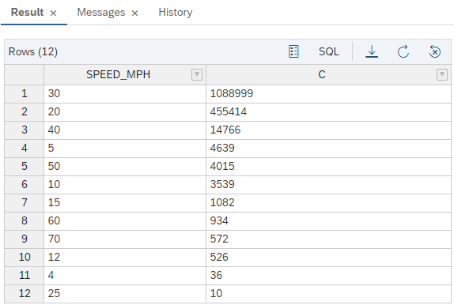
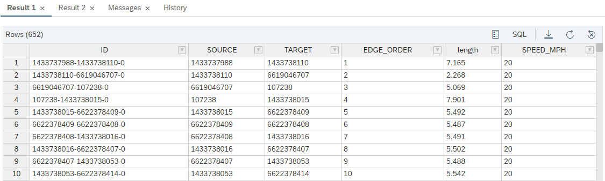
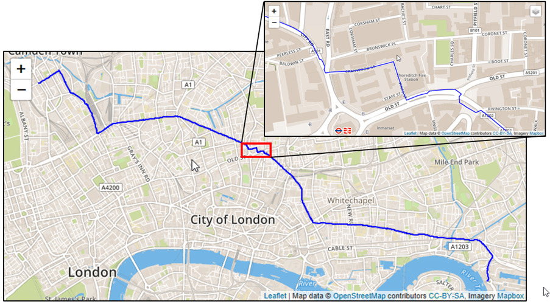
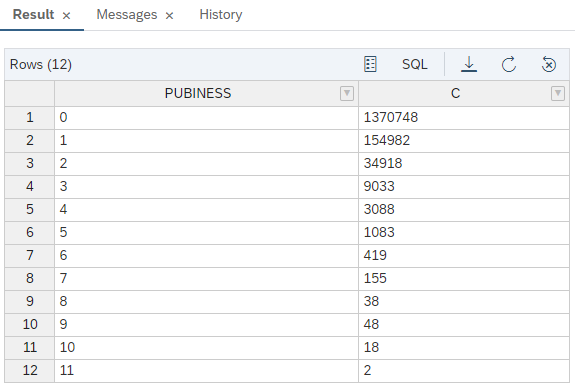
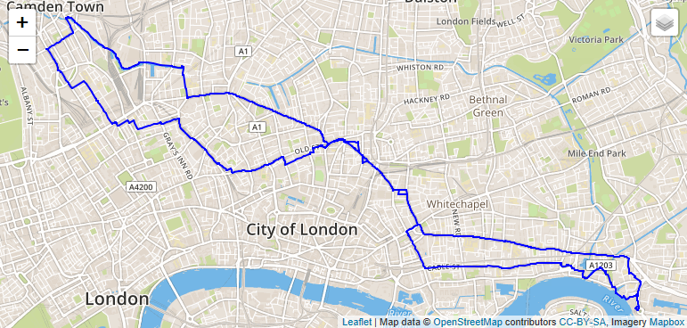

# Use a Cost Function to Calculate Shortest Path
<!-- description --> Learn how to use a more complex cost function to calculate shortest paths and how to wrap this procedure into a table function to compare different paths.

## Prerequisites
- You have already created a Graph Workspace using the tutorial [First steps with the SAP HANA Graph Engine](hana-cloud-smart-multi-model-7).
- You have access to the [sample graph data](https://github.com/SAP-samples/teched2020-DAT260/blob/main/exercises/data/DAT260.tar.gz) used in this tutorial group.
- Make sure your database instance is **running** before you start.


## You will learn
- How to calculate shortest path based on a cost function
- How to use insert a condition in the cost function
- How to wrap a GRAPH procedure in a table function


## Intro
In the previous tutorial, you used hop distance to calculate a shortest path. Now you will use a more meaningful cost function: you derive the time it takes to traverse a street segment.

The `EDGES` table contains a `length` and `maxspeed` column. `maxspeed` is a string column with values like '30 mph'. For this tutorial you first need to create a new numeric column `SPEED_MPH` and extract the number part of `maxspeed` into this column. Your next step will be to re-write the procedure to take the expression "**`length`/`SPEED_MPH`**" as cost function.

This tutorial consists of four steps:

-	Generate a numeric column that contains the maximum speed allowed information
-	Calculate the shortest path to minimize the time spent
-	Find Pubs and Bike lanes
-	Wrap a GRAPH procedure in a Table Function


---

### Generate a column for maximum speed information

First, you need to add an integer column to the `LONDON_BIKE_EDGES` table. Extract the number part of `maxspeed` by executing this statement:

```SQL
ALTER TABLE "LONDON_EDGES" ADD("SPEED_MPH" INT);
UPDATE "LONDON_EDGES"
	SET "SPEED_MPH" = TO_INT(REPLACE("maxspeed", ' mph', ''))
	WHERE REPLACE("maxspeed", ' mph', '') <> "maxspeed" ;
SELECT "SPEED_MPH", COUNT(*) AS C FROM "LONDON_EDGES" GROUP BY "SPEED_MPH" ORDER BY C DESC;
-- let's add a default value on the segments that do not have a speed information
UPDATE "LONDON_EDGES" SET "SPEED_MPH" = 30 WHERE "SPEED_MPH" IS NULL;
```

In the **Result** panel you can see the distribution of the `SPEED_MPH` column after updating with default values.

<!-- border -->


### Calculate shortest path to minimize the time spent

Just like in the [previous tutorial](hana-cloud-smart-multi-model-8), you need to define a **table type** and a **procedure**. This time, use "**`length`/`SPEED_MPH`**" as cost function. Syntactically, the cost function is a lambda function like this:

```
(Edge e) => DOUBLE{ return :e."length"/DOUBLE(:e."SPEED_MPH"); }
```

Copy and paste this statement to your SQL console and execute it to create the procedure:

```SQL
CREATE TYPE "TT_SPOO_WEIGHTED_EDGES" AS TABLE (
    "ID" NVARCHAR(5000), "SOURCE" BIGINT, "TARGET" BIGINT, "EDGE_ORDER" BIGINT, "length" DOUBLE, "SPEED_MPH" INT
);


CREATE OR REPLACE PROCEDURE "GS_SPOO_WEIGHTED"(
	IN i_startVertex BIGINT, 		-- INPUT: the ID of the start vertex
	IN i_endVertex BIGINT, 			-- INPUT: the ID of the end vertex
	IN i_direction VARCHAR(10), 	-- INPUT: the direction of the edge traversal: OUTGOING (default), INCOMING, ANY
	OUT o_path_length BIGINT,		-- OUTPUT: the hop distance between start and end
	OUT o_path_weight DOUBLE,		-- OUTPUT: the path weight/cost
	OUT o_edges "TT_SPOO_WEIGHTED_EDGES"  -- OUTPUT: the edges that make up the path
	)
LANGUAGE GRAPH READS SQL DATA AS BEGIN
	-- Create an instance of the graph, referring to the graph workspace object
	GRAPH g = Graph("DAT260", "LONDON_GRAPH");
	-- Create an instance of the start/end vertex
	VERTEX v_start = Vertex(:g, :i_startVertex);
	VERTEX v_end = Vertex(:g, :i_endVertex);
	--WeightedPath<DOUBLE> p = Shortest_Path(:g, :v_start, :v_end, (Edge e) => DOUBLE{ return :e."length"; }, :i_direction);
	WeightedPath<DOUBLE> p = Shortest_Path(:g, :v_start, :v_end,
		(Edge e) => DOUBLE{
			return :e."length"/DOUBLE(:e."SPEED_MPH");
		}, :i_direction);
	o_path_length = LENGTH(:p);
	o_path_weight = WEIGHT(:p);
	o_edges = SELECT :e."ID", :e."SOURCE", :e."TARGET", :EDGE_ORDER, :e."length", :e."SPEED_MPH" FOREACH e IN Edges(:p) WITH ORDINALITY AS EDGE_ORDER;
END;
```


Next, **call the procedure** by executing this statement:

```SQL
CALL "GS_SPOO_WEIGHTED"(1433737988, 1794145673, 'ANY', ?, ?, ?);
```

<!-- border -->

If you visualize the procedure on a map, it should look like this:

<!-- border -->


### Find pubs and bike lanes

Finding the fastest route is easy. Let's find two more interesting paths. First, you need to find paths suitable for bikes. You can do so by **boosting** street segments which are "**cycleways**".

Note that in most cases you cannot take cycleways only. The path algorithm will choose cycleways unless they are 10x longer than a normal road.

For this logic you will use an **IF** statement within the cost function.

Second, you would like to find "attractive" paths. You will calculate a new measure for the edges - "**`PUBINESS`**" - which is derived from the number of pubs nearby.

1. First, let's calculate **`PUBINESS`** by counting pubs within 100m distance and add this to our `LONDON_EDGES` table. You are using the spatial `ST_WithinDistance` predicate as join condition:

    ```SQL
ON pubs."SHAPE".ST_WithinDistance(e."EDGESHAPE", 100) = 1
```

2. This is the complete statement to alter the table and adding our **`PUBINESS`** measure. Paste and execute it:

    ```SQL
ALTER TABLE "LONDON_EDGES" ADD ("PUBINESS" DOUBLE DEFAULT 0);
MERGE INTO "LONDON_EDGES"
USING (
		SELECT e."ID", COUNT(*) AS "PUBINESS" FROM
			(SELECT * FROM "LONDON_POI" WHERE "amenity" ='pub') AS pubs
			LEFT JOIN
			(SELECT "ID", "SHAPE" AS "EDGESHAPE" FROM "LONDON_EDGES") AS e
			ON pubs."SHAPE".ST_WithinDistance(e."EDGESHAPE", 100) = 1
			GROUP BY e."ID" ORDER BY "PUBINESS" DESC)	AS U
	ON "LONDON_EDGES"."ID" = U."ID"
WHEN MATCHED THEN UPDATE SET "LONDON_EDGES"."PUBINESS" = U."PUBINESS";
```

3. Using this statement, you can check the distribution of this new **`PUBINESS`** property.

    ```SQL
SELECT "PUBINESS", COUNT(*) AS C FROM "LONDON_EDGES" GROUP BY "PUBINESS" ORDER BY "PUBINESS" ASC;
```

4. This is what the results should look like:

    <!-- border -->

    Now, you can use the new measure as part of the cost function for path finding with mode "**pub**".

    ```
Shortest_Path(:g, :v_start, :v_end, (Edge e) => DOUBLE {
RETURN :e."length"/(5.0*:e."PUBINESS"+1.0);
}, :i_direction);
```


    For finding the path with mode "**bike**", you can use a conditional cost function. Street segments which are of type "**cycleway**" are boosted by dividing the length by 10.


    ```SQL
Shortest_Path(:g, :v_start, :v_end, (EDGE e)=> DOUBLE {
IF(:e."highway" == 'cycleway') { RETURN :e."length"/10.0; }
ELSE { RETURN :e."length"; }
}, :i_direction);Shortest_Path(:g, :v_start, :v_end, (EDGE e)=> DOUBLE {
IF(:e."highway" == 'cycleway') { RETURN :e."length"/10.0; }
ELSE { RETURN :e."length"; }
}, :i_direction);
```


5. Create a **TABLE TYPE** first with the following statement.

    ```SQL
CREATE TYPE "TT_SPOO_MULTI_MODE" AS TABLE (
		"ID" NVARCHAR(5000), "SOURCE" BIGINT, "TARGET" BIGINT, "EDGE_ORDER" BIGINT, "length" DOUBLE, "SPEED_MPH" INT, "highway" NVARCHAR(5000)
);
```

6. Then create the **procedure** with this statement.

    ```SQL
CREATE OR REPLACE PROCEDURE "GS_SPOO_MULTI_MODE"(
	IN i_startVertex BIGINT, 		-- the ID of the start vertex
	IN i_endVertex BIGINT, 			-- the ID of the end vertex
	IN i_direction VARCHAR(10), 	-- the the direction of the edge traversal: OUTGOING (default), INCOMING, ANY
	IN i_mode VARCHAR(10), 		-- hop, time, bike
	OUT o_path_length BIGINT,		-- the hop distance between start and end
	OUT o_path_weight DOUBLE,		-- the path weight/cost based on the WEIGHT attribute
	OUT o_edges "TT_SPOO_MULTI_MODE"
	)
LANGUAGE GRAPH READS SQL DATA AS BEGIN
	GRAPH g = Graph("DAT260", "LONDON_GRAPH");
	VERTEX v_start = Vertex(:g, :i_startVertex);
	VERTEX v_end = Vertex(:g, :i_endVertex);
	-- mode=bike means cycleway preferred
	IF (:i_mode == 'bike') {
		WeightedPath<DOUBLE> p = Shortest_Path(:g, :v_start, :v_end,
		(EDGE e, DOUBLE current_path_weight)=> DOUBLE{
  			IF(:e."highway" == 'cycleway') { RETURN :e."length"/10.0; }
        ELSE { RETURN :e."length"; }
  	}, :i_direction);
		o_path_length = LENGTH(:p);
		o_path_weight = DOUBLE(WEIGHT(:p));
		o_edges = SELECT :e."ID", :e."SOURCE", :e."TARGET", :EDGE_ORDER, :e."length", :e."SPEED_MPH", :e."highway" FOREACH e IN Edges(:p) WITH ORDINALITY AS EDGE_ORDER;
	}
	-- mode=pub means street with pubs around preferred
	IF (:i_mode == 'pub') {
		WeightedPath<DOUBLE> p = Shortest_Path(:g, :v_start, :v_end, (Edge e) => DOUBLE{
			RETURN :e."length"/(5.0*:e."PUBINESS"+1.0);
		}, :i_direction);
		o_path_length = LENGTH(:p);
		o_path_weight = DOUBLE(WEIGHT(:p));
		o_edges = SELECT :e."ID", :e."SOURCE", :e."TARGET", :EDGE_ORDER, :e."length", :e."SPEED_MPH", :e."highway" FOREACH e IN Edges(:p) WITH ORDINALITY AS EDGE_ORDER;
	}
END;
```


7. To see the results, you can again use a **CALL** statement:

    ```SQL
CALL "GS_SPOO_MULTI_MODE"(1433737988, 1794145673, 'ANY', 'pub', ?, ?, ?);
CALL "GS_SPOO_MULTI_MODE"(1433737988, 1794145673, 'ANY', 'bike', ?, ?, ?);
```


### Wrap a GRAPH procedure in a table function

The procedure above returns more than one output - the path's length, weight, and a table with the edges. Sometimes it is convenient to wrap a GRAPH procedure in a table function, returning only the tabular output. Table functions are called via SELECT and are a convenient way to post-process graph results - you can use the full power of SQL on your graph results. This is how you do it:

1. First, as in the previous examples, create the **TABLE TYPE**:

    ```SQL
CREATE TYPE "TT_EDGES_SPOO_F" AS TABLE (
		"ID" NVARCHAR(5000), "SOURCE" BIGINT, "TARGET" BIGINT, "EDGE_ORDER" BIGINT, "length" DOUBLE, "SHAPE" ST_GEOMETRY(32630)
);
    ```

2. Then create the **function**:

    ```SQL
CREATE OR REPLACE FUNCTION "F_SPOO_EDGES"(
	IN i_startVertex BIGINT,
	IN i_endVertex BIGINT,
	IN i_direction VARCHAR(10),
	IN i_mode VARCHAR(10)
	)
  RETURNS "LONDON_EDGES"
LANGUAGE SQLSCRIPT READS SQL DATA AS
BEGIN
	DECLARE o_path_length DOUBLE;
	DECLARE o_path_weight DOUBLE;
  CALL "GS_SPOO_MULTI_MODE"(:i_startVertex, :i_endVertex, :i_direction, :i_mode, o_path_length, o_path_weight, o_edges);
  RETURN SELECT lbe.* FROM :o_edges AS P LEFT JOIN "LONDON_EDGES" lbe ON P."ID" = lbe."ID";
END;
    ```

3. Now you can simply calculate the **average** **`PUBINESS`** of a path, or UNION two paths to compare. To calculate the average value of one path, use this statement:

    ```SQL
SELECT AVG("PUBINESS")
	FROM "F_SPOO_EDGES"(1433737988, 1794145673, 'ANY', 'pub');
    ```

4. To compare two paths, you can use this statement:

    ```SQL
SELECT "ID", "SHAPE" FROM "F_SPOO_EDGES"(1433737988, 1794145673, 'ANY', 'pub')
UNION
SELECT "ID", "SHAPE" FROM "F_SPOO_EDGES"(1433737988, 1794145673, 'ANY', 'bike');
    ```

5. Visualizing this comparison should look like this:

    <!-- border -->

You now have used two more cost functions for path finding. You have wrapped the GRAPH procedure into a table function which can be called in a SQL SELECT statement. This is a nice way of mixing graph and relational processing.

> In the next tutorial, learn how to calculate `isochrones` and closeness centrality.


### Test yourself


---
