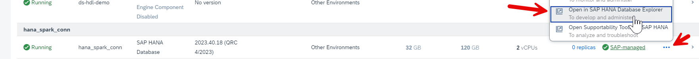
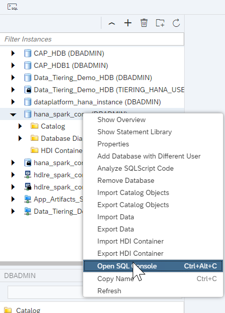
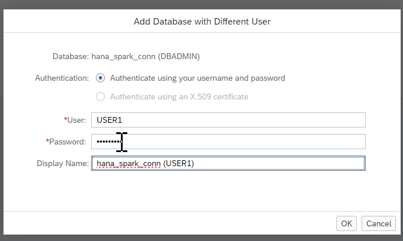
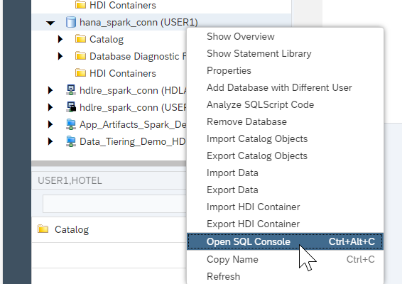
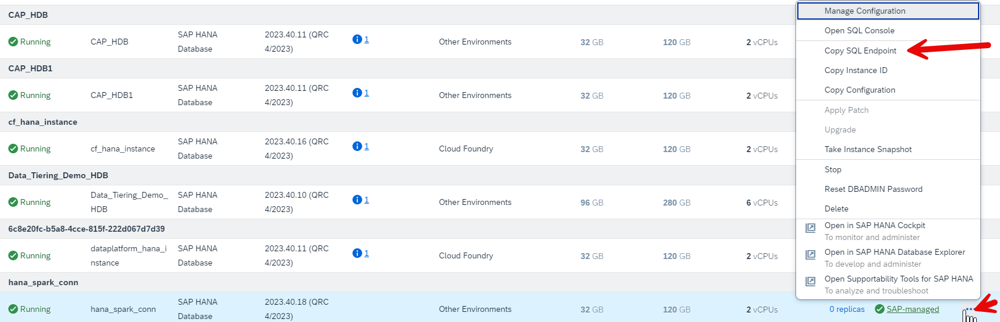
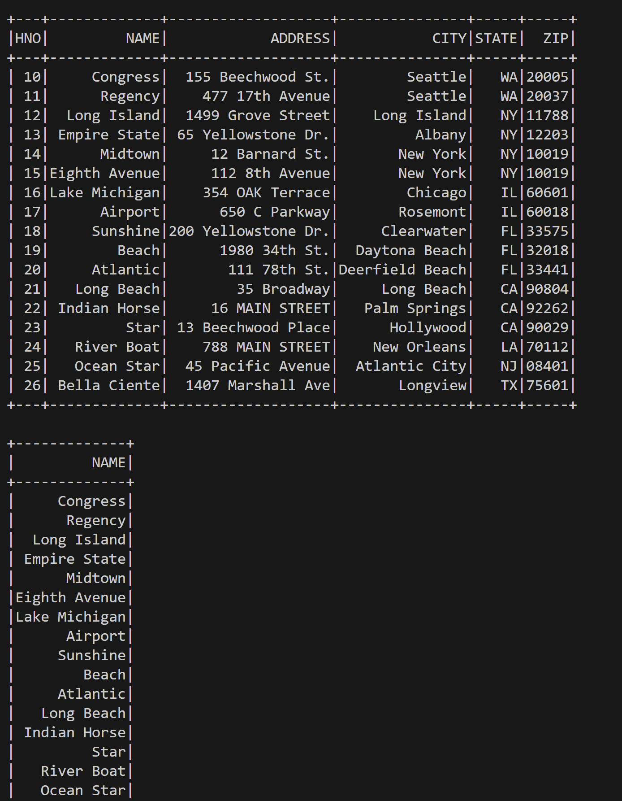

# Accessing SAP HANA Database using Apache Spark
<!-- description --> Learn how to access an SAP HANA Cloud Database instance using Apache Spark.  

## Prerequisites
- An SAP BTP account
- An SAP HANA Cloud Database instance
- Python is installed 
- A JDK is installed, one can be found [here](https://sap.github.io/SapMachine/#download), with detailed steps [here](https://github.com/SAP/SapMachine/wiki/Installation)
- Install pyspark using pip install pyspark 
- Install the SAP HANA Client following this tutorial: [Install the SAP HANA Client | SAP Tutorials](https://developers.sap.com/tutorials/hana-clients-install.html) 

## You will learn
  - How to write a script to access an SAP HANA Database Instance using Apache spark

---

### Create a User, Tables, and Import Data
1. Open up SAP HANA Cloud Central from SAP BTP Cockpit 

    

2. Click on the **3 dots under Actions** and click on **Open in SAP Database explorer** 

    

3. If it prompts you to login provide the username (e.g. DBADMIN) and the password 

4. Right click on the HANA Database instance and open an SQL console 

    

5. Copy the code from below into the the sql console to create the user and click on run 

    ```SQL
    CREATE USER USER1 PASSWORD Password1 no force_first_password_change;

    SELECT CURRENT_USER, CURRENT_SCHEMA FROM DUMMY;
    GRANT CREATE SCHEMA TO USER1;
    CONNECT USER1 PASSWORD Password1;
    ```

6. Now that USER1 has been created we will add the database with a different user, go to the DBADMIN database instance and right click and then click on **Add database with different user**

     

7. Input the user which in this case is USER1 and password as Password1 as was written in the sql script and change the display name to have USER1 instead of DBADMIN

     

8. Right click on the newly created user and open an SQL console 

     

9.  Copy the code from below and run it 

    ```sql
    CREATE COLUMN TABLE HOTEL(
      hno INTEGER PRIMARY KEY,
      name NVARCHAR(50) NOT NULL,
      address NVARCHAR(40) NOT NULL,
      city NVARCHAR(30) NOT NULL,
      state NVARCHAR(2) NOT NULL,
      zip NVARCHAR(6)
    );
    CREATE COLUMN TABLE ROOM(
      hno INTEGER,
      type NVARCHAR(6),
      free NUMERIC(3),
      price NUMERIC(6, 2),
      PRIMARY KEY (hno, type),
      FOREIGN KEY (hno) REFERENCES HOTEL
    );
    CREATE COLUMN TABLE CUSTOMER(
      cno INTEGER PRIMARY KEY,
      title NVARCHAR(7),
      firstname NVARCHAR(20),
      name NVARCHAR(40) NOT NULL,
      address NVARCHAR(40) NOT NULL,
      zip NVARCHAR(6)
    );
    CREATE COLUMN TABLE RESERVATION(
      resno INTEGER NOT NULL GENERATED BY DEFAULT AS IDENTITY,
      rno INTEGER NOT NULL,
      cno INTEGER,
      hno INTEGER,
      type NVARCHAR(6),
      arrival DATE NOT NULL,
      departure DATE NOT NULL,
      PRIMARY KEY (
        "RESNO", "ARRIVAL"
      ),
      FOREIGN KEY(hno) REFERENCES HOTEL,
      FOREIGN KEY(cno) REFERENCES CUSTOMER
    );
    CREATE COLUMN TABLE MAINTENANCE(
      mno INTEGER PRIMARY KEY,
      hno INTEGER,
      description NVARCHAR(100),
      date_performed DATE,
      performed_by NVARCHAR(40)
    );

    CREATE OR REPLACE PROCEDURE SHOW_RESERVATIONS(
      IN IN_HNO INTEGER, IN IN_ARRIVAL DATE)
      SQL SECURITY INVOKER
      READS SQL DATA
      AS BEGIN
        SELECT
          R.RESNO,
          R.ARRIVAL,
          DAYS_BETWEEN (R.ARRIVAL, R.DEPARTURE) as "Nights",
          H.NAME,
          CUS.TITLE,
          CUS.FIRSTNAME AS "FIRST NAME",
          CUS.NAME AS "LAST NAME"
        FROM
          RESERVATION AS R
          LEFT OUTER JOIN
          HOTEL AS H
          ON H.HNO = R.HNO
          LEFT OUTER JOIN
          CUSTOMER AS CUS
          ON CUS.CNO = R.CNO
          WHERE R.ARRIVAL = :IN_ARRIVAL AND
          H.HNO = :IN_HNO
        ORDER BY
          H.NAME ASC,
          R.ARRIVAL DESC;
      END;

    INSERT INTO HOTEL VALUES(10, 'Congress', '155 Beechwood St.', 'Seattle', 'WA', '20005');
    INSERT INTO HOTEL VALUES(11, 'Regency', '477 17th Avenue', 'Seattle', 'WA', '20037');
    INSERT INTO HOTEL VALUES(12, 'Long Island', '1499 Grove Street', 'Long Island', 'NY', '11788');
    INSERT INTO HOTEL VALUES(13, 'Empire State', '65 Yellowstone Dr.', 'Albany', 'NY', '12203');
    INSERT INTO HOTEL VALUES(14, 'Midtown', '12 Barnard St.', 'New York', 'NY', '10019');
    INSERT INTO HOTEL VALUES(15, 'Eighth Avenue', '112 8th Avenue', 'New York', 'NY', '10019');
    INSERT INTO HOTEL VALUES(16, 'Lake Michigan', '354 OAK Terrace', 'Chicago', 'IL', '60601');
    INSERT INTO HOTEL VALUES(17, 'Airport', '650 C Parkway', 'Rosemont', 'IL', '60018');
    INSERT INTO HOTEL VALUES(18, 'Sunshine', '200 Yellowstone Dr.', 'Clearwater', 'FL', '33575');
    INSERT INTO HOTEL VALUES(19, 'Beach', '1980 34th St.', 'Daytona Beach', 'FL', '32018');
    INSERT INTO HOTEL VALUES(20, 'Atlantic', '111 78th St.', 'Deerfield Beach', 'FL', '33441');
    INSERT INTO HOTEL VALUES(21, 'Long Beach', '35 Broadway', 'Long Beach', 'CA', '90804');
    INSERT INTO HOTEL VALUES(22, 'Indian Horse', '16 MAIN STREET', 'Palm Springs', 'CA', '92262');
    INSERT INTO HOTEL VALUES(23, 'Star', '13 Beechwood Place', 'Hollywood', 'CA', '90029');
    INSERT INTO HOTEL VALUES(24, 'River Boat', '788 MAIN STREET', 'New Orleans', 'LA', '70112');
    INSERT INTO HOTEL VALUES(25, 'Ocean Star', '45 Pacific Avenue', 'Atlantic City', 'NJ', '08401');
    INSERT INTO HOTEL VALUES(26, 'Bella Ciente', '1407 Marshall Ave', 'Longview', 'TX', '75601');

    INSERT INTO ROOM VALUES(10, 'single', 20, 135.00);
    INSERT INTO ROOM VALUES(10, 'double', 45, 200.00);
    INSERT INTO ROOM VALUES(12, 'single', 10, 70.00);
    INSERT INTO ROOM VALUES(12, 'double', 13, 100.00);
    INSERT INTO ROOM VALUES(13, 'single', 12, 45.00);
    INSERT INTO ROOM VALUES(13, 'double', 15, 80.00);
    INSERT INTO ROOM VALUES(14, 'single', 20, 85.00);
    INSERT INTO ROOM VALUES(14, 'double', 35, 140.00);
    INSERT INTO ROOM VALUES(15, 'single', 50, 105.00);
    INSERT INTO ROOM VALUES(15, 'double', 230, 180.00);
    INSERT INTO ROOM VALUES(15, 'suite', 12, 500.00);
    INSERT INTO ROOM VALUES(16, 'single', 10, 120.00);
    INSERT INTO ROOM VALUES(16, 'double', 39, 200.00);
    INSERT INTO ROOM VALUES(16, 'suite', 20, 500.00);
    INSERT INTO ROOM VALUES(17, 'single', 4, 115.00);
    INSERT INTO ROOM VALUES(17, 'double', 11, 180.00);
    INSERT INTO ROOM VALUES(18, 'single', 15, 90.00);
    INSERT INTO ROOM VALUES(18, 'double', 19, 150.00);
    INSERT INTO ROOM VALUES(18, 'suite', 5, 400.00);
    INSERT INTO ROOM VALUES(19, 'single', 45, 90.00);
    INSERT INTO ROOM VALUES(19, 'double', 145, 150.00);
    INSERT INTO ROOM VALUES(19, 'suite', 60, 300.00);
    INSERT INTO ROOM VALUES(20, 'single', 11, 60.00);
    INSERT INTO ROOM VALUES(20, 'double', 24, 100.00);
    INSERT INTO ROOM VALUES(21, 'single', 2, 70.00);
    INSERT INTO ROOM VALUES(21, 'double', 10, 130.00);
    INSERT INTO ROOM VALUES(22, 'single', 34, 80.00);
    INSERT INTO ROOM VALUES(22, 'double', 78, 140.00);
    INSERT INTO ROOM VALUES(22, 'suite', 55, 350.00);
    INSERT INTO ROOM VALUES(23, 'single', 89, 160.00);
    INSERT INTO ROOM VALUES(23, 'double', 300, 270.00);
    INSERT INTO ROOM VALUES(23, 'suite', 100, 700.00);
    INSERT INTO ROOM VALUES(24, 'single', 10, 125.00);
    INSERT INTO ROOM VALUES(24, 'double', 9, 200.00);
    INSERT INTO ROOM VALUES(24, 'suite', 78, 600.00);
    INSERT INTO ROOM VALUES(25, 'single', 44, 100.00);
    INSERT INTO ROOM VALUES(25, 'double', 115, 190.00);
    INSERT INTO ROOM VALUES(25, 'suite', 6, 450.00);

    INSERT INTO CUSTOMER VALUES(1000, 'Mrs', 'Jenny', 'Porter', '1340 N. Ash Street, #3', '10580');
    INSERT INTO CUSTOMER VALUES(1001, 'Mr', 'Peter', 'Brown', '1001 34th St., APT.3', '48226');
    INSERT INTO CUSTOMER VALUES(1002, 'Company', NULL, 'Datasoft', '486 Maple St.', '90018');
    INSERT INTO CUSTOMER VALUES(1003, 'Mrs', 'Rose', 'Brian', '500 Yellowstone Drive, #2', '75243');
    INSERT INTO CUSTOMER VALUES(1004, 'Mrs', 'Mary', 'Griffith', '3401 Elder Lane', '20005');
    INSERT INTO CUSTOMER VALUES(1005, 'Mr', 'Martin', 'Randolph', '340 MAIN STREET, #7', '60615');
    INSERT INTO CUSTOMER VALUES(1006, 'Mrs', 'Sally', 'Smith', '250 Curtis Street', '75243');
    INSERT INTO CUSTOMER VALUES(1007, 'Mr', 'Mike', 'Jackson', '133 BROADWAY APT. 1', '45211');
    INSERT INTO CUSTOMER VALUES(1008, 'Mrs', 'Rita', 'Doe', '2000 Humboldt St., #6', '97213');
    INSERT INTO CUSTOMER VALUES(1009, 'Mr', 'George', 'Howe', '111 B Parkway, #23', '75243');
    INSERT INTO CUSTOMER VALUES(1010, 'Mr', 'Frank', 'Miller', '27 5th St., 76', '95054');
    INSERT INTO CUSTOMER VALUES(1011, 'Mrs', 'Susan', 'Baker', '200 MAIN STREET, #94', '90018');
    INSERT INTO CUSTOMER VALUES(1012, 'Mr', 'Joseph', 'Peters', '700 S. Ash St., APT.12', '92714');
    INSERT INTO CUSTOMER VALUES(1013, 'Company', NULL, 'TOOLware', '410 Mariposa St., #10', '20019');
    INSERT INTO CUSTOMER VALUES(1014, 'Mr', 'Antony', 'Jenkins', '55 A Parkway, #15', '20903');
    INSERT INTO RESERVATION VALUES(1, 100, 1000, 11, 'single', '2020-12-24', '2020-12-27');
    INSERT INTO RESERVATION VALUES(2, 110, 1001, 11, 'double', '2020-12-24', '2021-01-03');
    INSERT INTO RESERVATION VALUES(3, 120, 1002, 15, 'suite', '2020-11-14', '2020-11-18');
    INSERT INTO RESERVATION VALUES(4, 130, 1009, 21, 'single', '2019-02-01', '2019-02-03');
    INSERT INTO RESERVATION VALUES(5, 150, 1006, 17, 'double', '2019-03-14', '2019-03-24');
    INSERT INTO RESERVATION VALUES(6, 140, 1013, 20, 'double', '2020-04-12', '2020-04-30');
    INSERT INTO RESERVATION VALUES(7, 160, 1011, 17, 'single', '2020-04-12', '2020-04-15');
    INSERT INTO RESERVATION VALUES(8, 170, 1014, 25, 'suite', '2020-09-01', '2020-09-03');
    INSERT INTO RESERVATION VALUES(9, 180, 1001, 22, 'double', '2020-12-23', '2021-01-08');
    INSERT INTO RESERVATION VALUES(10, 190, 1013, 24, 'double', '2020-11-14', '2020-11-17');

    INSERT INTO MAINTENANCE VALUES(10, 24, 'Replace pool liner and pump', '2019-03-21', 'Discount Pool Supplies');
    INSERT INTO MAINTENANCE VALUES(11, 25, 'Renovate the bar area.  Replace TV and speakers', '2020-11-29', 'TV and Audio Superstore');
    INSERT INTO MAINTENANCE VALUES(12, 26, 'Roof repair due to storm', null, null);

    SELECT SCHEMA_NAME, OBJECT_NAME, OBJECT_TYPE, OWNER_NAME FROM "PUBLIC"."OWNERSHIP" WHERE OWNER_NAME = 'USER1';

    ```

10. Run the following SQL command in the console, and if the last step was done right, you will get 15 as the result

    ```sql
    SELECT COUNT(*) FROM CUSTOMER
    ```

### Accessing SAP HANA Database Using Apache Spark
1. Create a directory within your local environment/computer 


2. Open up VSCODE or your preferred editor and copy the code into a file called spark_hana_connection.py within a local directory,      replace "Path to SAP HANA Database Client" with your local path to the database client that includes the ngdbc.jar


    ```python
    from pyspark.sql import SparkSession

    # Create SparkSession
    spark = SparkSession.builder \
              .appName('SparkByExamples.com') \
              .config("spark.jars", "<Path to SAP HANA Database Client>/ngdbc.jar") \
              .getOrCreate()

    # Query table using jdbc()
    df = spark.read \
        .jdbc("jdbc:sap://<SQL endpoint>/hotel", "hotel",
              properties={"user": "USER1", "password": "Password1", "driver":"com.sap.db.jdbc.Driver"})

    # show DataFrame
    df.show()


    df = spark.read \
        .format("jdbc") \
        .option("url", "jdbc:sap://<SQL endpoint>/hotel") \
        .option("driver", "com.sap.db.jdbc.Driver") \
        .option("dbtable", "hotel") \
        .option("user", "USER1") \
        .option("password", "Password1") \
        .load()

    df = spark.read \
        .format("jdbc") \
        .option("url", "jdbc:sap://<SQL endpoint>/hotel") \
        .option("driver", "com.sap.db.jdbc.Driver") \
        .option("query", "select name from hotel") \
        .option("user", "USER1") \
        .option("password", "Password1") \
        .load()

    df.show()
    ```


4. Switch out SQL Endpoint with the sql endpoint of your HANA database instance, to do this head over to SAP HANA Cloud Central and right click on **Actions** and copy the SQL endpoint 


    


5. Run the python script using the command 

    ```SHELL
    python spark-hana_conn.py 
    ```

    The result should look like this: 

    

### Knowledge check

Congratulations! You have now accessed an SAP HANA Database instance using Apache Spark through a JDBC connection!
