# Debugging Stored Procedures 
<!-- description --> Leveraging SQLScript in stored procedures, user-defined functions, and user-defined libraries.

## Prerequisites  
- This tutorial is designed for SAP HANA Cloud.
- **Tutorials:** [Anonymous Blocks](hana-cloud-sqlscript-anonymous)

## You will learn  
- How to debug a procedure using the SQLScript debugger

## Intro
The debugging shown in this tutorial includes setting breakpoints, evaluating expressions and intermediate results.

---

### Start Debugger

1. Go to the Database Explorer page and right-click on the procedure called `get_po_header_data` and choose **Open for Debugging**.

    <!-- border -->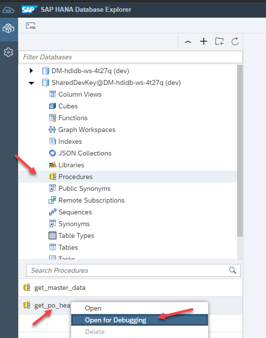

2. Make sure the configuration is set as shown here and click **OK**.

    <!-- border -->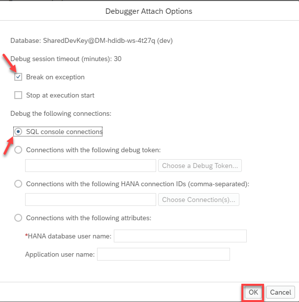

### Set Breakpoints and Run

1. Set breakpoints at the lines shown here by simply clicking on the line number.

    <!-- border -->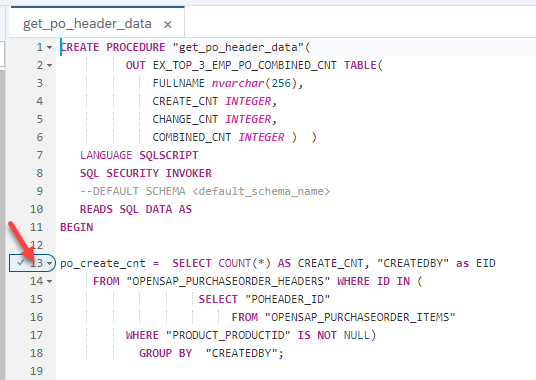

2. Right click on the procedure and choose **Generate Call Statement**

    <!-- border -->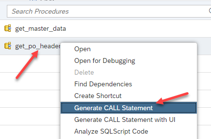

3. A new SQL tab will be opened.  Click on the **Run** button.

    <!-- border -->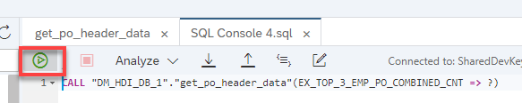

### Work with the Debugger

1. Execution of the procedure has started, and a debugger pane is now visible which is displayed on the right. You can see all of the variables and parameters for this procedure.  You might notice that this pane is currently not showing the intermediate table variables at this point.

    <!-- border -->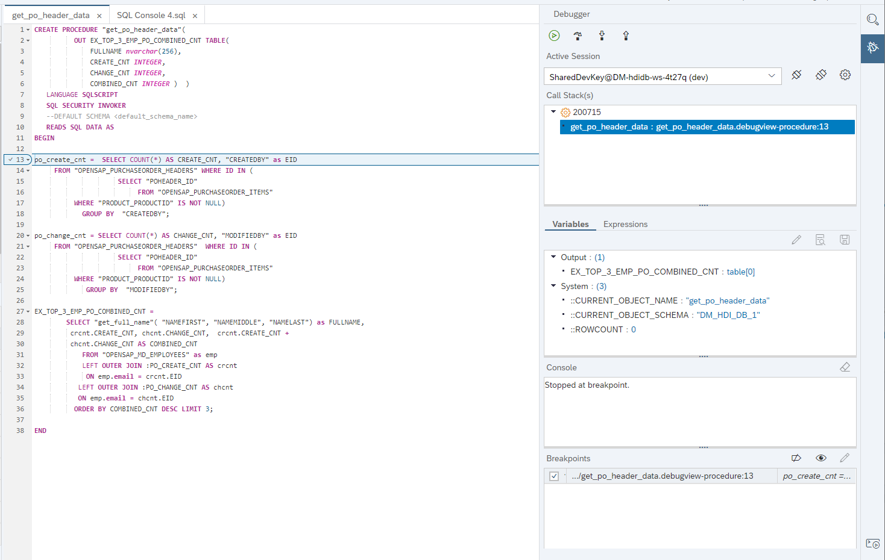

2. Click the **Step Over** button.

    <!-- border -->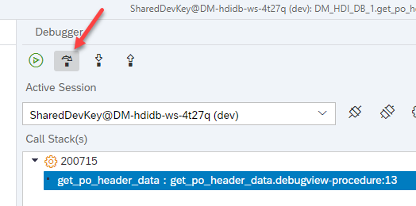

3. You will notice that execution has continued to the next statement. In the debugger pane, a new local variable has been added. This is because it is not defined explicitly and will be implicitly declared at runtime during first usage.

    <!-- border -->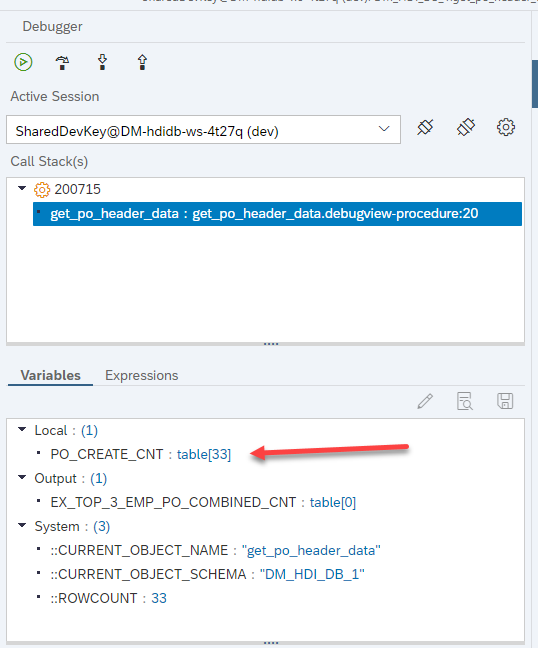

4. To see the data for this intermediate table variable, select it and click **Display Content**

    <!-- border -->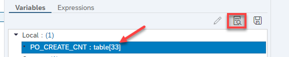

5. A new window is then opened showing the data in the table. Review the data and close the window by clicking **Close**

    <!-- border -->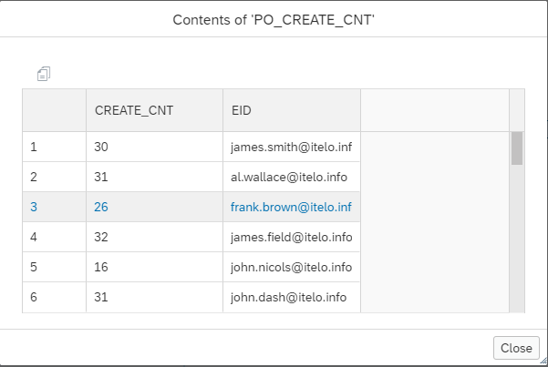

### Use Expression Editor

1. Click the **Expression** tab and click **+** button.

    <!-- border -->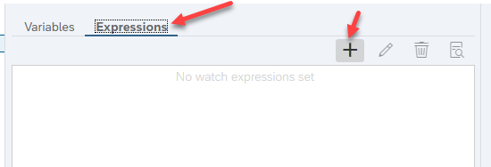

2. In the following window, enter a SELECT statement as shown here and hit **Add**.

    <!-- border -->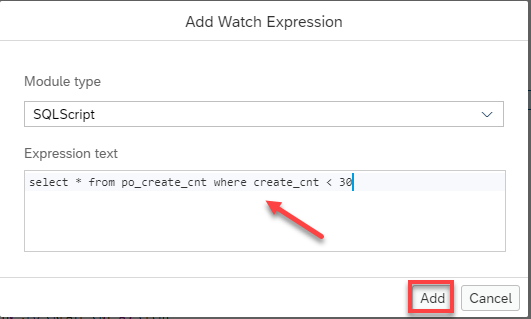

3. You will notice the expression is then added to the "Expressions" section. Select the expression and click  **Display Content**.

    <!-- border -->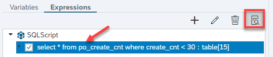

4. Review the results and close the window.

    <!-- border -->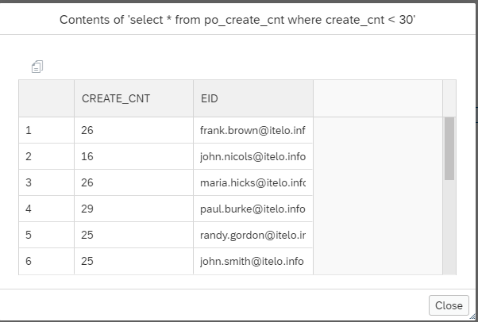

### Check Output

1. Once again click the **Step Over** button. Notice the next intermediate table variables is also added.  You can review the data in this table as well.

    <!-- border -->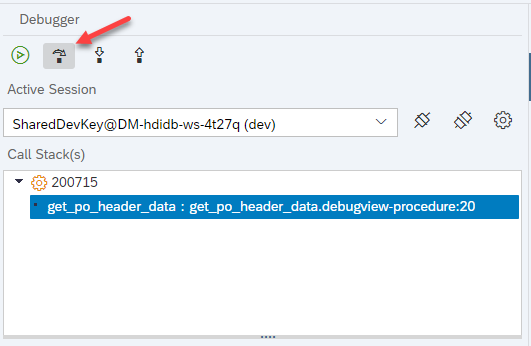

2. Continue to step through the code and when execution stops at the END statement of the procedure, display the contents of the output parameter the same way you did for the intermediate table variables. Finally, close the window by clicking the **Close**.

    <!-- border -->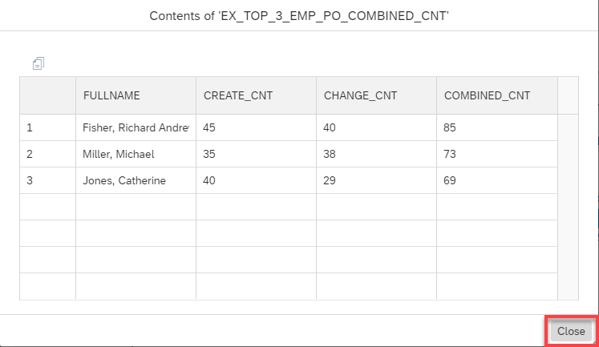

3. Click the **Resume** button.

    <!-- border -->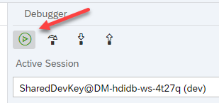

4. Execution of the procedure is now completed. Return to the SQL tab and check the results.

    <!-- border -->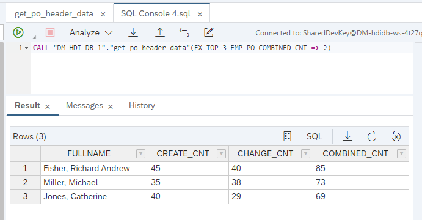

