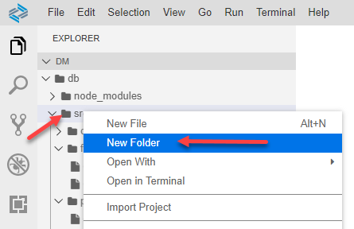
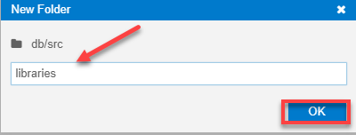
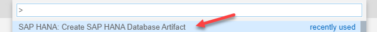
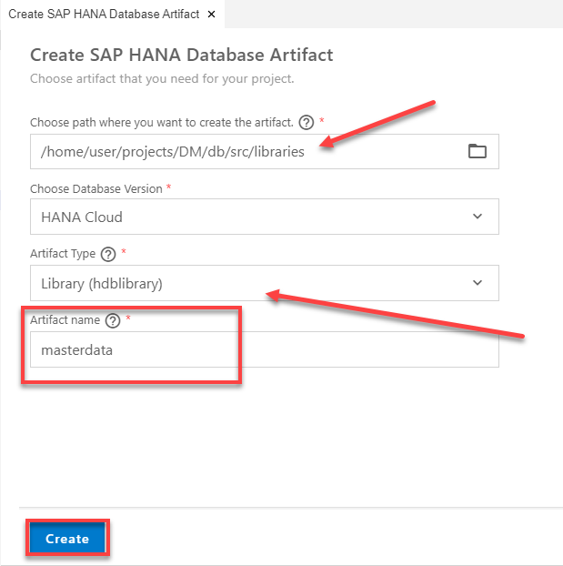
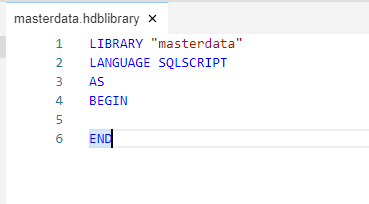
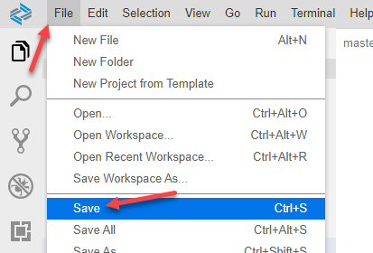
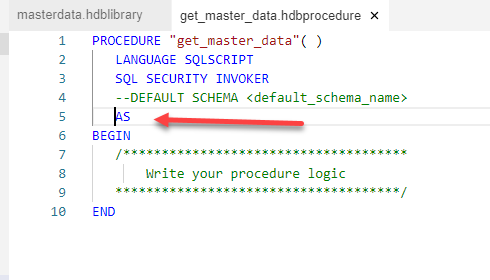
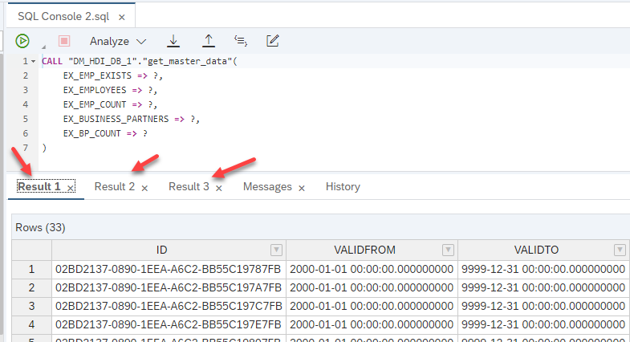

## Prerequisites  
- This tutorial is designed for SAP HANA Cloud.
- **Tutorials:** [Creating Table User Defined Functions](hana-cloud-sqlscript-table-user)

## Details
### You will learn  
- How to create SQLScript User Defined Libraries

Libraries are designed to group related variables, functions, and procedures together within a common object. These library members can either be exposed using the PULBIC keyword, or set to only be consumable from within the library itself using the PRIVATE keyword.

---

[ACCORDION-BEGIN [Step 1: ](Create new library)]
1. Return to the SAP Business Application Studio and right click on the `src` folder and choose **New Folder**.

    !

2. Enter the name of the folder as **libraries** and click **OK**.

    !

3. Use what you have learned in previous tutorials and create a new SAP HANA Database Artifact using the **SAP HANA: Create SAP HANA Database Artifact** command from the **View** menu.

    !

4. Make sure to select the `libraries` folder, and choose Library as the **Artifact Type**, then give the name as `masterdata`. Click **Create**

    !

[DONE]
[ACCORDION-END]


[ACCORDION-BEGIN [Step 2: ](Enter the library code)]
1. Click on the new `masterdata.hdblibrary` file in the `libraries` folder and the editor should open with the shell of the library.

    !

2. Between the BEGIN and END statements, define a public variable library member called `rowcount` with type int.

    ```SQLCRIPT
    public variable rowcount int;
    ```

3. After the public variable, define a public function library member as shown here.

    ```SQLCRIPT
    public function "employee_exists"(
                 in im_employee_id nvarchar(36) )
                 returns res boolean as
    begin
        declare lv_count int;
        select count(*) into lv_count from "OPENSAP_MD_EMPLOYEES"
                               where id = im_employee_id;
        if  lv_count > 0 then
         res = true;
        else
         res = false;
        end if;
    end;

    ```


4. After the public function, define two public procedure library members, one called `get_employee_data` and the other
`get_business_partner_data`.

    ```SQLCRIPT
    public procedure "get_employee_data"(
                 out ex_employees "OPENSAP_MD_EMPLOYEES" )
       LANGUAGE SQLSCRIPT
       SQL SECURITY INVOKER
       AS
    begin
      ex_employees = select * from "OPENSAP_MD_EMPLOYEES";
      rowcount = record_count(:ex_employees);
    end;

    public procedure "get_business_partner_data"(
                 out ex_businesspartners "OPENSAP_MD_BUSINESSPARTNERS" )
       LANGUAGE SQLSCRIPT
       SQL SECURITY INVOKER
        AS
    begin
      ex_businesspartners = select * from "OPENSAP_MD_BUSINESSPARTNERS";
      rowcount = record_count(:ex_businesspartners);
    end;

    ```

5. The complete code should look like this.

    ```SQLCRIPT
    LIBRARY "masterdata"
    LANGUAGE SQLSCRIPT
    AS
    BEGIN

    public variable rowcount int;

    public function "employee_exists"(
                 in im_employee_id nvarchar(36) )
                 returns res boolean as
    begin
        declare lv_count int;
        select count(*) into lv_count from "OPENSAP_MD_EMPLOYEES"
                               where id = im_employee_id;
        if  lv_count > 0 then
         res = true;
        else
         res = false;
        end if;
    end;

    public procedure "get_employee_data"(
                 out ex_employees "OPENSAP_MD_EMPLOYEES" )
       LANGUAGE SQLSCRIPT
       SQL SECURITY INVOKER
       AS
    begin
      ex_employees = select * from "OPENSAP_MD_EMPLOYEES";
      rowcount = record_count(:ex_employees);
    end;

    public procedure "get_business_partner_data"(
                 out ex_businesspartners "OPENSAP_MD_BUSINESSPARTNERS" )
       LANGUAGE SQLSCRIPT
       SQL SECURITY INVOKER
        AS
    begin
      ex_businesspartners = select * from "OPENSAP_MD_BUSINESSPARTNERS";
      rowcount = record_count(:ex_businesspartners);
    end;

    END

    ```

6. **Save** your work.

    !


[DONE]
[ACCORDION-END]

[ACCORDION-BEGIN [Step 3: ](Create a procedure)]
1. Use what you have learned and create a new procedure in the procedures folder called `get_master_data`. Because our library procedures actually update the library variable, we need our consuming procedure to be Read/Write as well, so make sure to remove the **READS SQL DATA** from this procedure as shown.

    !

2. Enter the output parameters in the signature of the procedure.

    ```SQLCRIPT
    out ex_emp_exists boolean,
    out ex_employees "OPENSAP_MD_EMPLOYEES" ,
    out ex_emp_count int,
    out ex_business_partners "OPENSAP_MD_BUSINESSPARTNERS",
    out ex_bp_count int
    ```
3. Enter code between the BEGIN and END statements. First call the library member scalar function called `employee_exists` and pass the result to the output parameter. Next, call the library member procedures and pass the result to the output parameters as well as pass the library member variable `rowcount` to the output parameters.

    ```SQLCRIPT
    ex_emp_exists  = "masterdata":"employee_exists"('02BD2137-0890-1EEA-A6C2-BB55C19787FB');   

    call "masterdata":"get_employee_data"( ex_employees );
    ex_emp_count = "masterdata":rowcount;

    call "masterdata":"get_business_partner_data"( ex_business_partners );
    ex_bp_count = "masterdata":rowcount;
    ```

4. The completed code should look similar to this.

    ```SQLCRIPT
    PROCEDURE "get_master_data"(
          out ex_emp_exists boolean,
          out ex_employees "OPENSAP_MD_EMPLOYEES" ,
          out ex_emp_count int,
          out ex_business_partners "OPENSAP_MD_BUSINESSPARTNERS",
          out ex_bp_count int
     )
       LANGUAGE SQLSCRIPT
       SQL SECURITY INVOKER
       --DEFAULT SCHEMA <default_schema_name>
       AS
    BEGIN

    ex_emp_exists  = "masterdata":"employee_exists"('02BD2137-0890-1EEA-A6C2-BB55C19787FB');   

    call "masterdata":"get_employee_data"( ex_employees );
    ex_emp_count = "masterdata":rowcount;

    call "masterdata":"get_business_partner_data"( ex_business_partners );
    ex_bp_count = "masterdata":rowcount;

    END
    ```

[DONE]
[ACCORDION-END]

[ACCORDION-BEGIN [Step 4: ](Save, deploy, run and Cceck results)]
1. Use what you have learned and **Save** your work, then perform a **Deploy**. Finally return to the Database Explorer and call the procedure `get_master_data` and check the results.  Check the result on each tab.  Scalar results are grouped into a single tab, in this case 'Result 3'.

    !


[DONE]
[ACCORDION-END]


---
