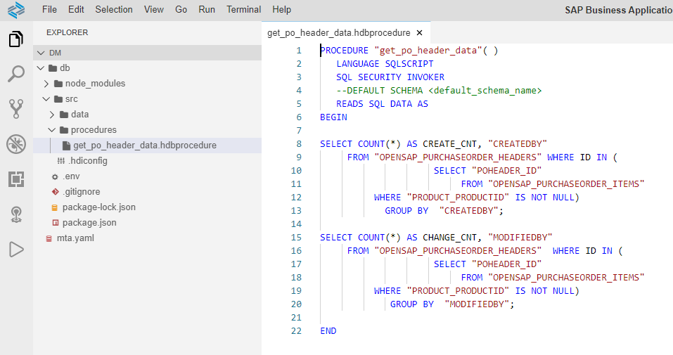
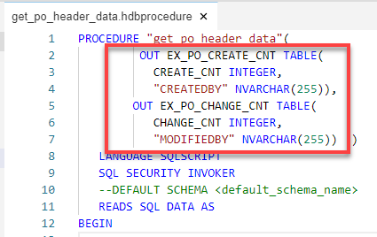
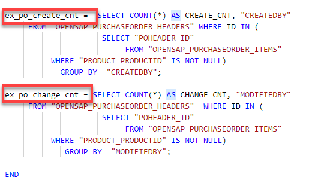
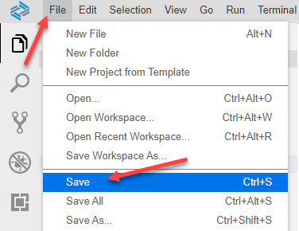
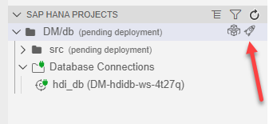
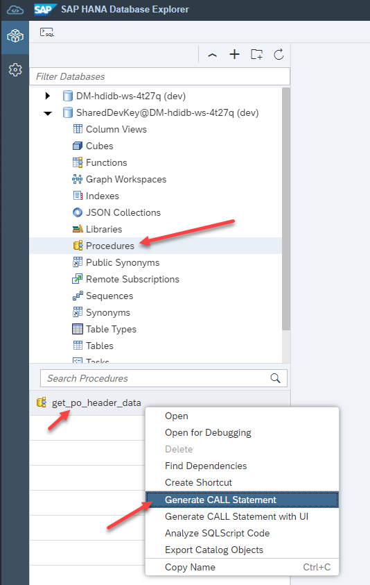
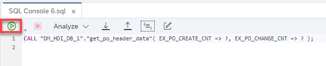
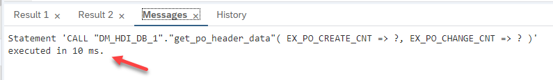

## Prerequisites  
- This tutorial is designed for SAP HANA Cloud.
- **Tutorials:** [Creating Stored Procedures](hana-cloud-sqlscript-stored-proc)

## Details
### You will learn  
- How to take full advantage of parallel processing in SAP HANA by using table variables

In this exercise, we will modify the code of procedure `get_po_header_data`  so that it takes full advantage of the parallel processing within HANA by using table variables.

---

[ACCORDION-BEGIN [Step 1: ](Edit previous procedure)]

1. Return to your procedure called `get_po_header_data`.

    !

2. Define two tabular output parameters which will be used to explicitly pass the results of the SELECT statements to the caller.

    !

3. Next, assign SELECT statements to the output parameters as shown here.

    !

4. The completed code should be similar to this.

    ```SQLCRIPT
    PROCEDURE "get_po_header_data"(
             OUT EX_PO_CREATE_CNT TABLE(
               CREATE_CNT INTEGER,
               "CREATEDBY" NVARCHAR(255)),
            OUT EX_PO_CHANGE_CNT TABLE(
               CHANGE_CNT INTEGER,
               "MODIFIEDBY" NVARCHAR(255))  )
       LANGUAGE SQLSCRIPT
       SQL SECURITY INVOKER
       --DEFAULT SCHEMA <default_schema_name>
       READS SQL DATA AS
    BEGIN

    ex_po_create_cnt =  SELECT COUNT(*) AS CREATE_CNT, "CREATEDBY"
         FROM "OPENSAP_PURCHASEORDER_HEADERS" WHERE ID IN (
                         SELECT "POHEADER_ID"
                              FROM "OPENSAP_PURCHASEORDER_ITEMS"
              WHERE "PRODUCT_PRODUCTID" IS NOT NULL)
                GROUP BY  "CREATEDBY";

    ex_po_change_cnt = SELECT COUNT(*) AS CHANGE_CNT, "MODIFIEDBY"
         FROM "OPENSAP_PURCHASEORDER_HEADERS"  WHERE ID IN (
                         SELECT "POHEADER_ID"
                              FROM "OPENSAP_PURCHASEORDER_ITEMS"
              WHERE "PRODUCT_PRODUCTID" IS NOT NULL)
                 GROUP BY  "MODIFIEDBY";

    END
    ```

[DONE]
[ACCORDION-END]

[ACCORDION-BEGIN [Step 2: ](Save, deploy, run and check results)]

1. Save the procedure.

    !

2. Perform a **Deploy**

    !

3. Use what you have learned and return to the Database Explorer page and run the procedure again.

    !

4. The CALL statement will be inserted into a new "SQL" tab. Click the **Run** button

    !

5. Check the execution time again, you may notice that it is a bit faster this time depending on your system. The reason is that these SQL statements are now executed in parallel.

    !

[DONE]
[ACCORDION-END]
