# Create Scalar User Defined Functions 
<!-- description --> Leverage SQLScript in stored procedures, user defined functions, and user defined libraries.

## Prerequisites
- This tutorial is designed for SAP HANA Cloud.
- **Tutorials:**  [Intermediate Table Variables](hana-cloud-sqlscript-table-var)

## You will learn  
- How to create a scalar UDF for generating a full name from the last, first and middle name of the employee

---

### Create new function


1. Right click on the `src` folder and choose **New Folder**.

    <!-- border -->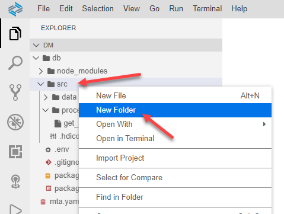

2. Enter the name of the folder as `functions` and click **OK**.

    <!-- border -->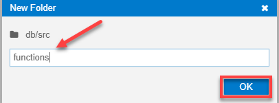

3. Click **View** then  **Find Command..**.

    <!-- border -->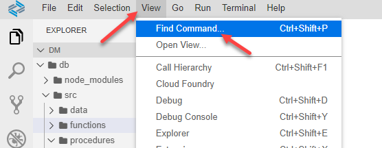

4. Enter `hana` as the search term, then click on **SAP HANA: Create SAP HANA Database Artifact**

    <!-- border -->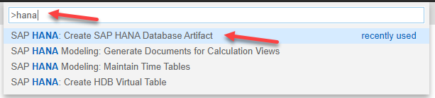

5. Click the **Browse** icon.

    <!-- border -->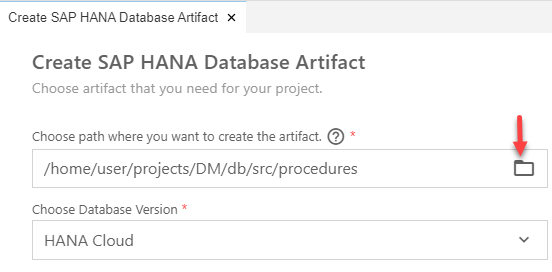

6. Select the `functions` folder that you created earlier, then click **Open**.

    <!-- border -->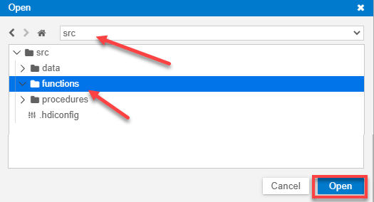

7. Use the dropdown, and select **Function** as the Artifact Type. Give the name of the artifact as  `get_full_name`, then click **Create**.

    <!-- border -->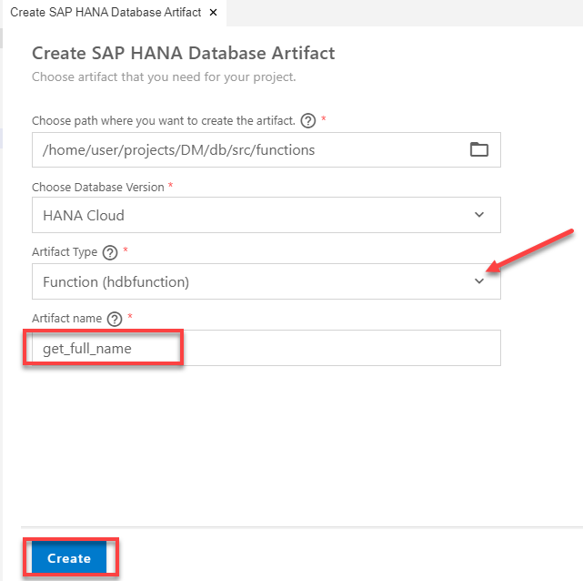

8. You will see a message saying that the new artifact as been created. From the functions folder, click on your new function. The SQLScript function editor will then be opened with the shell of your function code.

    <!-- border -->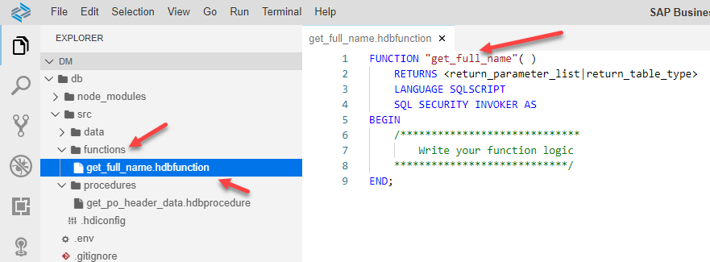


### Edit the function and save


1. Enter the code into the editor as shown here.  Please note the default for parameter `im_employeeid` which makes assigning a value to the parameter optional.

    ```SQLCRIPT
    FUNCTION "get_full_name" (
                  IN im_firstname NVARCHAR(40) ,
                  IN im_middlename NVARCHAR(40),
                  IN im_lastname NVARCHAR(40),
                  IN im_employeeid NVARCHAR(10) DEFAULT '' )
        			RETURNS ex_fullname NVARCHAR(256) AS
    BEGIN

      if :im_middlename IS NULL THEN
         ex_fullname = :im_lastname || ', ' || :im_firstname;
      ELSE
         ex_fullname = :im_lastname || ', ' ||
                       :im_firstname || ' ' || :im_middlename;
      END IF;

      IF :im_employeeid <> '' then
         ex_fullname = :ex_fullname || '(' || :im_employeeid || ')';
      END IF;
    END;
    ```

2. **Save** the function.

    <!-- border -->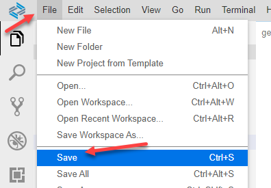


### Edit the procedure and save


1. Return to your procedure called `get_po_header_data` and modify it. Start by renaming the `LOGINNAME` column of the output table to `FULLNAME`. Also change the output length to 256. This is needed to match later on which the anticipated output structure.

    <!-- border -->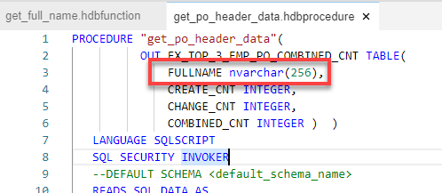

2. Change the last SELECT statement.  Remove the `LOGINNAME` column from the field list and replace it with a call to the scalar function that you created earlier.  Make sure to pass the `NAMEFIRST`, `NAMEMIDDLE` and `NAMELAST` name columns to the scalar function call.

    <!-- border -->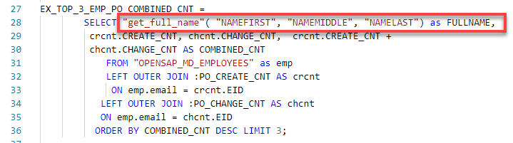

3. The completed code should look very similar to this.

    ```SQLCRIPT
    PROCEDURE "get_po_header_data"(
              OUT EX_TOP_3_EMP_PO_COMBINED_CNT TABLE(
                  FULLNAME nvarchar(256),
                  CREATE_CNT INTEGER,
                  CHANGE_CNT INTEGER,
                  COMBINED_CNT INTEGER )  )
       LANGUAGE SQLSCRIPT
       SQL SECURITY INVOKER
       --DEFAULT SCHEMA <default_schema_name>
       READS SQL DATA AS
    BEGIN

    po_create_cnt =  SELECT COUNT(*) AS CREATE_CNT, "CREATEDBY" as EID
         FROM "OPENSAP_PURCHASEORDER_HEADERS" WHERE ID IN (
                         SELECT "POHEADER_ID"
                              FROM "OPENSAP_PURCHASEORDER_ITEMS"
              WHERE "PRODUCT_PRODUCTID" IS NOT NULL)
                GROUP BY  "CREATEDBY";

    po_change_cnt = SELECT COUNT(*) AS CHANGE_CNT, "MODIFIEDBY" as EID
         FROM "OPENSAP_PURCHASEORDER_HEADERS"  WHERE ID IN (
                         SELECT "POHEADER_ID"
                              FROM "OPENSAP_PURCHASEORDER_ITEMS"
              WHERE "PRODUCT_PRODUCTID" IS NOT NULL)
                 GROUP BY  "MODIFIEDBY";

    EX_TOP_3_EMP_PO_COMBINED_CNT =
            SELECT "get_full_name"( "NAMEFIRST", "NAMEMIDDLE", "NAMELAST") as FULLNAME,
             crcnt.CREATE_CNT, chcnt.CHANGE_CNT,  crcnt.CREATE_CNT +
             chcnt.CHANGE_CNT AS COMBINED_CNT
                FROM "OPENSAP_MD_EMPLOYEES" as emp
                LEFT OUTER JOIN :PO_CREATE_CNT AS crcnt
                 ON emp.email = crcnt.EID
               LEFT OUTER JOIN :PO_CHANGE_CNT AS chcnt
               ON emp.email = chcnt.EID
              ORDER BY COMBINED_CNT DESC LIMIT 3;
    END
    ```

4. **Save** the procedure.

    <!-- border -->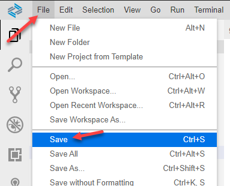


### Deploy and check results


1. Use what you have learned already and perform a deploy.

    <!-- border -->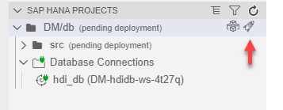

2. Then return to the Database Explorer and generate a new CALL statement and run it. Notice the `FULLNAME` column, it shows the results of the scalar `UDF` logic.

    <!-- border -->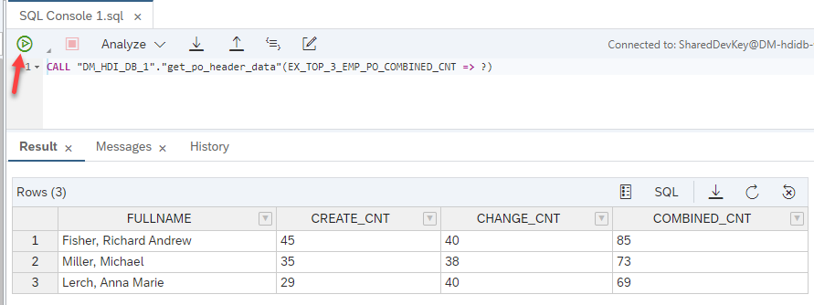

