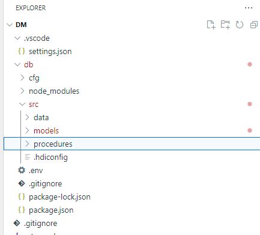
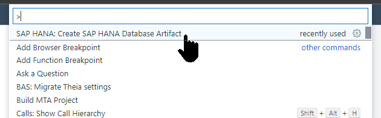
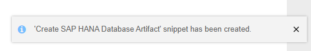

## Prerequisites  
- This tutorial is designed for SAP HANA Cloud.
- You have created a BTP trial, SAP HANA Cloud instance. [Deploy SAP HANA Cloud trial](hana-cloud-deploying)
- You are logged in to SAP Business Application Studio and its configured [Configure the Development Environment](hana-cloud-configure-dev-env)

## Details
### You will learn  
- How to create a small procedure `get_po_header_data` with two implicit SELECT queries

---

[ACCORDION-BEGIN [Step 1: ](Import Tables & Data)]

1. If you have not done so yet, create a new HANA Database Project in the SAP Business Application Studio. For more information about how to do this, complete step 1 from the [Create an SAP HANA Database Project](hana-cloud-create-db-project) tutorial.

2. Next, download the data.zip file from [here](https://github.com/SAP-samples/hana-opensap-cloud-2020/raw/main/tutorial/data.zip).   We will use predefined tables with sample data for all of the SQLScript tutorials in this group.

3. Right click on the `src` and choose **Import Project**, choose the data.zip file that you have downloaded.

    !

4. The imported files should now show in the newly created data folder.

    !

5. In the SAP HANA Projects section, click the **Deploy** button.

    !

6. You will then see the deployment log.

    !

7. Next, open the **Database Connections** folder, and click the **Open HDI Container** button.

    !

8. The SAP HANA Database Explorer will be opened, click on the **Tables** folder, and view the database tables that have been created.

    !

[DONE]
[ACCORDION-END]

[ACCORDION-BEGIN [Step 2: ](Create New Procedure)]

1. Right click on the `src` folder and choose **New Folder**.

    !

2. Enter the name of the folder as `procedures` and click **OK**.

    !

3. Click **View** then  **Find Command..**.

    !

4. Enter `hana` as the search term, then click on **SAP HANA: Create SAP HANA Database Artifact**

    !

5. Click the **Browse** icon.

    !

6. Select the `procedures` folder that you created earlier, then click **Open**.

    !

7. Use the dropdown, and select **Procedure** as the Artifact Type.

    !

8. Give the name of the artifact as `get_po_header_data`, then click **Create**.

    !

9. You will see a message saying that the new artifact as been created.

    !

10. From the procedures folder, click on your new procedure. The SQLScript procedure editor will then be opened with the shell of your procedure code.

    !

[DONE]
[ACCORDION-END]

[ACCORDION-BEGIN [Step 3: ](Add Code and Deploy)]

1. Between the BEGIN and END statements, insert the SELECT statements as shown.  These are implicit select statements whose results sets are passed to the caller.  

    ```SQLCRIPT
    SELECT COUNT(*) AS CREATE_CNT, "CREATEDBY"
         FROM "OPENSAP_PURCHASEORDER_HEADERS" WHERE ID IN (
                         SELECT "POHEADER_ID"
                              FROM "OPENSAP_PURCHASEORDER_ITEMS"
              WHERE "PRODUCT_PRODUCTID" IS NOT NULL)
                GROUP BY  "CREATEDBY";

    SELECT COUNT(*) AS CHANGE_CNT, "MODIFIEDBY"
         FROM "OPENSAP_PURCHASEORDER_HEADERS"  WHERE ID IN (
                         SELECT "POHEADER_ID"
                              FROM "OPENSAP_PURCHASEORDER_ITEMS"
              WHERE "PRODUCT_PRODUCTID" IS NOT NULL)
                 GROUP BY  "MODIFIEDBY";
    ```

2. The completed code should look similar to this.

    ```SQLSCRIPT
    PROCEDURE "get_po_header_data"( )
       LANGUAGE SQLSCRIPT
       SQL SECURITY INVOKER
       --DEFAULT SCHEMA <default_schema_name>
       READS SQL DATA AS
    BEGIN

    SELECT COUNT(*) AS CREATE_CNT, "CREATEDBY"
         FROM "OPENSAP_PURCHASEORDER_HEADERS" WHERE ID IN (
                         SELECT "POHEADER_ID"
                              FROM "OPENSAP_PURCHASEORDER_ITEMS"
              WHERE "PRODUCT_PRODUCTID" IS NOT NULL)
                GROUP BY  "CREATEDBY";

    SELECT COUNT(*) AS CHANGE_CNT, "MODIFIEDBY"
         FROM "OPENSAP_PURCHASEORDER_HEADERS"  WHERE ID IN (
                         SELECT "POHEADER_ID"
                              FROM "OPENSAP_PURCHASEORDER_ITEMS"
              WHERE "PRODUCT_PRODUCTID" IS NOT NULL)
                 GROUP BY  "MODIFIEDBY";

    END

    ```

3. Save the procedure.

    !

4. Once again, click **Deploy**.

    !


[DONE]
[ACCORDION-END]

[ACCORDION-BEGIN [Step 4: ](Run Procedure and Check Results)]

1. Switch over to the Database Explorer page and click on the `Procedures` folder. Right-click on the procedure and choose **Generate Call Statement**.

    !

2. A new SQL tab will be opened with the CALL statement inserted. Click the **Run** button.

    !

3. The two results are then shown in another tab.  

    !

4. Note the execution time on the **Messages** tab.

    !

[DONE]
[ACCORDION-END]
