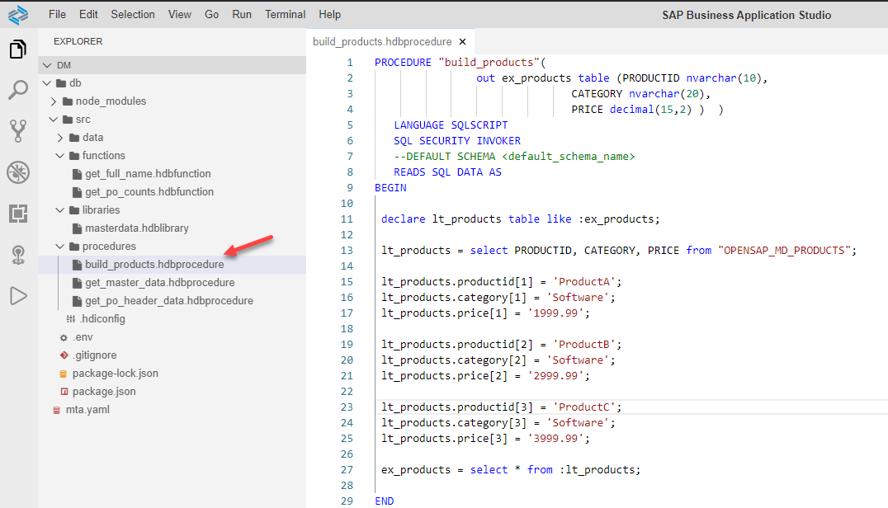
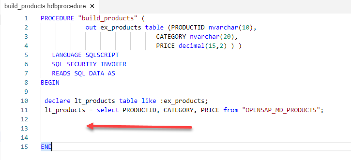
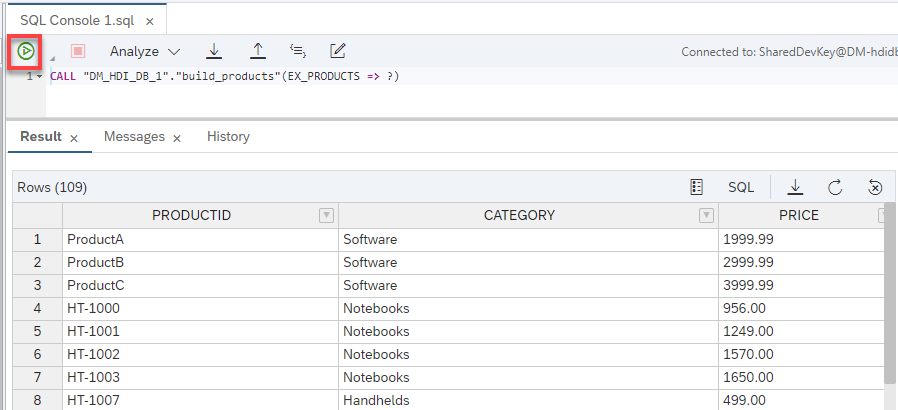
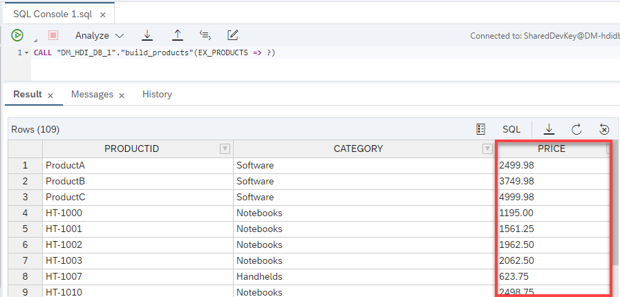
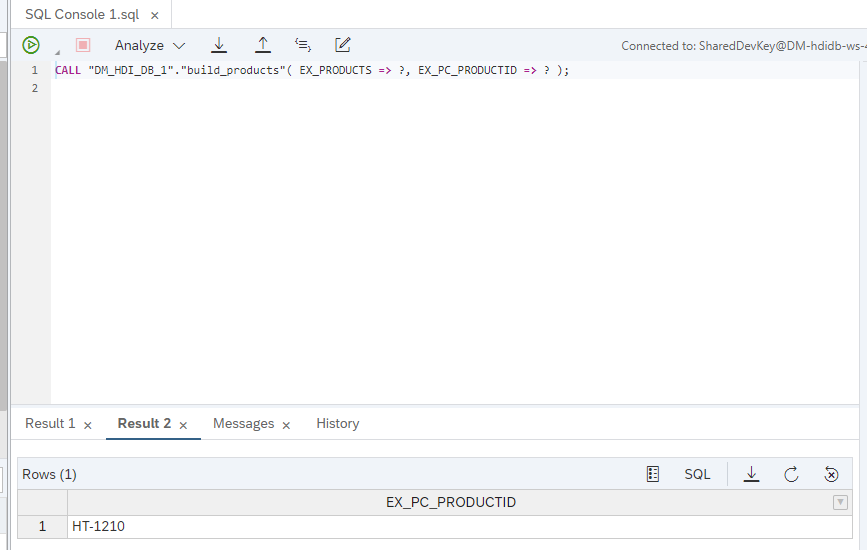

## Prerequisites  
- This tutorial is designed for SAP HANA Cloud.
- **Tutorials:** [Using Index Based Cell Access](hana-cloud-sqlscript-usingindexbased)


## Details
### You will learn  
- How to update procedure to use Table Variable Operators to manipulate the immediate table variables

In this tutorial, you will update the previous procedure to now use Table Variable Operators to manipulate the immediate table variables.  We can use table variable operators to perform DML like operations on table variables without having to invoke the SQL layer.  In this exercise, we will experiment with the INSERT, UPDATE, DELETE, and SEARCH operators.

---

[ACCORDION-BEGIN [Step 1: ](Use INSERT operator)]
1. Return to the procedure called `build_products` in the procedure folder.

    !

2. Remove the code inside the body, between the BEGIN and END statements leaving only the two lines shown here.

    !

3. After the SELECT statement, Use the INSERT operator to copy all rows of `lt_products` into the output parameter called `ex_products`. Then use the INSERT operator to insert 3 new products into the output table.  Since you are specifying the actual index, it will insert your new rows at that index and push all existing rows down.
```SQLCRIPT
:ex_products.INSERT(:lt_products);
:ex_products.INSERT(('ProductA', 'Software', '1999.99'), 1);
:ex_products.INSERT(('ProductB', 'Software', '2999.99'), 2);
:ex_products.INSERT(('ProductC', 'Software', '3999.99'), 3);
```

4. The complete code should look very similar to this.

	```SQLCRIPT
	PROCEDURE "build_products" (
			        out ex_products table (PRODUCTID nvarchar(10),
		                               CATEGORY nvarchar(20),
		                               PRICE decimal(15,2) ) )
		   LANGUAGE SQLSCRIPT
		   SQL SECURITY INVOKER
		   READS SQL DATA AS
	BEGIN

	 declare lt_products table like :ex_products;

		 lt_products = select PRODUCTID, CATEGORY, PRICE from "OPENSAP_MD_PRODUCTS";
		 :ex_products.INSERT(:lt_products);
		 :ex_products.INSERT(('ProductA', 'Software', '1999.99'), 1);
		 :ex_products.INSERT(('ProductB', 'Software', '2999.99'), 2);
		 :ex_products.INSERT(('ProductC', 'Software', '3999.99'), 3);

	END
	```


5. Use what you have learned and **Save** your work, and perform a **Deploy**. Then return to the Database Explorer and call the procedure.  In the Results tab, you should see the product data including the new products that you have inserted.

    !

[DONE]
[ACCORDION-END]

[ACCORDION-BEGIN [Step 2: ](Use UPDATE operator)]

1. Return to the procedure and further modify it.  Enter another DECLARE statement for `lv_index`.

	```SQLCRIPT
	declare lv_index int = 0;
	```

2. Also add a FOR loop to loop through the rows and update the price using the UDPATE operator

	```SQLCRIPT
	FOR lv_index IN 1..record_count(:ex_products) DO
		:ex_products.(PRICE).UPDATE((:ex_products.PRICE[lv_index] * 1.25), lv_index);
	END FOR;
	```

3. The complete code should look very similar to this.

	```SQLCRIPT
	PROCEDURE "build_products" (
		        out ex_products table (PRODUCTID nvarchar(10),
		                               CATEGORY nvarchar(20),
		                               PRICE decimal(15,2) ) )
	  LANGUAGE SQLSCRIPT
	  SQL SECURITY INVOKER
	  READS SQL DATA AS
	BEGIN

	 declare lt_products table like :ex_products;
	 declare lv_index int = 0;

	 lt_products = select PRODUCTID, CATEGORY, PRICE from "OPENSAP_MD_PRODUCTS";
	 :ex_products.INSERT(:lt_products);
	 :ex_products.INSERT(('ProductA', 'Software', '1999.99'), 1);
	 :ex_products.INSERT(('ProductB', 'Software', '2999.99'), 2);
	 :ex_products.INSERT(('ProductC', 'Software', '3999.99'), 3);

	 FOR lv_index IN 1..record_count(:ex_products) DO
	   :ex_products.(PRICE).UPDATE((:ex_products.PRICE[lv_index] * 1.25), lv_index);
	 END FOR;

	END
	```

4. Use what you have learned and **Save** your work, and perform a **Deploy**. Then return to the Database Explorer and call the procedure.  In the Results tab, you should see the product data including the new products that you have inserted and now the prices have been increased.

    !

[DONE]
[ACCORDION-END]

[ACCORDION-BEGIN [Step 3: ](Use DELETE operator)]
1. Return to the procedure and further modify it.  Enter two new DECLARE statements.

	```SQLCRIPT
	declare lv_del_index int array;
	declare lv_array_index int = 0;
	```

2. Also add a FOR loop determine which lines to delete, and finally use the DELETE operator to delete the rows all at once.

	```SQLCRIPT
	FOR lv_index IN 1..record_count(:ex_products) DO
		IF :ex_products.PRICE[lv_index] <= 2500.00 THEN
		 lv_array_index = lv_array_index + 1;
		 lv_del_index[lv_array_index] = lv_index;
	 END IF;
	END FOR;

	:ex_products.DELETE(:lv_del_index);
	```

3. The complete code should look very similar to this.

	```SQLCRIPT
	PROCEDURE "build_products" (
			        out ex_products table (PRODUCTID nvarchar(10),
			                               CATEGORY nvarchar(20),
			                               PRICE decimal(15,2) ) )
		   LANGUAGE SQLSCRIPT
		   SQL SECURITY INVOKER
		   READS SQL DATA AS
	BEGIN

	 declare lt_products table like :ex_products;
	 declare lv_index int = 0;
	 declare lv_del_index int array;
	 declare lv_array_index int = 0;

	 lt_products = select PRODUCTID, CATEGORY, PRICE from "OPENSAP_MD_PRODUCTS";
	 :ex_products.INSERT(:lt_products);
	 :ex_products.INSERT(('ProductA', 'Software', '1999.99'), 1);
	 :ex_products.INSERT(('ProductB', 'Software', '2999.99'), 2);
	 :ex_products.INSERT(('ProductC', 'Software', '3999.99'), 3);

	 FOR lv_index IN 1..record_count(:ex_products) DO
	   :ex_products.(PRICE).UPDATE((:ex_products.PRICE[lv_index] * 1.25), lv_index);
	 END FOR;

	 FOR lv_index IN 1..record_count(:ex_products) DO
	   IF :ex_products.PRICE[lv_index] <= 2500.00 THEN
	    lv_array_index = lv_array_index + 1;
	    lv_del_index[lv_array_index] = lv_index;
	  END IF;
	 END FOR;
	 :ex_products.DELETE(:lv_del_index);

	END
	```

4. Use what you have learned and **Save** your work, and perform a **Deploy**. Then return to the Database Explorer and call the procedure.  In the Results tab, you should see the product data that is left after the DELETE operation has been performed.

    !

[DONE]
[ACCORDION-END]

[ACCORDION-BEGIN [Step 4: ](Use SEARCH operator)]
1. Return to the procedure and further modify it.  Enter code for a new output parameter.

	```SQLCRIPT
	  out ex_pc_productid nvarchar(10)
	```

2. Also add the two lines of code for performing a SEARCH on the intermediate table variable.

	```SQLCRIPT
	 lv_index = :ex_products.SEARCH("CATEGORY", 'PC', 1);  
	 ex_pc_productid = :ex_products.PRODUCTID[lv_index];
	```

3. The complete code should look very similar to this.

	```SQLCRIPT
	PROCEDURE "build_products" (
		        out ex_products table (PRODUCTID nvarchar(10),
	                               CATEGORY nvarchar(20),
	                               PRICE decimal(15,2) ),
	          out ex_pc_productid nvarchar(10) )
	   LANGUAGE SQLSCRIPT
	   SQL SECURITY INVOKER
	   READS SQL DATA AS
	BEGIN

	 declare lt_products table like :ex_products;
	 declare lv_index int = 0;
	 declare lv_del_index int array;
	 declare lv_array_index int = 0;

	 lt_products = select PRODUCTID, CATEGORY, PRICE from "OPENSAP_MD_PRODUCTS";
	 :ex_products.INSERT(:lt_products);
	 :ex_products.INSERT(('ProductA', 'Software', '1999.99'), 1);
	 :ex_products.INSERT(('ProductB', 'Software', '2999.99'), 2);
	 :ex_products.INSERT(('ProductC', 'Software', '3999.99'), 3);

	 FOR lv_index IN 1..record_count(:ex_products) DO
	   :ex_products.(PRICE).UPDATE((:ex_products.PRICE[lv_index] * 1.25), lv_index);
	 END FOR;

	 FOR lv_index IN 1..record_count(:ex_products) DO
	   IF :ex_products.PRICE[lv_index] <= 2500.00 THEN
	    lv_array_index = lv_array_index + 1;
	    lv_del_index[lv_array_index] = lv_index;
	  END IF;
	 END FOR;

	 :ex_products.DELETE(:lv_del_index);

	 lv_index = :ex_products.SEARCH("CATEGORY", 'PC', 1);  
	 ex_pc_productid = :ex_products.PRODUCTID[lv_index];

	END
	```
4. Use what you have learned and **Save** your work, and perform a **Deploy**. Then return to the Database Explorer and call the procedure.  In the Results tab, you should see the product data that is left after the DELETE operation has been performed in the first tab, and on the second results tab you should see the product id of the first row which category was equal to "PC".

    !


[DONE]
[ACCORDION-END]


---
