## Prerequisites  
- This tutorial is designed for SAP HANA Cloud.
- **Tutorials:** [Creating Scalar User Defined Functions](hana-cloud-sqlscript-scalar)

## Details
### You will learn
- How to transform a procedure to a table function.

There are application and scenarios where you need a table function instead of procedure to leverage the advantage of direct selects on the output, for example, filtering, sorting and grouping. In the following exercise, we show you how you can easily transform a procedure to a table function.

---

[ACCORDION-BEGIN [Step 1: ](Create new function)]

1. Use what you have learned and return to the `functions` folder and create a new function called `get_po_counts` using the **SAP HANA: Create Database Artifact** command.

    !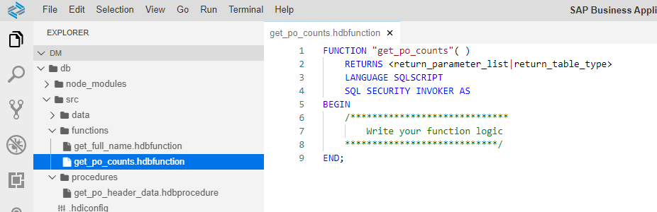

[DONE]
[ACCORDION-END]

[ACCORDION-BEGIN [Step 2: ](Enter table function code)]

1. Add the input parameter called `IM_FDATE` as well as the RETURN Table parameter as shown. Please note the scalar input parameter we will used later on for filtering.

    ```SQLCRIPT
    FUNCTION "get_po_counts" ( im_fdate DATE )
     RETURNS TABLE (EMAIL NVARCHAR(255),
    	       FULLNAME NVARCHAR(255),
    	       CREATE_CNT INTEGER,
    	       CHANGE_CNT INTEGER,
    	       COMBINED_CNT INTEGER)
        LANGUAGE SQLSCRIPT
        SQL SECURITY INVOKER AS
    BEGIN


    END;
    ```


2. Copy the logic from the procedure `get_po_header_data` into the body of the function.  Make sure to only copy the code between the BEGIN and END statements

    !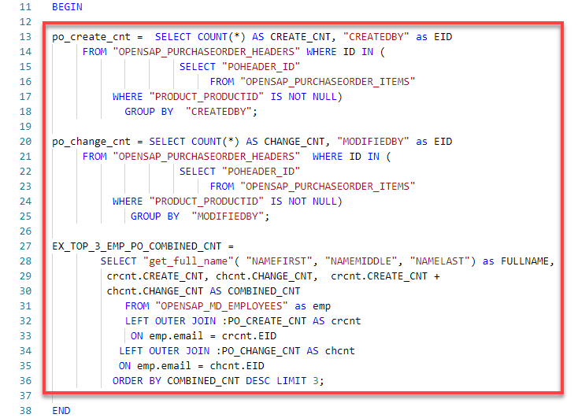


3. Add to the WHERE clauses in the first two SELECT statements for filtering by month. Month is captured from the input parameter `im_fdate`.

    !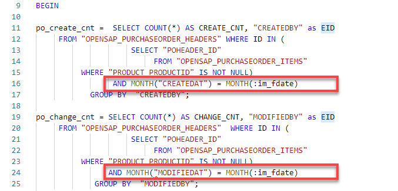

4. In the third SELECT statement, change the name of the intermediate table variable to `EMP_PO_COMBINED_CNT` to match the variable name to the semantics of the query

    !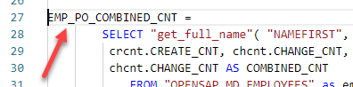

5. Also add the `EMAIL` column to the field list.

    !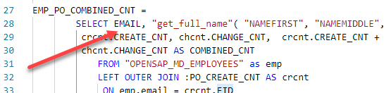


6. Remove the LIMIT clause at the end.

    !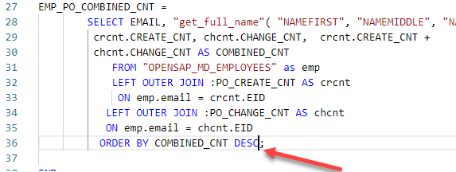


7. Finally, add a RETURN SELECT statement at the end to mark the to be returned result set of the function.

    !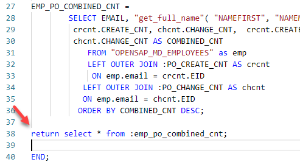


8. The completed code should be very similar to this.

    ```SQLCRIPT
    FUNCTION "get_po_counts"( im_fdate DATE )
     RETURNS TABLE (EMAIL NVARCHAR(255),
    	       FULLNAME NVARCHAR(255),
    	       CREATE_CNT INTEGER,
    	       CHANGE_CNT INTEGER,
    	       COMBINED_CNT INTEGER)
        LANGUAGE SQLSCRIPT
        SQL SECURITY INVOKER AS
    BEGIN

    po_create_cnt =  SELECT COUNT(*) AS CREATE_CNT, "CREATEDBY" as EID
         FROM "OPENSAP_PURCHASEORDER_HEADERS" WHERE ID IN (
                         SELECT "POHEADER_ID"
                              FROM "OPENSAP_PURCHASEORDER_ITEMS"
              WHERE "PRODUCT_PRODUCTID" IS NOT NULL)
                     AND MONTH("CREATEDAT") = MONTH(:im_fdate)
                GROUP BY  "CREATEDBY";

    po_change_cnt = SELECT COUNT(*) AS CHANGE_CNT, "MODIFIEDBY" as EID
         FROM "OPENSAP_PURCHASEORDER_HEADERS"  WHERE ID IN (
                         SELECT "POHEADER_ID"
                              FROM "OPENSAP_PURCHASEORDER_ITEMS"
              WHERE "PRODUCT_PRODUCTID" IS NOT NULL)
                    AND MONTH("MODIFIEDAT") = MONTH(:im_fdate)
                 GROUP BY  "MODIFIEDBY";

    EMP_PO_COMBINED_CNT =
            SELECT EMAIL, "get_full_name"( "NAMEFIRST", "NAMEMIDDLE", "NAMELAST") as FULLNAME,
             crcnt.CREATE_CNT, chcnt.CHANGE_CNT,  crcnt.CREATE_CNT +
             chcnt.CHANGE_CNT AS COMBINED_CNT
                FROM "OPENSAP_MD_EMPLOYEES" as emp
                LEFT OUTER JOIN :PO_CREATE_CNT AS crcnt
                 ON emp.email = crcnt.EID
               LEFT OUTER JOIN :PO_CHANGE_CNT AS chcnt
               ON emp.email = chcnt.EID
              ORDER BY COMBINED_CNT DESC;

    return select * from :emp_po_combined_cnt;

    END;
    ```


[DONE]
[ACCORDION-END]

[ACCORDION-BEGIN [Step 3: ](Save, deploy, check results)]

1. **Save** the function.

    !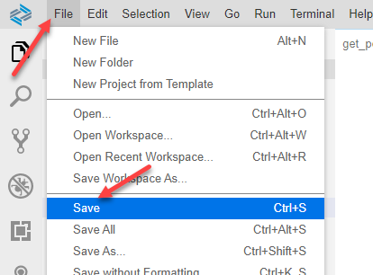

2. Perform a **Deploy**

    !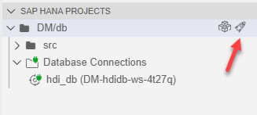

3. Return to the Database Explorer page. Select the Functions folder.  Right-click on the `get_po_counts` function and choose Generate SELECT statement.

    !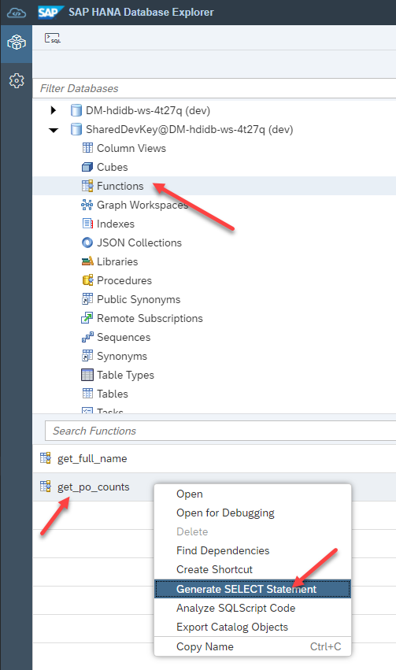

4. A new SQL tab will be opened with a SELECT statement. Enter the date `18.12.2014` as the input parameter and add  LIMIT 3 at the end of it. Click **Run**.

    ```SQLCRIPT
    SELECT * FROM "get_po_counts"('18.12.2014') LIMIT 3;
    ```
    !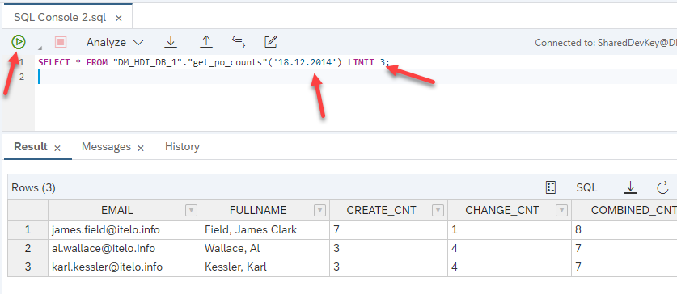

[DONE]
[ACCORDION-END]
