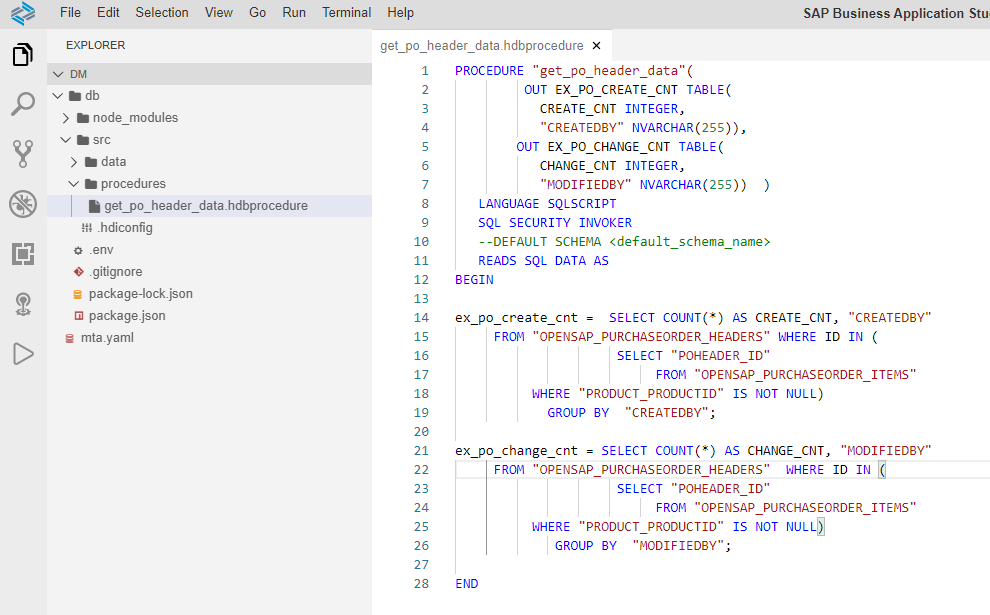
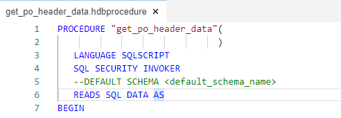
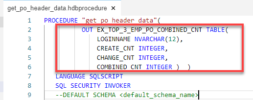
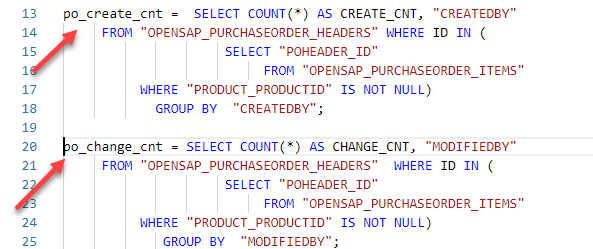
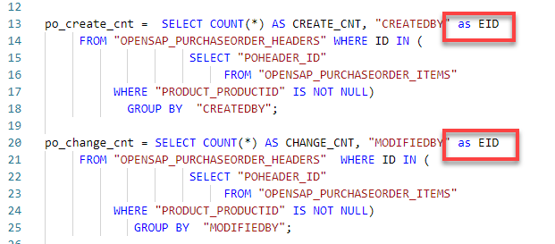
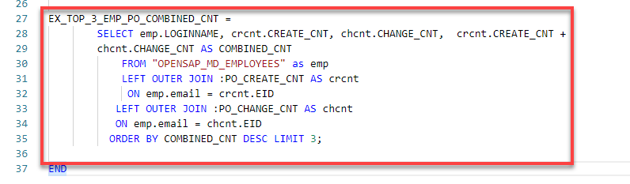
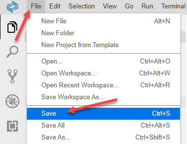
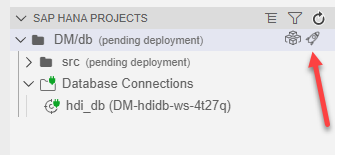
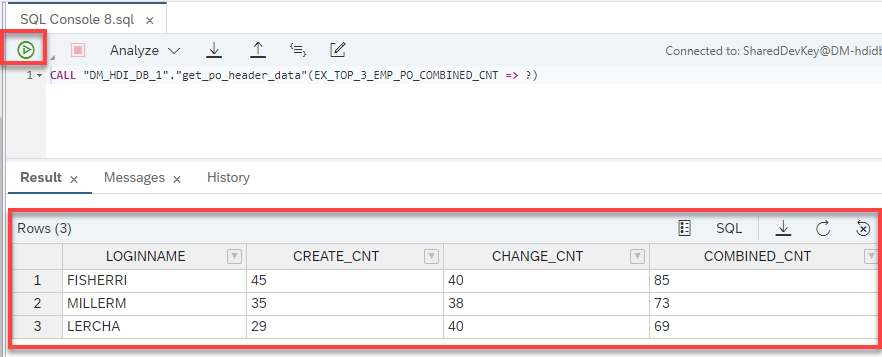

## Prerequisites  
- This tutorial is designed for SAP HANA Cloud.
- **Tutorials:** [Parallel Processing and Parameters](hana-cloud-sqlscript-parallel)

## Details
### You will learn  
In this exercise you will modify the code of procedure `get_po_header_data` again to use a single tabular output. Existing queries will be reused based on intermediate table variables.

---

[ACCORDION-BEGIN [Step 1: ](Edit previous procedure)]

1. Return to your procedure called `get_po_header_data`.

    !

2. Delete the output parameters which you defined in the last section.

    !


3. Define a new output parameter as shown

    !


4. Rename `EX_PO_CREATE_CNT` to `PO_CREATE_CNT`. Also rename `EX_PO_CHANGE_CNT` to `PO_CHANGE_CNT`

    !


5. Modify the two SELECT statements and add `AS EID` after the `CREADEDBY` and `MODIFIEDBY` fields.

    !

6. Next, add another SELECT statement after the 2 previous SELECT statements as shown. This statement uses the previously defined table variables.

    !

7. The completed code should be very similar to this.

    ```SQLCRIPT
    PROCEDURE "get_po_header_data"(
              OUT EX_TOP_3_EMP_PO_COMBINED_CNT TABLE(
                  LOGINNAME NVARCHAR(12),
                  CREATE_CNT INTEGER,
                  CHANGE_CNT INTEGER,
                  COMBINED_CNT INTEGER )  )
       LANGUAGE SQLSCRIPT
       SQL SECURITY INVOKER
       --DEFAULT SCHEMA <default_schema_name>
       READS SQL DATA AS
    BEGIN

    po_create_cnt =  SELECT COUNT(*) AS CREATE_CNT, "CREATEDBY" as EID
         FROM "OPENSAP_PURCHASEORDER_HEADERS" WHERE ID IN (
                         SELECT "POHEADER_ID"
                              FROM "OPENSAP_PURCHASEORDER_ITEMS"
              WHERE "PRODUCT_PRODUCTID" IS NOT NULL)
                GROUP BY  "CREATEDBY";

    po_change_cnt = SELECT COUNT(*) AS CHANGE_CNT, "MODIFIEDBY" as EID
         FROM "OPENSAP_PURCHASEORDER_HEADERS"  WHERE ID IN (
                         SELECT "POHEADER_ID"
                              FROM "OPENSAP_PURCHASEORDER_ITEMS"
              WHERE "PRODUCT_PRODUCTID" IS NOT NULL)
                 GROUP BY  "MODIFIEDBY";

    EX_TOP_3_EMP_PO_COMBINED_CNT =
            SELECT emp.LOGINNAME, crcnt.CREATE_CNT, chcnt.CHANGE_CNT,  crcnt.CREATE_CNT +
            chcnt.CHANGE_CNT AS COMBINED_CNT
                FROM "OPENSAP_MD_EMPLOYEES" as emp
                LEFT OUTER JOIN :PO_CREATE_CNT AS crcnt
                 ON emp.email = crcnt.EID
               LEFT OUTER JOIN :PO_CHANGE_CNT AS chcnt
               ON emp.email = chcnt.EID
              ORDER BY COMBINED_CNT DESC LIMIT 3;

    END

    ```


[DONE]
[ACCORDION-END]

[ACCORDION-BEGIN [Step 2: ](Save, deploy, run and check results)]

1. Save the procedure.

    !

2. Perform a **Deploy**.

    !

3. Return to the Database Explorer page and use what you have learned and generate a new call statement for the procedure and run it. The results are then shown.

    !


[DONE]
[ACCORDION-END]
