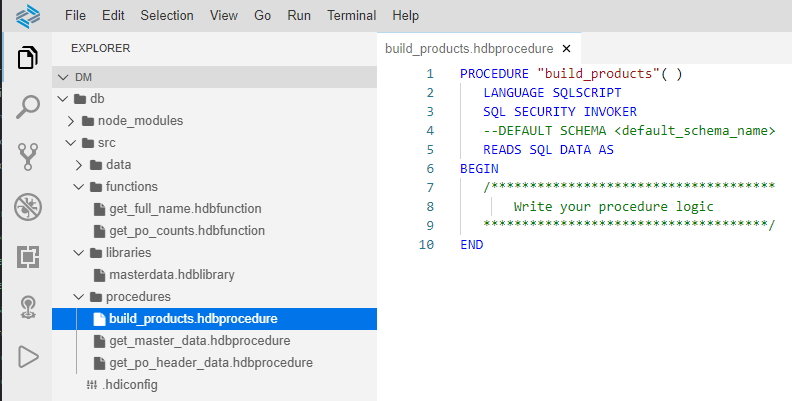
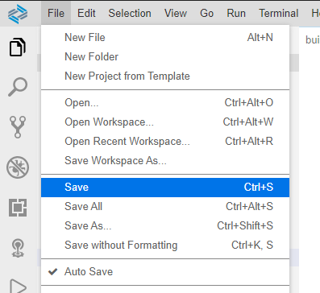
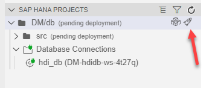
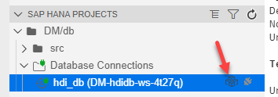
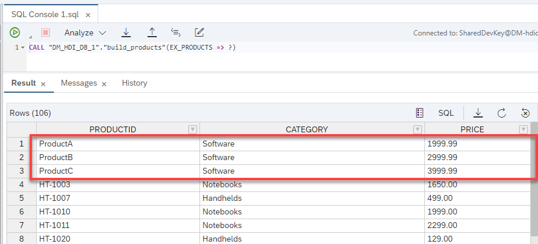

## Prerequisites  
- This tutorial is designed for SAP HANA Cloud.
- **Tutorials:** [Debugging Stored Procedures](hana-cloud-sqlscript-debugging)

## Details
### You will learn  
- How to use index-based cell access to manipulate table data.

Using index-based cell access to manipulate table data is faster than using cursors or arrays.

---

[ACCORDION-BEGIN [Step 1: ](Create a new procedure)]

1. Use what you have learned and create a new procedure called `build_products` in the procedure folder.

    !

2. Use what you have learned about procedure parameters, and define an output parameters as show here.

    ```SQLCRIPT
    out ex_products table (PRODUCTID nvarchar(10),
                           CATEGORY nvarchar(20),
                           PRICE decimal(15,2))
    ```

[DONE]

[ACCORDION-END]

[ACCORDION-BEGIN [Step 2: ](Insert procedure code)]

1. Between the BEGIN and END statements, using index based cell access, insert rows into an intermediate table variable using the following code.

    ```SQLCRIPT

     declare lt_products table like :ex_products;

     lt_products = select PRODUCTID, CATEGORY, PRICE from "OPENSAP_MD_PRODUCTS";

     lt_products.productid[1] = 'ProductA';
     lt_products.category[1] = 'Software';
     lt_products.price[1] = '1999.99';

     lt_products.productid[2] = 'ProductB';
     lt_products.category[2] = 'Software';
     lt_products.price[2] = '2999.99';

     lt_products.productid[3] = 'ProductC';
     lt_products.category[3] = 'Software';
     lt_products.price[3] = '3999.99';

     ex_products = select * from :lt_products;

    ```

2. The completed code should look like the following.

    ```SQLCRIPT
      PROCEDURE "build_products" (
          	    out ex_products table (PRODUCTID nvarchar(10),
                                   CATEGORY nvarchar(20),
                                   PRICE decimal(15,2) ) )
        LANGUAGE SQLSCRIPT
        SQL SECURITY INVOKER
        READS SQL DATA AS
      BEGIN

        declare lt_products table like :ex_products;

        lt_products = select PRODUCTID, CATEGORY, PRICE from "OPENSAP_MD_PRODUCTS";

        lt_products.productid[1] = 'ProductA';
        lt_products.category[1] = 'Software';
        lt_products.price[1] = '1999.99';

        lt_products.productid[2] = 'ProductB';
        lt_products.category[2] = 'Software';
        lt_products.price[2] = '2999.99';

        lt_products.productid[3] = 'ProductC';
        lt_products.category[3] = 'Software';
        lt_products.price[3] = '3999.99';

        ex_products = select * from :lt_products;

      END
    ```

[DONE]
[ACCORDION-END]

[ACCORDION-BEGIN [Step 3: ](Save, deploy and check results)]

1. **Save** the procedure

    !

2. Perform a **Deploy**

    !

3. Return to the Database Explorer page and generate and run the CALL statement for this procedure.

    !

4. Run the procedure and check the results.

    !

[DONE]
[ACCORDION-END]
