# Access Instances in SAP HANA Cloud Central 

<!-- description --> Learn how to open and interact with SAP HANA database, data lake Relational Engine, and data lake Files instances directly from the SAP HANA Cloud Central Instances list.

## Prerequisites

- You have completed [SAP HANA Cloud Overview and Instance Provisioning](hana-cloud-sqltools-overview)

## You will learn

- How to open a SQL console and browse catalog objects from the Instances list
- How to access a data lake Relational Engine instance
- How to access a data lake Files instance
- How to copy the SQL endpoint for use with external clients

## Intro

In SAP HANA Cloud Central, all instances provisioned in your BTP subaccount appear automatically in the **Instances** list. You do not need to manually add connections: you open SQL consoles, browse catalog objects, and manage instances directly from there.

Instances in the list can represent an SAP HANA database, a data lake Relational Engine, or a data lake Files instance. Each instance type has its own set of available actions.

---

### Open a database instance from SAP HANA Cloud Central

1. In SAP HANA Cloud Central, navigate to **Instances** and locate your SAP HANA database instance.

2. Click the **three dots** in the **Actions** column next to the instance.

    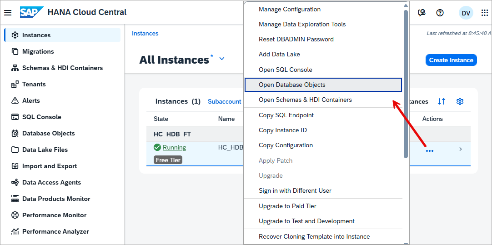

    From the actions menu you can:

    - Select **Open Database Objects** to browse the catalog of this instance.
    - Select **Open SQL Console** to open a SQL console connected directly to this instance.

3. When the Database Objects app opens, use the search to specify objects that start with **M_DATABASE** that are in the schema **SYS**.  The object type tabs, Tables, Views, Functions, Procedures, and others, let you browse objects by type.

    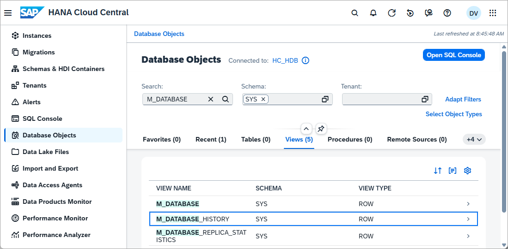

    Selecting an object such as the view M_DATABASE_HISTORY displays its details, such as column names and data types. From the detail panel you can also view the **CREATE Statement** to see the SQL used to define the object, and the **Dependencies** tab to see which objects reference it or which objects it depends on.

    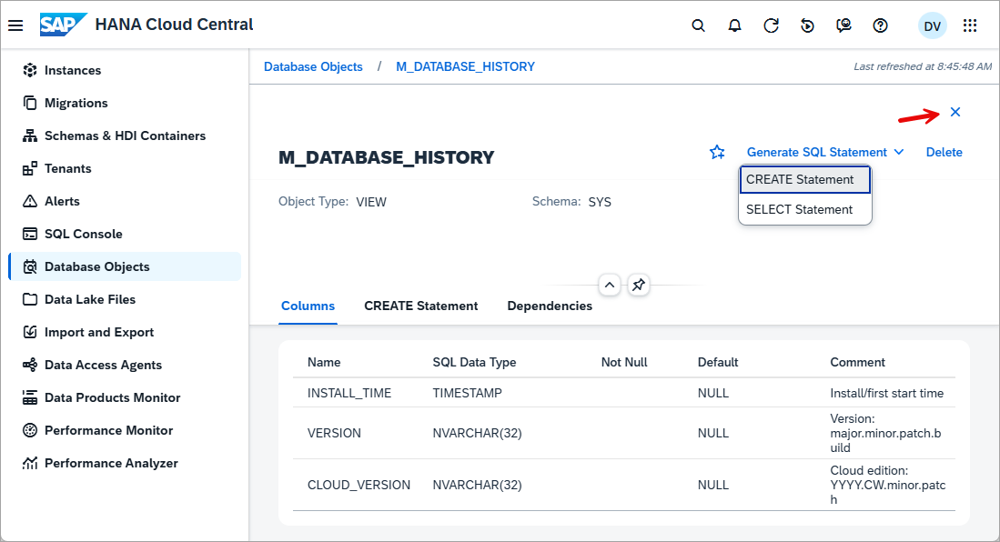

    > The next tutorial creates the HOTELS schema and populates it with tables, views, functions, and procedures that can then be explored here.

    After viewing the details of the M_DATABASE_HISTORY view, return to the objects list by pressing the exit or X icon in the top right.

    A SQL console can also be opened directly from the Database Objects app by selecting the SQL console icon in the toolbar, which opens a console pre-connected to the same instance.

    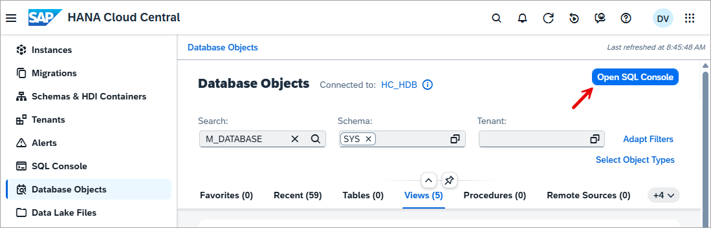

4. Once the SQL console is open, run the following queries to verify the connection and view basic database information.

   ```SQL
   SELECT CURRENT_USER, CURRENT_SCHEMA FROM DUMMY;
   SELECT * FROM M_DATABASE;
   ```

   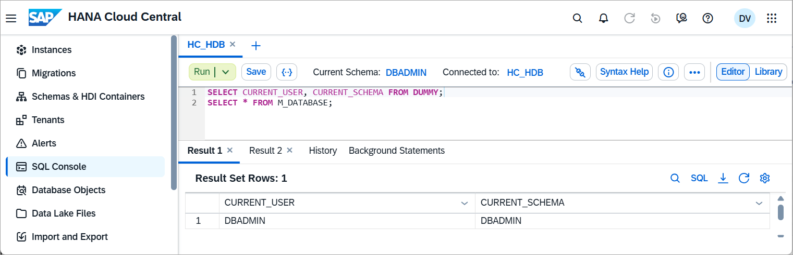

5. To copy the SQL endpoint, select the **Instance Information** button in the SQL Console and copy the endpoint. This is needed to connect external [clients](mission.hana-cloud-clients) or tools such as JDBC, ODBC, or a local development environment,

    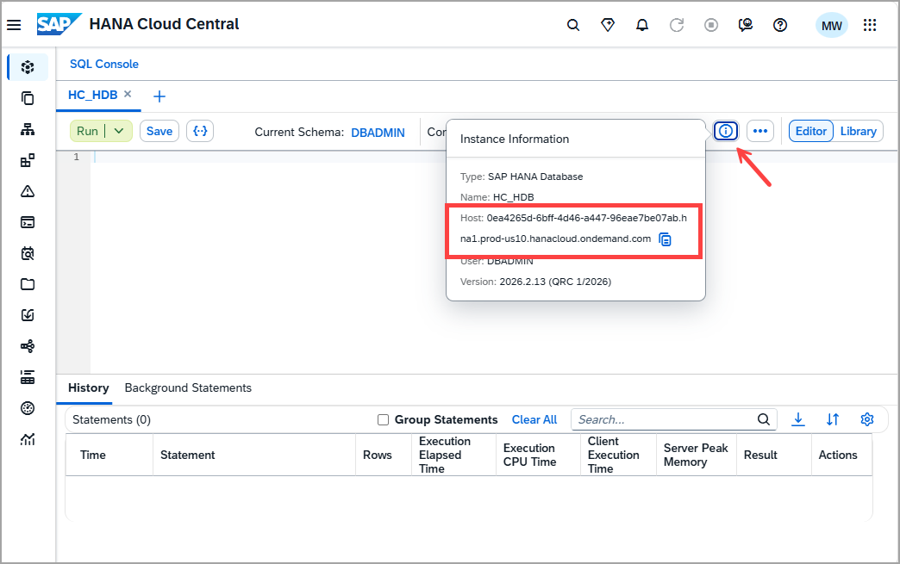

    > Additionally, you can navigate to the instances page and select **Copy SQL Endpoint** from the instance's actions menu.
    > 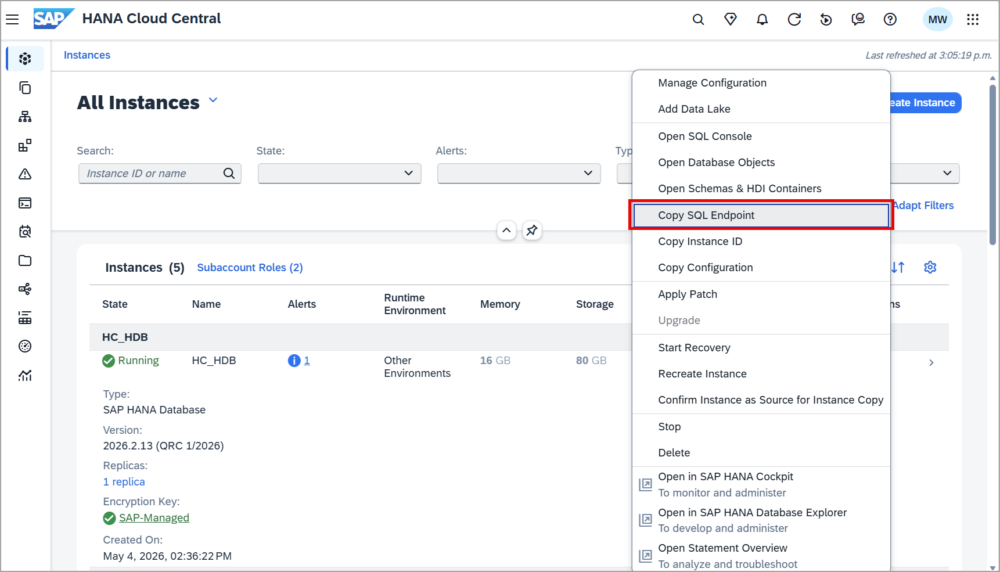

### Access a data lake Relational Engine instance (optional)

A data lake Relational Engine is a column-oriented, disk-based relational store used to economically store data that is not updated frequently. Additional details can be found at [What is SAP HANA Cloud, Data Lake](https://help.sap.com/docs/hana-cloud-data-lake/welcome-guide/sap-hana-cloud-data-lake-welcome-guide).

1. A data lake can be provisioned as a managed instance alongside an SAP HANA Cloud database, or as a standalone instance from the **Create Instance** wizard in SAP HANA Cloud Central. Once provisioned, it appears in the **Instances** list.

    For non-production databases, the allowed connections can be set to **Allow all IP addresses**.

2. Locate the data lake Relational Engine instance in the **Instances** list and select **Open SQL Console** from the actions menu. The default user name is **HDLADMIN**.

    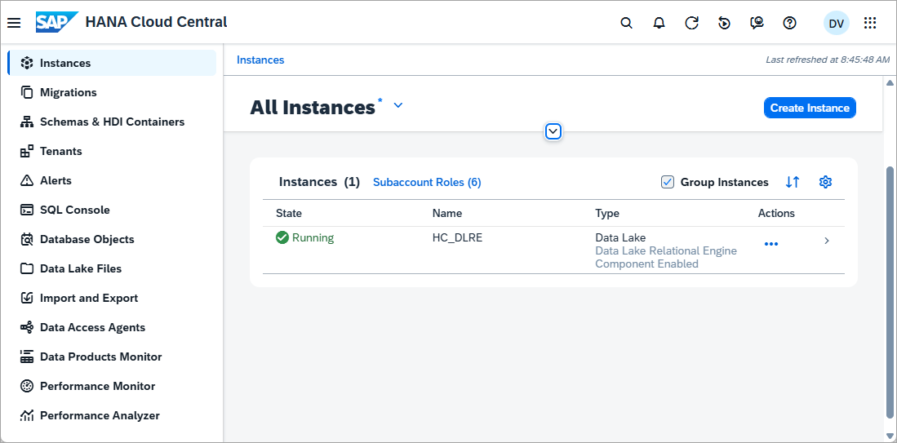

    The connection details can also be copied using **Copy SQL Endpoint** from the same actions menu and used to connect from a [client](group.hana-cloud-clients-data-lake).

3. Once connected, you can query the data lake Relational Engine using the SQL console.

   ```SQL
   SELECT CURRENT USER FROM DUMMY;
   SELECT * FROM SYS.SYSINFO;
   SELECT * FROM SA_DB_PROPERTIES() WHERE UPPER(PropName) LIKE '%NAME%';
   SELECT * FROM SYS.SYSOPTIONS WHERE UPPER("option") LIKE '%AUTO%' OR UPPER("option") LIKE '%COMM%' OR UPPER("option") LIKE '%ISOL%';
   ```

   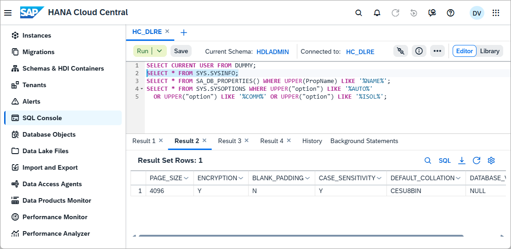

### Access a data lake Files instance (optional)

A [data lake Files instance](https://help.sap.com/docs/hana-cloud-data-lake/user-guide-for-data-lake-files/understanding-data-lake-files) provides object storage for unstructured files such as images or PDFs, as well as structured files such as CSV, Parquet, Delta table or Iceberg files. With [SQL on Files](https://help.sap.com/docs/hana-cloud-database/sap-hana-cloud-sap-hana-database-sql-on-files-guide/sap-hana-native-sql-on-files-overview), queries can be run directly against the data contained in those files.

> A data lake Files instance is not available in free tier instances of SAP HANA Cloud.

1. Once a data lake Files instance is provisioned, it appears in the **Instances** list in SAP HANA Cloud Central. Click the **three dots** in the **Actions** column next to the instance and select **Enable Single Sign-On (SSO) for Data Lake Files**. This allows you to authenticate using your BTP credentials when opening the instance.

    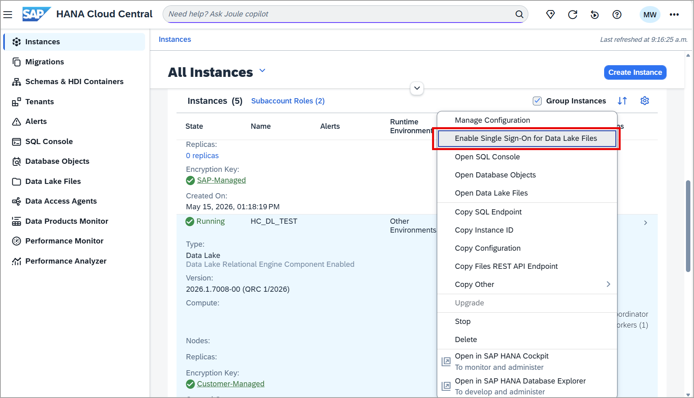

2. Once SSO is enabled, select **Open Data Lake Files** from the same actions menu, and select **Single Sign-On**. Files can be added, deleted, or viewed. When uploading files, if a path is specified that does not exist, the necessary folders will be created automatically.

3. To upload a file, select the **Upload** button and choose a file.

    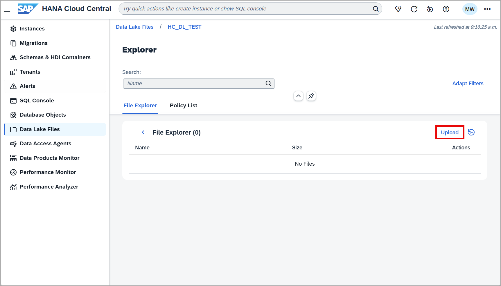

4. To query structured files stored in the data lake Files instance using SQL, see [Create Virtual Tables for SQL on Files](hana-dbx-sof).

    Additional details on configuring the data lake Files instance can be found at [Managing Data Lake Files](https://help.sap.com/docs/hana-cloud-data-lake/user-guide-for-data-lake-files/configuring-data-lake-files) and [Getting to know SAP HANA data lake Files](group.hana-data-lake-containers).

### Native HANA development with HDI (optional)

An SAP HANA Deployment Infrastructure (HDI) container can be created using SAP Business Application Studio. An HDI container can hold database objects such as tables, views, functions, stored procedures, and calculation views, and supports the use case where multiple developers work on the same data model deployed into the same database instance. Further details can be found at [SAP HANA Deployment Infrastructure in the Cloud](https://help.sap.com/docs/hana-cloud-database/sap-hana-cloud-sap-hana-database-deployment-infrastructure-hdi-reference/sap-hana-deployment-infrastructure-in-cloud).

For a walkthrough of setting up a project in SAP Business Application Studio and connecting it to your database, see [Create a Development Project in SAP Business Application Studio](hana-cloud-mission-trial-8).

Once set up, you may view the container in HANA Cloud Central within the HDI Containers app, and directly open the SQL Console.

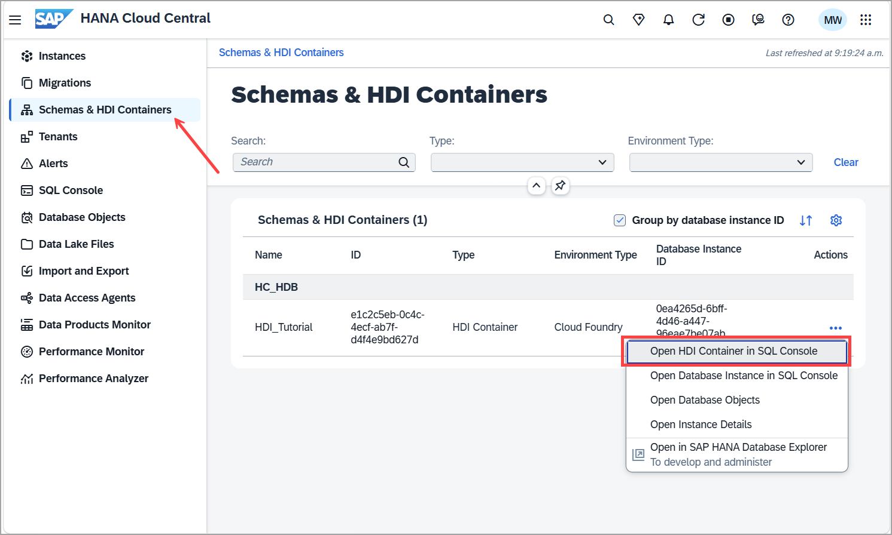

For a deeper look at collaborative SAP HANA native development with HDI, see [Get Started to Collaborate in SAP Business Application Studio](hana-cloud-collaborative-database-development-1).

### Knowledge check

Congratulations! You have learned how to access SAP HANA database, data lake Relational Engine, and data lake Files instances from SAP HANA Cloud Central, and how to open SQL consoles and browse catalog objects directly from the instances list.

In the next tutorial, you will create tables, views, functions, and procedures directly in the database.
