# Use the SAP HANA Database Explorer Extension in Visual Studio Code

<!-- description --> Explore the additional features provided by the SAP HANA Database Explorer extension in Visual Studio Code, including creating local connections, working with SQL files on the file system, viewing database object dependencies, and diagnosing issues with diagnostic files.

## Prerequisites

- You have [Visual Studio Code](https://code.visualstudio.com/) installed
- You have installed the [SAP HANA Database Explorer](https://marketplace.visualstudio.com/items?itemName=SAPSE.hana-database-explorer) extension from the Visual Studio Code Marketplace
- You have access to an SAP HANA Cloud instance (host, port, user name, and password)

## You will learn

- How to create a local connection to an SAP HANA Cloud instance
- How SQL can be saved to and loaded from the file system
- How to work with multiple SQL consoles side by side in Visual Studio Code
- How to view database object dependencies
- How to access and view diagnostic files

---

## Intro

The SAP HANA Database Explorer extension for Visual Studio Code provides the ability to run SQL queries and browse catalog objects directly in your development environment. This tutorial highlights features that are unique to or work particularly well in the Visual Studio Code context.

### Install the SAP HANA Database Explorer Extension

1. If needed, download [Visual Studio Code](https://code.visualstudio.com/download) for your computer.

2. Open Visual Studio Code and install the [SAP HANA Database Explorer](https://marketplace.visualstudio.com/items?itemName=SAPSE.hana-database-explorer) extension from the Visual Studio Marketplace by navigating to **Extensions** and searching for **SAP HANA Database Explorer**.

    > For information about the latest features and version updates, refer to the **CHANGELOG** tab on the Marketplace page.

    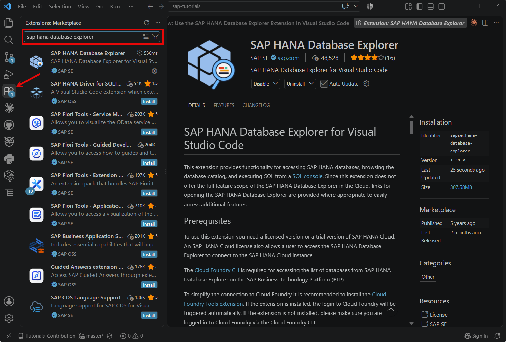

3. Open the extension from the new icon in the activity bar on the left. You will see the **Database List** panel which is where connections are managed.

    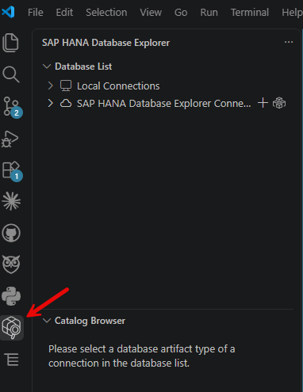

---

### Create a Local Connection

Local connections are added directly in Visual Studio Code by specifying the host, port, and credentials. Unlike the SAP HANA Database Explorer connections (which require logging in to Cloud Foundry), local connections work with any SAP HANA Cloud instance in any subaccount and do not require BTP or Cloud Foundry authentication.

> You can hide the SAP HANA Database Explorer Connections section if you prefer to work only with local connections. Navigate to **Manage** > **Settings**, search for **Show Database Explorer Connections**, and deselect the checkbox.
> 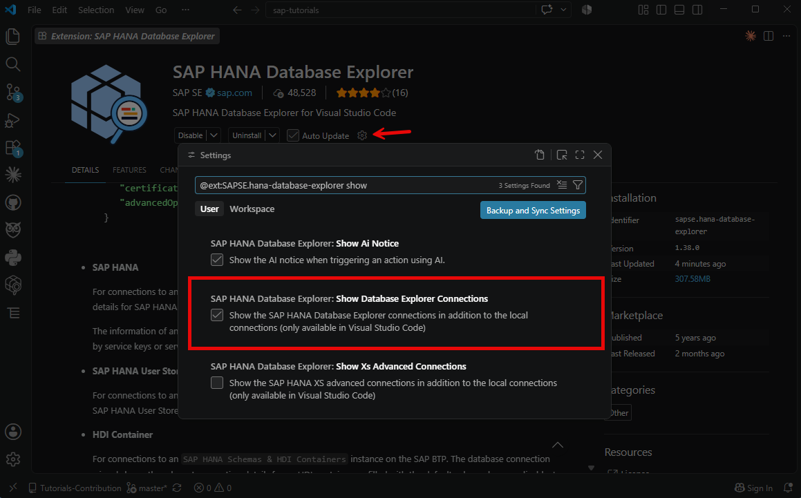

1. In the **Database List** section, navigate to **Local Connections** and click the **+** button to **Add SAP HANA Database**.

2. Select **SAP HANA Cloud** as the database type and enter values for **Host**, **Port**, **User**, and **Password**. You may also set a display name. This tutorial makes use of the `HOTELS` schema, in **Advanced Options** set `currentSchema=HOTELS;`

    > Enable the **Connect to database securely using TLS/SSL** checkbox to ensure the connection is secure. If you do not check **Save Password**, you will be prompted for your password each time the extension starts.

    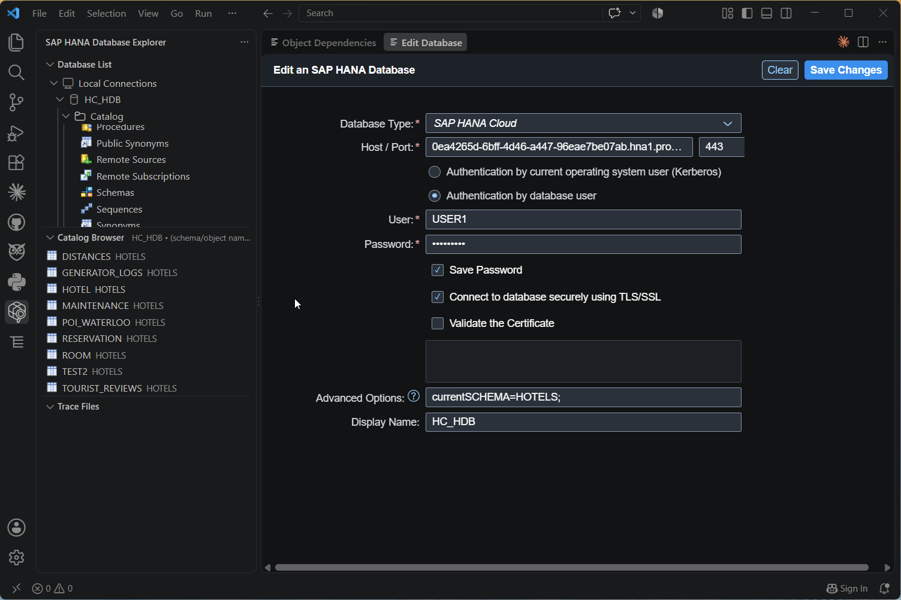

    A confirmation notification will appear in the bottom right corner if the database was added successfully. The connection will be listed under **Local Connections** in the Database List.

    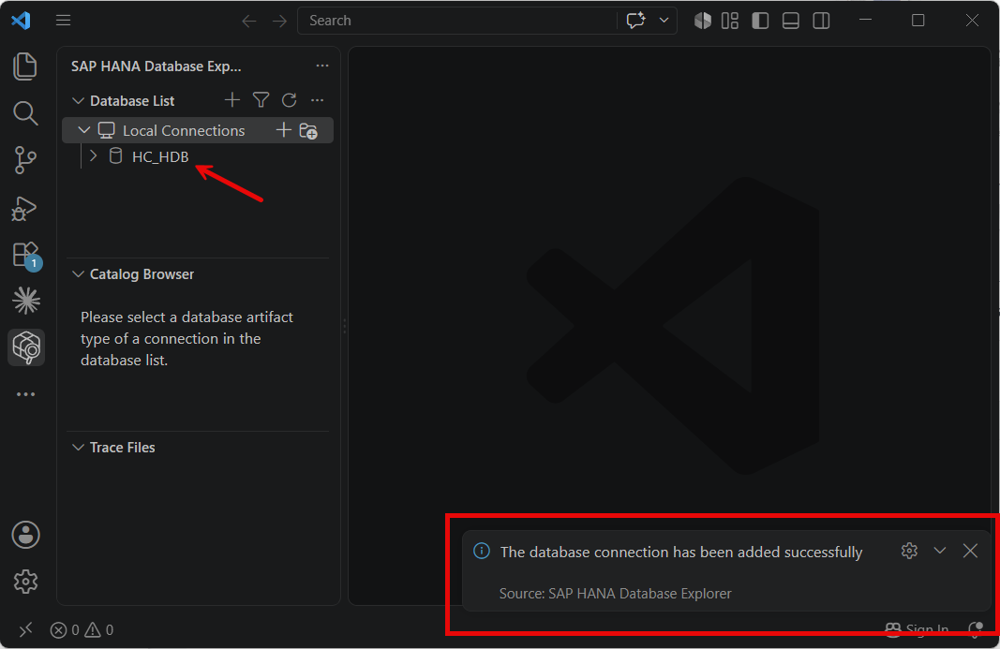

3. To edit a connection, right-click the connection name and select **Edit Database**.

4. To delete a connection, right-click the connection name and select **Remove Database** and confirm the deletion.

---

### View Database Object Dependencies

Database object dependencies can be visualized using a graphical dependency viewer. This can be opened in two ways:

- By right-clicking an object in the catalog browser and choosing **Open Dependency Viewer**

    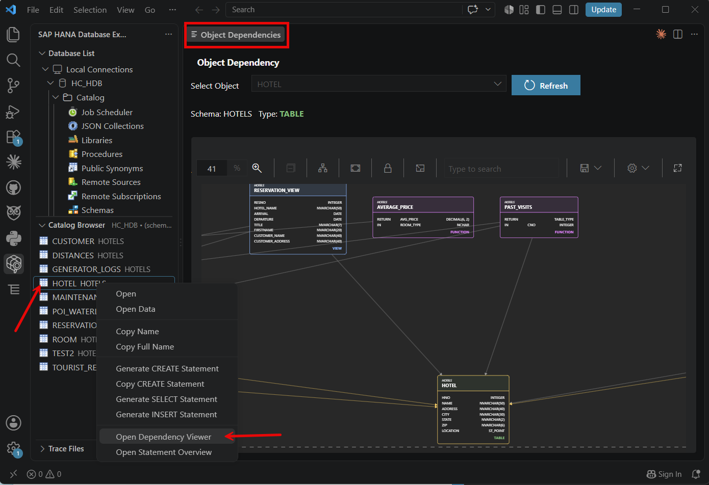

> You can specify the object types that you wish to exclude in the viewer by clicking on the settings button and selecting types to hide. 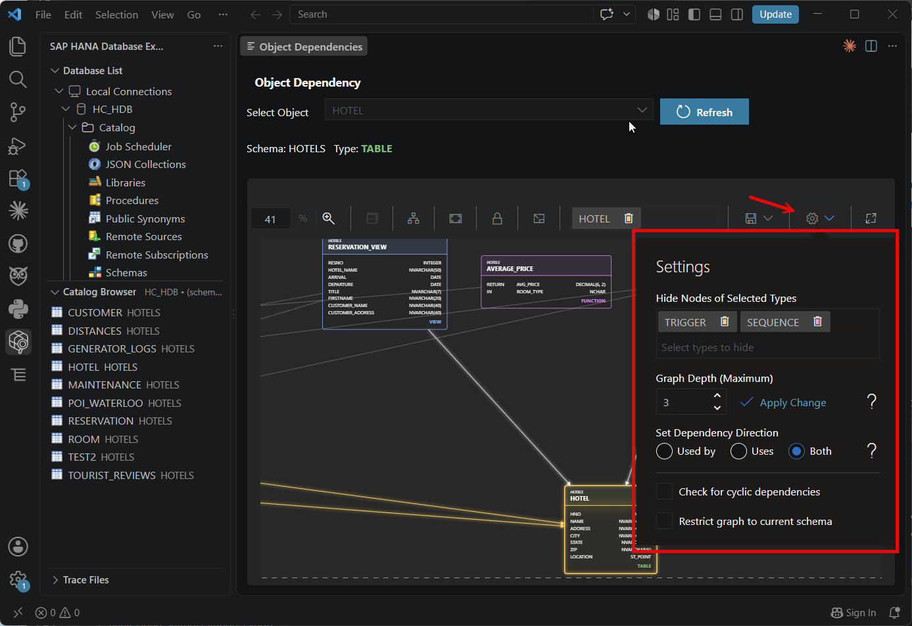

- By right-clicking a database connection

    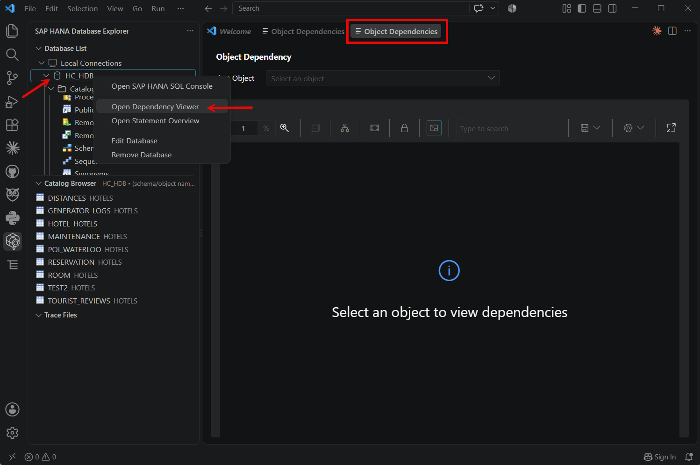

    When opened from an object, the viewer immediately shows that object's dependencies. When opened from a connection, use the **Select an object** dropdown to choose an object to visualize.

    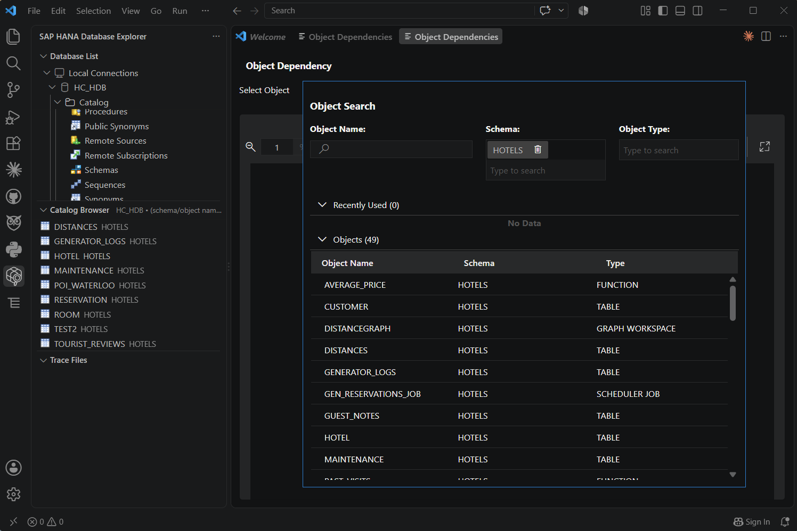

Dependencies can be explored in both directions, incoming and outgoing. Schemas are shown as boxes surrounding objects.

> Click an object to highlight it and its direct dependencies
    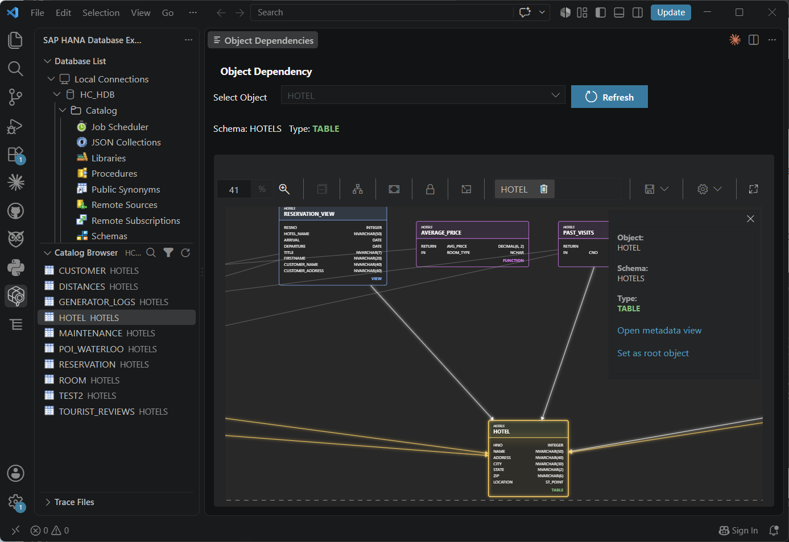

---

### Work with SQL Files on the File System

The Visual Studio Code extension allows SQL files to be loaded from and saved directly to the file system. This makes it straightforward to store SQL files in a Git repository and share common queries with teammates.

1. Open a SQL console by right-clicking your database and selecting **Open SAP HANA SQL Console** or clicking on the icon, and click the **folder** icon to import an existing `.sql` file from your file system.

    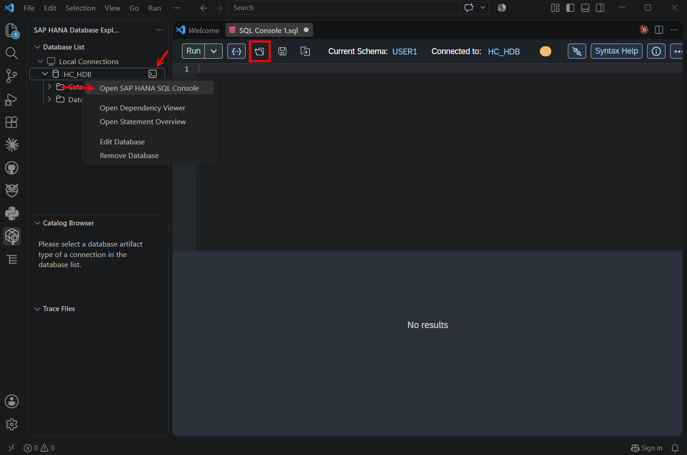

2. Edit the SQL as needed, then click the **save** icon to save your changes back to the file on disk.

    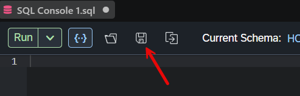

Because these files are stored on the file system, they can be committed to a Git repository and version-controlled alongside other project files.

---

### Use Multiple SQL Consoles in Visual Studio Code

Visual Studio Code's editor layout features work well with the SQL console, allowing you to view and work with multiple consoles at the same time.

1. Open a SQL console from a connection in the Database List. Then open a second SQL console.

2. Click the **split editor** icon in the top right of the editor, then drag one of the SQL console tabs into the new panel to display them side by side.

    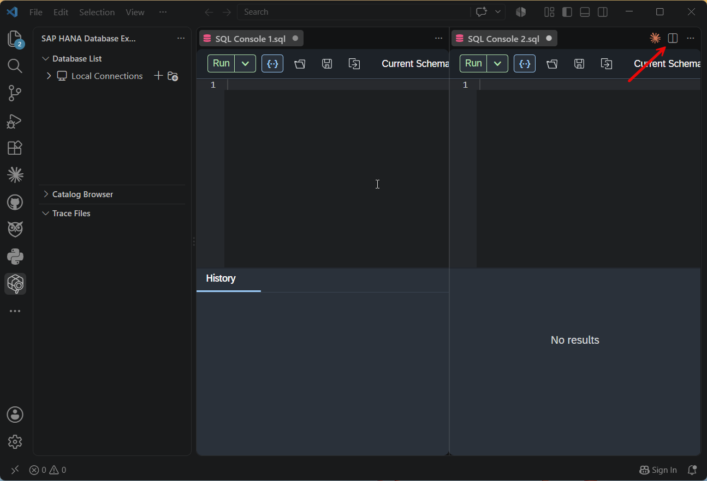

3. As an alternative to splitting within the same window, you can drag a SQL console tab completely outside of Visual Studio Code to open it in its own window.

    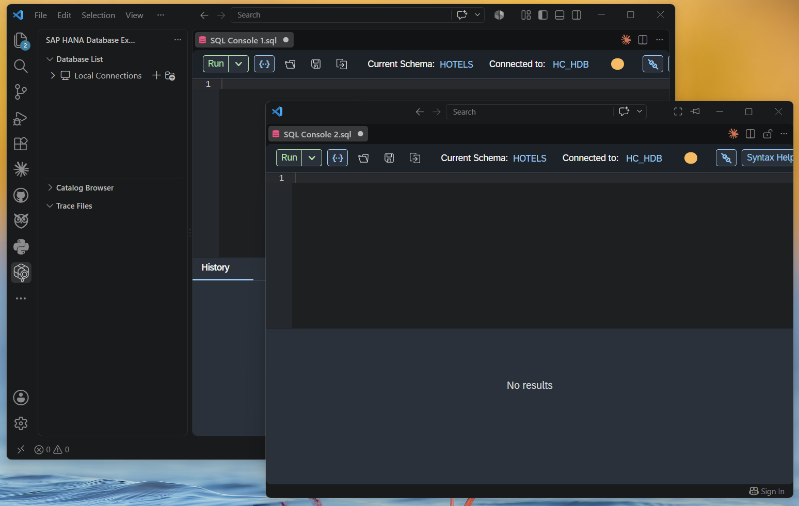

---

### View Diagnostic Files

Diagnostic files for an SAP HANA Cloud instance can be viewed directly within the extension.

1. In the **Database List**, expand your database connection.

2. Navigate to **Database Diagnostic Files**.

    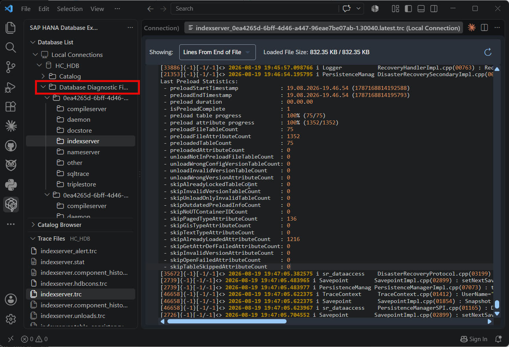

3. Select a trace file to open and view its contents.

    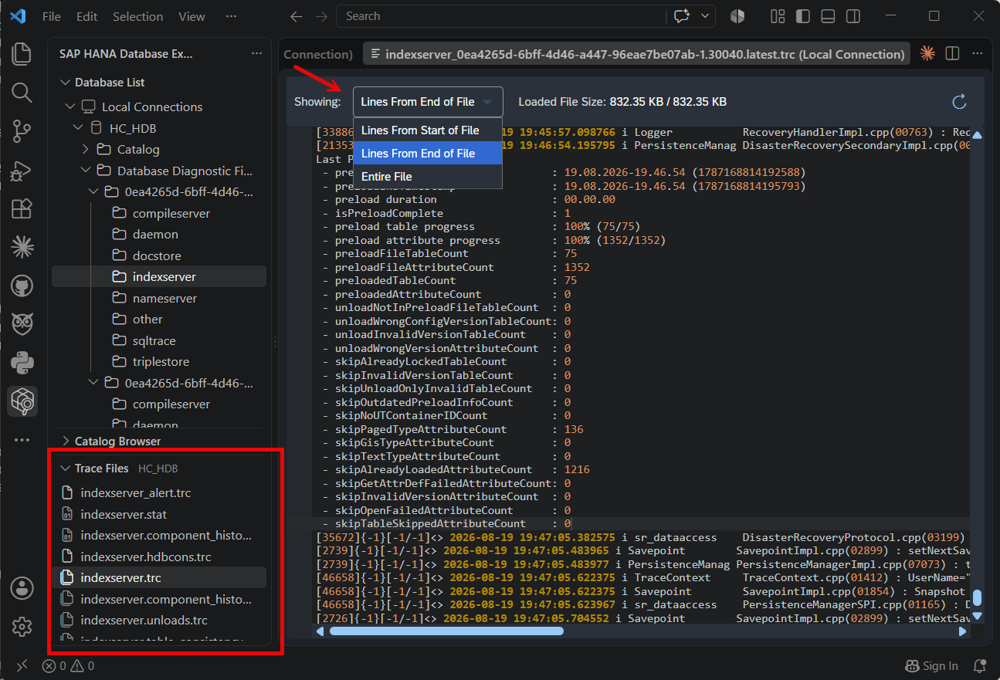

    > When opening a trace file, you can choose to view the entire file, a number of lines from the start of the file, or a number of lines from the end of the file.

---

### Use the SAP HANA SQL Statements Collection

The SAP HANA Database Explorer extension includes a built-in collection of SQL statements. This saves time searching for commonly needed SQL statements outside of Visual Studio Code.

1. In the activity bar, open the SAP HANA Database Explorer extension and locate the **SAP HANA SQL Statements Collection** view.

    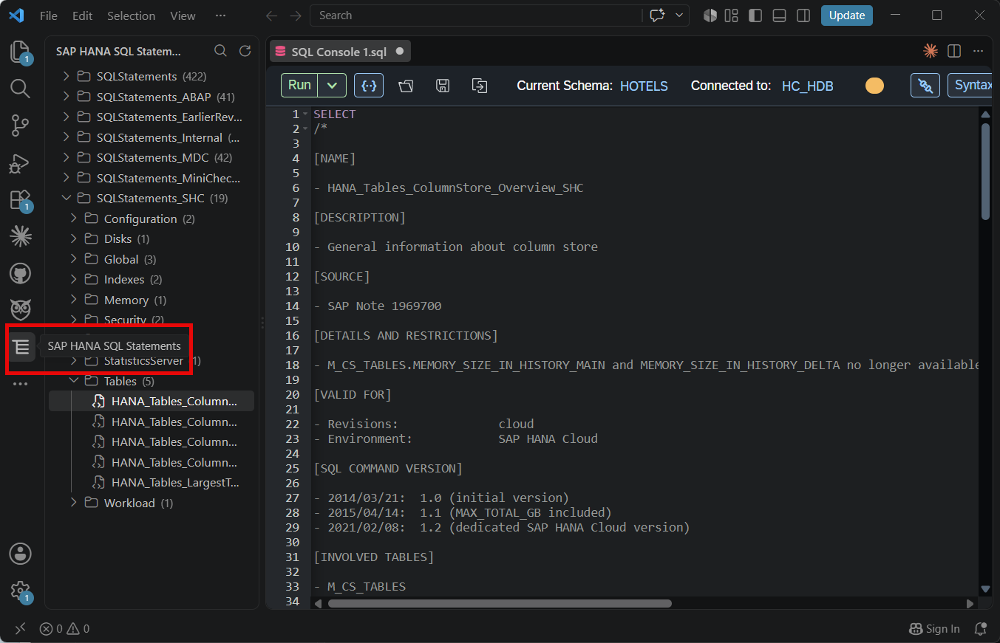

2. Browse the collection to find a statement. Click a statement to open it in a new SQL console.

---

### Knowledge check

Congratulations! You have now used the SAP HANA Database Explorer extension for Visual Studio Code and have become familiar with some of the features it provides.

[VALIDATE_7]