# Export and Import Data with SAP HANA Cloud Data Lake Files

<!-- description --> Use SAP HANA Cloud data lake Files as a storage target for exporting and importing data from both an SAP HANA Cloud, SAP HANA database and an SAP HANA Cloud, data lake Relational Engine database.

## Prerequisites

- A productive SAP HANA Cloud instance with a data lake (data lake Files is not available in the free tier service plan)

## You will learn

- How to perform an local export and import of data using CSV files
- How to configure a database credential for the data lake Files container
- How to export and import data and catalog objects between an SAP HANA Cloud, SAP HANA database and data lake Files
- How to export and import data between an SAP HANA Cloud, data lake Relational Engine database and data lake Files

## Intro

This tutorial demonstrates how data can be exported and imported using the import and export application in SAP HANA Cloud Central or through SQL statements.  It focuses on using SAP HANA Cloud data lake Files as a storage target for export and import operations.  Data lake Files provides a managed file store that is accessible from both the SAP HANA database and the data lake Relational Engine, making it a convenient intermediate storage layer for data movement between the two.

For a broader overview of all export and import options available, including local CSV downloads, GCS, Azure, and AWS S3, see the [Export and Import Data and Schema with SAP HANA Database Explorer](hana-dbx-export-import) tutorial.

---

### Export and import data

The following steps demonstrate how to export and import data from the MAINTENANCE table using the SQL console download option and the import data wizard in SAP HANA Cloud Central.  For use with larger amounts of data, it is recommended to use a cloud storage provider such as SAP HANA Cloud data lake Files which is used in subsequent steps of this tutorial.

1. Enter the SQL statement below in the SQL console.

   ```SQL
   SELECT * FROM HOTELS.MAINTENANCE;
   ```

    Click on the download toolbar item and choose **Download**.

    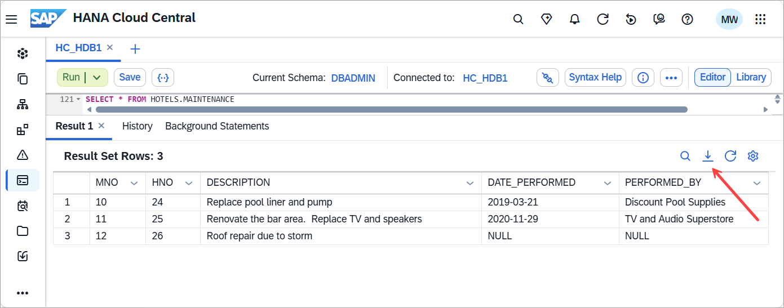

    >There is a setting that controls the number of results displayed which may need to be adjusted for tables with larger results.
    >
    > 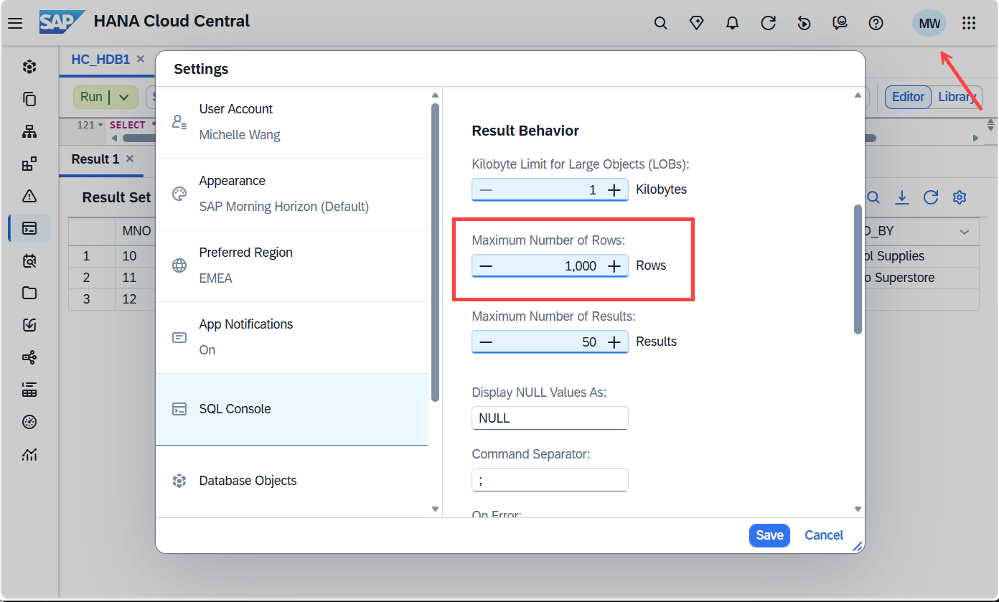

2. Enter the SQL statement below to delete the rows in the table. They will be added back in the next step.

   ```SQL
   DELETE FROM HOTELS.MAINTENANCE;
   ```

3. Navigate to the **Import and Export** app and choose **Import Data**.

4. In **Target Instance**, select your SAP HANA database instance.

5. In **Source Data**, select **Local Computer** and browse to the previously downloaded CSV file. 

    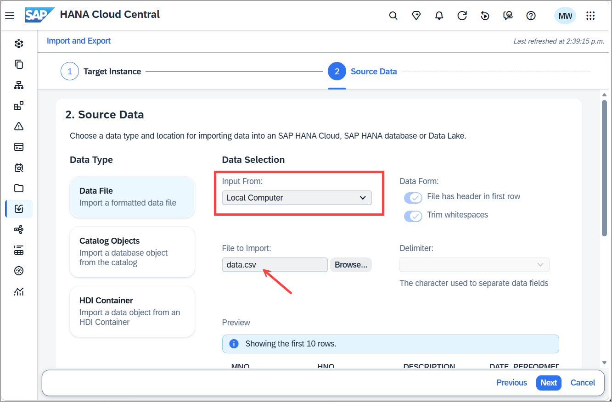

6. In **Target Table**, select **Use Existing Table**, choose the **HOTELS** schema, and select the **MAINTENANCE** table. Complete the remaining steps of the wizard and click **Import**.

    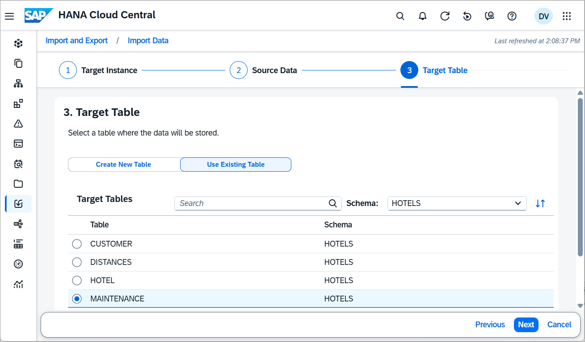

    After completing the wizard, the contents of the MAINTENANCE table should be the same as before the delete statement was executed. Run the following SQL statement to confirm.

   ```SQL
   SELECT * FROM HOTELS.MAINTENANCE;
   ```

    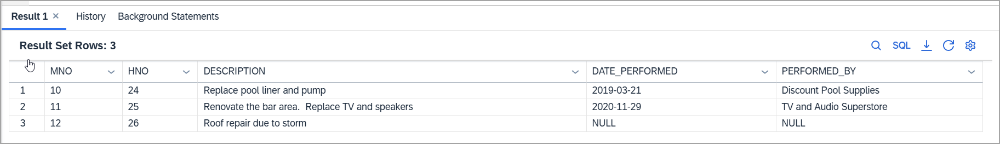

### Export and import data from an SAP HANA Cloud, SAP HANA database (optional)

The following steps walk through the process of exporting data to and importing data from data lake Files with a SAP HANA Cloud, SAP HANA database. This step requires a productive SAP HANA Cloud data lake instance as data lake files is currently not included in the free tier service plan.

SQL Statements used:

| Statement | Target | Format |
| --------- | ------ | ------ |
| [Export INTO](https://help.sap.com/docs/hana-cloud-database/sap-hana-cloud-sap-hana-database-sql-reference-guide/export-into-statement-data-import-export) | Data lake Files, S3, Azure, GCS | CSV, Parquet, JSON |
| [Import FROM](https://help.sap.com/docs/hana-cloud-database/sap-hana-cloud-sap-hana-database-sql-reference-guide/import-from-statement-data-import-export) | Data lake Files, S3, Azure, GCS | CSV, Parquet, JSON |

1. Complete steps 3 and 4 in the [Getting Started with Data Lake Files HDLFSCLI](data-lake-file-containers-hdlfscli) tutorial to configure the trust setup of the data lake Files container.

2. Create a database credential for the data lake Files container by running the following SQL in your database instance as DBADMIN.  Further details are described at [Importing and Exporting with SAP HANA Cloud Data Lake Files Storage](https://help.sap.com/docs/hana-cloud-database/sap-hana-cloud-sap-hana-database-administration-guide/importing-and-exporting-with-sap-hana-cloud-data-lake-files-storage).

   ```SQL
   SELECT * FROM PSES;
   CREATE PSE HTTPS;
   SELECT SUBJECT_COMMON_NAME, CERTIFICATE_ID, COMMENT, CERTIFICATE FROM CERTIFICATES;

   --cert from https://dl.cacerts.digicert.com/DigiCertGlobalRootCA.crt.pem and is the CA for HANA Cloud
   --https://knowledge.digicert.com/general-information/digicert-trusted-root-authority-certificates
   --https://cacerts.digicert.com/DigiCertTLSRSA4096RootG5.crt.pem
   CREATE CERTIFICATE FROM '-----BEGIN CERTIFICATE-----MIIDrzCCApegAwIBAgIQCDvgVpBCRrGhdWrJWZHHSjANBgkqhkiG9w0BAQUFADBh
   MQswCQYDVQQGEwJVUzEVMBMGA1UEChMMRGlnaUNlcnQgSW5jMRkwFwYDVQQLExB3
   d3cuZGlnaWNlcnQuY29tMSAwHgYDVQQDExdEaWdpQ2VydCBHbG9iYWwgUm9vdCBD
   QTAeFw0wNjExMTAwMDAwMDBaFw0zMTExMTAwMDAwMDBaMGExCzAJBgNVBAYTAlVT
   MRUwEwYDVQQKEwxEaWdpQ2VydCBJbmMxGTAXBgNVBAsTEHd3dy5kaWdpY2VydC5j
   b20xIDAeBgNVBAMTF0RpZ2lDZXJ0IEdsb2JhbCBSb290IENBMIIBIjANBgkqhkiG
   9w0BAQEFAAOCAQ8AMIIBCgKCAQEA4jvhEXLeqKTTo1eqUKKPC3eQyaKl7hLOllsB
   CSDMAZOnTjC3U/dDxGkAV53ijSLdhwZAAIEJzs4bg7/fzTtxRuLWZscFs3YnFo97
   nh6Vfe63SKMI2tavegw5BmV/Sl0fvBf4q77uKNd0f3p4mVmFaG5cIzJLv07A6Fpt
   43C/dxC//AH2hdmoRBBYMql1GNXRor5H4idq9Joz+EkIYIvUX7Q6hL+hqkpMfT7P
   T19sdl6gSzeRntwi5m3OFBqOasv+zbMUZBfHWymeMr/y7vrTC0LUq7dBMtoM1O/4
   gdW7jVg/tRvoSSiicNoxBN33shbyTApOB6jtSj1etX+jkMOvJwIDAQABo2MwYTAO
   BgNVHQ8BAf8EBAMCAYYwDwYDVR0TAQH/BAUwAwEB/zAdBgNVHQ4EFgQUA95QNVbR
   TLtm8KPiGxvDl7I90VUwHwYDVR0jBBgwFoAUA95QNVbRTLtm8KPiGxvDl7I90VUw
   DQYJKoZIhvcNAQEFBQADggEBAMucN6pIExIK+t1EnE9SsPTfrgT1eXkIoyQY/Esr
   hMAtudXH/vTBH1jLuG2cenTnmCmrEbXjcKChzUyImZOMkXDiqw8cvpOp/2PV5Adg
   06O/nVsJ8dWO41P0jmP6P6fbtGbfYmbW0W5BjfIttep3Sp+dWOIrWcBAI+0tKIJF
   PnlUkiaY4IBIqDfv8NZ5YBberOgOzW6sRBc4L0na4UU+Krk2U886UAb3LujEV0ls
   YSEY1QSteDwsOoBrp+uvFRTp2InBuThs4pFsiv9kuXclVzDAGySj4dzp30d8tbQk
   CAUw7C29C79Fv1C5qfPrmAESrciIxpg0X40KPMbp1ZWVbd4=-----END CERTIFICATE-----' COMMENT 'SAP_HC';
   --DROP CERTIFICATE <CERTIFICATE_ID>;
   ```

    Execute the following to retrieve the certificate ID and add it to the PSE.

   ```SQL
   SELECT CERTIFICATE_ID FROM CERTIFICATES WHERE COMMENT = 'SAP_HC';
   ```

    Add the certificate ID (ex: 123456) from the previous statement into `<CERTIFICATE_ID>`.

   ```SQL
   ALTER PSE HTTPS ADD CERTIFICATE <CERTIFICATE_ID>;
   --ALTER PSE HTTPS DROP CERTIFICATE <CERTIFICATE_ID>;
   ```

    Then set the own certificate using the client private key, client certificate, and Root Certification Authority of the client certificate in plain text. Make sure you have completed steps 3 and 4 in the [Getting Started with Data Lake Files HDLFSCLI](data-lake-file-containers-hdlfscli) tutorial to configure the trust setup of the data lake Files container.

   ```SQL
   ALTER PSE HTTPS SET OWN CERTIFICATE
   '<Contents from client.key>
   <Contents from client.crt>
   <Contents from ca.crt>';
   --GRANT REFERENCES ON PSE HTTPS TO USER1;
   SELECT * FROM PSE_CERTIFICATES;
   ```

3. Execute the following SQL to store a credential for the data lake Files container.

   ```SQL
   SELECT * FROM CREDENTIALS;
   CREATE CREDENTIAL FOR COMPONENT 'SAPHANAIMPORTEXPORT' PURPOSE 'DL_FILES' TYPE 'X509' PSE HTTPS;
   ```

4. Export the `MAINTENANCE` table into the data lake Files container using the export data wizard or the SQL statement below.

    Navigate to the **Import and Export** app and choose **Export Data**.

    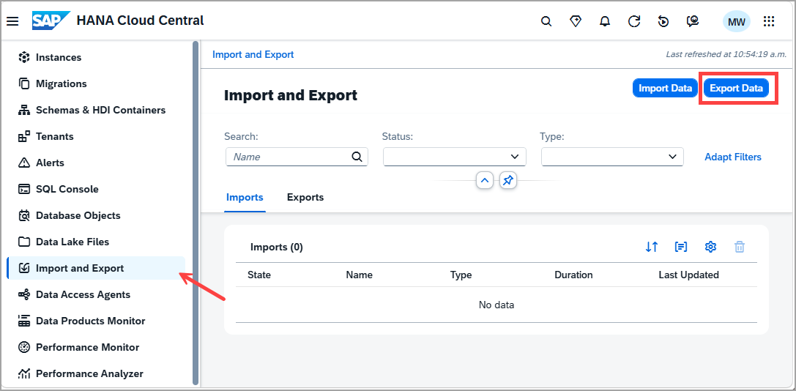

5. In **Source Instance**, select the SAP HANA database instance you want to export data from.

6. Navigate to **Source Data**, select **Data File** as the export type, choose **HOTELS** as the schema, and select the **MAINTENANCE** table as the database object.

    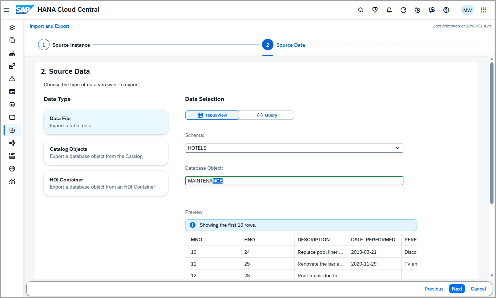

7. For **Target Instance**, select **Data Lake Files** as the export destination. Enter **DL_FILES** as the credential purpose and provide the REST API endpoint of your data lake Files instance. Enter the file path (e.g. `HOTELS/maintenance.csv`).

    > The REST API endpoint can be copied by clicking the three dots in the **Actions** column next to your data lake Files instance.
    >
    > 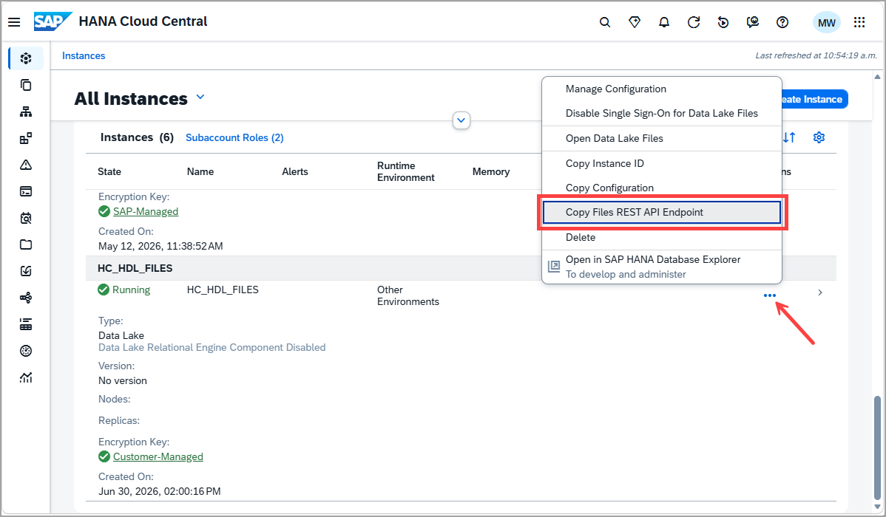

    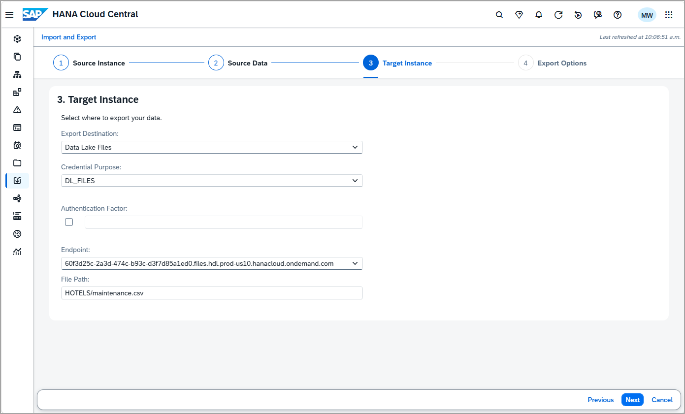

    Complete the remaining export options and click **Export**.

    >On the final screen of the wizard, you can select **View Generated SQL** to see the SQL statement that will be executed.
    >
    >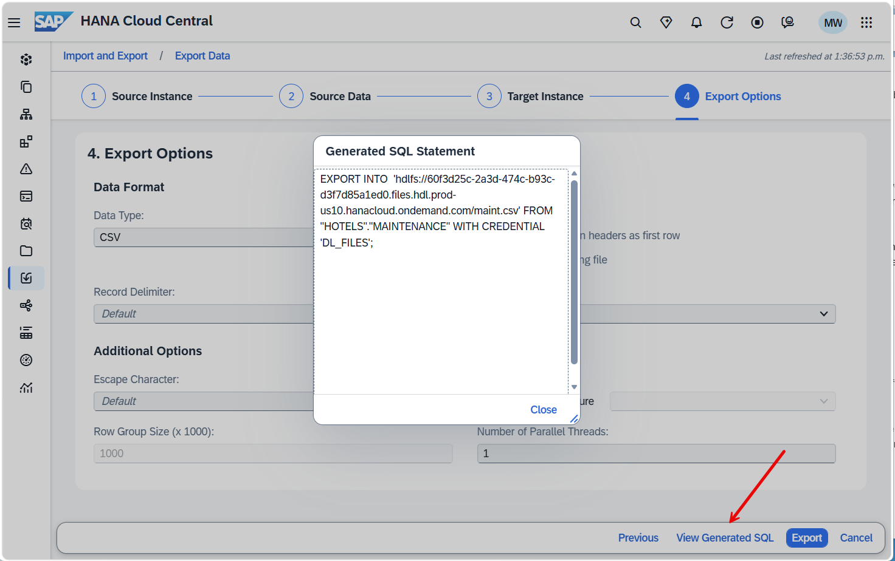

    Verify that the export was successful in the Import and Export app, under Exports.

    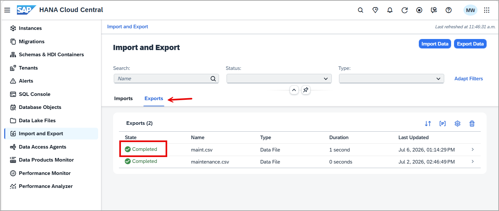

    You can also use the data lake Files app to view the contents of the exported file.

    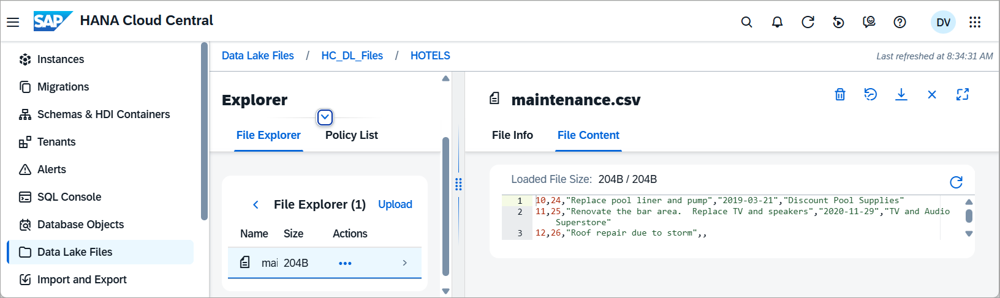

8. The wizard makes use of the `EXPORT INTO` statement. An example is shown below:

    ```SQL
    EXPORT INTO CSV FILE
        'hdlfs://1234-567-890-1234-56789.files.hdl.prod-us10.hanacloud.ondemand.com/HOTELS/maintenance.csv'
    FROM MAINTENANCE
    WITH
        CREDENTIAL 'DL_FILES'
        COLUMN LIST IN FIRST ROW;
    ```

9. In a SQL console connected to the SAP HANA database, delete the rows from the table. They will be restored in the next step.

   ```SQL
   DELETE FROM HOTELS.MAINTENANCE;
   ```

10. Import the data back using the import data wizard or the SQL statement below. Navigate to the **Import and Export** app and choose **Import Data**.

11. In **Target Instance**, select the SAP HANA database instance you want to import data into.

12. Under **Source Data**, select **Data Lake Files** as the source type. Enter **DL_FILES** as the database credential, provide the REST API endpoint of your data lake Files instance (which can be copied by clicking the **three dots** in the **Actions** column next to your data lake Files instance in SAP HANA Cloud Central), and enter the file path (e.g. `HOTELS/maintenance.csv`).

    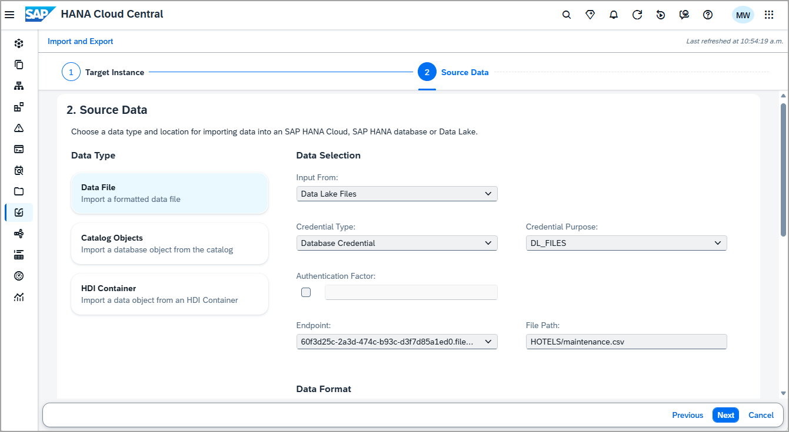

13. In **Target Table** select **Use Existing Table** and choose the **HOTELS** schema and **MAINTENANCE** table.

    Complete the remaining steps for table mapping and error handling and click **Import**.

14. The wizard makes use of the import from statement. An example is shown below:

   ```SQL
   IMPORT FROM CSV FILE 'hdlfs://1234-567-890-1234-56789.files.hdl.prod-us10.hanacloud.ondemand.com/HOTELS/maintenance.csv'
   INTO HOTELS.MAINTENANCE WITH
       CREDENTIAL 'DL_FILES'
       COLUMN LIST IN FIRST ROW;
   ```

   You can verify the success of the export or import operation by navigating to the **Import and Export** app and reviewing the job history and by executing a select against the table.

   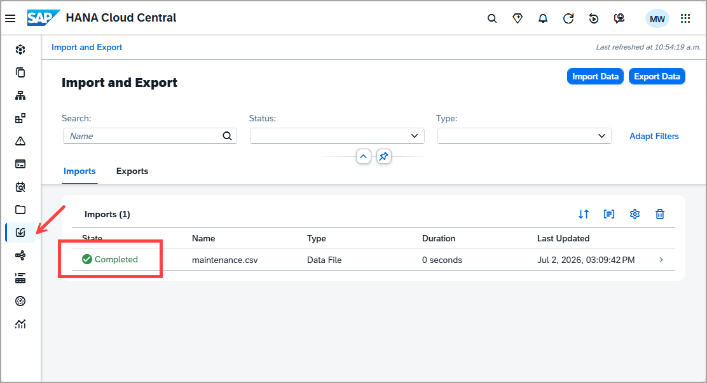

   ```SQL
   SELECT * FROM HOTELS.MAINTENANCE;
   ```

### Export and import data from an SAP HANA Cloud, data lake Relational Engine database (optional)

The following steps walk through exporting to and importing data from data lake Files using an SAP HANA Cloud, data lake Relational Engine database.  

SQL Statements used:

| Statement | Target | Format |
| --------- | ------ | ------ |
| [Unload](https://help.sap.com/docs/hana-cloud-data-lake/sql-reference-for-data-lake-relational-engine/unload-statement-for-data-lake-relational-engine) | Data lake Files, S3, Azure, GCS | Parquet, Text, Binary |
| [Load](https://help.sap.com/docs/hana-cloud-data-lake/sql-reference-for-data-lake-relational-engine/load-table-statement-for-data-lake-relational-engine) | Data lake Files, S3, Azure, GCS | Parquet, ASCII, Binary |

1. Create a database credential for the data lake Files container.  This step is required if you wish to export to a data lake Files instance that is not the one associated with the data lake Relational Engine.  Open a SQL Console connected to a data lake Relational Engine instance and execute the below SQL statements as HDLADMIN.

   ```SQL
   SELECT * FROM SYSPSE;
   CREATE PSE HTTPS;
   SELECT * FROM SYSCERTIFICATE;
   CREATE CERTIFICATE DIGICERTG5 FROM '-----BEGIN CERTIFICATE-----
   MIIFZjCCA06gAwIBAgIQCPm0eKj6ftpqMzeJ3nzPijANBgkqhkiG9w0BAQwFADBN
   MQswCQYDVQQGEwJVUzEXMBUGA1UEChMORGlnaUNlcnQsIEluYy4xJTAjBgNVBAMT
   HERpZ2lDZXJ0IFRMUyBSU0E0MDk2IFJvb3QgRzUwHhcNMjEwMTE1MDAwMDAwWhcN
   NDYwMTE0MjM1OTU5WjBNMQswCQYDVQQGEwJVUzEXMBUGA1UEChMORGlnaUNlcnQs
   IEluYy4xJTAjBgNVBAMTHERpZ2lDZXJ0IFRMUyBSU0E0MDk2IFJvb3QgRzUwggIi
   MA0GCSqGSIb3DQEBAQUAA4ICDwAwggIKAoICAQCz0PTJeRGd/fxmgefM1eS87IE+
   ajWOLrfn3q/5B03PMJ3qCQuZvWxX2hhKuHisOjmopkisLnLlvevxGs3npAOpPxG0
   2C+JFvuUAT27L/gTBaF4HI4o4EXgg/RZG5Wzrn4DReW+wkL+7vI8toUTmDKdFqgp
   wgscONyfMXdcvyej/Cestyu9dJsXLfKB2l2w4SMXPohKEiPQ6s+d3gMXsUJKoBZM
   pG2T6T867jp8nVid9E6P/DsjyG244gXazOvswzH016cpVIDPRFtMbzCe88zdH5RD
   nU1/cHAN1DrRN/BsnZvAFJNY781BOHW8EwOVfH/jXOnVDdXifBBiqmvwPXbzP6Po
   sMH976pXTayGpxi0KcEsDr9kvimM2AItzVwv8n/vFfQMFawKsPHTDU9qTXeXAaDx
   Zre3zu/O7Oyldcqs4+Fj97ihBMi8ez9dLRYiVu1ISf6nL3kwJZu6ay0/nTvEF+cd
   Lvvyz6b84xQslpghjLSR6Rlgg/IwKwZzUNWYOwbpx4oMYIwo+FKbbuH2TbsGJJvX
   KyY//SovcfXWJL5/MZ4PbeiPT02jP/816t9JXkGPhvnxd3lLG7SjXi/7RgLQZhNe
   XoVPzthwiHvOAbWWl9fNff2C+MIkwcoBOU+NosEUQB+cZtUMCUbW8tDRSHZWOkPL
   tgoRObqME2wGtZ7P6wIDAQABo0IwQDAdBgNVHQ4EFgQUUTMc7TZArxfTJc1paPKv
   TiM+s0EwDgYDVR0PAQH/BAQDAgGGMA8GA1UdEwEB/wQFMAMBAf8wDQYJKoZIhvcN
   AQEMBQADggIBAGCmr1tfV9qJ20tQqcQjNSH/0GEwhJG3PxDPJY7Jv0Y02cEhJhxw
   GXIeo8mH/qlDZJY6yFMECrZBu8RHANmfGBg7sg7zNOok992vIGCukihfNudd5N7H
   PNtQOa27PShNlnx2xlv0wdsUpasZYgcYQF+Xkdycx6u1UQ3maVNVzDl92sURVXLF
   O4uJ+DQtpBflF+aZfTCIITfNMBc9uPK8qHWgQ9w+iUuQrm0D4ByjoJYJu32jtyoQ
   REtGBzRj7TG5BO6jm5qu5jF49OokYTurWGT/u4cnYiWB39yhL/btp/96j1EuMPik
   AdKFOV8BmZZvWltwGUb+hmA+rYAQCd05JS9Yf7vSdPD3Rh9GOUrYU9DzLjtxpdRv
   /PNn5AeP3SYZ4Y1b+qOTEZvpyDrDVWiakuFSdjjo4bq9+0/V77PnSIMx8IIh47a+
   p6tv75/fTM8BuGJqIz3nCU2AG3swpMPdB380vqQmsvZB6Akd4yCYqjdP//fx4ilw
   MUc/dNAUFvohigLVigmUdy7yWSiLfFCSCmZ4OIN1xLVaqBHG5cGdZlXPU8Sv13WF
   qUITVuwhd4GTWgzqltlJyqEI8pc7bZsEGCREjnwB8twl2F6GmrE52/WRMmrRpnCK
   ovfepEWFJqgejF0pW8hL2JpqA15w8oVPbEtoL8pU9ozaMv7Da4M/OMZ+
   -----END CERTIFICATE-----';
   SELECT * FROM SYSCERTIFICATE WHERE cert_name = 'DIGICERTG5';
   ALTER PSE HTTPS ADD CERTIFICATE <object_id>;
   ```

   ```SQL
   SELECT * FROM SYSPSECERTIFICATE;
   ALTER PSE HTTPS SET OWN CERTIFICATE
   '<Contents from client.key>
   <Contents from client.crt>
   <Contents from ca.crt>';
   ----ALTER PSE HTTPS UNSET OWN CERTIFICATE;
   ```

   ```SQL
   SELECT * FROM SYSCREDENTIAL;
   CREATE CREDENTIAL FOR COMPONENT 'SAPHDLRELOADUNLOAD' PURPOSE 'DL_FILES' TYPE 'X509' PSE HTTPS;
   --DROP CREDENTIAL FOR COMPONENT 'SAPHDLRELOADUNLOAD' PURPOSE 'DL_FILES' TYPE 'X509';
   ```

    Additional details are described at [CREATE CERTIFICATE](https://help.sap.com/docs/hana-cloud-data-lake/sql-reference-for-data-lake-relational-engine/create-certificate-statement-for-data-lake-relational-engine).

2. The HOTELS schema and MAINTENANCE table are not automatically shared with the Relational Engine. If the schema does not already exist, create it manually in the Relational Engine SQL console.

    ```SQL
    CREATE SCHEMA HOTELS;
    CREATE TABLE HOTELS.MAINTENANCE (
        MNO INTEGER NOT NULL,
        HNO INTEGER NOT NULL,
        DESCRIPTION VARCHAR(100),
        DATE_PERFORMED DATE,
        PERFORMED_BY VARCHAR(40)
    );

    INSERT INTO HOTELS.MAINTENANCE VALUES(10, 24, 'Replace pool liner and pump', '2019-03-21', 'Discount Pool Supplies');
    INSERT INTO HOTELS.MAINTENANCE VALUES(11, 25, 'Renovate the bar area.  Replace TV and speakers', '2020-11-29', 'TV and Audio Superstore');
    INSERT INTO HOTELS.MAINTENANCE VALUES(12, 26, 'Roof repair due to storm', null, null);
    ```

3. Export (unload) the data from the `MAINTENANCE` table to data lake Files using the export data wizard or the SQL statement below.

    Navigate to the **Import and Export** app and choose **Export Data**.

4. In **Source Instance**, select your data lake Relational Engine instance.

5. In **Source Data**, choose **HOTELS** as the schema, and select the **MAINTENANCE** table as the database object.

6. In **Target Instance**, select **Data Lake Files** as the export destination. Enter **DL_FILES** as the credential purpose, choose the REST API endpoint of your data lake Files instance, and enter the file path (e.g. `maint.csv`).

    Complete the remaining export options and click **Export**.
  
    >Export or unload the data from the MAINTENANCE table to a data lake Files instance using the SQL statement. The below example targets the data lake Files instance that is attached to the data lake Relational Engine.

    ```SQL
    UNLOAD SELECT * FROM HOTELS.MAINTENANCE
    INTO FILE 'hdlfs:///maint.csv'
    NULL FORMAT EMPTY
    ```

    The below example targets a different data lake Files instance.

    ```SQL
    UNLOAD SELECT * FROM HOTELS.MAINTENANCE
    INTO FILE 'hdlfs://18b4be74-a4f1-40a0-a357-60155aee5f30/maint.csv'
    CONNECTION_STRING 'ENDPOINT=https://18b4be74-a4f1-40a0-a357-60155aee5f30.files.hdl.prod-ca10.hanacloud.ondemand.com'
    WITH CREDENTIAL 'DL_FILES'
    NULL FORMAT EMPTY;
    ```

7. Import (load) the data back into the `MAINTENANCE` table using the import data wizard or the SQL statement below.

    >Remember to delete the data before testing the import by running DELETE FROM HOTELS.MAINTENANCE. 

8. Navigate to the **Import and Export** app and choose **Import Data**.

9. In **Target Instance**, select your data lake Relational Engine instance.

10. In **Source Data**, select **Data Lake Files** as the source type. Enter **DL_FILES** as the database credential, provide the REST API endpoint of your data lake Files instance, and enter the file path (e.g. `maint.csv`).

11. In **Target Table**, use the existing table in schema **HOTELS** and search for **MAINTENANCE**.

    Complete the remaining steps for column mapping and error handling and click **Import**.

    >The wizard makes use of the load statement. The below example targets the data lake Files instance that is attached to the data lake Relational Engine.

   ```SQL
   DELETE FROM HOTELS.MAINTENANCE;
   LOAD TABLE HOTELS.MAINTENANCE (MNO, HNO, DESCRIPTION, DATE_PERFORMED, PERFORMED_BY) FROM 'hdlfs:///maint.csv'
   ESCAPES OFF;
   SELECT * FROM HOTELS.MAINTENANCE;
   ```

   The below example targets a different data lake Files instance.

   ```SQL
   DELETE FROM HOTELS.MAINTENANCE;
   LOAD TABLE HOTELS.MAINTENANCE (MNO, HNO, DESCRIPTION, DATE_PERFORMED, PERFORMED_BY) FROM 'hdlfs://18b4be74-a4f1-40a0-a357-60155aee5f30/maint.csv'
   CONNECTION_STRING 'ENDPOINT=https://18b4be74-a4f1-40a0-a357-60155aee5f30.files.hdl.prod-ca10.hanacloud.ondemand.com'
   WITH CREDENTIAL 'DL_FILES' 
   ESCAPES OFF;
   SELECT * FROM HOTELS.MAINTENANCE;
   ```

   Run the following SQL statement to verify the import succeeded.

   ```SQL
   SELECT * FROM HOTELS.MAINTENANCE
   ```

### Export and import schema or catalog objects (optional)

The export catalog wizard and export statement can include multiple objects in the export or import such as tables, views, functions, and procedures.  The operation can also recreated the schema of the objects.

The following tables list the different options available in SAP HANA Cloud Central to export and import catalog objects.

SQL Statements used:

| Statement | Target | Format |
| --------- | ------ | ------ |
| [Export](https://help.sap.com/docs/hana-cloud-database/sap-hana-cloud-sap-hana-database-sql-reference-guide/export-statement-data-import-export) | Data lake Files, S3, Azure, GCS | Binary, CSV, Parquet |
| [Import](https://help.sap.com/docs/hana-cloud-database/sap-hana-cloud-sap-hana-database-sql-reference-guide/import-statement-data-import-export) | Data lake Files, S3, Azure, GCS | Binary, CSV, Parquet |

To try these out, follow the steps below.

1. Navigate to the **Import and Export** app and connect to the desired SAP HANA instance you want to export data from. Under **Source Data**, select **Database Objects**. Navigate to the **Add Database Objects** button and search for the schema **HOTELS**. Notice how you can select multiple object types.  In this example we are exporting all of the objects that are part of the HOTELS schema.  Select **Add to List**.

    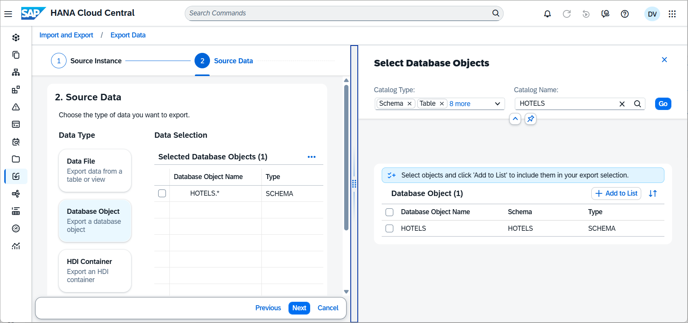

    Choose **Local Computer** for the export location and provide a name for the archive. 

    ![Target settings]](target.png)

    Next, select an export format such as CSV, and click **Export**.

    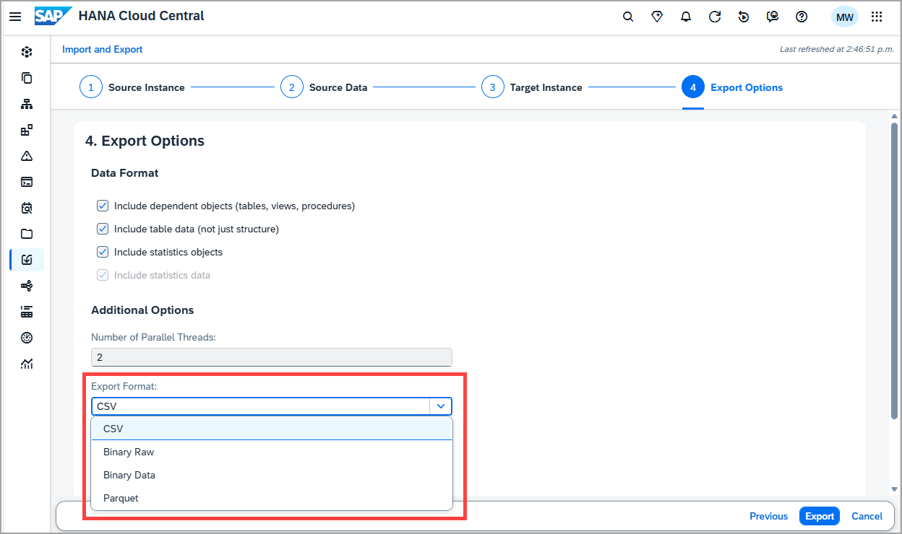

    > **Binary Raw** is the binary format for SAP HANA Cloud and **Binary Data** is the format option for SAP HANA on-premise.

2. The archive file contains the SQL to recreate the table as well as the data of the table.

3. Enter the SQL statement below to drop all of the objects in the schema.  They will then be re-added in the next sub-step.

   ```SQL
   DROP SCHEMA HOTELS CASCADE;
   ```

4. Navigate to the **Import and Export** app and choose **Import Database Objects**. Browse to the previously downloaded archive file and complete the wizard.

    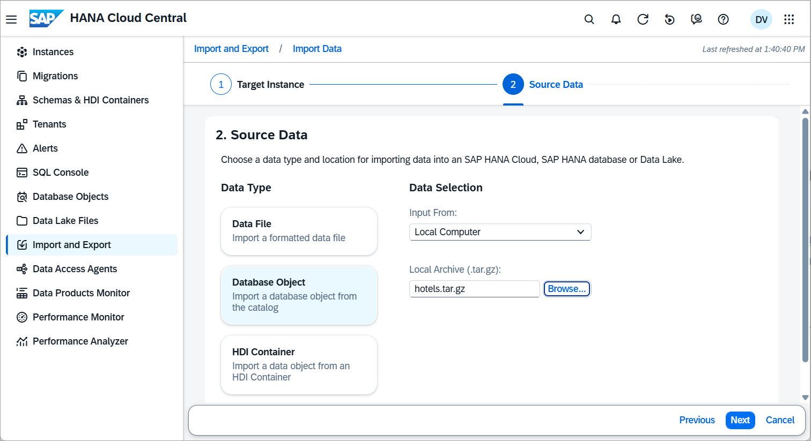

    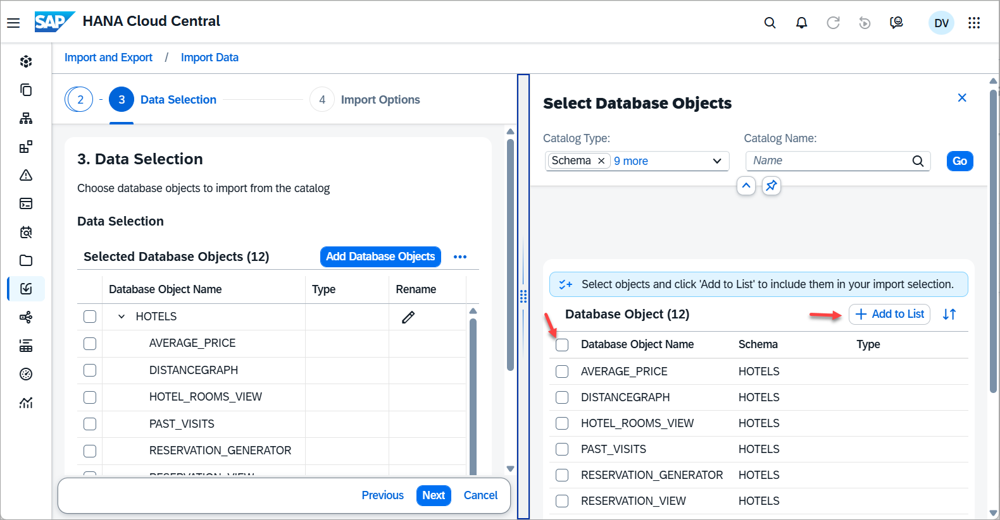

    The contents of the HOTELS schema should now be the same as before the drop statement was executed.

   ```SQL
   SELECT * FROM HOTELS.CUSTOMER;
   SELECT * FROM HOTELS.HOTEL;
   ```

### Knowledge check

Congratulations! You have exported and imported data using SAP HANA Cloud data lake Files from both an SAP HANA Cloud, SAP HANA database and a data lake Relational Engine database, and exported and imported catalog objects using SAP HANA Cloud Central.

---
