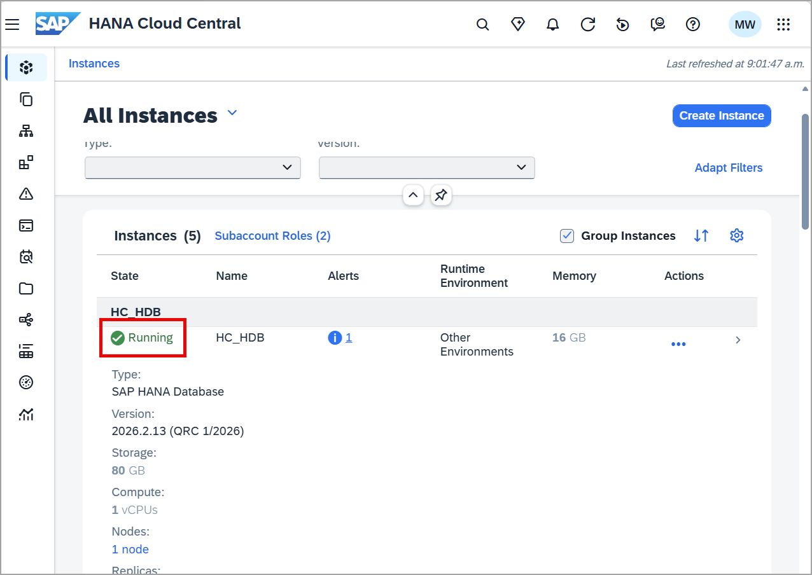

# SAP HANA Cloud Overview and Instance Provisioning

<!-- description --> Learn about SAP HANA Cloud, provision an SAP HANA Cloud database instance, and get familiar with SAP HANA Cloud Central.

## Prerequisites

- You have access to an SAP BTP trial account or a productive account that has SAP HANA Cloud entitlements

## You will learn

- About the features provided by SAP HANA Cloud
- What tools are covered in this tutorial group
- How to get started with SAP HANA Cloud free tier
- How to provision an SAP HANA Cloud, SAP HANA database instance

---

## Intro

> Access help from the SAP community or provide feedback on this tutorial by navigating to the "Feedback" link located on the top right of this page.

### SAP HANA Cloud Overview

[SAP HANA Cloud](https://www.sap.com/products/data-cloud/hana.html) lets you use advanced data processing capabilities of relational, JSON, text, spatial, predictive, vector, knowledge graph, and more, to pull insights from all types of data.

By combining in-memory storage with columnar store, data operations are performed faster than in a traditional database with a disk-based storage. SAP HANA is also `translytical`, which means that developers can perform both transactional and analytical operations from the same structure, in real time, and without creating additional copies of the data such as materialized views.

The following are some related documentation links for SAP HANA Cloud.

 
|  :------------- | :------------- |
|  Version   | Notes |
|  [SAP HANA Cloud](https://help.sap.com/docs/hana-cloud)   | Product documentation page |
|  [SAP HANA Cloud Administration Guide](https://help.sap.com/docs/hana-cloud/sap-hana-cloud-administration-guide/sap-hana-cloud-administration-guide) | Administration tasks performed in SAP HANA Cloud Central |
|  [Understand How the SAP HANA Cloud Free Tier Service can be Used in a SAP BTP Trial or Productive Account](hana-cloud-mission-trial-1)| Overview of SAP HANA Cloud free tier service plan and the SAP BTP account options available |

### What this tutorial group covers

The tutorials in this group focus on the following apps in SAP HANA Cloud Central:

- **SQL Console** — open a SQL console and create a sample schema with tables, views, functions, and stored procedures
- **Database Objects app** — browse and explore the catalog objects created in the SQL console
- **Data lake Files app** — work with a data lake Files instance alongside your SAP HANA database
- **Import and Export** — move data in and out of your database

For a broader look at provisioning and administering SAP HANA Cloud, see the [Provisioning and Administering Databases in SAP HANA Cloud](https://learning.sap.com/courses/provisioning-and-administering-databases-in-sap-hana-cloud) course or the [Becoming a Certified Database Administrator – SAP HANA](https://learning.sap.com/learning-journeys/becoming-a-certified-database-administrator-sap-hana) learning journey on SAP Learning.

### SAP HANA Cloud Free Tier

To complete the tutorials in this group, an SAP HANA Cloud instance is needed. Complete the steps in [Start Using SAP HANA Cloud Free Tier Service in SAP BTP Cockpit](hana-cloud-mission-trial-2) to set up your SAP BTP account, configure entitlements and subscriptions, and assign the SAP HANA Cloud Administrator role collection. Once complete, return here to provision your first instance.

The SAP BTP Trial is available on the US10 and AP21 landscapes, and includes the SAP HANA Cloud free tier service. If a free tier instance is used in a productive subaccount, a seamless transition from a free tier to a paid plan is available.

> The SAP HANA Cloud Basic Trial provides a database user and password that has access to a specific schema free for 30 days. The provided database user can be used to create database objects within the provided schema but cannot create new schemas or users. To get started, click on **Try Now** on the Discover SAP HANA Cloud section of the trial page of [SAP HANA Cloud](https://www.sap.com/products/technology-platform/hana/trial.html).  The SAP HANA Cloud Basic Trial does not provide access to SAP HANA Cloud Central or the SQL Console in SAP HANA Cloud Central and for that reason, it is not recommended to be used for this tutorial group.

### Provision and manage an instance

The full provisioning walkthrough — including how to open SAP HANA Cloud Central, run the provisioning wizard, configure size and advanced settings, optionally enable a managed data lake, and start and stop instances — is covered in:

- [Provision an Instance of SAP HANA Cloud, SAP HANA Database](hana-cloud-mission-trial-3)

Complete that tutorial and return here once your instance shows a **Running** status in SAP HANA Cloud Central.

> SAP HANA Cloud free tier instances are shut down overnight (i.e. 10:00 PM based on the location where your instance was provisioned) and will need to be restarted before working with them the next day. The tutorial group [Automating SAP HANA Cloud Tasks](https://developers.sap.com/group.sap-hana-cloud-automating.html) provides some examples of using tools such as the BTP CLI or the SAP Automation Pilot to help with repetitive tasks such as starting and stopping instances.

### Knowledge check

Congratulations! You now have an overview of SAP HANA Cloud, understand what this tutorial group covers, and have a running SAP HANA Cloud instance. Continue to the next tutorial to start accessing databases and working with the SQL console.
