# Access Remote Sources with SAP HANA Cloud Central

<!-- description --> Use SAP HANA federation capabilities to query data from other SAP HANA and SAP HANA Cloud, data lake Relational Engine databases using SAP HANA smart data access (SDA).

## Prerequisites

- You have completed the first 3 tutorials in this group
- An SAP HANA database, an SAP HANA Cloud data lake instance, and an additional SAP HANA database to connect to

## You will learn

- How to use SAP HANA smart data access (SDA) to create connections (remote sources) to other databases
- How to create virtual tables from a remote source

## Intro

Remote sources enable connections to other databases. Virtual tables use a remote source to create a local table that points to data stored in another database.  Federated queries make use of virtual and non virtual tables.

To illustrate these concepts, a table will be created in the remote database that contains fictitious review data from some of the top tourist sites near a given hotel.  There is likely a correlation between hotel stays and the desire for customers to visit nearby tourist attractions or restaurants.

For additional details on SAP HANA smart data access (SDA) and SAP HANA Smart Data Integration (SDI), consult [Connecting SAP HANA Cloud to Remote Data Sources](https://help.sap.com/docs/hana-cloud/sap-hana-cloud-getting-started-guide/connecting-sap-hana-cloud-sap-hana-database-to-remote-data-sources) and [Data Access with SAP HANA Cloud](https://help.sap.com/docs/hana-cloud-database/sap-hana-cloud-sap-hana-database-data-access-guide/data-access-in-sap-hana-cloud-sap-hana-database).

>This tutorial requires more than one database to complete.  It is not necessary to complete this tutorial to continue to the next tutorial in this group.  

>The SAP HANA Cloud free tier is limited to creating one SAP HANA database and one data lake instance.

The example in step 1 demonstrates a connection from one SAP HANA Cloud, SAP HANA database to another. The example in step 2 demonstrates a connection from an SAP HANA Cloud, SAP HANA database to an SAP HANA Cloud, data lake Relational Engine. The example in step 3 demonstrates connecting from SAP HANA Cloud, data lake Relational Engine to an SAP HANA Cloud, SAP HANA database. The example in step 4 demonstrates connecting from one SAP HANA Cloud, data lake Relational Engine to another.

---

### Connect from one SAP HANA Cloud, SAP HANA database to another

Two SAP HANA Cloud, SAP HANA database instances can be connected so that one can query data from the other in real time using virtual tables, without copying or moving data.

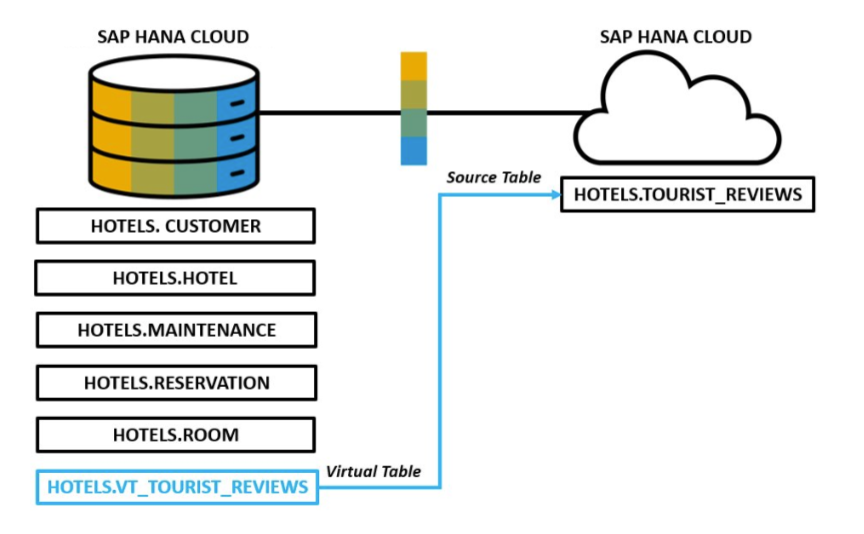

1. In SAP HANA Cloud Central, select an SAP HANA database (HDB) instance  (the one you want to connect *to*), and execute the following SQL statements to create the `tourist_reviews` table.

    > If needed, first create a schema and user.

   ```SQL
   CREATE SCHEMA HOTELS;
   CREATE USER USER1 PASSWORD Password1 no force_first_password_change;
   GRANT ALL PRIVILEGES ON SCHEMA HOTELS TO USER1;
   ```

   ```SQL
   SET SCHEMA HOTELS;
   CREATE COLUMN TABLE TOURIST_REVIEWS(
       review_id INTEGER GENERATED BY DEFAULT AS IDENTITY PRIMARY KEY,
       review_date DATE NOT NULL,
       destination_id INTEGER,
       destination_rating INTEGER,
       review VARCHAR(500) NOT NULL
   );

   INSERT INTO TOURIST_REVIEWS(review_date, destination_id, destination_rating, review) VALUES('2019-03-14', 1, 5, 'We had a great day swimming at the beach and exploring the beach front shops.  We will for sure be back next summer.');
   INSERT INTO TOURIST_REVIEWS(review_date, destination_id, destination_rating, review) VALUES('2019-02-01', 1, 4, 'We had an enjoyable meal.  The service and food was outstanding.  Would have liked to have slightly larger portions');
   ```

2. The result can be seen below.

   ```SQL
   SELECT * FROM TOURIST_REVIEWS;
   ```

    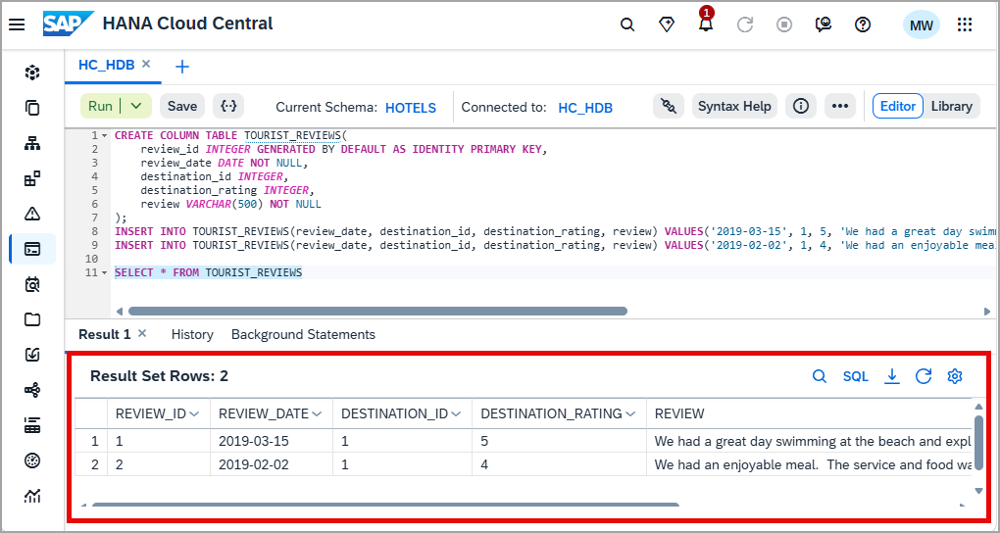

3. To create a remote source to SAP HANA Cloud, open another SAP HANA database.

    In the SQL console, enter the SQL statement below. Replace `<Target HDB Host>` with the host copied from the SQL endpoint.

   ```SQL
   CREATE REMOTE SOURCE REMOTE_HC ADAPTER "hanaodbc" CONFIGURATION 'ServerNode=<Target HDB Host>:443;driver=libodbcHDB.so;dml_mode=readwrite;sslTrustStore="-----BEGIN CERTIFICATE-----MIIDrzCCApegAwIBAgIQCDvgVpBCRrGhdWrJWZHHSjANBgkqhkiG9w0BAQUFADBhMQswCQYDVQQGEwJVUzEVMBMGA1UEChMMRGlnaUNlcnQgSW5jMRkwFwYDVQQLExB3d3cuZGlnaWNlcnQuY29tMSAwHgYDVQQDExdEaWdpQ2VydCBHbG9iYWwgUm9vdCBDQTAeFw0wNjExMTAwMDAwMDBaFw0zMTExMTAwMDAwMDBaMGExCzAJBgNVBAYTAlVTMRUwEwYDVQQKEwxEaWdpQ2VydCBJbmMxGTAXBgNVBAsTEHd3dy5kaWdpY2VydC5jb20xIDAeBgNVBAMTF0RpZ2lDZXJ0IEdsb2JhbCBSb290IENBMIIBIjANBgkqhkiG9w0BAQEFAAOCAQ8AMIIBCgKCAQEA4jvhEXLeqKTTo1eqUKKPC3eQyaKl7hLOllsBCSDMAZOnTjC3U/dDxGkAV53ijSLdhwZAAIEJzs4bg7/fzTtxRuLWZscFs3YnFo97nh6Vfe63SKMI2tavegw5BmV/Sl0fvBf4q77uKNd0f3p4mVmFaG5cIzJLv07A6Fpt43C/dxC//AH2hdmoRBBYMql1GNXRor5H4idq9Joz+EkIYIvUX7Q6hL+hqkpMfT7PT19sdl6gSzeRntwi5m3OFBqOasv+zbMUZBfHWymeMr/y7vrTC0LUq7dBMtoM1O/4gdW7jVg/tRvoSSiicNoxBN33shbyTApOB6jtSj1etX+jkMOvJwIDAQABo2MwYTAOBgNVHQ8BAf8EBAMCAYYwDwYDVR0TAQH/BAUwAwEB/zAdBgNVHQ4EFgQUA95QNVbRTLtm8KPiGxvDl7I90VUwHwYDVR0jBBgwFoAUA95QNVbRTLtm8KPiGxvDl7I90VUwDQYJKoZIhvcNAQEFBQADggEBAMucN6pIExIK+t1EnE9SsPTfrgT1eXkIoyQY/EsrhMAtudXH/vTBH1jLuG2cenTnmCmrEbXjcKChzUyImZOMkXDiqw8cvpOp/2PV5Adg06O/nVsJ8dWO41P0jmP6P6fbtGbfYmbW0W5BjfIttep3Sp+dWOIrWcBAI+0tKIJFPnlUkiaY4IBIqDfv8NZ5YBberOgOzW6sRBc4L0na4UU+Krk2U886UAb3LujEV0lsYSEY1QSteDwsOoBrp+uvFRTp2InBuThs4pFsiv9kuXclVzDAGySj4dzp30d8tbQkCAUw7C29C79Fv1C5qfPrmAESrciIxpg0X40KPMbp1ZWVbd4=-----END CERTIFICATE-----"' WITH CREDENTIAL TYPE 'PASSWORD' USING 'user=USER1;password=Password1';
   CALL PUBLIC.CHECK_REMOTE_SOURCE('REMOTE_HC');
   ```

4. Alternatively, a remote source can be created using the UI in the Database Objects app.

    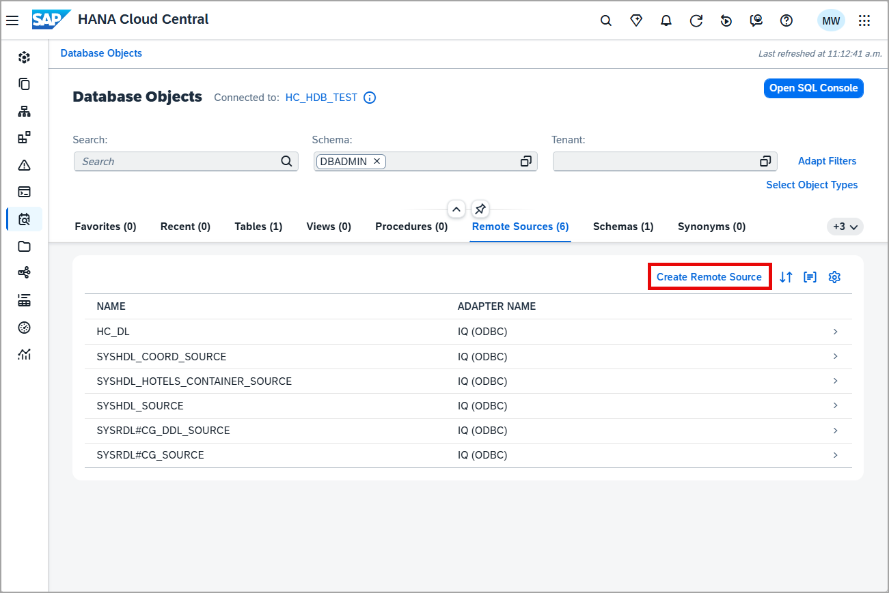

    For the Database Source Type, select **SAP HANA Cloud, SAP HANA Database**.

    Add a source name and specify the server, port, and credentials (USER1, Password1). The Extra Adapter properties can be retrieved by copying the `sslTrustStore` in the SQL query above. 

    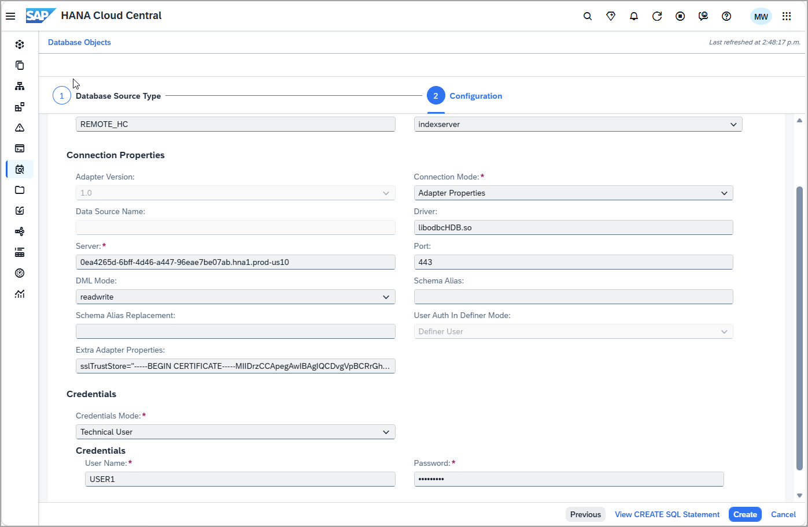

    Additional details can be found at [CREATE REMOTE SOURCE Statement](https://help.sap.com/docs/hana-cloud-database/sap-hana-cloud-sap-hana-database-sql-reference-guide/create-remote-source-statement-access-control)

    If the above command fails, one reason might be that an allowlist has been set on the SAP HANA Cloud instance. This can be seen by choosing Actions > Manage Configuration > Connections.

    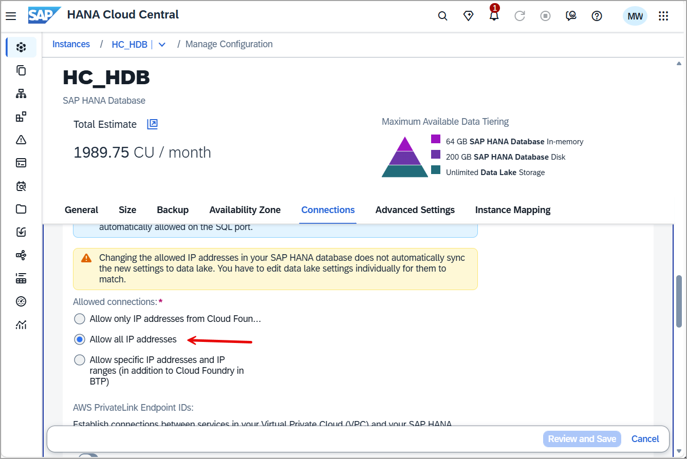

    The public root certificate of the certificate authority (CA) that signed the SAP HANA Cloud instance’s server certificate is required in the `sslTrustStore` parameter. For more information, see [Secure Communication Between SAP HANA Cloud and JDBC/ODBC Clients](https://help.sap.com/docs/hana-cloud-database/sap-hana-cloud-sap-hana-database-security-guide/secure-communication-between-sap-hana-and-sap-hana-clients).

5. A virtual table named `vt_tourist_reviews` will be created in the SAP HANA database you are connecting from. This will enable access to the `tourist_reviews` table that was created in SAP HANA Cloud. This can be visualized as follows: 

    Open the SAP HANA database you wish to connect from.

    > If needed, create the HOTELS schema and a user who can access the schema.

   ```SQL
   CREATE USER USER1 PASSWORD Password1 no force_first_password_change;
   CREATE SCHEMA HOTELS;
   GRANT ALL PRIVILEGES ON SCHEMA HOTELS TO USER1;
   ```

6. Create a virtual table named **`VT_TOURIST_REVIEWS`** in the schema **HOTELS** that maps to the `TOURIST_REVIEWS` table on the original HDB.

   ```SQL
   CREATE VIRTUAL TABLE VT_TOURIST_REVIEWS AT "REMOTE_HC"."HC_HDB".HOTELS."TOURIST_REVIEWS";
   ```

    Additional details can be found at [CREATE VIRTUAL TABLE STATEMENT](https://help.sap.com/docs/hana-cloud-database/sap-hana-cloud-sap-hana-database-sql-reference-guide/create-virtual-table-statement-data-definition)

7. Perform queries against the local tables, the remote table, and perform a federated query that contains both local and remote tables.

   ```SQL
   SELECT * FROM HOTELS.RESERVATION;
   SELECT * FROM HOTELS.CUSTOMER;
   SELECT * FROM HOTELS.VT_TOURIST_REVIEWS;
   SELECT C.NAME, TR.REVIEW, REVIEW_DATE
   FROM
       HOTELS.RESERVATION AS R JOIN
       HOTELS.VT_TOURIST_REVIEWS AS TR
       ON TR.REVIEW_DATE = R.ARRIVAL JOIN
       HOTELS.CUSTOMER AS C
   ON C.CNO = R.CNO;
   ```

8. In the source HDB SQL console, query the virtual table to confirm data is returned from the target HDB.

   ```SQL
   SELECT * FROM VT_TOURIST_REVIEWS;
   ```

    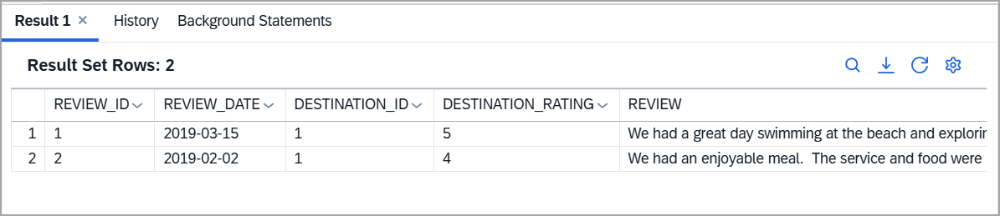

    Add a new review.

   ```SQL
   INSERT INTO HOTELS.VT_TOURIST_REVIEWS(review_id, review_date, destination_id, destination_rating, review) VALUES(3, '2020-08-21', 1, 5, 'The harbour cruise was fantastic.  It was great to see the city from a different viewpoint');
   SELECT * FROM HOTELS.VT_TOURIST_REVIEWS;
   ```

    Notice that the virtual table is editable.

    A benefit of a non replicated virtual table is that there is only one location where the data is persisted.

### Connect from SAP HANA Cloud, SAP HANA database to a data lake Relational Engine

[SAP HANA Cloud, data lake](https://help.sap.com/docs/hana-cloud-data-lake) can be used to store large amounts of data that is not accessed and updated as frequently as data in an SAP HANA database.  The following steps create the table `tourist_reviews` in SAP HANA Cloud, data lake Relational Engine and access the table from the associated SAP HANA database (HDB) instance.

1. If needed, in SAP HANA Cloud Central, add an SAP HANA Cloud, data lake (HDLRE) instance to your SAP HANA Cloud instance, by choosing **Actions > Add Data Lake**.

    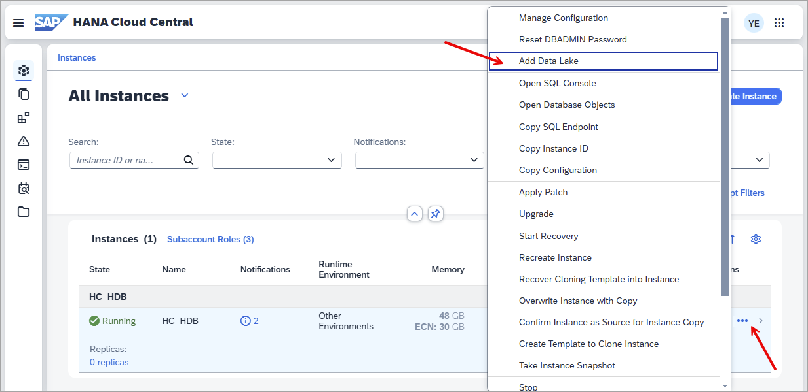

2. Open a SQL console connected to the data lake instance by selecting the instance tile and choosing **Actions > Open SQL Console**.

    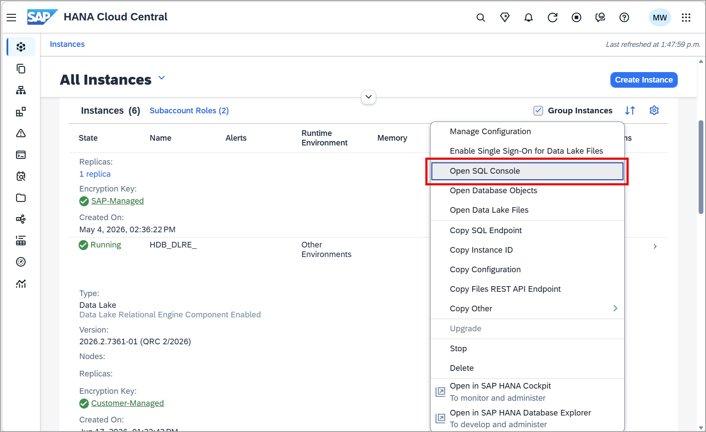

3. Execute the following SQL to create a table named `tourist_reviews` in the HDLRE.

    >If needed, first create the required schema and role.

   ```SQL
   --Create a schema for the sample hotel dataset 
   CREATE SCHEMA HOTELS;
   --Create USER1 and grant privileges 
   CREATE USER USER1 IDENTIFIED BY Password1;
   GRANT ALL PRIVILEGES ON SCHEMA HOTELS TO USER1;
       
   SET SCHEMA HOTELS;
   
   CREATE TABLE TOURIST_REVIEWS (
       REVIEW_ID INTEGER PRIMARY KEY,
       REVIEW_DATE DATE NOT NULL,
       DESTINATION_ID INTEGER,
       DESTINATION_RATING INTEGER,
       REVIEW VARCHAR(500) NOT NULL
   );

   INSERT INTO TOURIST_REVIEWS(REVIEW_ID, REVIEW_DATE, DESTINATION_ID, DESTINATION_RATING, REVIEW) VALUES(1, '2019-03-14', 1, 5, 'We had a great day swimming at the beach and exploring the beach front shops.  We will for sure be back next summer.');
   INSERT INTO TOURIST_REVIEWS(REVIEW_ID, REVIEW_DATE, DESTINATION_ID, DESTINATION_RATING, REVIEW) VALUES(2, '2019-02-01', 1, 4, 'We had an enjoyable meal.  The service and food were outstanding.  Would have liked to have slightly larger portions');
   ```

    For additional details consult [CREATE TABLE Statement for Data Lake Relational Engine](https://help.sap.com/docs/hana-cloud-data-lake/sql-reference-for-data-lake-relational-engine/create-table-statement-for-data-lake-relational-engine).

4. In the HDB SQL console, create a remote source **from** the HANA database **to** the HDLRE.  Be sure to replace the host and password values.

   ```SQL
   CREATE REMOTE SOURCE HC_DL
       ADAPTER "IQODBC"
           CONFIGURATION 'Driver=libdbodbc17_r.so;host=XXXXXXXX-XXXX-XXXX-XXXX-XXXXXXXXXXXX.iq.hdl.trial-XXXX.hanacloud.ondemand.com:443;ENC=TLS(tls_type=rsa;direct=yes)'
               WITH CREDENTIAL TYPE 'PASSWORD'
                   USING 'user=USER1;password=Password1';
   CALL PUBLIC.CHECK_REMOTE_SOURCE('HC_DL');
   ```

    >Access host details under Actions > Copy SQL Endpoint

    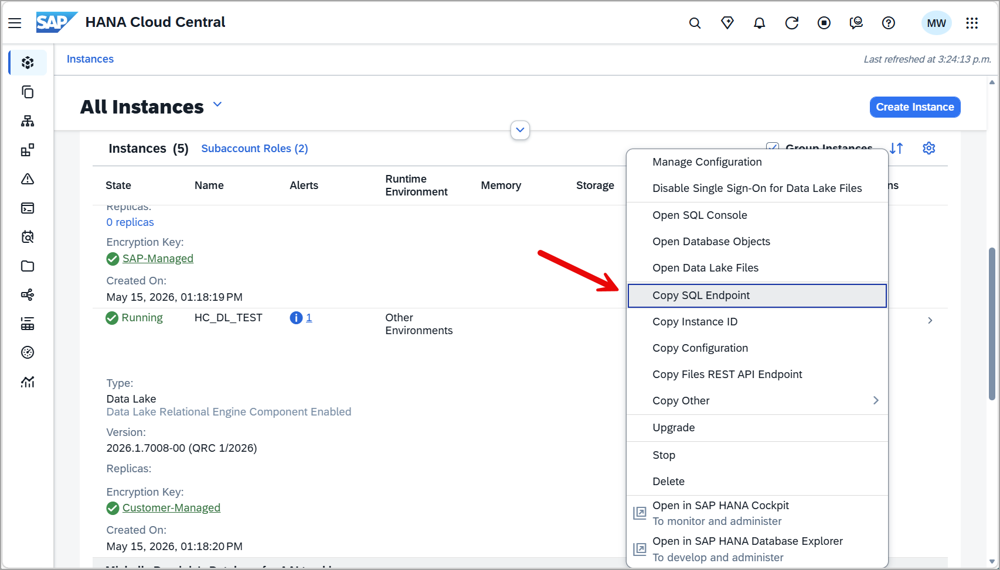

5. Navigate to **Database Objects** to view an instance's remote sources. Notice that under remote sources, there is a remote source `HC_DL`.

    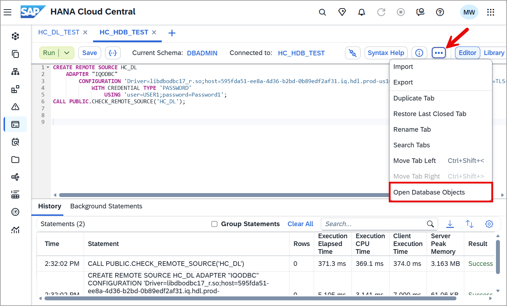

    If an instance's remote sources are unavailable, go to **Select Object Types** to add **Remote Sources**.

    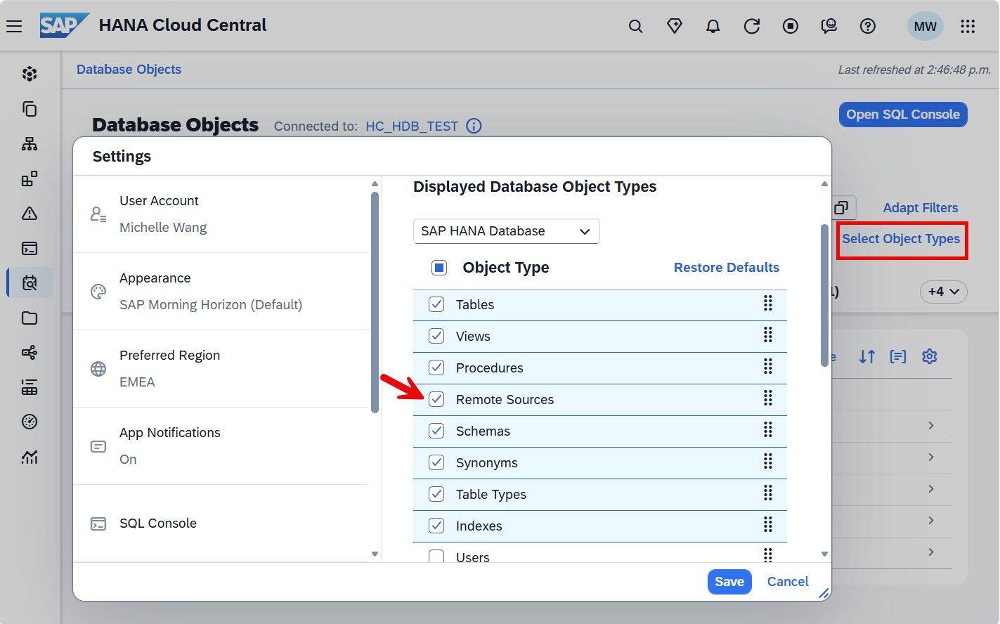 

6. In the HDB SQL console, create a virtual table named **`VT_DL_TOURIST_REVIEWS`** in the schema **HOTELS** that maps to the newly created table in the HDLRE.

    This can be visualized as follows:

    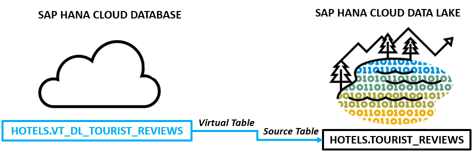

   ```SQL
   CREATE VIRTUAL TABLE VT_DL_TOURIST_REVIEWS AT HC_DL.iqaas.HOTELS.TOURIST_REVIEWS;
   ```

    > It is also possible to create the remote table and virtual table together in the same statement.
    >
    > ```SQL
    > CREATE VIRTUAL TABLE VT_DL_TOURIST_REVIEWS (
    >   REVIEW_ID INTEGER PRIMARY KEY,
    >   REVIEW_DATE DATE NOT NULL,
    >   DESTINATION_ID INTEGER,
    >   DESTINATION_RATING INTEGER,
    >   REVIEW VARCHAR(500) NOT NULL
    > ) AT HC_DL.iqaas.HOTELS.TOURIST_REVIEWS WITH REMOTE;
    > INSERT INTO VT_DL_TOURIST_REVIEWS VALUES(1, '2019-03-15', 1, 5, 'We had a great day swimming at the beach and exploring the beach front shops.  We will for sure be back next summer.');
    > INSERT INTO VT_DL_TOURIST_REVIEWS VALUES(2, '2019-02-02', 1, 4, 'We had an enjoyable meal.  The service and food were outstanding.  Would have liked to have slightly larger portions');
    > ```

7. In the HDB SQL console, query the local SAP HANA table and the equivalent HDLRE table.

   ```SQL
   SELECT * FROM TOURIST_REVIEWS;
   SELECT * FROM VT_DL_TOURIST_REVIEWS;
   ```

    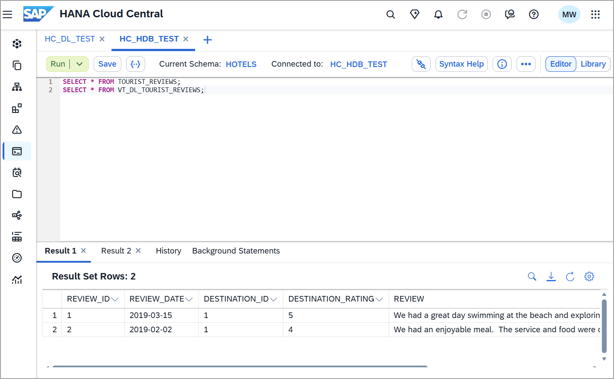

8. In the HDB SQL console, add a new review.

   ```SQL
   INSERT INTO VT_DL_TOURIST_REVIEWS VALUES(3, '2020-08-21', 1, 5, 'The harbour cruise was fantastic.  It was great to see the city from a different viewpoint');
   SELECT * FROM VT_DL_TOURIST_REVIEWS;
   ```

    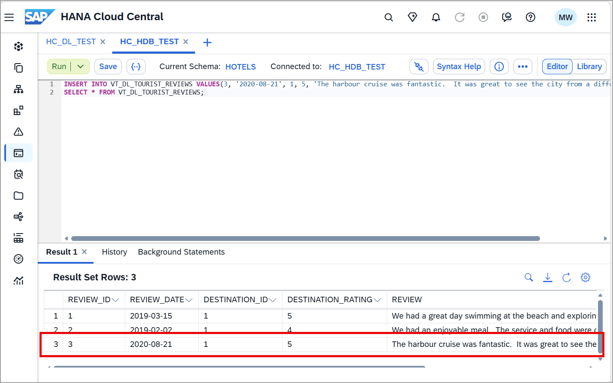

    Notice that the remote data source is updatable.  Data stored in an HDLRE is stored on disk, which has cost advantages compared to memory storage. HDLRE can also be used to store large amounts of data.

### Connect from a data lake Relational Engine to SAP HANA Cloud, SAP HANA database

The first task in preparing the data lake Relational Engine instance is creating a remote server that connects to the SAP HANA database instance that contains the data you want to access.

1. In SAP HANA Cloud Central, locate the SAP HANA database instance tile and choose **Actions > Copy SQL Endpoint** to obtain the host name.

2. In SAP HANA Cloud Central, select the data lake instance tile and choose **Actions > Open SQL Console**.

3. In the data lake SQL console, run the following SQL using HDLADMIN. Notice, you are naming the remote server `HDB_SERVER`. Replace the `<HANA Host Name>` with the host copied from the SQL endpoint.  Additional details can be found at [CREATE SERVER Statement](https://help.sap.com/docs/hana-cloud-data-lake/sql-reference-for-data-lake-relational-engine/create-server-statement-for-data-lake-relational-engine).

   ```SQL
   CREATE SERVER HDB_SERVER CLASS 'HANAODBC' USING
   'Driver=libodbcHDB.so;
   ConnectTimeout=0;
   CommunicationTimeout=15000;
   RECONNECT=0;
   ServerNode=<HANA Host Name>:443;
   ENCRYPT=TRUE;';
   ```

4. In the data lake SQL console, create the `EXTERNLOGIN` that will map your HDLRE user to the HANA user credentials and allow access to the HDB. Notice below in the `CREATE EXTERNLOGIN` statement you are granting your HDLRE user permission to use the HANA user for the `HDB_SERVER` that was created above.

   ```SQL
   -- Replace `<HDL USER NAME>` with the current HDLRE user that is being used and replace `<HANA USER NAME>` and `<HANA PASSWORD>` with the target HANA database user password.

   -- CREATE EXTERNLOGIN <HDL USER NAME> to HDB_SERVER REMOTE LOGIN <HANA USER NAME> IDENTIFIED BY <HANA PASSWORD>;

   CREATE EXTERNLOGIN HDLADMIN to HDB_SERVER REMOTE LOGIN USER1 IDENTIFIED BY Password1;
   ```

    >If you would prefer to use USER1 instead of HDLADMIN, execute the `GRANT MANAGE ANY USER TO USER1;` query as described [here](https://help.sap.com/docs/hana-cloud-data-lake/sql-reference-for-data-lake-relational-engine/create-externlogin-statement-for-data-lake-relational-engine).

5. In the data lake SQL console, do a quick test to ensure everything has been set up successfully. You will create a temporary table that points to your TOURIST_REVIEWS table in SAP HDB. Then run a select against that table to ensure you are getting data back.  Additional details can be found at [CREATE EXISTING TABLE Statement](https://help.sap.com/docs/hana-cloud-data-lake/sql-reference-for-data-lake-relational-engine/create-existing-table-statement-for-data-lake-relational-engine).

   ```SQL
   CREATE EXISTING LOCAL TEMPORARY TABLE VT_HDB_TOURIST_REVIEWS AT 'HDB_SERVER..HOTELS.TOURIST_REVIEWS';
   /* 
   --If you wish to only include specific columns, the column list can also be provided
   CREATE EXISTING LOCAL TEMPORARY TABLE VT_HDB_TOURIST_REVIEWS
   (
       REVIEW_ID           INTEGER          NOT NULL,
       DESTINATION_ID      INTEGER          DEFAULT NULL,
       DESTINATION_RATING  INTEGER          DEFAULT NULL,
       REVIEW              NVARCHAR(500)    NOT NULL,
       REVIEW_DATE         DATE             NOT NULL,
       PRIMARY KEY (REVIEW_ID)
   ) AT 'HDB_SERVER..HOTELS.TOURIST_REVIEWS'; */

   SELECT * FROM VT_HDB_TOURIST_REVIEWS;
   --DROP TABLE VT_HDB_TOURIST_REVIEWS;
   ```

    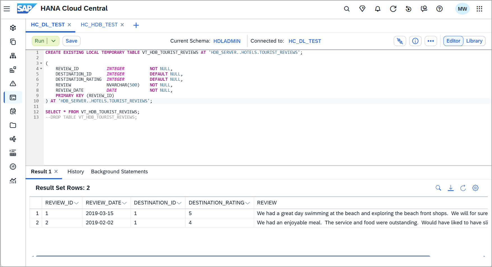

### Connect from a data lake Relational Engine to another data lake Relational Engine

1. In SAP HANA Cloud Central, locate the target data lake instance tile and choose **Actions > Copy SQL Endpoint** to obtain the host name.

2. In SAP HANA Cloud Central, select the source data lake instance tile and choose **Actions > Open SQL Console**.

3. In the source data lake SQL console, run the following SQL using a user with the `MANAGE ANY REMOTE SERVER` privilege to create a remote server. Notice, you are naming the remote server `HDLRE_SERVER`. Replace `<remote_host>` with the host copied from the SQL endpoint.

   ```SQL
   CREATE SERVER HDLRE_SERVER CLASS 'IQODBC' USING 
   'DRIVER=libodbc17_r.so;
   host=<remote_host>:443;
   UseCloudConnector=OFF;
   ENC=TLS(tls_type=rsa;direct=yes);'
   ```

4. In the source data lake SQL console, use the `CREATE EXTERNLOGIN` statement to assign an alternate login name and password for communications with the target server. Replace `<HDLRE USER NAME>` and `<HDLRE PASSWORD>` with the target HDLRE user credentials.

   ```SQL
   -- Replace `<HOST HDL USER NAME>` with the current HDLRE user that is being used and replace `<HDL USER NAME>` and `<HDL PASSWORD>` with the target HDLRE database user password.

   -- CREATE EXTERNLOGIN <HOST HDL USER NAME> TO HDLRE_SERVER REMOTE LOGIN <HDL USER NAME> IDENTIFIED BY <HDL PASSWORD>;

   CREATE EXTERNLOGIN HDLADMIN TO HDLRE_SERVER REMOTE LOGIN USER1 IDENTIFIED BY Password1;
   ```

    >If you would prefer to use USER1 instead of HDLADMIN, execute the `GRANT MANAGE ANY USER TO USER1;` query as described [here](https://help.sap.com/docs/hana-cloud-data-lake/sql-reference-for-data-lake-relational-engine/create-externlogin-statement-for-data-lake-relational-engine).

5. In the source data lake SQL console, do a quick test to ensure everything has been set up successfully. You will create a temporary table that points to your TOURIST_REVIEWS table in your target HDLRE. Then run a select against that table to ensure you are getting data back.

   ```SQL
   CREATE EXISTING LOCAL TEMPORARY TABLE VT_HDLRE_TOURIST_REVIEWS
   (
       REVIEW_ID INTEGER PRIMARY KEY,
       REVIEW_DATE DATE NOT NULL,
       DESTINATION_ID INTEGER,
       DESTINATION_RATING INTEGER,
       REVIEW VARCHAR(500) NOT NULL
   ) AT 'HDLRE_SERVER..HOTELS.TOURIST_REVIEWS';

   SELECT * FROM VT_HDLRE_TOURIST_REVIEWS;
   --DROP TABLE VT_HDLRE_TOURIST_REVIEWS;
   ```

    

For further information, see [Data Replication and Data Virtualization](group.hana-cloud-extend-2-data-replication), and [Getting Started with SAP HANA Cloud | Remote Data Source](https://blogs.sap.com/2020/08/03/getting-started-with-sap-hana-cloud-vii-smart-data-access/).

### Knowledge check

Congratulations!  You have now used remote sources to access data running on a different SAP HANA instance and on an SAP HANA Cloud, data lake Relational Engine.

---
