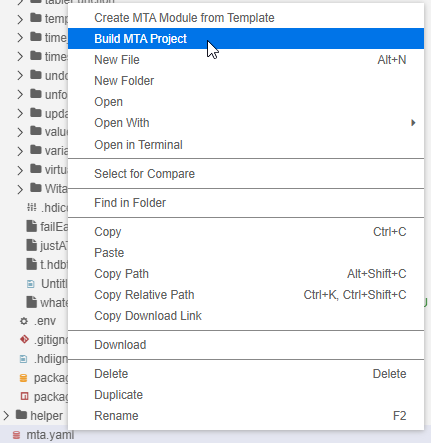
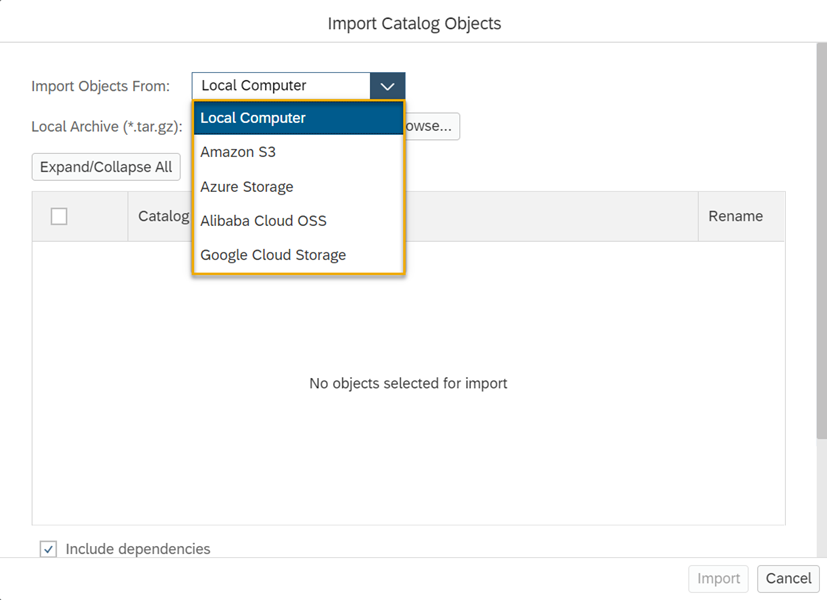

# Move Data from a Free Tier Model or Trial Instance to a Production Instance
<!-- description --> Learn to move data, HDI containers, schemas and more from your free tier model or trial instance to your production instance of SAP HANA Cloud, SAP HANA database.

## Prerequisites
- You have access to a free tier model or trial account and a production account in SAP HANA Cloud.
- You have access to a free tier model or trial and production environment in SAP Business Application Studio.

## You will learn
- To move development objects from a free tier model or trial environment of SAP Business Application Studio
- To export catalog objects like schemas and tables from a free tier model or trial environment of SAP HANA Cloud, SAP HANA database

## Intro
If you have data or any kinds of artifacts in your trial account and you would like to make sure you can keep these artifacts in a production environment, then this tutorial will help you. Please remember to follow these steps before your trial account expires, otherwise it won't be possible to recover this data.

For moving objects between trial and production, it's important to differentiate between catalog objects, like tables and schemas, and development objects you created in development projects using SAP Business Application Studio.

In the first three steps of this article, you will learn how to move **development objects**, steps four and five will focus on **catalog objects**.

---

### Export artifacts from free tier model or trial account

The recommended way to move your artifacts within HDI containers is to deploy each of them to your production environment. To do that, you need to use the SAP Business Application Studio.

1. In SAP Business Application Studio, go to your workspace.

2. Right-click on your project name and the click on **Download**. Your export package will be prepared and downloaded for you.

### Import artifacts into production account

1. On your productive SAP Business Application Studio, right-click on the Project folder that you want to import your project to.

2. Click on **Import Project**.

3. Select the file you have downloaded before.

4. Your project will be imported, and you will see a confirmation on the bottom right-hand side of the screen.

5. To upload individual files, right-click on the project folder and select **Upload files**.

[You can find more information on importing projects to SAP Business Application Studio here.](https://help.sap.com/viewer/9d1db9835307451daa8c930fbd9ab264/LATEST/en-US/2ada2be6bedd4cfc926a1347b87ebfe7.html)

Alternatively, you can connect to a local or remote Git repository and transfer your projects to that repository. In your production environment, you can then create a new project directly from a git repository clone.

[Learn all about using Git with SAP Business Application Studio here](https://help.sap.com/viewer/9d1db9835307451daa8c930fbd9ab264/LATEST/en-US/9689c07b64364bbea43725dad9f27320.html).

### Deploy development objects to production instance

Finally, if you don't need your design-time project and would rather deploy your development objects to a production instance, please follow these steps:

1. In the SAP HANA Projects panel, use the deploy icon () to deploy the imported project.

2. Once the deployment is successful, find the **`mta.yaml`** file in your project folder and right-click on it.

3. Select **Build MTA Project**.

    <!-- border -->

4. This will create a folder called **`mta_archives`**. Expand this folder.

5. Right-click the **`.mtar`** file within this folder and deploy it.

6. Select **Deploy to SAP BTP**.

7. Select the **API Endpoint**, **Organization** and **Space** of your production environment.

8. Click on **Deploy**.

For more information on Developing Multi-Target Applications, [please see this article](https://help.sap.com/viewer/65de2977205c403bbc107264b8eccf4b/LATEST/en-US/d04fc0e2ad894545aebfd7126384307c.html).

If you prefer to work with the Command Line Interface (CLI), just [follow this tutorial](https://help.sap.com/viewer/9ae9104a46f74a6583ce5182e7fb20cb/LATEST/en-US/921f3e46247947779d69b8c85c9b9985.html).
If you wish to develop applications with the SAP Business Application Studio, please see the following technical documents:

-	[Build Your Application](https://help.sap.com/viewer/584e0bcbfd4a4aff91c815cefa0bce2d/LATEST/en-US/33816f39a54a426892c5076ecd6f0098.html)
-	[Deploy Your Application](https://help.sap.com/viewer/584e0bcbfd4a4aff91c815cefa0bce2d/LATEST/en-US/83b0fb23e37d456caad1ad0448e14727.html)

For more details on SAP HDI Containers, please see the technical documents of the following topics:

-	[SAP HDI Containers](https://help.sap.com/viewer/c2cc2e43458d4abda6788049c58143dc/LATEST/en-US/e28abca91a004683845805efc2bf967c.html)
-	[Maintaining SAP HDI Containers](https://help.sap.com/viewer/c2cc2e43458d4abda6788049c58143dc/LATEST/en-US/bcd6e27173464d9eb6a5ff9e53275240.html)

### Export catalog objects

In case you would prefer to export your catalog objects, you can see below the options available.

> **IMPORTANT**: Since the user you use to import object with is the owner of those objects, make sure you are not importing any objects using the DBADMIN user. This is a security best practice. Instead, to import development objects, you can use any developer user that is allowed to develop in the intended space.

If you simply wish to export a mixed list of artifacts in your main SAP HANA Cloud database, you can export the catalog using the SAP HANA Database Explorer. To get started:

1. In the SAP HANA Database Explorer, expand the database to see the Catalog.

2. Right-click on **Catalog**.

3. Click on **Export Catalog Objects**.

4. Add the name to your export file on the Local archive field.

5. Click on **Add Catalog Objects** to add objects to your export file.

6. Use the search to find the objects you wish to include on your export. Click on each object and then click on **Add to export**.

7. You can select a binary format instead of a CSV on the Column Table Format field.

8. Once you are happy with your selection, click on **Export**.

### Export schemas

If you simply wish to export everything within a particular schema, you can export it with the following steps:

1. In the SAP HANA Database Explorer, expand the database to see the Catalog.

2. Right-click on **Schema**.

3. Click on **Export Catalog Objects**. Your schema will be automatically included in the list.

4. You can select a binary format instead of a CSV on the Column Table Format field.

5. Once you are happy with your selection, click on **Export**.

### Export individual tables 

If you simply wish to export one individual table, you can export it with the following steps:

1. In the SAP HANA Database Explorer, expand the database to see the Catalog.

2. Click on **Tables**.

3. On the left-hand panel at the bottom, right-click on the table you wish to export.

4. Click on **Export Catalog Objects**. Your table will be automatically included in the list.

5. You can select a binary format instead of a CSV on the Column Table Format field.

6. Once you are happy with your selection, click on **Export**.

[You can read more about exporting schemas, tables, and other catalog objects here](https://help.sap.com/viewer/a2cea64fa3ac4f90a52405d07600047b/LATEST/en-US/1f20a6c4364c4b0680596e74e4ba281d.html).

Alternatively, you can also export HDI Containers, if needed. Please see the documentation on the topics given below:

-	[Export HDI Containers](https://help.sap.com/viewer/a2cea64fa3ac4f90a52405d07600047b/LATEST/en-US/0394510cb4154e5494e6e44ae84a4478.html)
-	[Export an SAP HDI Container for Copy Purposes](https://help.sap.com/viewer/c2cc2e43458d4abda6788049c58143dc/LATEST/en-US/c25ee286cee5496cb96fdf5875f444a2.html)

### Import schemas, tables, and other catalog objects

Next, you can import schemas, tables, and other catalog objects into your database by using the SAP HANA Database Explorer.

> ### Prerequisites
> The catalog objects imported must be compressed in `.tar.gz` format. They must have been exported using the export feature in the SAP HANA Database Explorer.
>
> You must have the necessary object privileges (INSERT, DROP, CREATE) for the catalog objects in the target database. Also, you must have the IMPORT system privilege for the user.

1. In the SAP HANA database explorer, select **Schemas** from the list of **Catalog** objects in your target HDI container.

2. Right-click on the schema to which you want to import the objects and choose **Import Catalog Objects**.

3. Select the location of the file you want to import. You can select from the following available options shown in the image below:

    <!-- border -->

4. Browse for the location of the file you want to import. Select the file and click **Open**.

5. Click on the arrow icon for the selected file to expand and view all the catalog objects present in it.

6. Specify the scope of the import by choosing the relevant options from the table given below:

    |  Option         | Description
|  :------------- | :-------------
| **Include dependencies**     | Dependent objects of the selected objects are also imported.
|  **Include object data**     | Import the table data along with the table definitions. If left unselected, only the table definitions are imported.
|  **Replace existing objects** | If objects with the same names already exist in the target database, then they are replaced by the imported objects.
|  **Fail import if it contains invalid data** | If you have selected the option `Include object data`, then selecting this option ensures that your import is canceled if the object data is incomplete or corrupt.
|  **Number of Parallel Threads** | Increasing the number of threads can speed up your import and affect database performance. Check [this link](https://help.sap.com/viewer/a2cea64fa3ac4f90a52405d07600047b/LATEST/en-US/80f63855e7854cd3a6144e0021b5f748.html) for guidelines on how to choose the number of threads.

7. Click on **Import**.

Now, you have completed the process of importing catalog objects. The time taken to complete the import process depends on the number of objects being imported and the scope of the import.

> **You have completed this tutorial!**
>
> Enjoy your production environment and make sure to [check out our other tutorials](https://developers.sap.com/tutorial-navigator.html?tag=software-product:technology-platform/sap-hana-cloud/sap-hana-cloud).
>
> Follow our tag in the [SAP Community](https://blogs.sap.com/tags/73554900100800002881/) to stay up-to-date on the latest updates and newest content! For more learning materials on SAP HANA Cloud, [click here](https://community.sap.com/topics/hana-cloud).

### Test yourself

---
