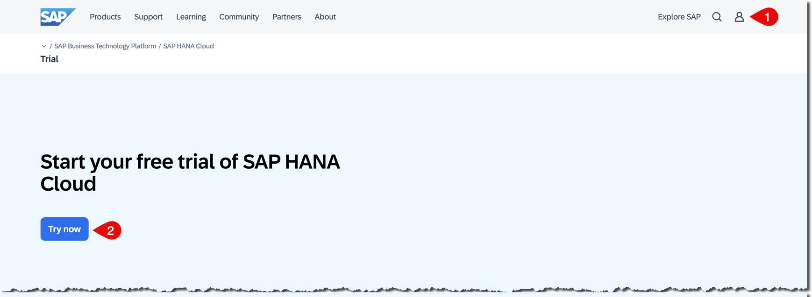
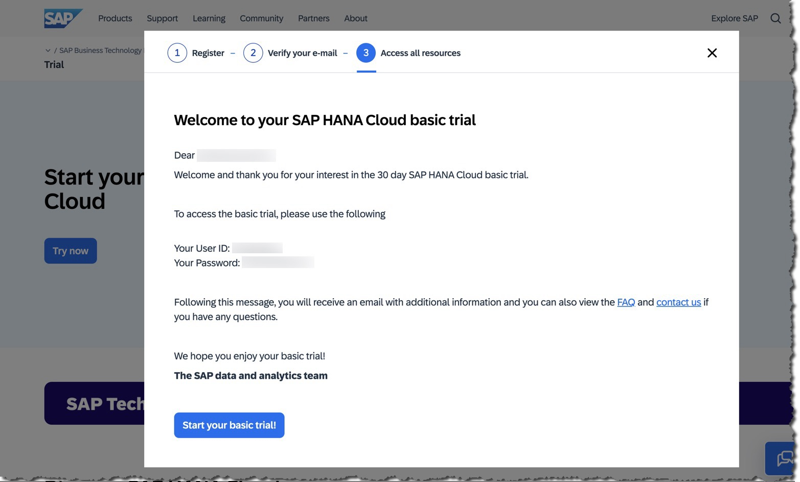
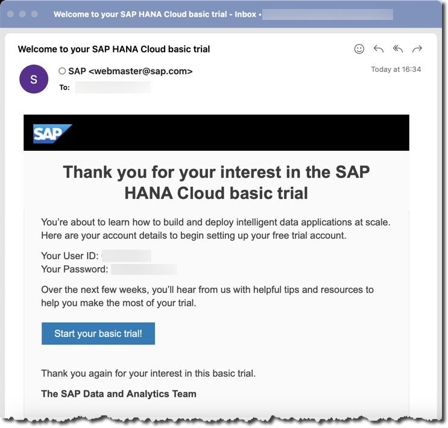
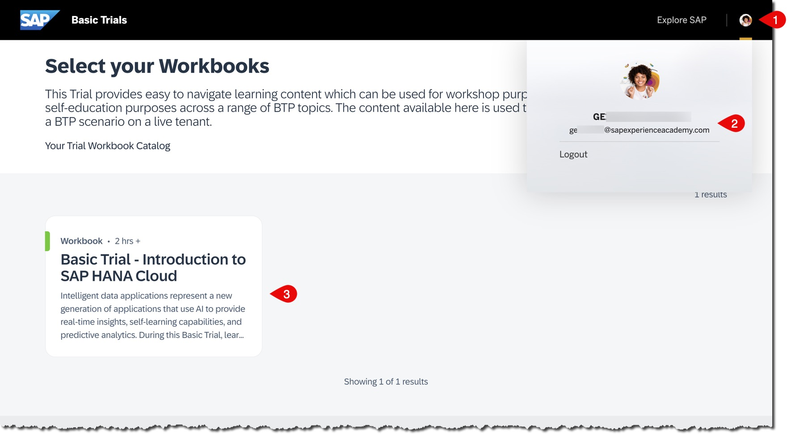
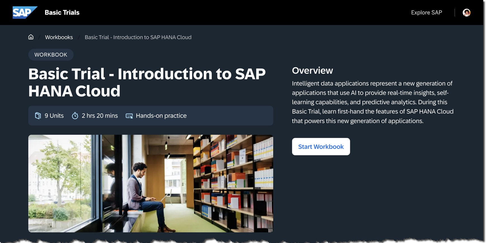
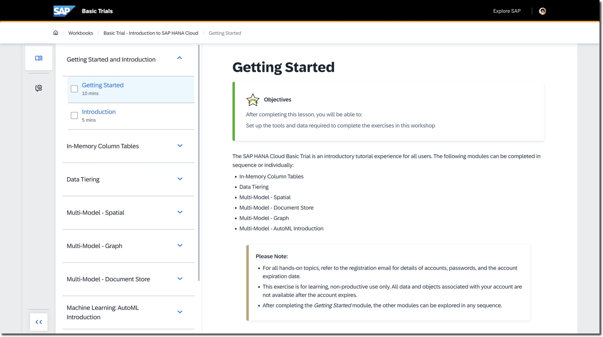
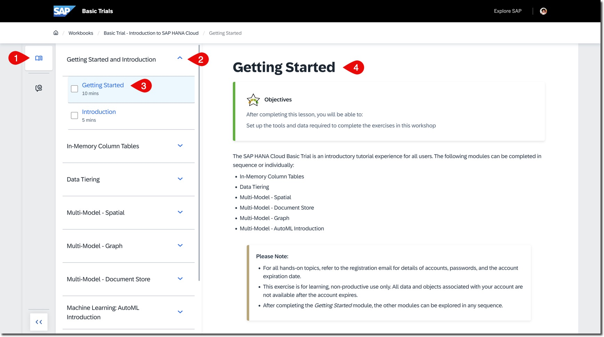
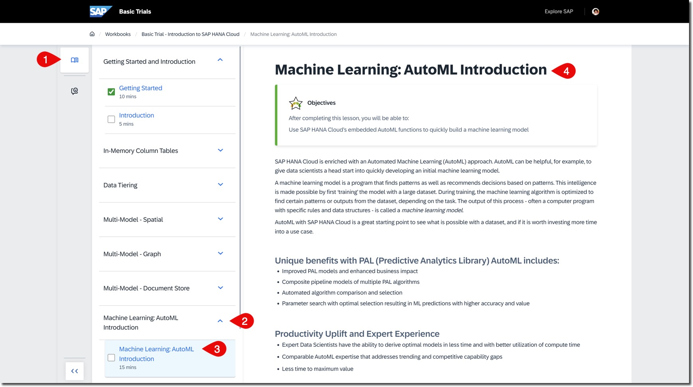

# Train Your First Machine Learning Model Using AutoML in SAP HANA Cloud
<!-- description --> This tutorial will guide you through using SAP HANA Cloud's embedded machine learning capability called AutoML. You will explore it using Python and a Jupyter notebook in SAP Business Application Studio.

## Prerequisites
- This tutorial is designed for SAP HANA Cloud. It is not intended for SAP HANA on-premise or SAP HANA, express edition.

## You will learn
- How to use SAP HANA Cloud’s embedded AutoML functions to quickly train a machine learning model.

The hands-on tasks are completed exclusively in SAP Business Application Studio, referred to as **BAS**.

### Register for an SAP HANA Cloud Basic Trial Instance

Register for the SAP HANA Cloud basic trial: https://www.sap.com/products/technology-platform/hana/trial.html

At the end of the registration process, you should receive a username and password to use in the following exercises.

You should also receive an email with the same information.

### Start Your Basic Trial and Access the Workbook

Click on **Start your basic trial!**

On the login page, use the username and password you received.

Upon successful login, you should see a workbook titled **Basic Trial - Introduction to SAP HANA Cloud**.

Click on it to open the workbook.

Click on **Start Workbook**.

This workbook includes multiple exercises, but in this tutorial, you will focus only on **Machine Learning: AutoML Introduction**.

> Good news: You have access to this user account and workbook for 30 days from the registration date. You can complete the other exercises after finishing this tutorial.

### Set Up the Tools and Data Required to Complete the Exercises

With the **Basic Trial - Introduction to SAP HANA Cloud** workbook open, ensure you are in the (1) Learning Content view. Then (2) expand **Getting Started and Introduction** and (3) click on **Getting Started**.

Complete (4) the **Getting Started** exercise.

After completing this exercise, answer the validation question, and then proceed directly to the exercise " **Machine Learning: AutoML Introduction**".

### Machine Learning —— AutoML Introduction

With the **Basic Trial - Introduction to SAP HANA Cloud** workbook open, ensure you are in the (1) Learning Content view. Then (2) expand **Machine Learning: AutoML Introduction** and (3) click on **Machine Learning: AutoML Introduction**.

Complete (4) the **Machine Learning: AutoML Introduction** exercise.

### Knowledge Check

Congratulations! You have explored the embedded machine learning capabilities in SAP HANA Cloud.

Answer the last validation question, and remember you can keep working on other execises during the next 30 days after the registration for the SAP HANA Cloud basic trial!