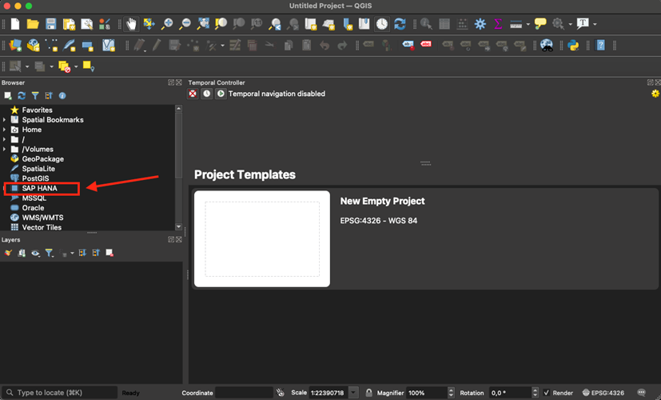

# Connect QGIS to SAP HANA Database in SAP HANA Cloud
<!-- description --> Learn how to connect QGIS to your SAP HANA database in SAP HANA Cloud.

## Prerequisites
- [Register](https://www.sap.com/cmp/td/sap-hana-cloud-trial.html) for a trial account of SAP HANA Cloud.
- Provision an SAP HANA database within your trial account and have it **running** before you start.
- Download the [QGIS installer](https://download.qgis.org/) packages for your operating system.

## You will learn
- How to install SAP HANA ODBC Driver
- How to install QGIS 3.18
- How to connect QGIS to SAP HANA database in SAP HANA Cloud

## Intro
If you are interested in knowing more about what the SAP HANA engine within SAP HANA Cloud, SAP HANA database can do, this tutorial will walk you through the steps to use it with your SAP HANA Cloud trial account. These steps work in an SAP HANA Cloud production account as well.

In this tutorial group, you will learn how to perform the following tasks:

1. **Install SAP HANA ODBC Driver**

2. **Install QGIS**

3. **Connect QGIS to SAP HANA database in SAP HANA Cloud**

4. Upload your first spatial dataset

5. Visualize data on a base map

6. Pushing down Spatial Workload to SAP HANA database in SAP HANA Cloud

> This tutorial will cover the tasks **1-3** from this list.

Let's get started!

---

### Introduction to SAP HANA Spatial engine

>Please note that SAP HANA Spatial engine works only with **SAP HANA Cloud, SAP HANA database**.

The combination of SAP HANA Cloud trial with QGIS offers an easy way to get into spatial data processing at scale. Spatial workflows built upon SAP HANA Cloud can ultimately be re-used in business applications to inject the location dimension into your business processes.

No matter if you're new to QGIS or if you're new to SAP HANA Cloud – or even both – this tutorial group allows you to create a working and free-of-cost spatial playground in less than 30 minutes. So – add it to your bookmarks and block some time in your calendar!

> Note: The screenshots you will see on this tutorial were taken on a macOS, if you use a different OS, it might look different to you.

### Install SAP HANA ODBC driver

Here, you should not need more than 2 minutes. To install the SAP HANA ODBC Driver, which is part of the SAP HANA Client, you just need to download it from [SAP Development Tools](https://tools.hana.ondemand.com/#hanatools) and execute the installer for your operating system.

<!-- border -->

There is not much to consider here since this is a Next-Next-Finish-Installer. (Is that an even an official expression? Well, it should be.)
There are install packages for [Windows](https://tools.hana.ondemand.com/additional/hanaclient-latest-windows-x64.zip), [macOS](https://tools.hana.ondemand.com/additional/hanaclient-latest-macosx-x64.tar.gz) and [Linux](https://tools.hana.ondemand.com/additional/hanaclient-latest-linux-x64.tar.gz) available.

### Install QGIS

This is essentially another simple installer without specific considerations. As mentioned above, the OS specific installation package for Windows, macOS and Linux are available on the [QGIS Download Page](https://download.qgis.org/). You will need at least the version QGIS 3.18 to work with SAP HANA Cloud.

> Note: The installation packages for QGIS 3.18 are 1.2GB in size. Depending on server speed, this download may last a while.

<!-- border -->

Once you downloaded and installed QGIS 3.18, you can start the client. Make sure that you see SAP HANA as a data provider in the data browser on the left-hand side.

### Connect QGIS to the database

The general instructions on how to connect QGIS to SAP HANA database in SAP HANA Cloud can be found in the [QGIS documentation](https://docs.qgis.org/testing/en/docs/user_manual/managing_data_source/opening_data.html#connecting-to-sap-hana). Also, there is a short video available depicting the process.

<iframe width="560" height="315" src="https://www.youtube.com/embed/Akjh9IixLlQ" frameborder="0" allowfullscreen></iframe>

### Collect SQL endpoint information

1. Please go to the **SAP BTP cockpit** and navigate to your space, then click on **SAP HANA Cloud**. There you will be able to see your running SAP HANA database instance in SAP HANA Cloud.

2. Click on **Actions** and then on **Copy SQL endpoint**. The endpoint will be copied to your clipboard. Keep it there.

    <!-- border -->

### Create a new connection to the database

1. Open **QGIS** and locate the SAP HANA entry in the browser on the left panel.

2. Right-click on **SAP HANA** and choose **New Connection**.

3. The connection dialog will open. Fill following fields:

    - Name: Fill in a name for the connection. For example, in this **`hctrial`**.

    - Host: Paste your clipboard and remove '**:443**' at the end. The SQL endpoint has format <host>:<port> and the field expects <host>.

    - Identifier: Switch the dropdown to Port and enter **443** in the text field.

    - Authentication: Choose Basic authentication and enter Username and Password. If this is just a playground the **DBADMIN** user will do the job. Keep in mind that the recommendation still is to create a dedicated user with limited access.

> Older versions of the ODBC driver require you to explicitly enable SSL in the connection properties. Make sure to use an up-to-date client version.

### Check the connection

1. In the connection dialog, click on **Test Connection**, and you should see a successful connection attempt.

2. Click on **OK** and check that your connection (in this case **`hctrial`**) is listed on the browser on the left pane.

> You have completed the first tutorial of this group! Learn in the next tutorial how to upload and visualize spatial data on a base map with QGIS and SAP HANA database in SAP HANA Cloud.

### Test yourself

---
