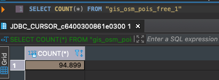

# Visualize a Spatial Dataset on SAP HANA Database in SAP HANA Cloud
<!-- description --> Learn how to upload and visualize spatial data on a base map with QGIS and SAP HANA database in SAP HANA Cloud.

## Prerequisites
- Ensure that your SAP HANA database instance within your SAP HANA Cloud trial account is **running** before you proceed.
- You have connected QGIS to your SAP HANA database in SAP HANA Cloud. If not, we recommend you complete the tutorial [Connect QGIS to SAP HANA database in SAP HANA Cloud](hana-cloud-trial-qgis-1).

## You will learn
- How to upload a spatial dataset to SAP HANA database in SAP HANA Cloud
- How to add a base map to QGIS project
- How to add vector data to base map

## Intro
This tutorial group will comprise of the following tasks:

1. Install SAP HANA ODBC Driver

2. Install QGIS

3. Connect QGIS to SAP HANA database in SAP HANA Cloud

4. **Upload your first spatial dataset**

5. **Visualize data on a base map**

6. Pushing down Spatial Workload to SAP HANA database in SAP HANA Cloud

> This tutorial will cover the tasks **four** and **five** of this list.

What have you achieved so far? You have created an SAP HANA database within the SAP HANA Cloud trial and connected it to QGIS via ODBC. Currently, this database does not contain spatial data. We will change this in the next steps. The good news is that you do not need any database tooling to upload your first dataset. You will simply use QGIS.

---

### Download the spatial dataset

<!-- border -->

As suggested in [this blog](https://blogs.sap.com/2021/02/23/qgis-3.18-supports-sap-hana-cloud/) shown above, you can use the [OpenStreetMap](https://download.geofabrik.de/) data provided by `Geofabrik`. Let's start by looking at the point of interest data in the area of SAP's Headquarter in Waldorf, Germany.

Download the [Shapefile (.shp.zip)](https://download.geofabrik.de/europe/germany/baden-wuerttemberg/karlsruhe-regbez-latest-free.shp.zip) for the **`Regierungsbezirk`** [Karlsruhe](https://download.geofabrik.de/europe/germany/baden-wuerttemberg.html). You can think of a Shapefile being a file-based database for geospatial data. Learn more about Shapefile from [here](https://de.wikipedia.org/wiki/Shapefile).

### Import dataset into the database

1. Open **QGIS** and locate the downloaded file **(do not unzip!)** in the browser on the left side.

2. The file can be further expanded in the browser. Do this and locate the layer called **`gis_osm_pois_free_1`**.

3. Locate your database connection in the browser and expand it twice, so that you can see the schema. If you followed the steps above, the schema will be called **DBADMIN**.

4. And here comes the magic: Drag and Drop the **`gis_osm_pois_free_1`** layer onto your **DBADMIN** schema.

5. You have successfully imported your first spatial dataset into your SAP HANA database within the SAP HANA Cloud trial!

6. If you need confirmation, you can open the SAP HANA Database Explorer or **`DBeaver`** and check for the table that has been created.

    <!-- border -->

### Add base map to QGIS project

> We now have stored **points of interest (POI's)** with its coordinates in our database. This kind of data (i.e. points, lines, polygons, etc.) given by coordinates is called [**vector data**](https://en.wikipedia.org/wiki/GIS_file_formats#Vector). The vector data can be printed onto a map or even satellite image (which is considered [**raster data**](https://en.wikipedia.org/wiki/GIS_file_formats#Raster)).
>
> So, we need to add two different layers to our QGIS project:
>
> 1. A base map (e.g. street map or satellite image)
> 2. The data plotted onto this map (vector data that is managed by SAP HANA Cloud)

Follow these steps to add a base map to QGIS project:

1. In the browser, left click on **XYZ Tiles** and choose **New Connection**.

    <!-- border -->

2. A dialog for a new tile service opens.

3. Enter **Google Maps Satellite** as a name.

4. Enter **`https://mt1.google.com/vt/lyrs=s&x={x}&y={y}&z={z}`** as a URL.

5. Set the Max. Zoom Level to **19**.

6. Confirm with **OK**.

7. Locate **Google Satellite** in the browser under XYZ Tiles.

8. Double-click on **Google Maps Satellite** to add the base layer with satellite imagery.

### Add vector data to base map

Follow the steps to add all the fountains around the SAP Headquarter:

1. Locate the dataset that we have previously uploaded to SAP HANA in the browser. In this example, this is the path **`SAP HANA`** > **`hctrial`** > **`DBADMIN`** > **`gis_osm_pois_free_1`**.

    <!-- border -->

2. Double-click on **`gis_osm_pois_free_1`** to add another layer on top of the base map.

3. In the list of visible layers at the left bottom, right-click on the newly added layer and choose **Zoom to Layer(s)**. This will determine the bounding box of the respective data and zoom the map correspondingly.

4. We now see all POI's of the Karlsruhe region on the map. Let's filter out only the fountains. Right-click again on the layer and choose **Filter**.

5. On the dialog that opens, select **`fclass`** = **`fountain`** as the Filter Expression.

6. Confirm with **OK**.

7. Zoom in to the SAP Headquarter. You will see two fountains – the one in the East being the fountain in front of Building 3. Take some time to look around, as this is an exploration.

8. On the top bar of the window, choose the **Identify Features** tool. Your cursor will change and include a small information icon when hovering over the map.

9. Click on the point of the fountain and you will see the corresponding record in the database on the right-hand side.

You now know how to visualize data from SAP HANA in QGIS. If you like, you can play a bit with the filters and change the base map.

> You have completed the second tutorial of this tutorial group. In the next tutorial, learn how to push down Spatial Workload to SAP HANA database in SAP HANA Cloud.

### Test yourself

---
