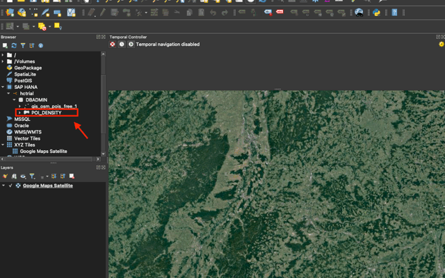
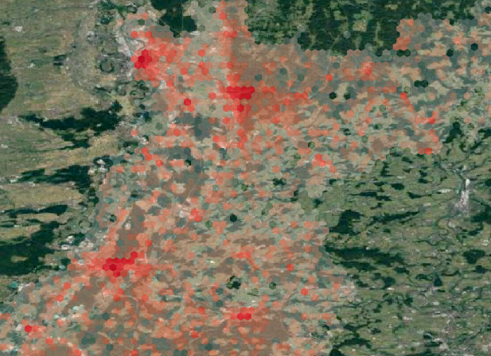

# Push Down a Spatial Workload to SAP HANA Database in SAP HANA Cloud
<!-- description --> Learn how to create SQL views using hexagonal clustering and QGIS and apply basic styling on a base map.

## Prerequisites
- Ensure that your SAP HANA database instance within your SAP HANA Cloud trial account is **running** before you proceed.
- You have completed the visualization of spatial dataset on a base map. If not, complete the tutorial [Visualize Spatial Dataset on SAP HANA database in SAP HANA Cloud](hana-cloud-trial-qgis-2).


## You will learn
- How to create an SQL view using hexagonal clustering
- How to add an SQL view into QGIS
- How to apply basic styling to the SQL view on base map


## Intro
This tutorial group will comprise of the following tasks:

1. Install SAP HANA ODBC Driver

2. Install QGIS

3. Connect QGIS to SAP HANA Cloud

4. Upload your first spatial dataset

5. Visualize data on a base map

6. **Pushing down the spatial workload to SAP HANA database in SAP HANA Cloud**

> This tutorial will cover the **sixth** task.

Finally, let's check how to execute spatial workloads on the database level and get the results to QGIS. Since all spatial processing functions on SAP HANA Cloud are part of the SQL syntax, the best way to go is to create a SQL view which can be consumed in QGIS.
So, you need to open the SAP HANA Database Explorer, create an SQL View and consume it in QGIS.


---

### Create a SQL view using hexagonal clustering

Follow the steps to create an SQL view doing a hexagonal clustering and counting the number of POI's (points of interest) per cluster:

1. Go to the SAP BTP cockpit and navigate to your SAP HANA database instance in SAP HANA Cloud. You should see your created and running instance.

2. Click on **Actions** and **Open in SAP HANA Database Explorer**.

3. You may be prompted for your user credentials. Use the same user, that you have setup in QGIS (i.e. DBADMIN).

4. Click on the SQL icon in the upper left corner to open a new SQL Console.

5. Copy the following SQL statement into the SQL Console and execute:

    ```
CREATE VIEW POI_DENSITY AS
(
	SELECT
		ST_ClusterId() AS cluster_id,
		ST_ClusterCell() AS cluster_cell,
		COUNT(*) AS count_pois
	FROM "gis_osm_pois_free_1"
	GROUP CLUSTER BY "geom" USING HEXAGON X CELLS 100
)
    ```


You can find more information on [Spatial Clustering](https://help.sap.com/viewer/bc9e455fe75541b8a248b4c09b086cf5/2020_04_QRC/en-US/7eb3c0e6bbf04fc6bcb9809d81533e6f.html) in the [SAP HANA Spatial Reference](https://help.sap.com/viewer/bc9e455fe75541b8a248b4c09b086cf5/2020_04_QRC/en-US/e1c934157bd14021a3b43b5822b2cbe9.html).


### Add SQL view into QGIS

Follow the steps to bring the data into QGIS:

1. Open **QGIS** and add a base map via double-click.

2. Locate SQL view **`POI_DENSITY`** in the browser ( **`SAP HANA`** > **`hctrial`** > **`DBADMIN`** > **`POI_DENSITY`**) and double-click to add it to the map.

    <!-- border -->


### Apply basic styling to the map

1. Right-click the **`POI_DENSITY`** layer and choose **Properties**. Make sure to do this in the Layers tab rather than in the browser!

2. In the following dialog, you can adapt the layer styling. Choose **`Symbology`** on the left side.

3. On the very top, change the drop-down value from Single Symbol to **Graduated**.

4. As a value, choose our database field **`COUNT_POIS`**.

5. Choose a suitable **Color ramp** (i.e. Reds).

6. Change the Mode from Equal Count (Quantile) to **Logarithmic Scale**.

7. Determine the number of Classes in the lower right corner, i.e. 8.

8. Click the **Classify** button to create the color ranges.

9. Confirm with **OK**.

You should now see a heatmap-like visualization on your map. The hexagonal cells are colored according to the number of POI's in the cell.

The heatmap-like visualization makes it easy to spot the major cities around the SAP Headquarter: Karlsruhe, Mannheim and Heidelberg.

<!-- border -->

As a challenge, why don't you try to add some transparency to the hexagonal cells?


### Learn more about SAP HANA Spatial

**Congratulations!** You have accomplished the setup of a playground for spatial analytics. If you would like to dive into more sophisticated scenarios, check out some material on **Spatial Data Science** and how to add the geospatial dimension to machine learning models.

> A good starting point is this article on [Towards Data Science](https://towardsdatascience.com/the-impact-of-geospatial-features-on-machine-learning-3a71c99f080a?source=friends_link&sk=c38d7707eb88f853ffe19486e6aa3dd4). Note that this is a high-level overview. Blogs with more detailed instructions are linked in the article.

To get to know more details about SAP HANA Spatial and Graph in particular, watch the video recordings of SAP's **`Devtoberfest`** on [YouTube](https://www.youtube.com/playlist?list=PL6RpkC85SLQA8za7iX9FRzewU7Vs022dl). This series of 11 videos is the most complete recording available online.

Also, read [this blog](https://cutt.ly/saphanaspatial) gathering all the community content around SAP HANA Spatial. What you see in this blog is a rather technical walk-through to get up-to-speed with SAP HANA Spatial. If you are coming from a GIS background, you may want to know why you should use SAP HANA Spatial over any other GIS client – with or without database persistency or push-down of spatial workload.

Read [this blog](https://blogs.sap.com/2020/02/12/the-four-advantages-of-arcgis-on-hana/) outlining the major advantages of running your **`ArcGIS`** on SAP HANA Cloud. While it is specifically tailored to **`ArcGIS`**, the outlined qualities are valid irrespective of the actual GIS client.

> Follow our tag in the [**SAP Community**](https://blogs.sap.com/tags/73554900100800002881/) to stay up-to-date on the latest updates and newest content! For more learning materials on **SAP HANA Cloud**, [click here](https://community.sap.com/topics/hana-cloud).


### Test yourself


---
