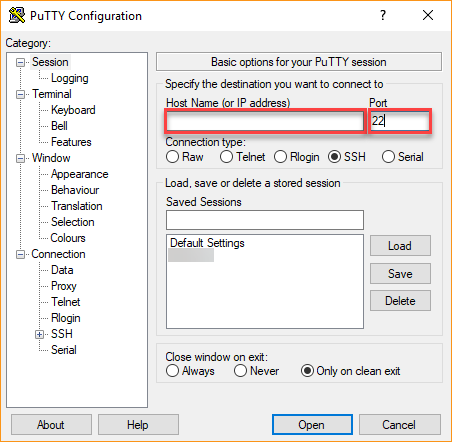
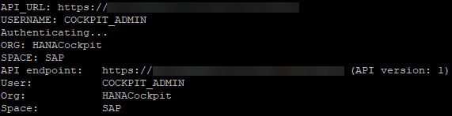

## Prerequisites  
 - Install the Python programming language on the computer that will call the REST endpoints

## Details
### You will learn
  - How to obtain a service key for authentication and authorization
  - How to obtain your SAP HANA cockpit host name and appropriate port numbers
  - How to set up the required Python packages and functions to call the SAP HANA cockpit REST endpoints

---

[ACCORDION-BEGIN [Step 1: ](Log in to the cockpit host's XSA)]
You will first need to log in to the cockpit machine, for example using **PuTTY** with your host and port number.



Run `su - h4cadm` to switch to the operating system user and enter your password.
Navigate to the XSA binaries folder:
```
cd /hana/shared/H4C/xs/bin/
```

Run the `./xs-admin-login` command and enter your XSA admin user password.
The expected output should be similar to the following image:



**Note:** if you installed the cockpit's persistence on an existing SAP HANA system, make sure you use the correct organization and space names by running the command `xs login -o <org_name> -s <space_name>`.

[DONE]

[ACCORDION-END]

[ACCORDION-BEGIN [Step 2: ](Generate the service key)]
The service key that you need for authentication and authorization uses is a block of JavaScript Object Notation (JSON) code; you store it in a file that your application can load and use.

Run the following command to generate a service key, replacing `<tool-name>` with a name of your choice:
```
xs create-service-key cockpit-uaa <tool-name>-cockpit-uaa
```

[DONE]

[ACCORDION-END]

[ACCORDION-BEGIN [Step 3: ](Store the service key)]
Store your generated service key in a `.json` file by entering the command:
```
xs service-key cockpit-uaa <tool-name>-cockpit-uaa > <tool-name>-service-key.json
```

You have now created your own service key file! Open and edit it by running the command:
```
edit <tool-name>-service-key.json
```

Finally, press **`Insert`** and remove the lines before and after the curly brackets.
The original file should take this similar form:
```
Getting service key "demo-cockpit-uaa" for service instance "cockpit-uaa" ...

{
  "tenantmode" : "dedicated",
  "clientid" : "sb-cockpit!i1",
  "verificationkey" : "<REDACTED>",
  "xsappname" : "cockpit!i1",
  "identityzone" : "uaa",
  "identityzoneid" : "uaa",
  "clientsecret" : "<REDACTED>",
  "url" : https://host:30032/uaa-security
}

OK

```

Change it to look similar to this form:
```
{
  "tenantmode" : "dedicated",
  "clientid" : "sb-cockpit!i1",
  "verificationkey" : "<REDACTED>",
  "xsappname" : "cockpit!i1",
  "identityzone" : "uaa",
  "identityzoneid" : "uaa",
  "clientsecret" : "<REDACTED>",
  "url" : https://host:30032/uaa-security
}
```

Press **`Esc`** and then type `:wq` to save and exit the editing mode. Copy/move your service key file to the computer that will run the API endpoints.

[VALIDATE_1]

[ACCORDION-END]

[ACCORDION-BEGIN [Step 4: ](Obtain the necessary port number)]
To call an API endpoint, you will need to know your port number for the app `cockpit-adminui-svc`.
Issue the following command:
```
xs apps | grep cockpit-adminui-svc
```

The output should look similar to this and your port number for `cockpit-adminui-svc` is the number at the end of the URL.


> For the cockpit GET API endpoints `GroupsForUserGet` and `GroupResourcesGet` specifically, you will need your port number for `cockpit-landscape-svc`. Run the following command to obtain this number when necessary:
```
xs apps | grep cockpit-landscape-svc
```

[DONE]

[ACCORDION-END]

[ACCORDION-BEGIN [Step 5: ](Obtain an OAuth Token)]
OAuth tokens are granted to cockpit users, so you must identify a cockpit user you can employ to run the cockpit APIs. In order to obtain an OAuth token, you will use the service key that you just created.

Create a new file on your Python IDE. Make sure that it is saved in the same folder as the service key file that you just created.

Copy the following code to this file to import the necessary packages to run cockpit API functions. Make sure that you have installed these packages into your Python IDE before running the program.
```Python
import requests
import json
import urllib3
```

Enter the following function to generate an OAuth token for later use:
```Python
def getServiceKeyJSON(fileName):
    contents = open(fileName).read()
    return json.loads(contents)

def get_oauth_token(client, service_key):
    serviceKeyJSON = getServiceKeyJSON(service_key)

    oauthURI = serviceKeyJSON['url'] + '/oauth/token'
    oauthResponse = client.post(oauthURI, verify=False, data={
        'grant_type': 'password',
        'username': COCKPIT_USER_NAME,      # Replace with your cockpit username (e.g. COCKPIT_ADMIN)
        'password': COCKPIT_USER_PASSWORD,  # Replace with your cockpit user's password
        'client_id': serviceKeyJSON['clientid'],
        'client_secret': serviceKeyJSON['clientsecret']
    })

    authorization = 'Bearer ' + oauthResponse.json()['access_token']
    return authorization

def get_header(authorization):
  return {'Authorization': authorization,
          'Content-Type': 'application/json'}
```

Copy the following code to disable warnings, get a handle on the client session and finally, obtain the OAuth token. Replace *<host.domain.com>* and *<port for cockpit-adminui-svc>* with your own identities, and *demo-service-key.json* with the name of your own service key file.
```Python
baseURL = 'https://' + '<host.domain.com>' + ':' + '<port for cockpit-adminui-svc>'
urllib3.disable_warnings(urllib3.exceptions.InsecureRequestWarning)
client = requests.Session()
authorization = get_oauth_token(client, 'demo-service-key.json')
```

You are now ready to use the SAP HANA cockpit API REST endpoints.

[DONE]

[ACCORDION-END]

---
