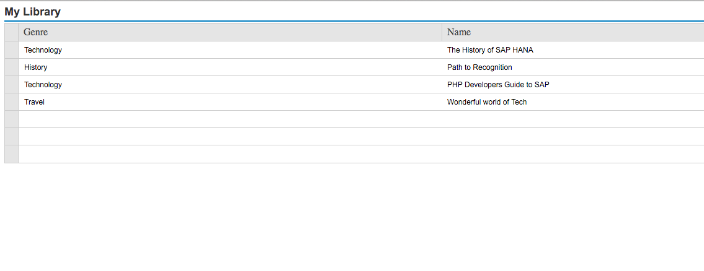

## Prerequisites  
- **Proficiency:** Beginner
- **Tutorials:** [Enable XSODATA in your SAP HANA XSC Application](https://www.sap.com/developer/tutorials/hana-xsodata.html)

## Next Steps
 - Select a tutorial from the [Tutorial Navigator](https://www.sap.com/developer/tutorial-navigator.html) or the [Tutorial Catalog](https://www.sap.com/developer/tutorials.html)


## Details

### You will learn  
How to consume a simple `xsodata` service.

### Time to Complete
Beginners might take **10 minutes** to execute this tutorial.


[ACCORDION-BEGIN [Step 1: Modify your Index](Modify your Index)]

Now that you have created your OData service in the previous tutorial it is time to actually incorporate your service into your application directly. For this you will modify the file called `index.html`

What you will do now is add a basic table control using the SAPUI5 framework.

```
<!DOCTYPE HTML>
<html>
  <head>
    <meta http-equiv="X-UA-Compatible" content="IE=edge" />
    <meta charset="UTF-8"/>
    <title>Library</title>  
    <script id='sap-ui-bootstrap'
        src='/sap/ui5/1/resources/sap-ui-core.js'  
        data-sap-ui-theme='sap_goldreflection'  
        data-sap-ui-libs='sap.ui.core,sap.ui.commons,sap.ui.table'>
    </script>

</head>
<body>
	<div id="ctable"/>

</body>
</html>
```

[ACCORDION-END]

[ACCORDION-BEGIN [Step 2: Incorporate your service](Incorporate your service)]

Now to add in JavaScript code to to add the UI5 control. Add this code in right before the `</body>` line at the bottom of the page.

```
    <script language="JavaScript">
        var aData;

        //Create an instance of the table control
        var oTable = new sap.ui.table.Table({
        	title: "My Library",
        	visibleRowCount: 7,
        	firstVisibleRow: 3,
        	selectionMode: sap.ui.table.SelectionMode.Single
        });

        //Define the columns and the control templates to be used
        var oColumn = new sap.ui.table.Column({
        	label: new sap.ui.commons.Label({text: "Category"}),
        	template: new sap.ui.commons.TextView().bindProperty("text", "CATEGORY"),
        	sortProperty: "CATEGORY",
        	filterProperty: "CATEGORY",
        	width: "100px"
        });
        oTable.addColumn(oColumn);

        //Define the columns and the control templates to be used
        var oColumn = new sap.ui.table.Column({
        	label: new sap.ui.commons.Label({text: "Name"}),
        	template: new sap.ui.commons.TextView().bindProperty("text", "BOOKNAME"),
        	sortProperty: "BOOKNAME",
        	filterProperty: "BOOKNAME",
        	width: "100px"
        });
        oTable.addColumn(oColumn);

        //Create a model and bind the table rows to this model
        var oModel = new sap.ui.model.json.JSONModel();
        oModel.setData({modelData: aData});
        oTable.setModel(oModel);
        oTable.bindRows("/modelData");

        //Initially sort the table
        oTable.sort(oTable.getColumns()[2]);

        //Bring the table onto the UI
        oTable.placeAt("ctable");

	</script>
```

[ACCORDION-END]

[ACCORDION-BEGIN [Step 3: Call your service](Call your service)]

The last bit is to add the call to the service to your code and you will have a complete application, or at least complete in the sense that is shows your data. Add the following bit right after your variable definition `var aData`

```
        $.ajax
        ({
          type: "GET",
          url: "/codejam/services/library.xsodata/library/?$format=json",
          dataType: 'json',
          async: false,
          success: function (data, status){
        	  aData = data.d.results;
          }
        });
```

[ACCORDION-END]

[ACCORDION-BEGIN [Step 3: Deploy, Run and Test the Application](Deploy, Run and Test the Application)]

Now the application is ready to be tested. As you are developing with the SAP HANA Web-based Development Workbench the application is already deployed and activated. So you can immediately continue to test it:

Select the `index.html` file to enable the Run on Server in the toolbar. Then click the Run on Server button:

The application will open in your browser and greet you with My Library:



[ACCORDION-END]

### Optional: Related Information
[SAP HANA Development Information - Official Documentation](https://help.sap.com/hana_platform#section6)
