## Prerequisites  
- [Develop your first SAP HANA XSC application](http://www.sap.com/developer/tutorials/hana-web-development-workbench.html)

## Next Steps
- [Enable XSODATA in your SAP HANA XSC application](http://www.sap.com/developer/tutorials/hana-xsodata.html)

## Details

### You will learn  
1. How to create a simple schema and table.
2. Importing data automatically via a CSV file.
3. Preparing and executing a very simple SQL query on the table.

### Time to Complete
Beginners might take **10-15 minutes** to execute this tutorial.

[ACCORDION-BEGIN [Step 1: Create your data sub package](Create your data sub package)]

Your first step will be to create a package to organize your files. To do this you will create a new package under your existing `codejam` package and call it `data`.


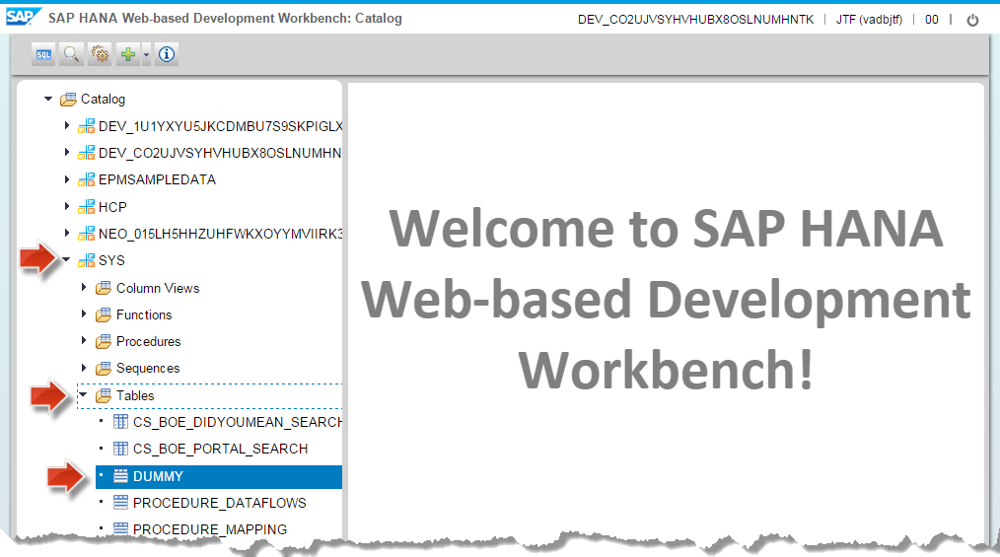

[ACCORDION-END]

[ACCORDION-BEGIN [Step 2: Create your schema](Create your schema)]

Now that you have a location for your objects you will create your schema file, this will be a new file called `MYCJ` which is short for "My CodeJam" but you can actually call it anything you like. Remember to include the `.hdbschema` ending.

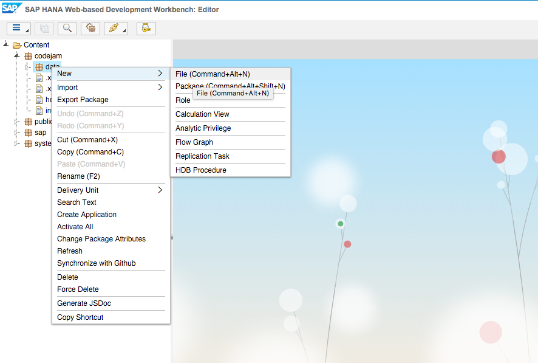

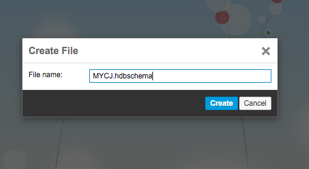

```js
schema_name="MYCJ";
```
[ACCORDION-END]

[ACCORDION-BEGIN [Step 3: Create your table](Create your table)]

Now that you have a home for your table and other data objects, you will go ahead and define a simple table. So it's time for a new file called `mydata.hdbdd`, again you can call it whatever you like but remember the `.hdbdd` ending.

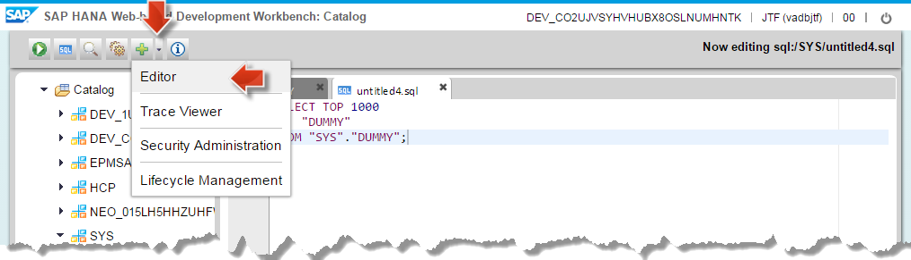

In this file you will define your table entities.

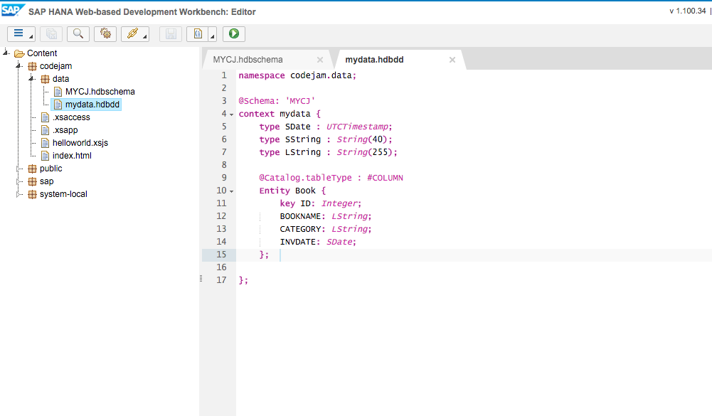

```
namespace codejam.data;

@Schema: 'MYCJ'

context mydata {

 	type SDate : UTCTimestamp;
 	type SString : String(40);
 	type LString : String(255);

 	@Catalog.tableType : #COLUMN
 	Entity Book {
 		key ID: Integer;
        BOOKNAME: LString;
        CATEGORY: LString;
        INVDATE: SDate;
    };
};
```

Once you save this, you should see (provided no mistakes in typing) the following output in the console.

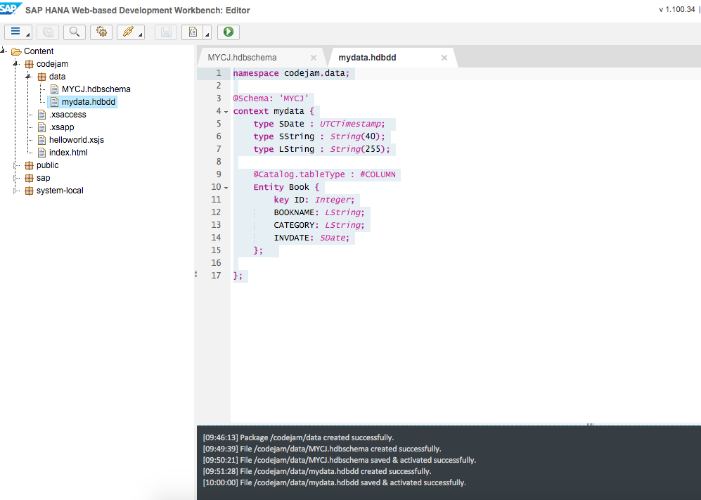

[ACCORDION-END]

[ACCORDION-BEGIN [Step 4: Sample data import](Sample data import)]

Now for a bit of sample data into your CSV file and then you can automatically import that into the new table.

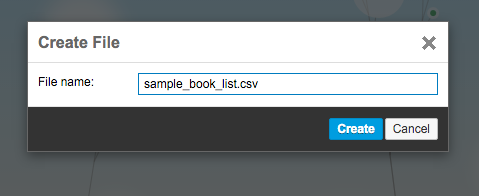

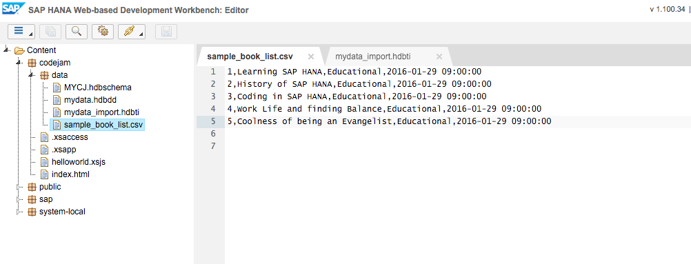

```
1,Learning SAP HANA,Educational,2016-01-29 09:00:00
2,History of SAP HANA,Educational,2016-01-29 09:00:00
3,Coding in SAP HANA,Educational,2016-01-29 09:00:00
4,Work Life and Finding Balance,Educational,2016-01-29 09:00:00
5,Coolness of being an Evangelist,Educational,2016-01-29 09:00:00
```

Now you will create the automatic import file, you can name the file anything you like but ensure it has the `.hdbti` ending.

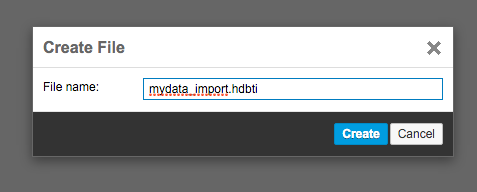


```
import	= 	[ 
    			{ 
					cdstable  =	"codejam.data::mydata.Book";
					file = "codejam.data:simple_book:list.csv"; 	     
					header = false;		
    			} 
     		];
```

Once you save the file, your data should automatically import into your table.

[ACCORDION-END]

[ACCORDION-BEGIN [Step 5: Create a role for access](Create a role for access)]

In order to now view the data you will need to ensure your user has access to it, for this you will need to create a new role and assign it to your user, this is the one that you log into the system with or any additional users your wish to have access to your objects.

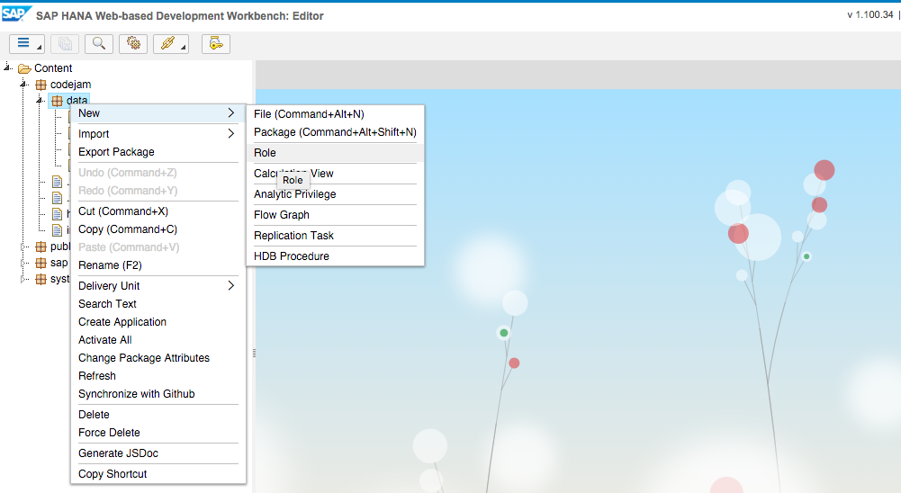

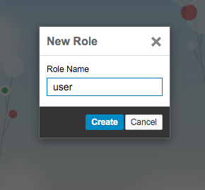

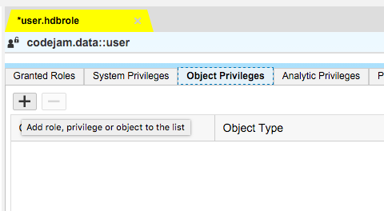


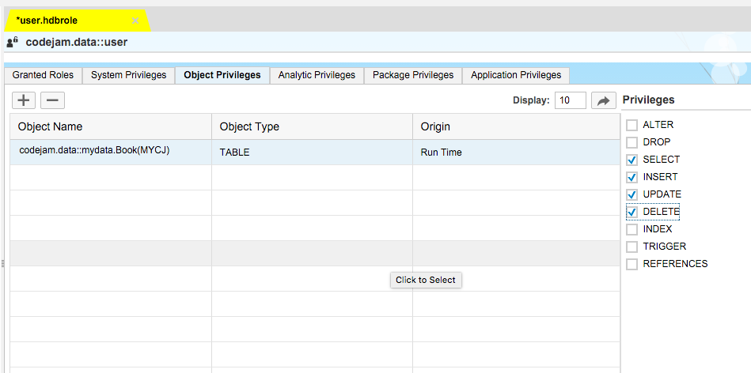

[ACCORDION-END]

[ACCORDION-BEGIN [Step 6: Assigning the role to your user](Assigning the role to your user)]

Now you will need to open the "Security" tab and add this new role to your user.

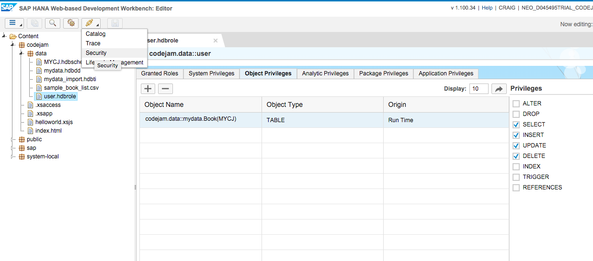

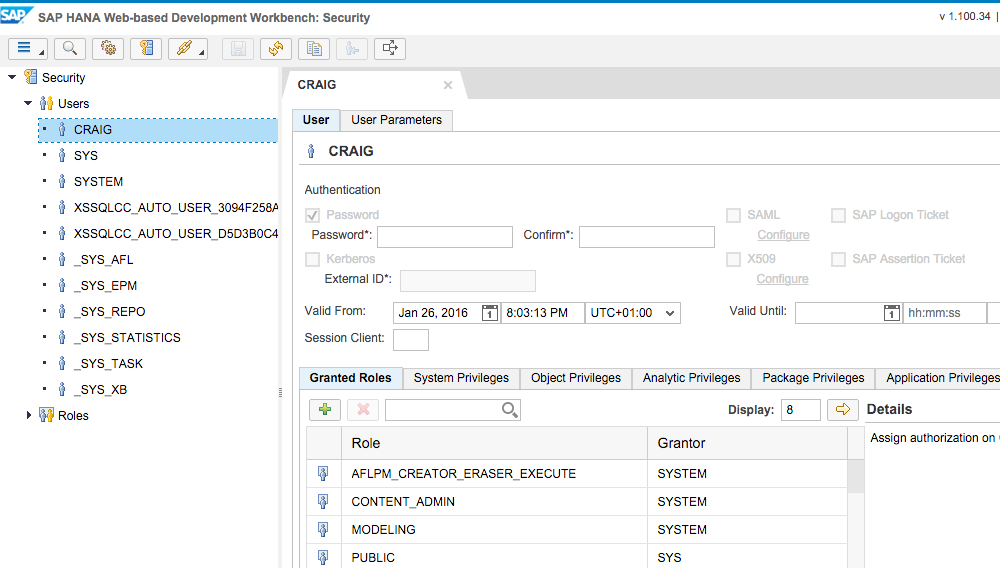

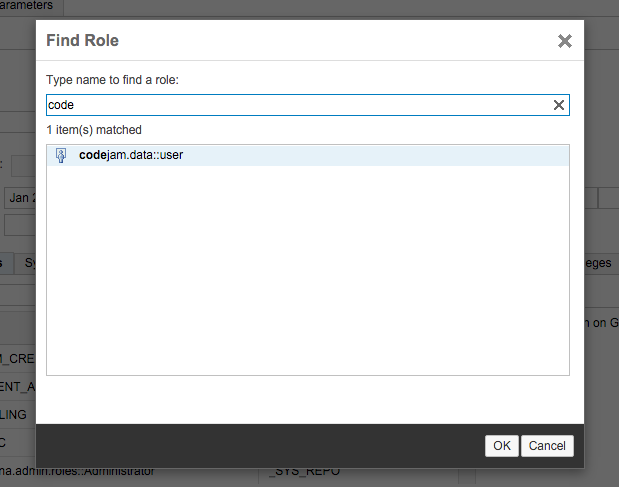

[ACCORDION-END]

[ACCORDION-BEGIN [Step 7: View your table](View your table)]

Now you are set to view the data from the "Catalog" tab.


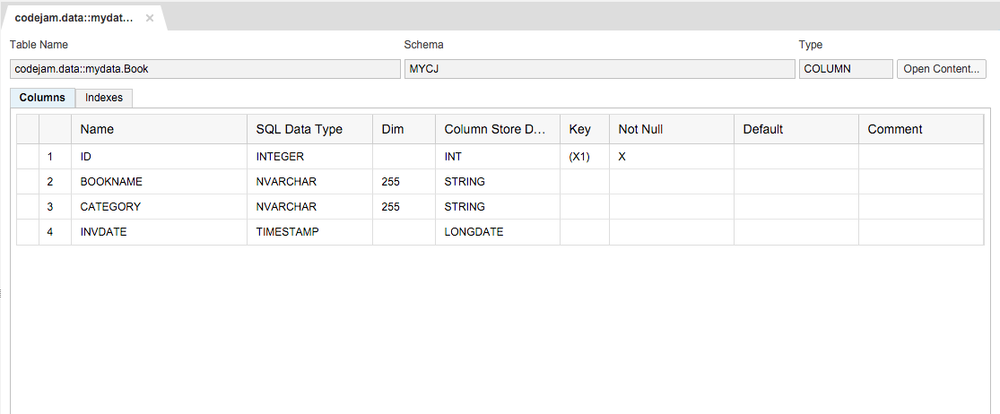

The resulting view shows the SQL query executed when you clicked the "Open Content" button.

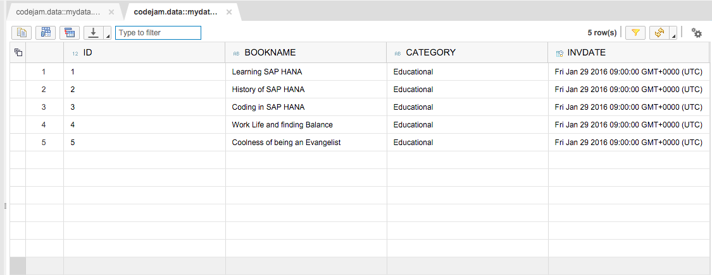

[ACCORDION-END]

[ACCORDION-BEGIN [Step 8: Access your data via coding](Access your data via coding)]

From the editor you will open the existing `mylibrary.xsjs` and modify the code.

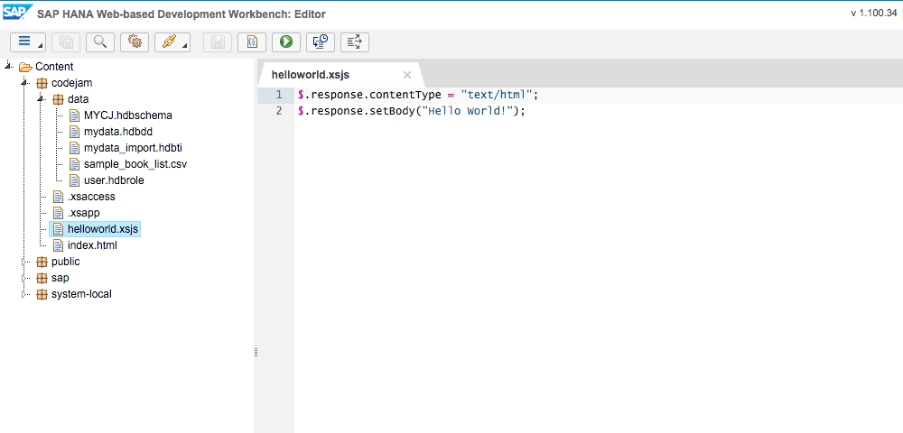

Replace the current code in the `mylibrary.xsjs` file with the following code that opens a database connection, prepares a simple SQL statement, executes it and returns the result of the query:

```
$.response.contentType = "text/html";
var output = "My Personal Library!<br><br>";

//Open a database connection
var conn = $.db.getConnection();

//Prepare a simple SQL statement on the system table "DUMMY"
var pstmt = conn.prepareStatement('SELECT * FROM "MYCJ"."codejam.data::mydata.Book"');

//Execute the query
var rs = pstmt.executeQuery();

//Check the query result
if (!rs.next()) {
    //Something went wrong: Return an error
    $.response.setBody("Failed to retrieve data");
    $.response.status = $.net.http.INTERNAL_SERVER_ERROR;
} else {
    //All went fine: Return the Query result
    output = output + "This is the response from my SQL:<br><br>";
    output = output + rs.getString(1) + ' ' +  rs.getString(2) + ' ' +  rs.getString(3) + ' ' +  rs.getString(4) + '<br>';
}

//Close the database connection
rs.close();
pstmt.close();
conn.close();

//Return the HTML response.
$.response.setBody(output);
```

Save the file using the Save button or by pressing `ctrl+s`. Again, the successful save is confirmed in the console.

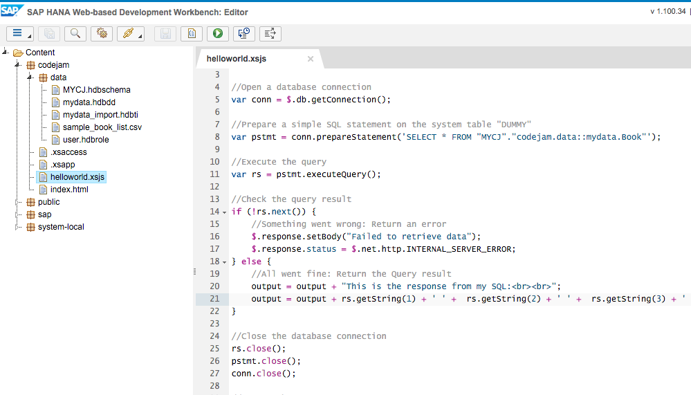

Now you are ready to run the application.

You can even loop through all records like this,

```
    while (rs.next()) {
        output = output + rs.getString(1) + ' ' +  rs.getString(2) + ' ' +  rs.getString(3) + ' ' +  rs.getString(4) + '<br>';
    }
```

[ACCORDION-END]

[ACCORDION-BEGIN [Step 9: Deploy, Run and Test the Application](Deploy, Run and Test the Application)]

Now the application is ready to be tested. As you are developing with the Web-based Development Workbench the application is already deployed and activated so you can immediately continue to test it.

Select the `mylibrary.xsjs` file to enable the Run on Server in the toolbar. Then click the `Run on Server` button:

The application will open in your browser and greet you with **My Personal Library** and the just accessed data from your table:

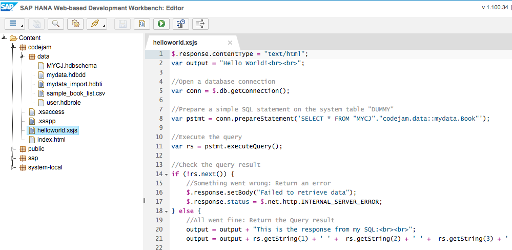

Congratulations: You have just accessed your first data on SAP HANA!

[ACCORDION-END]

### Optional: Related Information
[SAP HANA Development Information - Official Documentation](http://help.sap.com/hana_platform#section6)

