## Prerequisites
- An SAP HANA database such as SAP HANA Cloud trial or the SAP HANA, express edition that includes the SAP HANA database explorer
- You have completed the first 3 tutorials in this group

## Details
### You will learn
  - How a schema filter can be used in the database browser
  - How to explore and examine objects in an SAP HANA database

---

[ACCORDION-BEGIN [Step 1: ](Schemas)]

1. Many objects within an SAP HANA database belong to a schema.  A schema allows objects, like tables, views, functions, and stored procedures, to be grouped together.  The current schema in the SQL console is shown at the top of the SQL console.  

    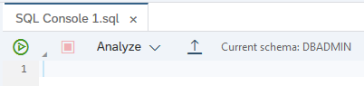

    The schema can be changed by executing the SQL statement below:

    ```SQL
    SET SCHEMA HOTEL;
    ```

    When performing a select against an object in the currently-set schema, the schema name can be omitted.

    ```SQL
    SET SCHEMA USER1;
    SELECT * FROM HOTEL.CITY;  --succeeds
    SELECT * FROM CITY;  --fails
    SET SCHEMA HOTEL;
    SELECT * FROM CITY; --succeeds
    ```

2. When browsing objects in the database browser, the schema name is shown for each object if a schema filter is not set.

    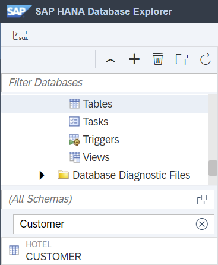

    A schema filter can be applied.

    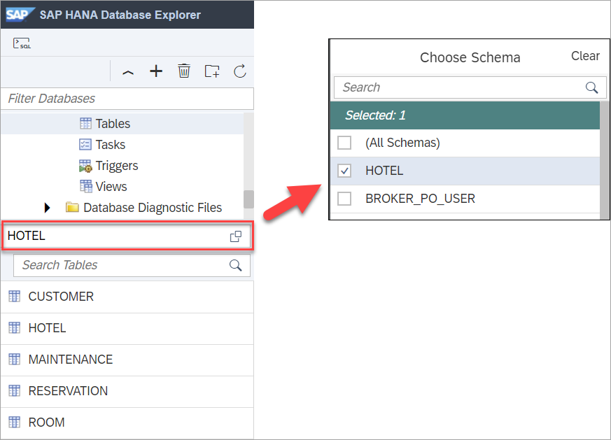

    The schema filter persists between reloads of the SAP HANA database explorer.

[DONE]
[ACCORDION-END]

[ACCORDION-BEGIN [Step 2: ](Table editor)]

1. Right-click **Tables** in the catalog tree and choose **Show Tables**.  

    

    A list of all of the tables appears along with additional metadata.

    

2.  Filters can be applied to the columns.  The filter is applied to the data that is already fetched.

    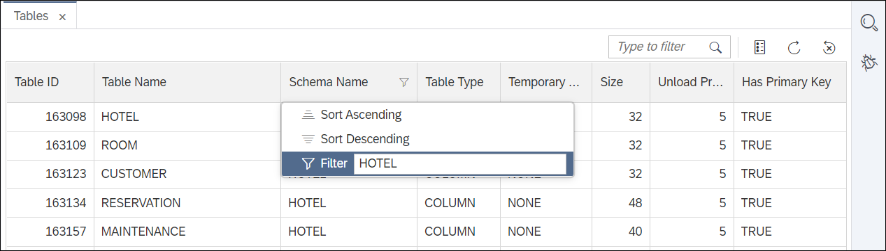


3. The set of columns to be displayed can be set.

    

4. Right-click the name of a table in the tree and select **Open**.  The editor for the table opens in a new tab.

    

5. Examine the other tabs, such as **Runtime Information**, where further information about the table can be found. This information includes the total number of rows, disk size, and memory consumption for the table, as well as individual columns.

    

6. Click the button **Open Data**.  The table's rows are shown.

    

7. Values can be edited by selecting a cell, pressing enter, and typing in a new value.  New rows can be added by selecting the **+** button.  Changes must be saved by pressing the save button in order to commit them to the table.

    

8. The results can be saved to a comma-separated values (CSV) file.

    

9. Filters can be applied to the table using a set of dropdowns that build up a WHERE clause, which can select a subset of the data.  

    

    The following filter searches for hotels in California with a name containing `lo`.

    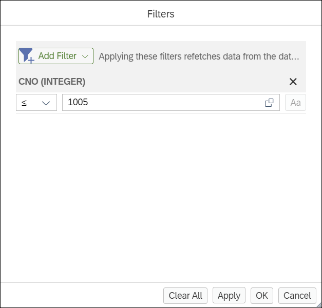

    Select the **SQL** button to see the generated query.

    


[DONE]
[ACCORDION-END]

[ACCORDION-BEGIN [Step 3: ](Analysis)]
An analysis view is provided to help get quick insights into the data of a table.

1. Right-click on the ROOM table and choose **Open Data**.

2. Click on the **Analysis** tab.

    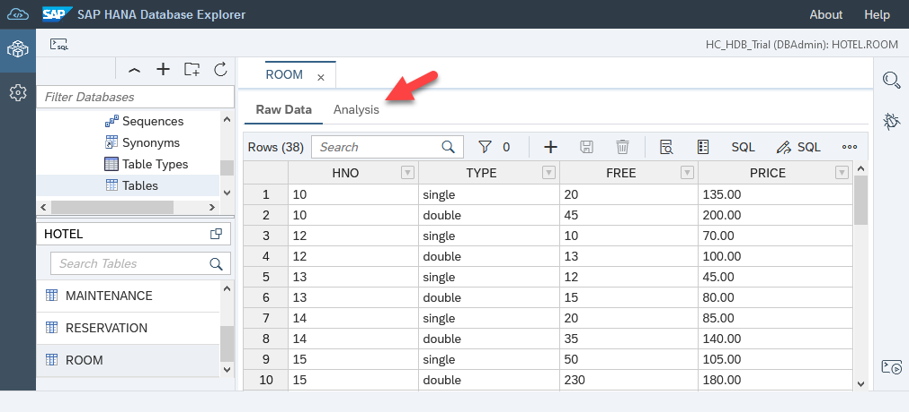

3. Create a chart showing how many reservations of each room type have been made.

    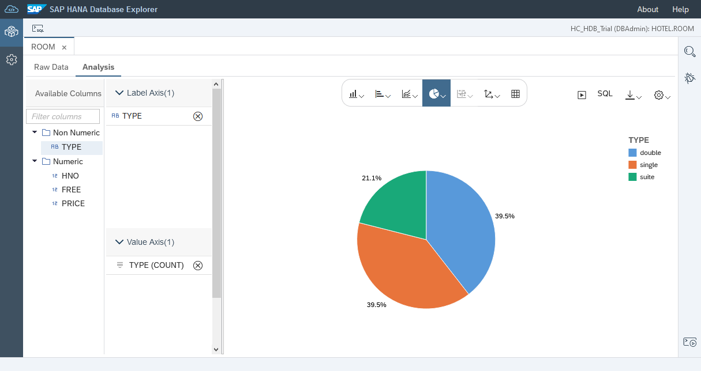

4. Create a chart showing the overall value of the bookings by room type.

    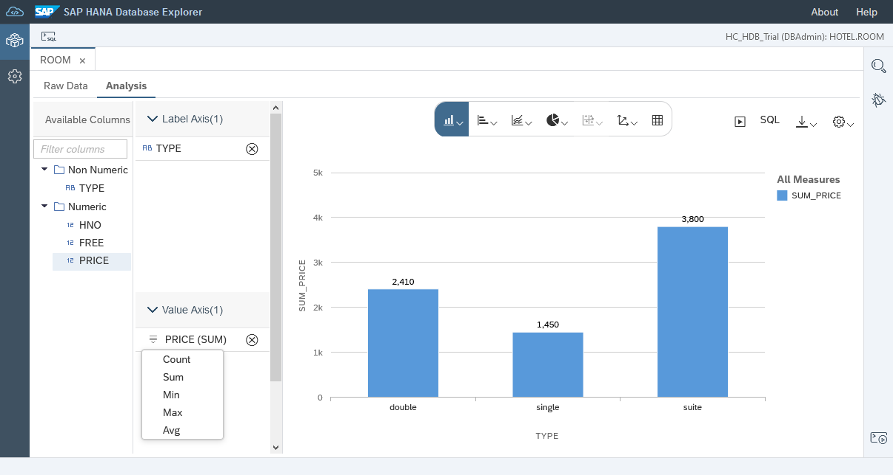

We can see that reservations for suites only make up a small part of the overall bookings but account for the largest share of the total revenue.

[DONE]
[ACCORDION-END]


[ACCORDION-BEGIN [Step 4: ](Additional features)]

1. Right-click the tab of an open object such as CITY and choose  **Display In Database Browser** to reveal the object in the database browser.

    

    The database browser then updates to display the selected object.

    

2.  A list of objects that make use of a selected object can be found using the **Find Dependencies** menu item.  

    Right-click the ROOM table and choose **Find Dependencies**.

    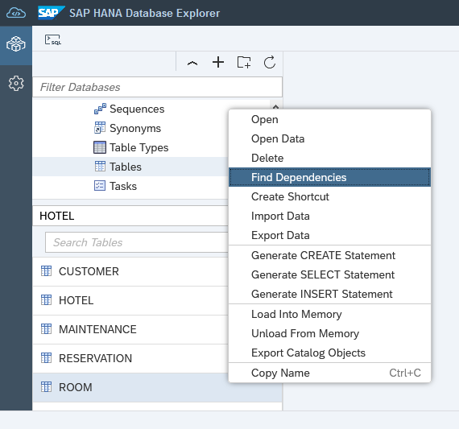

    As seen in the screenshot below, the ROOM table is used by the `AVERAGE_PRICE` function and the `HOTEL_ROOMS_VIEW` as well as triggers related to the foreign key between the ROOM and HOTEL tables.

    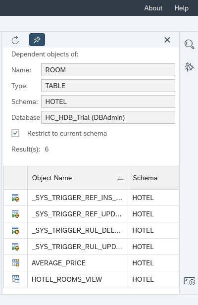

3. The SAP HANA database explorer has the ability to search for an object in one or more databases.

    Click the magnifying glass in the top right.  

    Enter **HOTEL** in the search field.  

    Select the database to search against.  

    Select **Function**, **View**, **Procedure**, and **Schema names**.  

    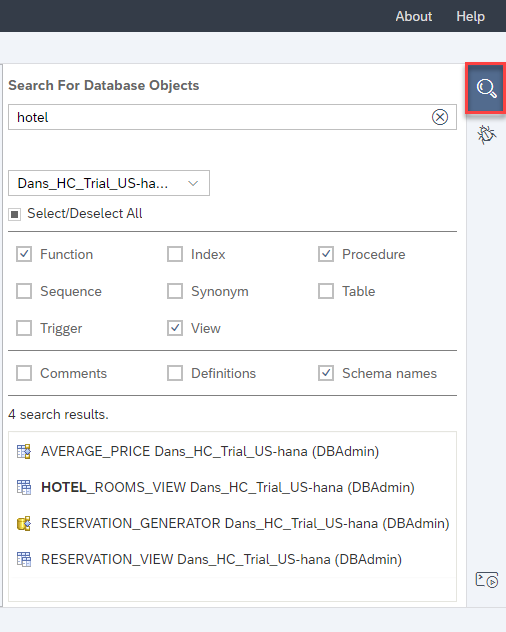

    The above search returned a function, view, stored procedure, and another view.

Congratulations! You have now used the database browser to view details of objects within an SAP HANA database and have become familiar with some of the features it provides.

[VALIDATE_1]
[ACCORDION-END]
