# Add Databases to the SAP HANA Database Explorer
<!-- description --> This tutorial will explore different instance types, such as SAP HANA Cockpit Database, SAP HANA Cloud, data lake Relational Engine, data lake Files, and SAP HANA Deployment Infrastructure (HDI) that can be added, along with the different operations that can be performed on them.

## Prerequisites
- An SAP HANA database such as SAP HANA Cloud free tier, trial or the SAP HANA, express edition that includes the SAP HANA database explorer

## You will learn
- How to add different instance types in the SAP HANA database explorer
- Additional operations that can be performed on an instance

## Intro
Instances in the SAP HANA database explorer represent SAP HANA, data lake Relational Engine, or data lake Files connections that you browse and interact with.  

SQL consoles are associated with a database instance.

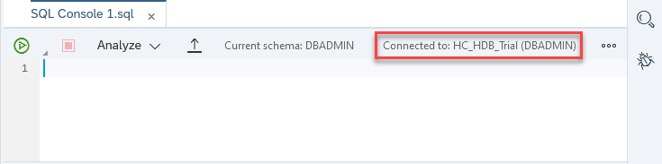

---

### Add an SAP HANA cockpit database instance


Instances defined in SAP HANA Cloud Central, the SAP BTP cockpit, or in SAP HANA cockpit can be opened in the SAP HANA database explorer.

1.  From SAP HANA Cloud Central, choose **Open in SAP HANA Database Explorer**.  

    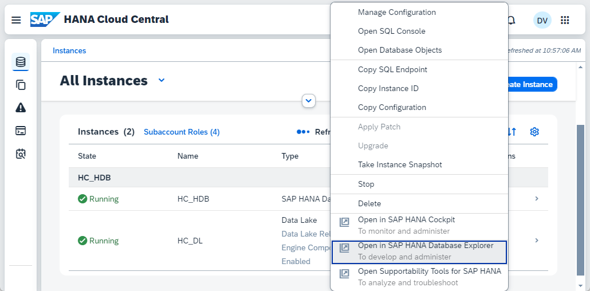

    >You may be prompted to enter database login credentials at this point.  Enter the DBADMIN or SYSTEM user credentials that were set when the instance was created.

    >---

    >The credentials can be saved so they do not need to be re-entered if they are entered into  SAP HANA Cloud Central, or SAP HANA cockpit.

    Notice that when the SAP HANA database explorer opens, the selected instance is the one from the selected tile or administered database.  Also note that the URL contains a `&databaseid=`.  

    If this URL is saved as a bookmark, each time the page is opened, the matching instance will be selected in the catalog browser.

    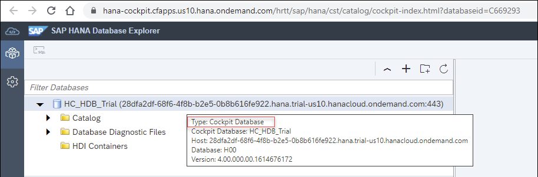

    Hover over the database to see a summary and note that the type is Cockpit Database.


### Add an SAP HANA database connection

Instances can also be added directly to the SAP HANA database explorer.  To connect to an SAP HANA Cloud or on-premise database, the host, port, user name, and  password must be provided.  

1.  In the SAP HANA database explorer, press the **+** button to add a new instance.

    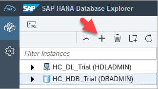

2.  For Instance Type, choose **SAP HANA Database**.

    

    >An SAP HANA, express edition or on-premise database can have two types of databases; system and tenant.  This is known as multitenant.  System databases are used to manage one or more tenant databases and are only applicable to on-premise systems.  For further details, see [Server Architecture of Tenant Databases](https://help.sap.com/viewer/78209c1d3a9b41cd8624338e42a12bf6/latest/en-US/f9aba40d6c4c4ae48cce461db4d42d88.html).

3.  Provide the host, port, user name, password, and name to show in display. Below are instructions on how to obtain the host name and port number.

    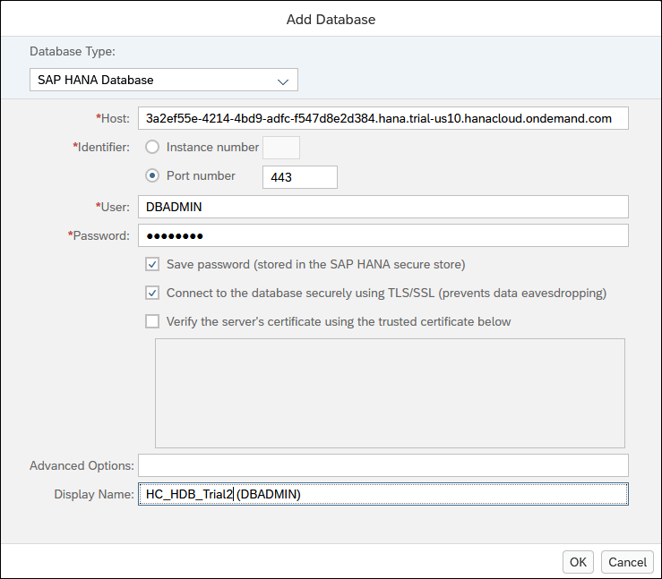


    >---

    >When connecting to an SAP HANA Cloud instance, the connection must use TLS.

    >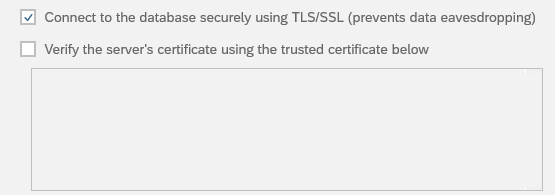

    >The public root certificate of the certificate authority (CA) that signed the SAP HANA Cloud instance's server certificate is required.  This certificate is likely already available in the system certificate store on the operating system and accessible by the browser, but if not, it can be pasted into the UI.  For more information see [Secure Communication Between SAP HANA Cloud and JDBC/ODBC Clients](https://help.sap.com/viewer/c82f8d6a84c147f8b78bf6416dae7290/cloud/en-US/dbd3d887bb571014bf05ca887f897b99.html).


    >For a HANA Cloud database, the host and port values can be copied from SAP HANA Cloud Central.  

    >---

    >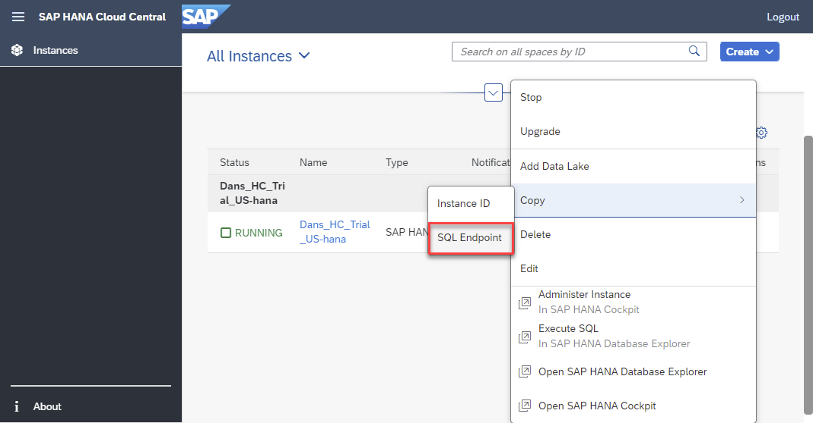

    >Remember to remove the colon and port number from the host name and add the port to the port field.

    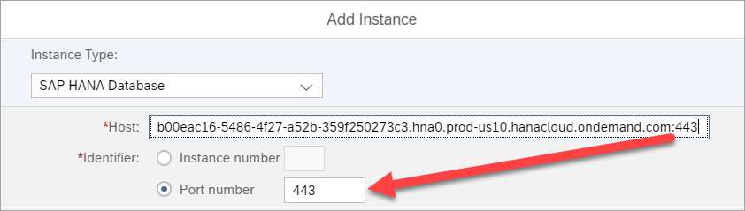 

    >---

    >If you are using an SAP HANA, express edition or on-premise database, the port numbers for a system or tenant database can be determined by running the following query against the **System** database.  

    >```SQL
    SELECT "DATABASE_NAME", "HOST", "SERVICE_NAME", "SQL_PORT" FROM SYS_DATABASES.M_SERVICES WHERE SQL_PORT != 0;
    >```

    >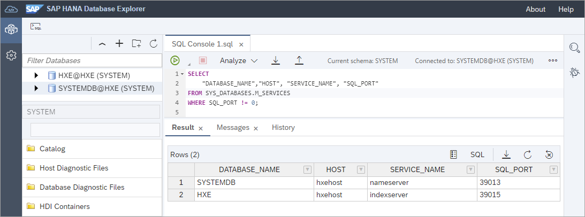

4.  After pressing OK, a new instance will appear whose type is SAP HANA Database.

    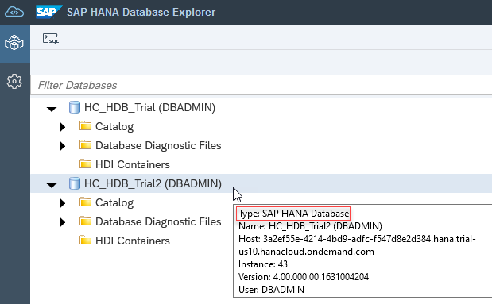

    >Advanced options can be used to specify database properties.  

    >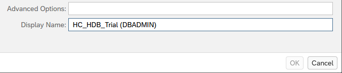

    >An example of what can be configured is shown below.

    >
    ```
    isolationLevel=SERIALIZABLE;locale=fr_FR;schema=HOTEL;client=55
    ```

    >These values can be seen by opening a SQL console and noticing the schema that the database is using or by executing the following queries.

    >```SQL
    >SELECT * FROM M_SESSION_CONTEXT WHERE CONNECTION_ID = current_connection;
    >SELECT * FROM M_CONNECTIONS WHERE CONNECTION_ID = current_connection;
    >SELECT ISOLATION_LEVEL FROM M_TRANSACTIONS where CONNECTION_ID = current_connection;
    >```
    >
    >For additional details, see [Add Instances to the SAP HANA Database Explorer](https://help.sap.com/viewer/a2cea64fa3ac4f90a52405d07600047b/cloud/en-US/4e2e8382f8484edba31b8b633005e937.html) and the [SET Statement](https://help.sap.com/docs/HANA_CLOUD_DATABASE/c1d3f60099654ecfb3fe36ac93c121bb/20fd82b675191014b22c8af08d0b319c.html).


### Add a data lake Relational Engine database

A data lake Relational Engine is a column oriented, disk based relational store that can be used to economically  store data that is not updated frequently.  Additional details can be found at [What is SAP HANA Cloud, Data Lake](https://help.sap.com/viewer/a896c6a184f21015b5bcf4c7a967df07/latest/en-US/228c19ac890046ecbe8e38a540c0cb6b.html).

1.  A data lake can be added to an already created SAP HANA Cloud database that does not have a data lake already associated with it or it can be added as a standalone database.

    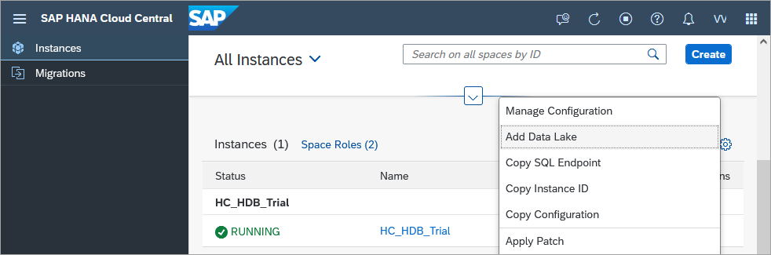

    If this is a non-production database, the allowed connections list can be set to **Allow all IP addresses**.

    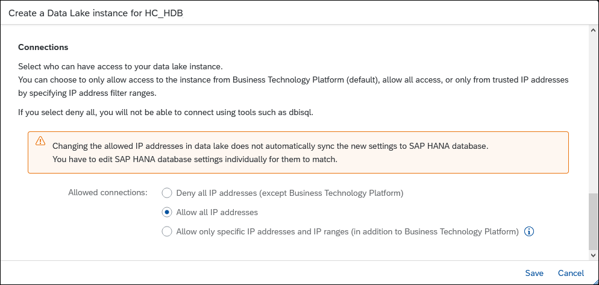

2.  In the SAP HANA database explorer, choose to add a new connection of type **Data Lake Relational Engine**.

    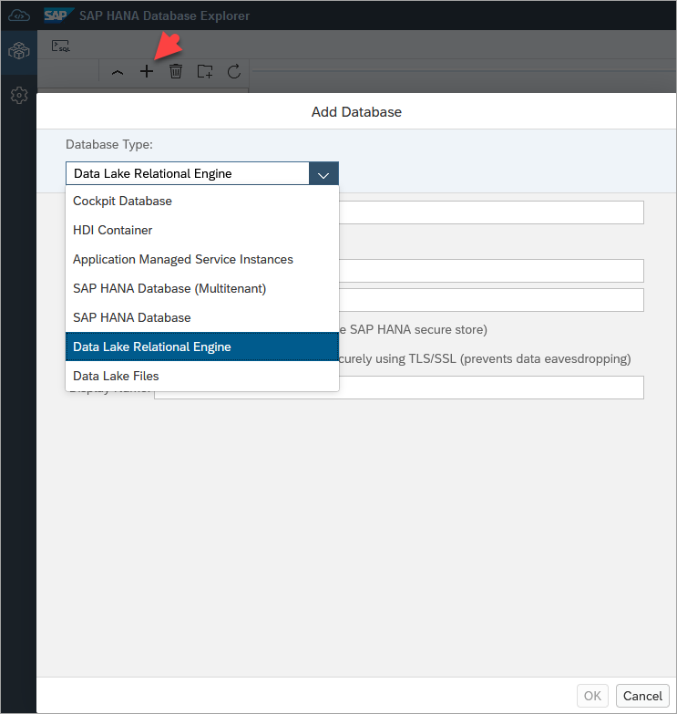

    The user name is HDLADMIN.

    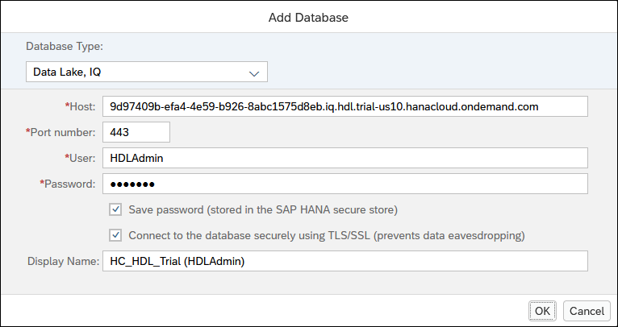

    The connection details can be copied from the instance tile.

    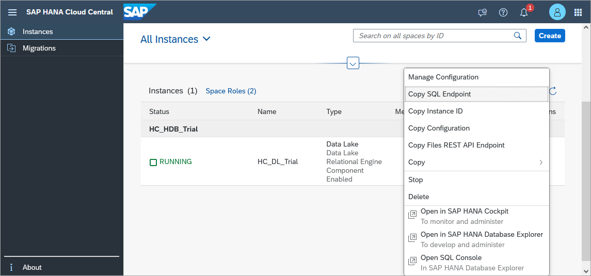

3.  The catalog browser can be used to view database objects and a SQL console can be opened to query the database.

    ```SQL
    SELECT CURRENT USER FROM DUMMY;
    SELECT * FROM SYS.SYSINFO;
    SELECT * FROM SA_DB_PROPERTIES() WHERE UPPER(PropName) LIKE '%NAME%';
    SELECT * FROM SYS.SYSOPTIONS WHERE UPPER("option") LIKE '%AUTO%' OR UPPER("option") LIKE '%COMM%' OR UPPER("option") LIKE '%ISOL%';
    ```

    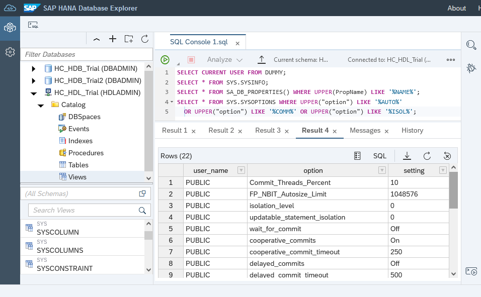

    Diagnostic files can also be viewed in the Logs directory.


### Add a data lake Files container (Optional)

A [data lake Files container](https://help.sap.com/viewer/b239ed4bb73a4f07886657e237f1875f/latest/en-US/125cccac948c4b42a09a9d5695366ffb.html) provides storage for non structured files such as images or PDF documents.  It can also store structured files such as CSV, parquet, or ORC files and with the use of [SQL on Files](https://help.sap.com/viewer/3ef213750ce94aac885ac4fc54ea212f/latest/en-US/c6f12cb258b646aa81b3482e7efeddcf.html), queries can be performed on the data contained in those files.  An example of using the data lake Files container is shown as a target for an export operation at [Export and Import Data and Schema with SAP HANA Database Explorer](hana-dbx-export-import).

1. A connection can be added to a data lake Files container.  A data lake Files container is not currently available in the free tier or trial instances of SAP HANA Cloud.

    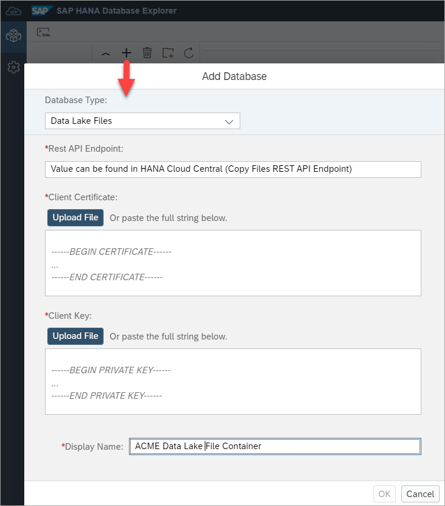

    Additional details on how to configure the data lake Files container including the certificates and how to perform queries using SQL on Files can be found at [Managing Data Lake Files](https://help.sap.com/viewer/b239ed4bb73a4f07886657e237f1875f/latest/en-US/afe91bfba419464a84b7a05e7960d6f9.html) and [Getting to know SAP HANA data lake Files](group.hana-data-lake-containers).

2. Once added, the contents of the file container can be browsed.  Files can be added, deleted or viewed.

    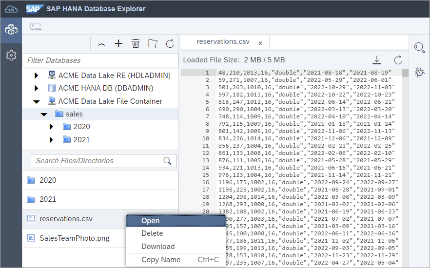

    When files are added, if a path is specified that does not exist, it will create the necessary folders.

    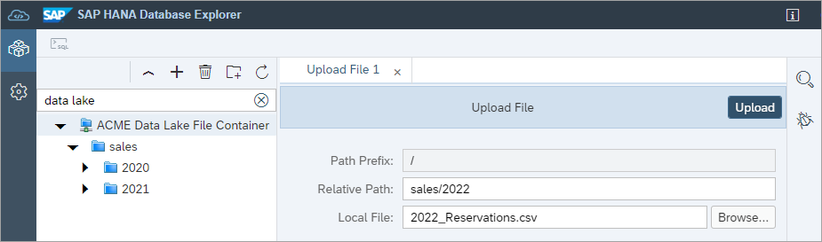


### Additional database connection features

Instances have additional actions that can be performed on them such as renaming, connecting as a different user, changing the connection of a SQL console, and viewing an overview of the connected SAP HANA Cloud, SAP HANA database.  

1.  To rename an instance, right-click on an instance and choose **Properties**.

    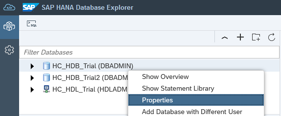

     You may wish to rename the default database display name. Press **OK** to save the changes and close the window.

    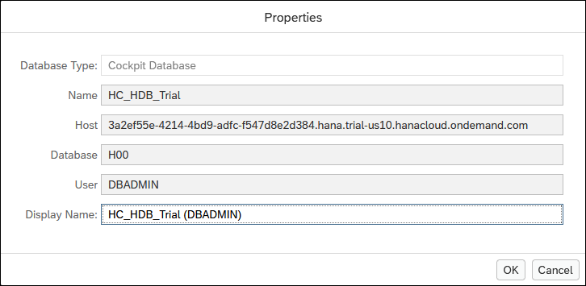

2.  To connect to the same instance but with different credentials, right-click an instance and choose **Add Database with Different User**.  This can be useful when you wish to connect to the same instance but with a different set of credentials perhaps because you need elevated permissions.  The USER1 database user will be created in the next tutorial.

    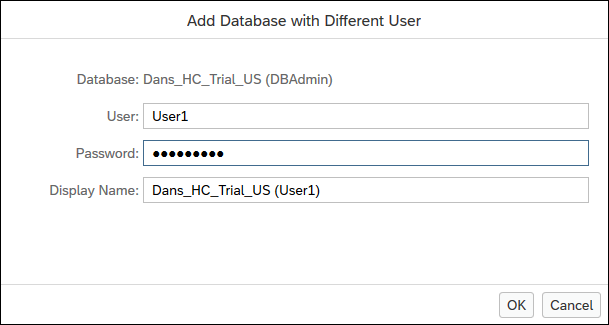

3.  When a SQL console opens, it connects to the currently selected database instance and displays the current schema and instance name.  

    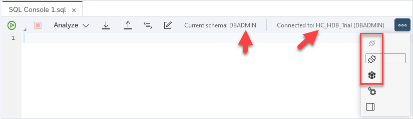

    It is possible to connect, disconnect, or change the connection via the toolbar items highlighted above.  

    > Subsequent tutorials assume the connected user is DBADMIN or SYSTEM.

4.  To see information about an SAP HANA database, right-click on an instance and choose **Show Overview**.  This provides a quick overview of the database that you are connected to including the database version.

    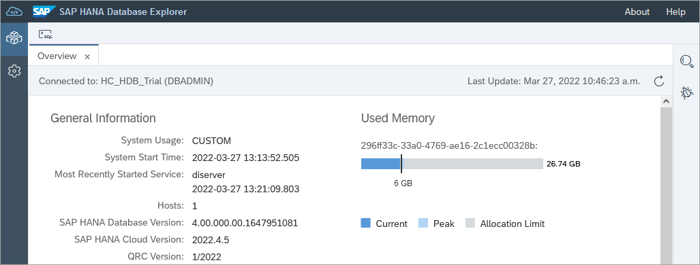

5.  Groups and filters can be used to organize and quickly find databases.

    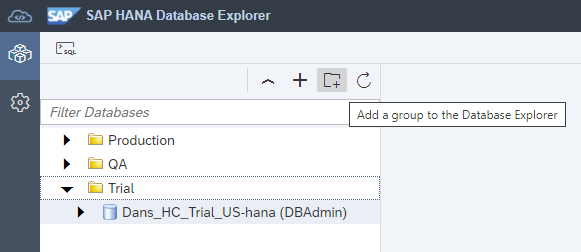

    >These groups are separate from the mechanism used in the on-premise SAP HANA Cockpit Manager or the groups seen in Run SQL on Multiple Databases dialog which use groups based on the cloud foundry space name for SAP HANA Cloud instances.  For further details, see step 7.


### Database usage


An SAP HANA database can be set to have a specified usage, such as development or production.  The following SQL statements will display the current usage value and then change it to production.

```SQL
SELECT * FROM M_INIFILE_CONTENTS WHERE KEY = 'usage';
ALTER SYSTEM ALTER CONFIGURATION ('global.ini', 'DATABASE') SET ('system_information', 'usage') = 'production' WITH RECONFIGURE;
```

After refreshing the page, there will be indicators that the database instance being worked with is a production database as shown below and care should be taken before executing operations that may affect performance or make unintentional changes to the database.

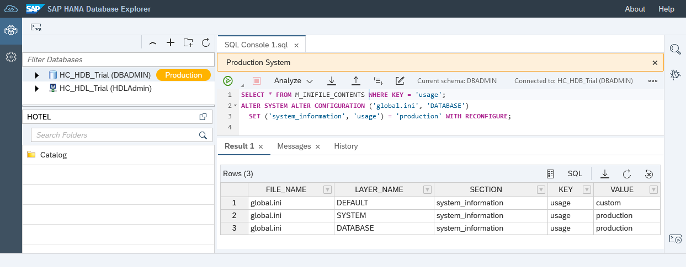

For additional details on this parameter, see the `system_information` usage parameter in [SAP HANA Configuration Parameter Reference](https://help.sap.com/viewer/009e68bc5f3c440cb31823a3ec4bb95b/latest/en-US/514ab38a2e574c85a70ebba80ff16d99.html).

To undo this setting, execute the SQL below.

```SQL
ALTER SYSTEM ALTER CONFIGURATION ('global.ini', 'DATABASE') UNSET ('system_information', 'usage') WITH RECONFIGURE;
```

### Database groups (Optional)


SAP HANA cockpit databases can be grouped together.  This enables SQL statements to be run against a group of databases.

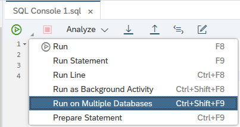  

1. With SAP HANA Cloud, all databases created in a Cloud Foundry space are placed in a group.  As seen below, the space name is dev.    

    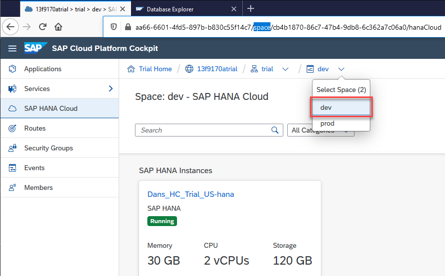

    SAP BTP Cockpit or SAP HANA Cloud Central contain in their URL, a parameter that indicates the unique name (GUID) for the space.

    ```
    https://host/trial/#/globalaccount/GUID/subaccount/GUID/org/GUID/space/GUID/hanaCloud
    ```

    The spaces that contain SAP HANA Cloud instances appear when running SQL against multiple databases.  Executing commands in the SQL console will be covered in a subsequent tutorial.

      

    The space dev is represented by its GUID in the selection dialog below.    

    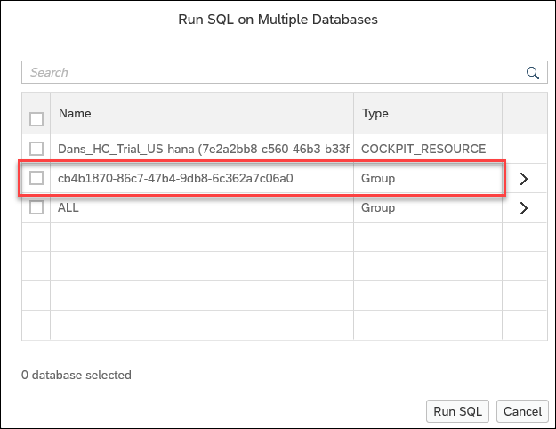

    >This feature does not apply to SAP HANA Cloud instances deployed to the subaccount or when used with the multi-environment tooling.

2. With SAP HANA, express edition or an on-premise install, a tool called SAP HANA Cockpit Manager can be used to register databases and organize them into groups.

    

    Two user defined groups are shown below.  

    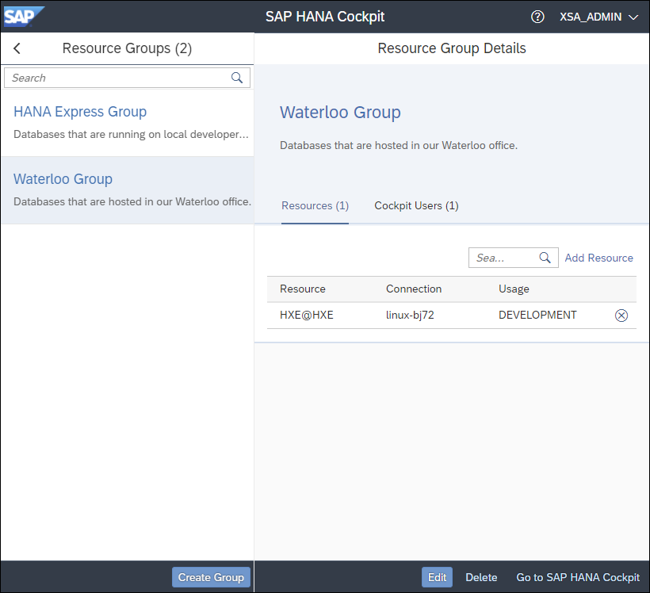  

    These groups appear when running SQL against multiple databases. There are also three predefined groups named DEVELOPMENT, ALL, and PRODUCTION.

      <br><br>

    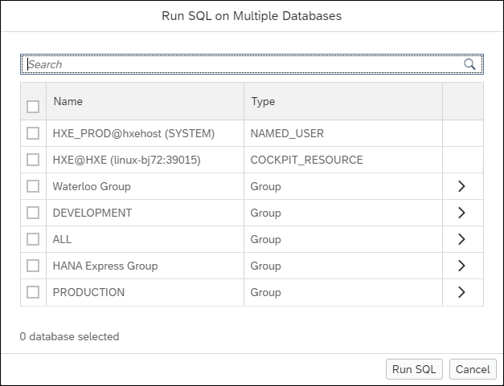

    >The ability to see groups in the SAP HANA database explorer that have been created using the SAP HANA Cockpit Manager requires the SAP HANA database explorer to be opened from the SAP HANA cockpit.


### Native HANA development with HDI (Optional)


An SAP HANA Deployment Infrastructure (HDI) container can be created by using SAP Business Application Studio or the SAP HANA Web IDE.  An HDI container can contain database objects such as tables, views, functions, stored procedures, and calculation views.  HDI containers support the use case where multiple versions of the same data model are deployed into the same database instance. This might be done by multiple developers working on a project.  Using HDI helps ensure a consistent deployment.  Objects within an HDI container all share the same schema and are accessed by a technical user.  Further details can be found at [SAP HANA Deployment Infrastructure in the Cloud](https://help.sap.com/viewer/c2cc2e43458d4abda6788049c58143dc/latest/en-US/3ef0ee9da11440e4b01708455b8497a9.html).

The SAP Business Application Studio is the recommended tool for SAP HANA native application development with SAP HANA Cloud HANA databases while the SAP HANA Web IDE is the recommended tool for HANA 2.0 on-premise databases.  For additional details see [SAP Business Application Studio and SAP Web IDE Full-Stack](https://blogs.sap.com/2021/02/09/sap-business-application-studio-and-sap-web-ide-full-stack/).  

The following steps demonstrate how to use the SAP Business Application Studio or the SAP HANA Web IDE to create and deploy an HDI container containing a table and then view container in the SAP HANA database explorer.  


### Create and deploy an HDI container with the SAP Business Application Studio (Optional)


1.  Open the SAP BTP cockpit and from the Service Marketplace under the subaccount level (named trial in the screenshot below) find and open the **SAP Business Application Studio**.  

    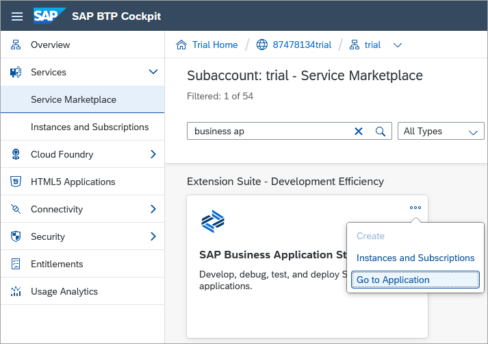

2.  Create a new **SAP HANA Native Application** dev space.

    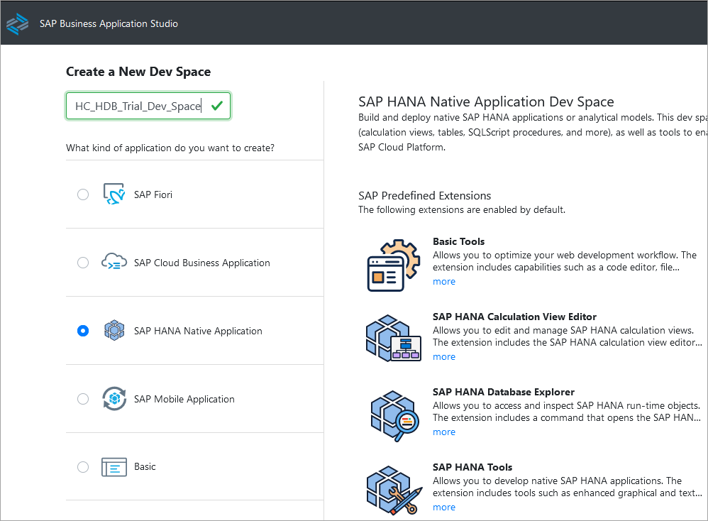

3.  Once the dev space is running, open it.  

4.  Set the cloud foundry org and space by pressing F1 or Ctrl + Shift + P to open the command palette.  Search for the command **CF Set Org and Space**.

    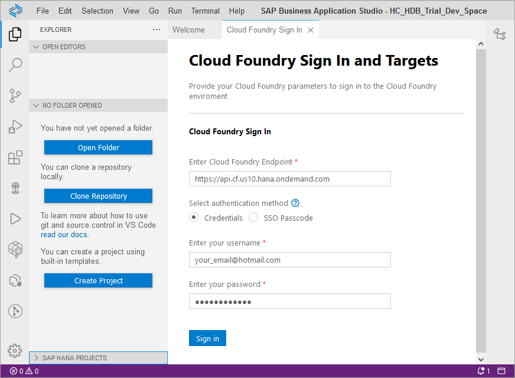

    The endpoint value can be found in the SAP BPT Cockpit.

    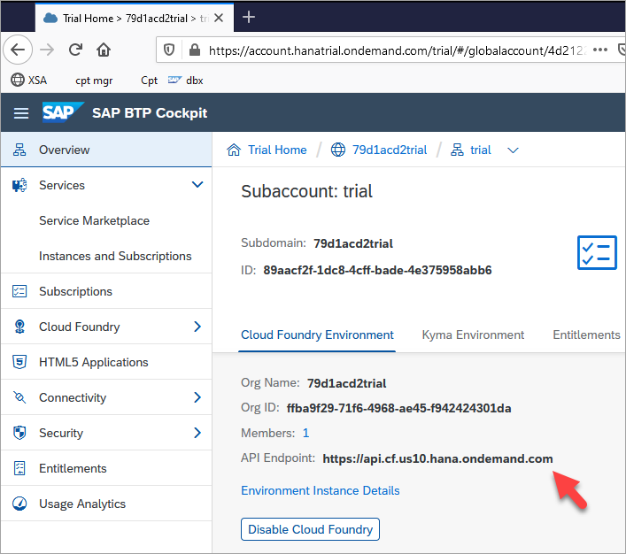

5.  From the Welcome tab (can be opened from the command palette if it is not open), choose **Start from template**.

    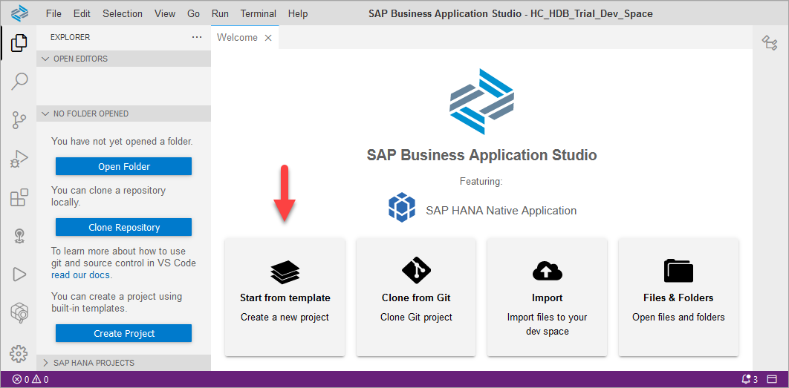

6.  Select **SAP HANA Database Project**.

    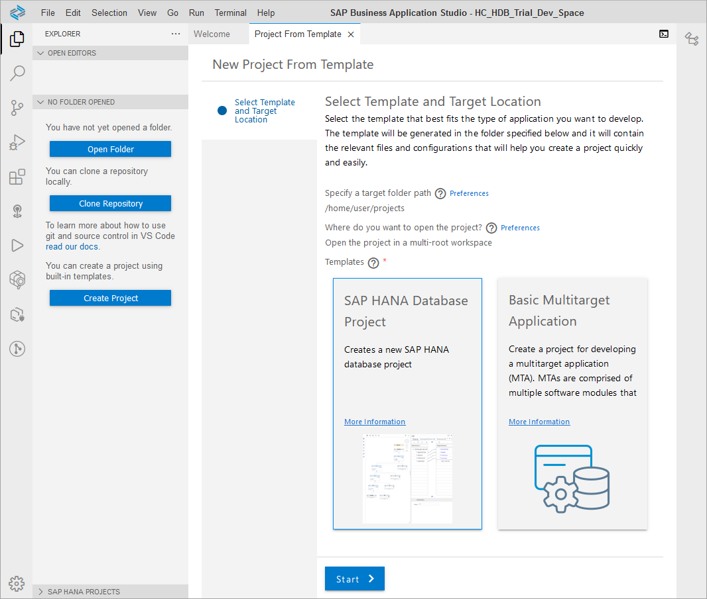

7.  Provide the following values and click **Finish**.

    |  Setting        | Value
    |  :------------- | :-------------
    |  Project name:  | `myHANAProj`
    |  Module name:   | `db`
    |  Namespace:     |
    |  Schema name:   | `mySchema`
    |  SAP HANA Database Version: | HANA Cloud    
    |  Bind database  | Yes

8.  Once the project generation finishes, open the tool palette (F1) and choose  **SAP HANA: Create SAP HANA Database Artifact**.  Provide the following values and click **Create**.

    |  Setting     | Value
    |  :------------- | :-------------
    |  Path:    | `/home/user/projects/myHANAProj/db/src`
    |  Version: | HANA Cloud
    |  Artifact Type:    | `Table (hdbtable)`
    |  Name:    | `myTable`   


9.  Paste the below content into the file.

    ```SQL
    COLUMN TABLE myTable
    (
        "ID" INTEGER,
        "VALUE" VARCHAR(50)
    )
    ```

10. Use the SAP HANA Projects Explorer to deploy the table.

    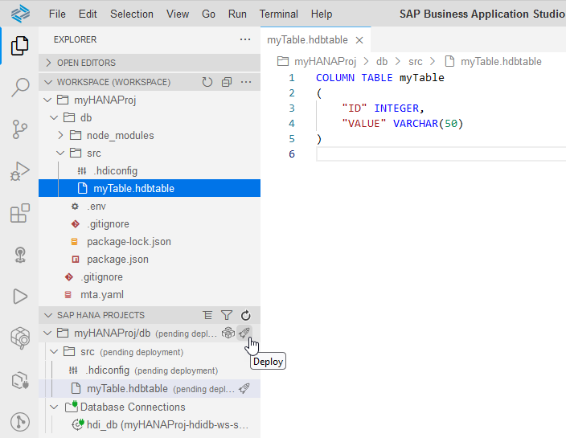

11. Open the SAP HANA database explorer to view the deployed HDI container and table.

    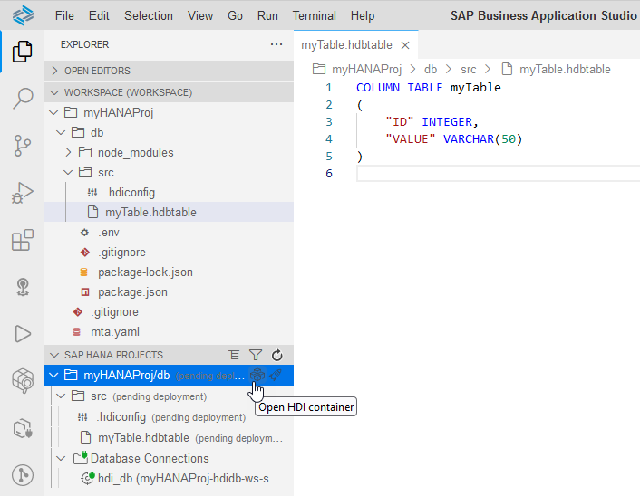

    A new HDI container with the table is shown.

    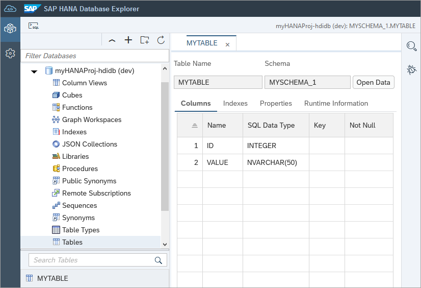


### Create and deploy an HDI container with the SAP HANA Web IDE (Optional)


1.  Open SAP HANA Web IDE for SAP HANA if using SAP HANA, express edition or an on-premise install.

    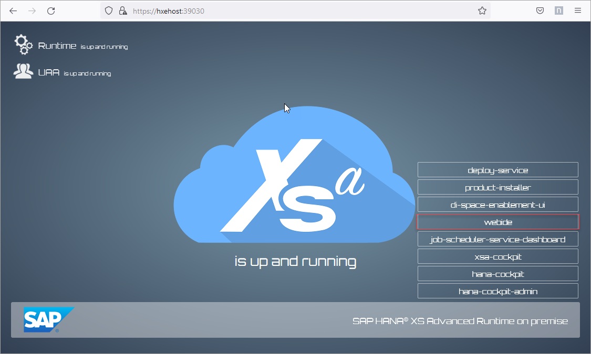

    An alternative way to determine the URL for the SAP Web IDE for SAP HANA is to run the below command on the machine where SAP HANA on-premise is installed.

    ```Shell
    su hxeadm
    xs apps
    ```

    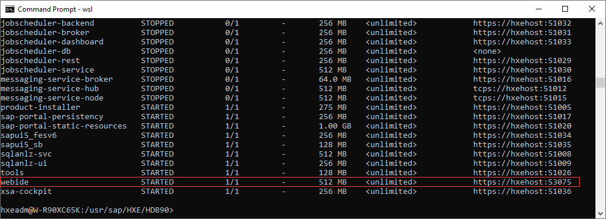

    >The user name for login is `XSA_ADMIN`.
    >
    >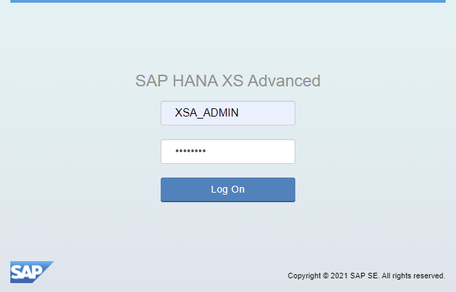

2.  Ensure that the SAP HANA extensions are enabled.

    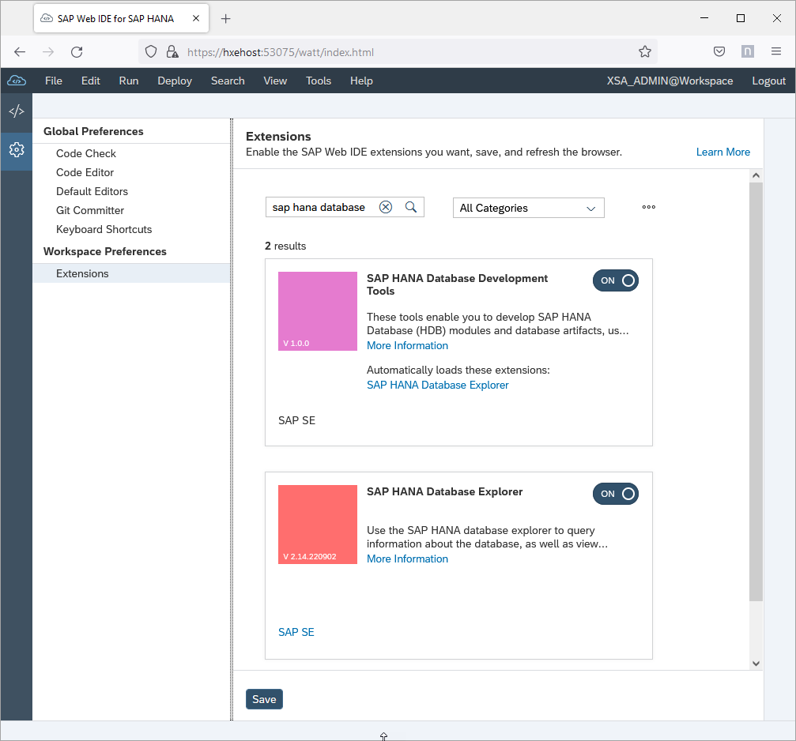

3.  Open the development pane.

    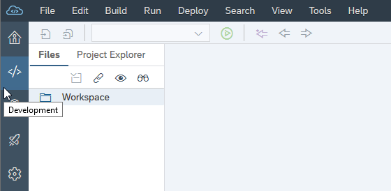

4.  Create a new HANA database project.

    Right-click **Workspace** and choose **New** | **Project from Template**.

    Select the template **SAP HANA Database Application**.

    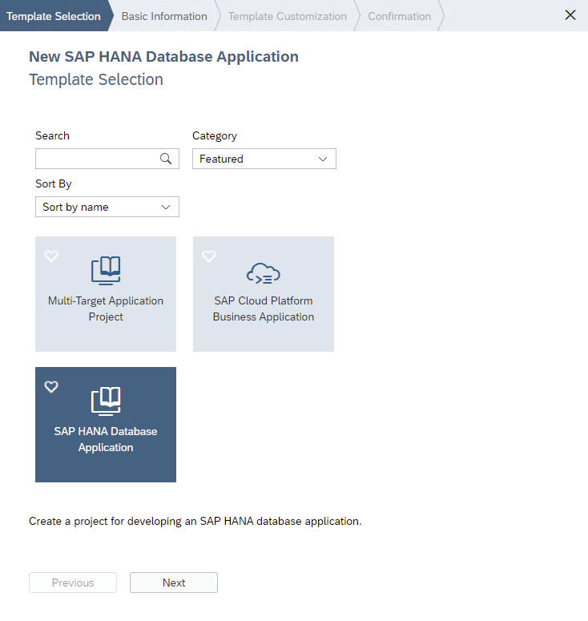  

    Fill in the following values and press **Finish**.  

    |  Setting     | Value
    |  :------------- | :-------------
    |  Project Name:  | `myHANAProj`
    |  Space:         | development
    |  Namespace:     | Clear the default value
    |  SAP HANA Database Version: | Choose the appropriate version such as 2.0 SPS 06


5.  After the wizard finishes, create a table by right-clicking on the `src` folder and choosing **New** | **Database Artifact**.  

    Specify a file name of `test` and a file type of `.hdbtable`.

    Paste the below content into the file and choose **File** | **Save**.

    ```SQL
    COLUMN TABLE test
    (
        "ID" INTEGER,
        "VALUE" VARCHAR(50)
    )
    ```

    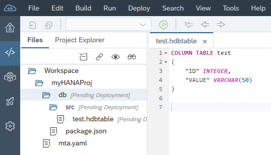

6.  Deploy the HDI container.  Right-click the **db** folder and choose **Build** | **Build**.

    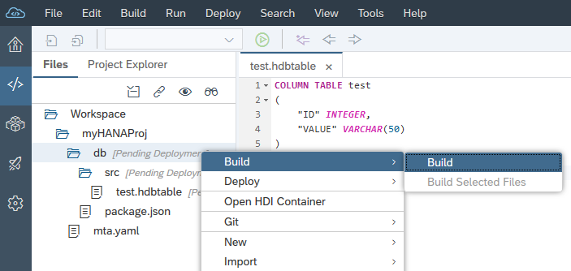

    The Console window will show the result of the build process.  

    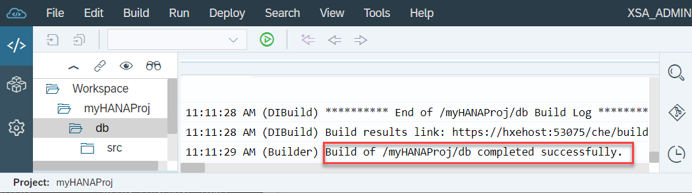

7.  Once complete, the HDI container can be opened in the SAP HANA database explorer by right-clicking on the **db** folder and choosing **Open HDI Container**.

    Alternatively, it can be added via the Add Database dialog.

    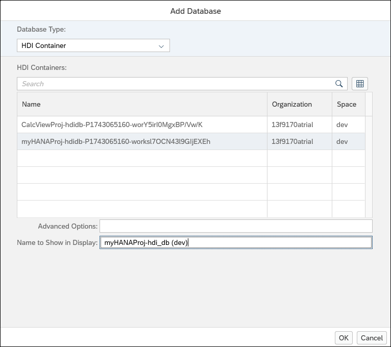

    Notice, above, that a user name and password are not requested.  The connection will use a technical user, which was generated when the HDI container was created.

    In the database browser and in the SQL console, notice that the schema name is not shown.

    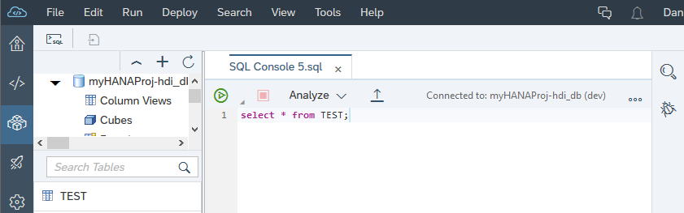

    >It is also possible to connect to an HDI container as an admin, which enables the ability to grant additional permissions in the HDI container.  For an example of where this might be used, see [Grant a Support User Access to an SAP HDI Container](https://help.sap.com/viewer/c2cc2e43458d4abda6788049c58143dc/cloud/en-US/b460586c9fe14618a69f4b3dec152659.html).  Do not use the Admin connection to perform DDL (such as create, update, or delete) operations.

    >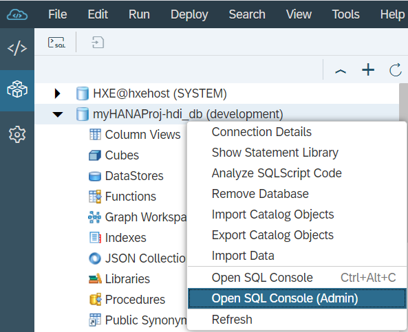

    For an example of creating a calculation view inside an HDI container, see the video titled Develop Apps at the end of the blog post [Getting Started with SAP HANA Cloud II | Basics](https://blogs.sap.com/2020/03/29/getting-started-with-sap-hana-cloud-part-ii/)

    The mission [Get Started with XS Advanced Development](mission.xsa-get-started) provides further examples of using an HDI container.

### Knowledge check

Congratulations! You have added different databases to the SAP HANA database explorer.

In the next tutorial, additional tables, views, functions, and procedures that will be used in subsequent tutorials in this group will be created directly in the database rather than in an HDI container.


---
