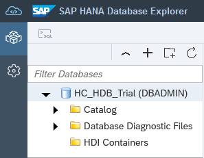
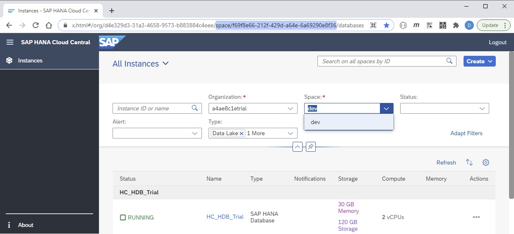
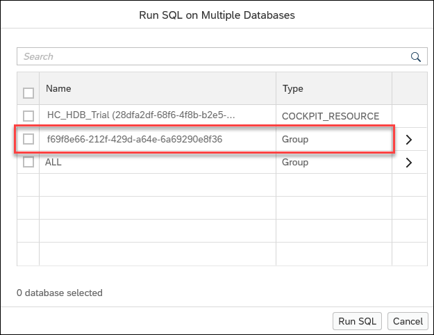
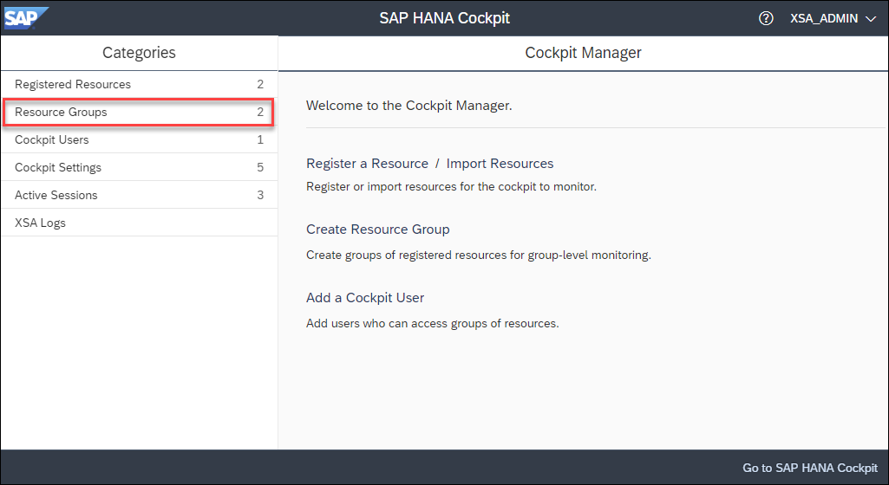
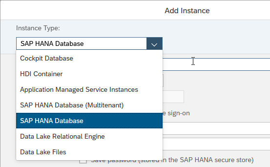
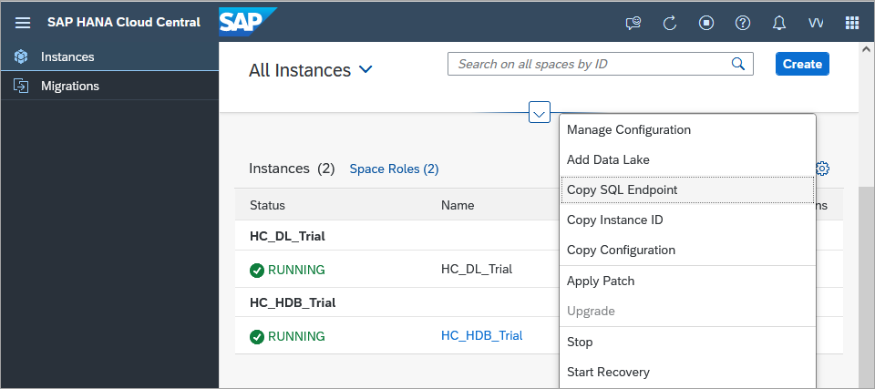
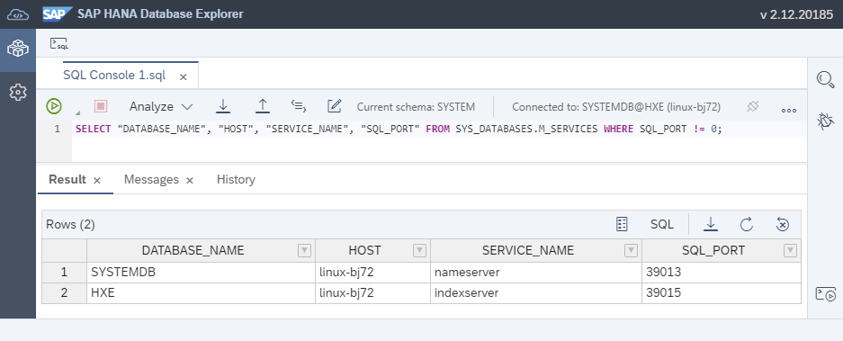
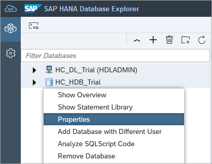
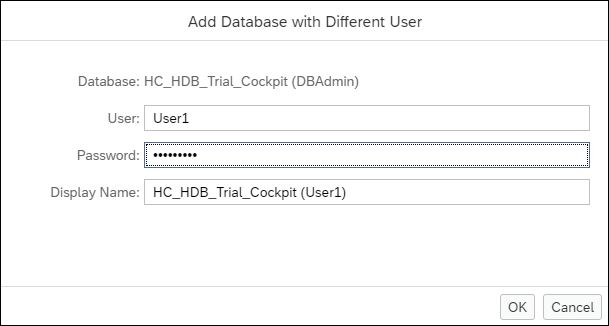
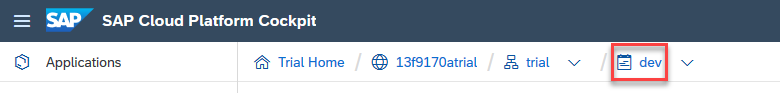

## Prerequisites
- An SAP HANA database such as SAP HANA Cloud trial or the SAP HANA, express edition that includes the SAP HANA database explorer

## Details
### You will learn
- How to add different SAP HANA database types in the SAP HANA database explorer
- Additional operations that can be performed on a database

Database connections in the database explorer represent SAP HANA databases that you browse and interact with.  

  

SQL consoles are associated with a database connection.


---

[ACCORDION-BEGIN [Step 1: ](Add an SAP HANA cockpit database connection)]

Databases defined in the SAP Cloud Platform cockpit or the SAP HANA cockpit can be opened in the SAP HANA database explorer.

1.  From the SAP Cloud Platform Cockpit or the SAP HANA Cockpit, choose to open the **SAP HANA Database Explorer**.  

    

    or

    !

    >You may be prompted to enter database login credentials at this point.  Enter the DBADMIN or SYSTEM user credentials that were set during the SAP HANA Cloud trial or express edition setup process, or the credentials provided by your database administrator.

    Notice that when the SAP HANA database explorer opens, the selected database is the one from the selected tile or administered database.  Also note that the URL contains a `?databaseid=`.  

    If this URL is saved as a bookmark, each time the page is opened, the matching database will be selected.

    

    Hover over the database to see a summary and note that the type is Cockpit Database.

[DONE]
[ACCORDION-END]

[ACCORDION-BEGIN [Step 2: ](Database groups)]
SAP HANA Cockpit databases can be grouped together.  This enables SQL statements to be run against a group of databases.

!  


1. With SAP HANA Cloud, all databases created in a space are placed in a group.  As seen below, the space name is dev.  The SAP HANA Cloud Cockpit contains in its URL, a parameter that indicates the unique name (GUID) for the space.  

    ```
    https://host/trial/#/globalaccount/GUID/subaccount/GUID/org/GUID/space/GUID/hanaCloud
    ```   

    In the SAP HANA Cloud trial, only one SAP HANA Cloud instance can be created.

    

    The spaces that contain SAP HANA Cloud instances appear when running SQL against multiple databases.  Executing commands in the SQL console will be covered in a subsequent tutorial.

    !  

    The space dev is represented by its GUID in the selection dialog below along with a predefined group named ALL.    

    

2. With SAP HANA, express edition or an on-premise install, a tool called SAP HANA cockpit manager can be used to register databases and organize them into groups.

    

    Two user defined groups are shown below.  

      

    These groups appear when running SQL against multiple databases. There are also three predefined groups named DEVELOPMENT, ALL, and PRODUCTION.

    !  <br><br>

    

    >Note that the ability to see groups in the SAP HANA database explorer that have been created using the SAP HANA cockpit manager requires the SAP HANA database explorer to be opened from the SAP HANA Cockpit.

    >---

    >An on-premise SAP HANA database can be set to have a specified usage, such as development or production. When set, this usage type will appear in the predefined group with the same name.  This can be configured in the SAP HANA cockpit.  For more details on this parameter, see the `system_information` usage parameter in [SAP HANA Configuration Parameter Reference](https://help.sap.com/viewer/009e68bc5f3c440cb31823a3ec4bb95b/latest/en-US/514ab38a2e574c85a70ebba80ff16d99.html).

[DONE]
[ACCORDION-END]

[ACCORDION-BEGIN [Step 3: ](Add an SAP HANA database)]
Databases can be added directly to the SAP HANA database explorer.  To connect to an SAP HANA Cloud or on-premise database, the host, port, user name, and  password must be provided.  

1.  In the SAP HANA database explorer, press the **+** button to add a new database.

    

2.  For database type, choose **SAP HANA Database**.

    

    >Note that an SAP HANA, express edition or on-premise database can have two types of databases; system and tenant.  This is known as multitenant.  System databases are used to manage one or more tenant databases and are only applicable to on-premise systems.  For further details, see [Server Architecture of Tenant Databases](https://help.sap.com/viewer/78209c1d3a9b41cd8624338e42a12bf6/latest/en-US/f9aba40d6c4c4ae48cce461db4d42d88.html).

3.  Provide the host, port, user name, password, and name to show in display.

    

    The host and port values can be copied from the SAP HANA Cloud Platform Cockpit.  

    !

    >Remember to remove the colon and port number from the host name and add it to the port field.

    >---

    >When connecting to an SAP HANA Cloud instance, the database connection must use TLS.

    >

    >The public root certificate of the certificate authority (CA) that signed the SAP HANA Cloud instance's server certificate is required.  This certificate is likely already available in the system certificate store and accessible by the browser, but if not, it can be pasted into the UI.  For more information see [Secure Communication Between SAP HANA Cloud and JDBC/ODBC Clients](https://help.sap.com/viewer/c82f8d6a84c147f8b78bf6416dae7290/cloud/en-US/dbd3d887bb571014bf05ca887f897b99.html).

    If you are using an SAP HANA, express edition or on-premise database, the port numbers for a system or tenant database can be determined by running the following query against the **System** database.  

    ```SQL
    SELECT "DATABASE_NAME", "HOST", "SERVICE_NAME", "SQL_PORT" FROM SYS_DATABASES.M_SERVICES WHERE SQL_PORT != 0;
    ```

    

4.  After pressing OK, a new database will appear whose type is SAP HANA Database.

    

    >Advanced options can be used to specify database properties.  

    >

    >An example of what can be configured is shown below.

    >
    ```
    isolationLevel=SERIALIZABLE;locale=fr_FR;schema=HOTEL;client=55
    ```

    >These values can be seen by opening a SQL console and noticing the schema that the database is using or by executing the following queries.

    >```SQL
    >select * from M_SESSION_CONTEXT where CONNECTION_ID=current_connection;
    >select ISOLATION_LEVEL from PUBLIC.M_TRANSACTIONS where CONNECTION_ID = current_connection;
    >```
    >
    >For additional details, see [Add HDI Containers and Databases to the SAP HANA Database Explorer](https://help.sap.com/viewer/a2cea64fa3ac4f90a52405d07600047b/cloud/en-US/4a0818acfaff48bea88c1c3010f6944b.html).

[DONE]
[ACCORDION-END]

[ACCORDION-BEGIN [Step 4: ](Additional database connection features)]
Databases have additional actions that can be performed on them such as renaming, connecting as a different user, changing the connection of a SQL console, and viewing an overview of the connected database.  

1.  To rename a connection, right-click a database and choose **Properties**.

    

     You may wish to rename the default database display name. Press **OK** to save the changes and close the window.

    !

2.  To add the same database but with different credentials, right-click a database and choose **Add Database with Different User**.  This can be useful when you wish to connect to the same SAP HANA database but with a different set of credentials perhaps because you need elevated permissions.

    

3.  When a SQL console opens, it connects to the currently selected database connection and displays the current schema and connection.  

    !

    It is possible to connect, disconnect, or change the connection via the toolbar items highlighted above.  

    > Subsequent tutorials assume the connected user is DBADMIN or SYSTEM.

4.  To see information about a database, right-click a database and choose **Show Overview**.  This provides a quick overview of the database that you are connected to.

    

[DONE]
[ACCORDION-END]

[ACCORDION-BEGIN [Step 5: ](Create and connect to an HDI container (optional))]


An SAP HANA Deployment Infrastructure (HDI) container can be created by using the SAP HANA Web IDE.  An HDI container can contain database objects such as tables, views, functions, stored procedures, and calculation views.  HDI containers support the use case where multiple versions of the same data model are deployed into the same database instance. This might be done by multiple developers working on a project.  Objects within an HDI container all share the same schema and are accessed by a technical user.  The following steps demonstrate how to use the SAP HANA Web IDE to create and deploy an HDI container containing a table and then add the container as a database in the SAP HANA database explorer.  

>Note: This section is optional and does not need to be followed to complete the subsequent tutorials in this group.

1.  Open the SAP HANA Web IDE for HANA Development if using SAP HANA Cloud or SAP HANA Web IDE for SAP HANA if using SAP HANA, express edition or an on-premise install.

    Open SAP HANA Web IDE (in SAP Cloud Platform).  Further instructions on how to setup the SAP HANA Web IDE in the trial can be found on steps 3 and 4 of [Help Thomas Get Started with SAP HANA](https://developers.sap.com/tutorials/hana-trial-advanced-analytics.html#4a1b9a58-e95b-41d5-81f5-8a9a82703ec4).    

    

    or

    Open SAP HANA Web IDE for SAP HANA (on-premise)

    

    An alternative way to determine the URL for the SAP Web IDE for SAP HANA is to run the below command on the machine where SAP HANA on-premise is installed.

    ```Shell
    xs apps
    ```

    

2.  Ensure that the SAP HANA extensions are enabled.

    

3.  For the SAP HANA Web IDE running in the cloud, ensure that the targeted Cloud Foundry space is specified in the two locations indicated below.

    

    The API Endpoint can be found on the subaccount page of the SAP Cloud Platform Cockpit.

    

    The space can be found on the subaccount page of the SAP Cloud Platform Cockpit.

    !

4.  Open the development pane.

    

5.  Create a new HANA database project.

    Right-click **Workspace** and choose **New** | **Project from Template**.

    In the **Search** field, enter **HANA**.  

    If you are using SAP HANA Cloud, in the **Environment** dropdown, select **Cloud Foundry**.

    Select the template **SAP HANA Database Application**.

      

    Fill in the following values and press **Finish**.  

    |  Setting     | Value
    |  :------------- | :-------------
    |  Project Name:  | `myHANAProj`
    |  Space:         | If you are using SAP HANA, express or on-premise, choose the space you wish to deploy to (e.g. development)
    |  SAP HANA Database Version: | Choose the appropriate version such as HANA Cloud or 2.0 SPS 04


6.  After the wizard finishes, create a table by right-clicking on the `src` folder and choosing **New** | **Database Artifact**.  

    Specify a file name of **test** and a file type of `.hdbtable`.

    Paste the below content into the file and choose **File** | **Save**.

    ```SQL
    COLUMN TABLE test
    (
        "ID" INTEGER,
        "VALUE" VARCHAR(50)
    )
    ```

    

7.  Deploy the HDI container.  Right-click the **db** folder and choose **Build** | **Build**.

    

    The Console window will show the result of the build process.  

    

8.  Once complete, the HDI container can be opened in the SAP HANA database explorer by right-clicking on the **db** folder and choosing **Open HDI Container**.

    Alternatively, it can be added via the Add Database dialog.

    

    Notice, above, that a user name and password are not requested.  The connection will use a technical user, which was generated when the HDI container was created.

    In the database browser and in the SQL console, notice that the schema name is not shown.

    

    >It is also possible to connect to an HDI container as an admin, which enables the ability to grant additional permissions in the HDI container.  For an example of where this might be used, see [Grant a Support User Access to an SAP HDI Container](https://help.sap.com/viewer/c2cc2e43458d4abda6788049c58143dc/cloud/en-US/b460586c9fe14618a69f4b3dec152659.html).  Note, never use the Admin connection to perform DDL (such as create, update, or delete) operations.

    >

For an example of creating a calculation view inside an HDI container, see the video titled Develop Apps at the end of the blog post [Getting Started with SAP HANA Cloud II | Basics](https://blogs.sap.com/2020/03/29/getting-started-with-sap-hana-cloud-part-ii/)

The mission [Get Started with XS Advanced Development](https://developers.sap.com/mission.xsa-get-started.html) provides further examples of using an HDI container.

In the next tutorial, additional tables, views, functions, and procedures that will be used in subsequent tutorials in this group will be created directly in the database rather than in an HDI container.

Congratulations! You have added different databases to the SAP HANA database explorer.

[VALIDATE_1]
[ACCORDION-END]


---
