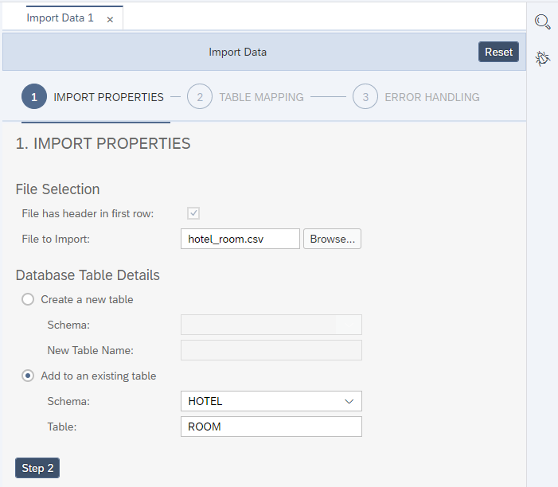
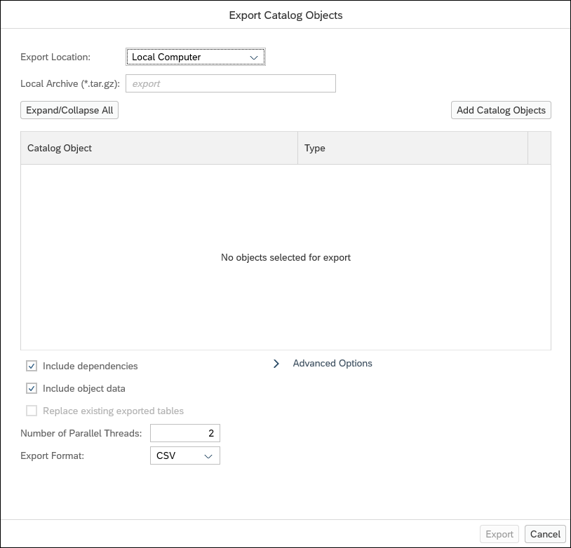
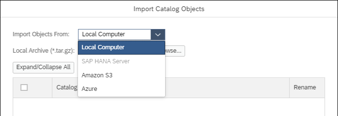
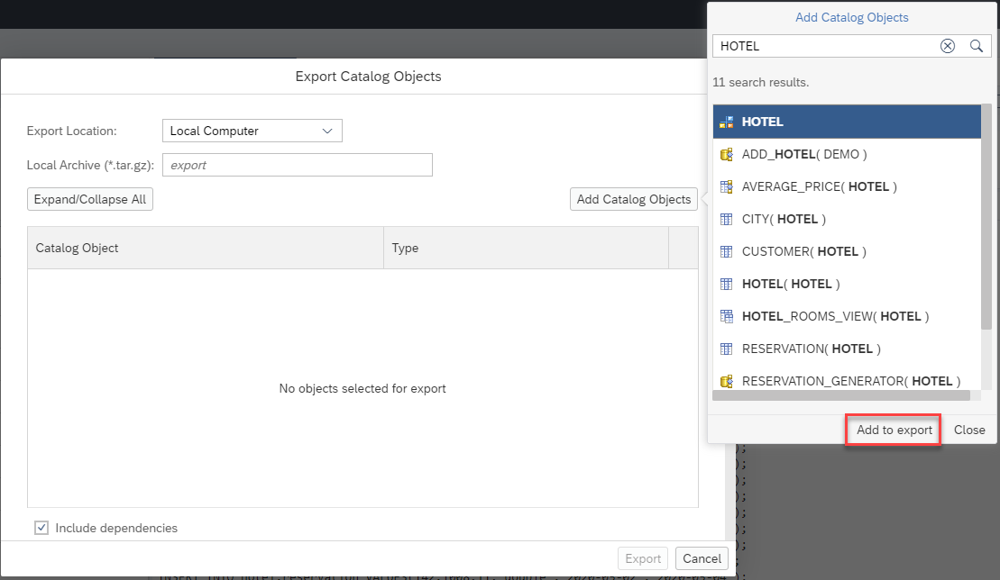
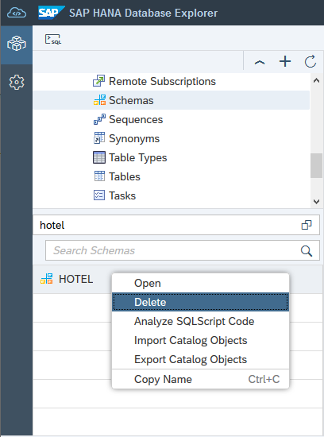
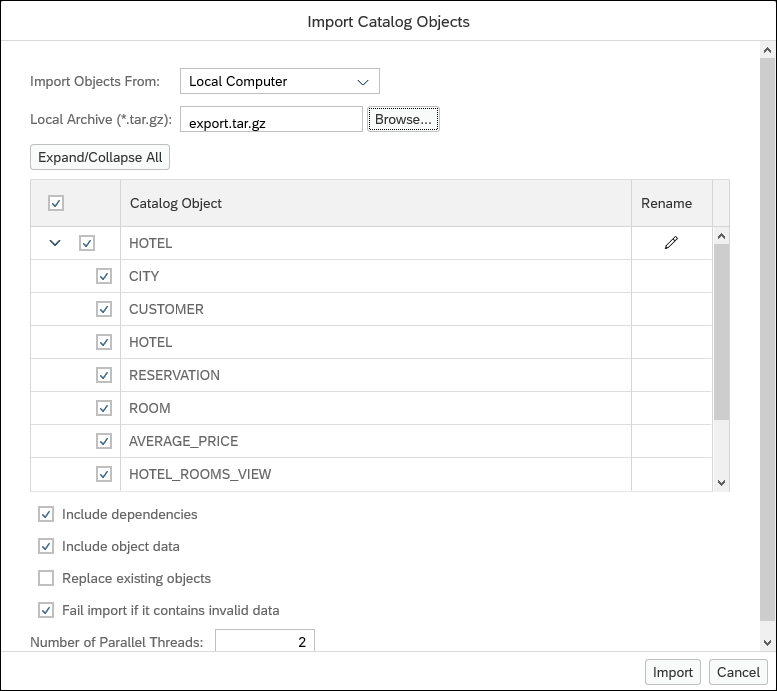

## Prerequisites
  - An SAP HANA database such as SAP HANA Cloud trial or the SAP HANA, express edition that includes the SAP HANA database explorer

## Details
### You will learn
  - How to create and import data using SQL statements and built-in wizards.
  - How to create different objects including tables, views, functions, and stored procedures.

The following steps will create sample objects for a hotel database.

[ACCORDION-BEGIN [Step 1: ](Create a user and schema)]

1. In the database explorer, select the previously created SAP HANA Cockpit or SAP HANA database and open a SQL console.  Do not use the HDI container.

    

2. Create a user named `User1`.

    ```SQL
    CREATE USER USER1 PASSWORD Password1 no force_first_password_change;
    ```

    For additional details see on creating users see [CREATE USER Statement (Access Control)](https://help.sap.com/viewer/c1d3f60099654ecfb3fe36ac93c121bb/latest/en-US/20d5ddb075191014b594f7b11ff08ee2.html).


    >The following statement deletes the user in case it already exists or if you wish to remove the user after completing the group.  Make sure you really wish to delete USER1 and the objects it owns before proceeding, as this operation cannot be undone.

    >
    ```SQL
    DROP USER USER1 CASCADE;
    ```

3. The list of users can be seen by executing the following statement:

    ```SQL
    SELECT USER_NAME FROM USERS;
    ```

4. Create a schema named `HOTEL` and grant `User1` access to it.  A schema provides a way to group database objects together.

    ```SQL
    CREATE SCHEMA HOTEL;
    GRANT ALL PRIVILEGES ON SCHEMA HOTEL TO USER1;
    ```

    >The following statement deletes the schema in case it already exists or if you wish to remove the schema  after completing the group.  Make sure you really wish to delete the HOTEL schema and the objects it contains before proceeding, as this operation cannot be undone.
    >
    ```SQL
    DROP SCHEMA HOTEL CASCADE;
    ```

    For additional details see [Database Users](https://help.sap.com/viewer/f9c5015e72e04fffa14d7d4f7267d897/cloud/en-US/bd856a90bb5710148a47e5765db45e3e.html) and [CREATE SCHEMA Statement](https://help.sap.com/viewer/c1d3f60099654ecfb3fe36ac93c121bb/cloud/en-US/20d4ecad7519101497d192700ce5f3df.html).

[DONE]
[ACCORDION-END]

[ACCORDION-BEGIN [Step 2: ](Create tables and import data using SQL)]
1. Create tables that represent a basic hotel administration system by running the SQL statements below:

    ```SQL
    CREATE COLUMN TABLE hotel.city(
      zip CHAR(5) PRIMARY KEY,
    	name VARCHAR(30) NOT NULL,
    	state CHAR(2) NOT NULL
    );
    CREATE COLUMN TABLE hotel.customer(
    	cno INTEGER PRIMARY KEY,
    	title CHAR(7),
    	firstname VARCHAR(20),
    	name VARCHAR(40) NOT NULL,
    	zip CHAR(5),
    	address VARCHAR(40) NOT NULL
    );
    CREATE COLUMN TABLE hotel.hotel(
    	hno INTEGER PRIMARY KEY,
    	name VARCHAR(50) NOT NULL,
    	zip CHAR(5),
    	address VARCHAR(40) NOT NULL
    );
    CREATE COLUMN TABLE hotel.room(
    	hno INTEGER,
    	type CHAR(6),
    	free NUMERIC(3),
    	price NUMERIC(6, 2),
    	PRIMARY KEY (hno, type)
    );
    CREATE COLUMN TABLE hotel.reservation(
      resno INTEGER NOT NULL GENERATED BY DEFAULT AS IDENTITY,
    	rno INTEGER NOT NULL,
    	cno INTEGER,
    	hno INTEGER,
    	type CHAR(6),
    	arrival DATE NOT NULL,
    	departure DATE NOT NULL,
    	PRIMARY KEY (
    		"RESNO", "ARRIVAL"
    	)
    );
    ```

    > To find the newly created tables in the database browser, select the Tables folder and set the schema to **HOTEL**.  If needed, the contents of the database browser can be updated by pressing the refresh button.
    >
    >


2. Execute the following SQL statements to add data into the tables in the `hotel` schema.

    ```SQL
    INSERT INTO hotel.city VALUES('12203', 'Albany', 'NY');
    INSERT INTO hotel.city VALUES('60601', 'Chicago', 'IL');
    INSERT INTO hotel.city VALUES('60615', 'Chicago', 'IL');
    INSERT INTO hotel.city VALUES('45211', 'Cincinnati', 'OH');
    INSERT INTO hotel.city VALUES('33575', 'Clearwater', 'FL');
    INSERT INTO hotel.city VALUES('75243', 'Dallas', 'TX');
    INSERT INTO hotel.city VALUES('32018', 'Daytona Beach', 'FL');
    INSERT INTO hotel.city VALUES('33441', 'Deerfield Beach', 'FL');
    INSERT INTO hotel.city VALUES('48226', 'Detroit', 'MI');
    INSERT INTO hotel.city VALUES('90029', 'Hollywood', 'CA');
    INSERT INTO hotel.city VALUES('92714', 'Irvine', 'CA');
    INSERT INTO hotel.city VALUES('90804', 'Long Beach', 'CA');
    INSERT INTO hotel.city VALUES('11788', 'Long Island', 'NY');
    INSERT INTO hotel.city VALUES('90018', 'Los Angeles', 'CA');
    INSERT INTO hotel.city VALUES('70112', 'New Orleans', 'LA');
    INSERT INTO hotel.city VALUES('10580', 'New York', 'NY');
    INSERT INTO hotel.city VALUES('10019', 'New York', 'NY');
    INSERT INTO hotel.city VALUES('92262', 'Palm Springs', 'CA');
    INSERT INTO hotel.city VALUES('97213', 'Portland', 'OR');
    INSERT INTO hotel.city VALUES('60018', 'Rosemont', 'IL');
    INSERT INTO hotel.city VALUES('95054', 'Santa Clara', 'CA');
    INSERT INTO hotel.city VALUES('20903', 'Silver Spring', 'MD');
    INSERT INTO hotel.city VALUES('20037', 'Seattle', 'WA');
    INSERT INTO hotel.city VALUES('20005', 'Seattle', 'WA');
    INSERT INTO hotel.city VALUES('20019', 'Seattle', 'WA');
    INSERT INTO hotel.city VALUES('45455', 'San Diego', 'CA');
    INSERT INTO hotel.city VALUES('33344', 'Boston', 'MD');
    INSERT INTO hotel.city VALUES('88811', 'Springfield', 'WA');
    INSERT INTO hotel.city VALUES('15505', 'Twin Peaks', 'MO');
    INSERT INTO hotel.city VALUES('77709', 'Gardner', 'MA');

    INSERT INTO hotel.customer VALUES(1000, 'Mrs', 'Jenny', 'Porter', '10580', '1340 N. Ash Street, #3');
    INSERT INTO hotel.customer VALUES(1001, 'Mr', 'Peter', 'Brown', '48226', '1001 34th St., APT.3');
    INSERT INTO hotel.customer VALUES(1002, 'Company', NULL, 'Datasoft', '90018', '486 Maple St.');
    INSERT INTO hotel.customer VALUES(1003, 'Mrs', 'Rose', 'Brian', '75243', '500 Yellowstone Drive, #2');
    INSERT INTO hotel.customer VALUES(1004, 'Mrs', 'Mary', 'Griffith', '20005', '3401 Elder Lane');
    INSERT INTO hotel.customer VALUES(1005, 'Mr', 'Martin', 'Randolph', '60615', '340 MAIN STREET, #7');
    INSERT INTO hotel.customer VALUES(1006, 'Mrs', 'Sally', 'Smith', '75243', '250 Curtis Street');
    INSERT INTO hotel.customer VALUES(1007, 'Mr', 'Mike', 'Jackson', '45211', '133 BROADWAY APT. 1');
    INSERT INTO hotel.customer VALUES(1008, 'Mrs', 'Rita', 'Doe', '97213', '2000 Humboldt St., #6');
    INSERT INTO hotel.customer VALUES(1009, 'Mr', 'George', 'Howe', '75243', '111 B Parkway, #23');
    INSERT INTO hotel.customer VALUES(1010, 'Mr', 'Frank', 'Miller', '95054', '27 5th St., 76');
    INSERT INTO hotel.customer VALUES(1011, 'Mrs', 'Susan', 'Baker', '90018', '200 MAIN STREET, #94');
    INSERT INTO hotel.customer VALUES(1012, 'Mr', 'Joseph', 'Peters', '92714', '700 S. Ash St., APT.12');
    INSERT INTO hotel.customer VALUES(1013, 'Company', NULL, 'TOOLware', '20019', '410 Mariposa St., #10');
    INSERT INTO hotel.customer VALUES(1014, 'Mr', 'Antony', 'Jenkins', '20903', '55 A Parkway, #15');

    INSERT INTO hotel.hotel VALUES(10, 'Congress', '20005', '155 Beechwood St.');
    INSERT INTO hotel.hotel VALUES(11, 'Regency', '20037', '477 17th Avenue');
    INSERT INTO hotel.hotel VALUES(12, 'Long Island', '11788', '1499 Grove Street');
    INSERT INTO hotel.hotel VALUES(13, 'Empire State', '12203', '65 Yellowstone Dr.');
    INSERT INTO hotel.hotel VALUES(14, 'Midtown', '10019', '12 Barnard St.');
    INSERT INTO hotel.hotel VALUES(15, 'Eighth Avenue', '10019', '112 8th Avenue');
    INSERT INTO hotel.hotel VALUES(16, 'Lake Michigan', '60601', '354 OAK Terrace');
    INSERT INTO hotel.hotel VALUES(17, 'Airport', '60018', '650 C Parkway');
    INSERT INTO hotel.hotel VALUES(18, 'Sunshine', '33575', '200 Yellowstone Dr.');
    INSERT INTO hotel.hotel VALUES(19, 'Beach', '32018', '1980 34th St.');
    INSERT INTO hotel.hotel VALUES(20, 'Atlantic', '33441', '111 78th St.');
    INSERT INTO hotel.hotel VALUES(21, 'Long Beach', '90804', '35 Broadway');
    INSERT INTO hotel.hotel VALUES(22, 'Indian Horse', '92262', '16 MAIN STREET');
    INSERT INTO hotel.hotel VALUES(23, 'Star', '90029', '13 Beechwood Place');
    INSERT INTO hotel.hotel VALUES(24, 'River Boat', '70112', '788 MAIN STREET');
    INSERT INTO hotel.hotel VALUES(25, 'Ocean Star', '44332', '16 MAIN STREET');
    INSERT INTO hotel.hotel VALUES(26, 'Bella Ciente', '77111', '13 Beechwood Place');

    INSERT INTO hotel.reservation VALUES(1, 100, 1000, 18, 'single', '2019-11-13', '2019-11-15');
    INSERT INTO hotel.reservation VALUES(2, 110, 1001, 20, 'double', '2019-12-24', '2020-01-06');
    INSERT INTO hotel.reservation VALUES(3, 120, 1002, 15, 'suite', '2004-11-14', '2004-11-18');
    INSERT INTO hotel.reservation VALUES(4, 130, 1009, 21, 'single', '2019-02-01', '2019-02-03');
    INSERT INTO hotel.reservation VALUES(5, 150, 1006, 17, 'double', '2019-03-14', '2019-03-24');
    INSERT INTO hotel.reservation VALUES(6, 140, 1013, 18, 'double', '2004-04-12', '2004-04-30');
    INSERT INTO hotel.reservation VALUES(7, 160, 1011, 17, 'single', '2004-04-12', '2004-04-15');
    INSERT INTO hotel.reservation VALUES(8, 170, 1014, 25, 'suite', '2004-09-01', '2004-09-03');
    INSERT INTO hotel.reservation VALUES(9, 180, 1001, 22, 'double', '2004-12-23', '2005-01-08');
    INSERT INTO hotel.reservation VALUES(10, 190, 1013, 24, 'double', '2004-11-14', '2004-11-17');
    ```

    For additional details see [CREATE Table statement](https://help.sap.com/viewer/c1d3f60099654ecfb3fe36ac93c121bb/cloud/en-US/20d58a5f75191014b2fe92141b7df228.html) and [Insert Statement](https://help.sap.com/viewer/c1d3f60099654ecfb3fe36ac93c121bb/cloud/en-US/20f7f70975191014a76da70c9181720e.html).

[DONE]
[ACCORDION-END]

[ACCORDION-BEGIN [Step 3: ](Import data using the Import Data Wizard)]

Another way to add data into tables is to use the import data wizard which can be used to import data to a new or existing table.

1. Create a file titled `hotel_room.csv` using the following commands:

    ```Shell (Microsoft Windows)
    cd %HOMEPATH%\Downloads
    notepad hotel_room.csv
    ```

    ```Shell (Linux or Mac)
    cd ~/Downloads
    pico hotel_room.csv
    ```

    

2. Copy the following data into `hotel_room.csv` and save the file.

    ```CSV
    hno,type,free,price
    10,single,20,135
    10,double,45,200
    13,single,12,45
    13,double,15,80
    12,single,10,70
    12,double,13,100
    17,single,4,115
    17,double,11,180
    18,single,15,90
    18,double,19,150
    18,suite,5,400
    14,single,20,85
    14,double,35,140
    15,single,50,105
    15,double,230,180
    15,suite,12,500
    16,single,10,120
    16,double,39,200
    16,suite,20,500
    19,single,45,90
    19,double,145,150
    19,suite,60,300
    20,single,11,60
    20,double,24,100
    21,single,2,70
    21,double,10,130
    22,single,34,80
    22,double,78,140
    22,suite,55,350
    25,single,44,100
    25,double,115,190
    25,suite,6,450
    23,single,89,160
    23,double,300,270
    23,suite,100,700
    24,single,10,125
    24,double,9,200
    24,suite,78,600
    ```

3. In the database explorer, right-click **Tables** and choose **Import Data**.

    

    Click **Browse** and choose hotel_room.csv.

    There is an option to either create a new table for the information in the file or to add it to an existing table. The table was created in a previous step, so select **Add to an existing table**. Then choose the schema **HOTEL**, and choose the table **ROOM**.

     

4. Ensure each column from the file is matched to the corresponding column in the `hotel.room` table.

    

5. After pressing the **Import into Database** button, a summary of the import will appear.

    

6. To see the data that was added to the `hotel.room` table, execute the following statement:

    ```SQL
    SELECT * FROM HOTEL.ROOM
    ```

    

Further details about the import wizard including file size limits can be found at  [Import Data Into a New or Existing Table](https://help.sap.com/viewer/a2cea64fa3ac4f90a52405d07600047b/cloud/en-US/ee0e1389fde345fa8ccf937f19c99c30.html).  

Alternate ways to import larger CSV files include the [IMPORT FROM Statement(Data Import Export)](https://help.sap.com/viewer/c1d3f60099654ecfb3fe36ac93c121bb/cloud/en-US/20f712e175191014907393741fadcb97.html) from the SAP HANA Cloud SQL Reference Guide using AWS or Azure, [IMPORT FROM Statement (Data Import Export)](https://help.sap.com/viewer/4fe29514fd584807ac9f2a04f6754767/latest/en-US/20f712e175191014907393741fadcb97.html) from SAP HANA SQL Reference Guide for SAP HANA Platform using the SAP HANA file system, and [Smart Data Integration](https://help.sap.com/viewer/product/HANA_SMART_DATA_INTEGRATION/latest).

[DONE]
[ACCORDION-END]


[ACCORDION-BEGIN [Step 4: ](Create a partition)]

1. Partitions can be created to divide the data in a large table into smaller parts.  Execute the following SQL statement to create one partition that contains older reservations and one that contains reservations made in 2019 or later.  

    ```SQL
    alter table hotel.reservation partition by range(ARRIVAL)
    ((
        partition '2000-01-01' <= VALUES < '2019-01-01',
        partition others
    ));
    ```

    In the example in this section, older reservation data will be stored on disk rather than in memory.  Another reason for partitioning is for load balancing across multiple hosts in a distributed system.  For more details see [Table Partitioning](https://help.sap.com/viewer/f9c5015e72e04fffa14d7d4f7267d897/cloud/en-US/c2ea130bbb571014b024ffeda5090764.html).

    Execute the following SQL to make the partition containing older reservations  loadable from disk using [Native Storage Extensions (NSE)](https://help.sap.com/viewer/f9c5015e72e04fffa14d7d4f7267d897/cloud/en-US/786c621dd35e4534a2f955bf2f04a2e2.html).

    ```SQL
    alter table hotel.reservation ALTER PARTITION 1 PAGE LOADABLE;
    ```

    The partition information can be seen in the **Runtime Information** tab of the reservation table, which can be shown by right-clicking on the reservation table and choosing **Open**.

    

    The following select statement shows the load unit type of columns in the schema HOTEL.

    ```SQL
    SELECT TABLE_NAME, PART_ID, COLUMN_NAME, LOAD_UNIT FROM M_CS_COLUMNS where schema_Name = 'HOTEL';
    ```

    

    Notice above that the partition 1 (containing older reservations) is page loadable and partition 2 (containing recent reservations) is column loadable.  

    For further information see [Reduce the Memory Footprint Using Page-Loadable Columns](https://help.sap.com/viewer/f9c5015e72e04fffa14d7d4f7267d897/cloud/en-US/786c621dd35e4534a2f955bf2f04a2e2.html).  

    Another option for data that is accessed less frequently is the SAP HANA Data Lake.  Additional information on when to use Native Store Extensions and Data Lake can be found at [Introduction to SAP HANA Cloud - Storage Options](https://help.sap.com/viewer/db19c7071e5f4101837e23f06e576495/cloud/en-US/7a27607b08ba46d5b253365e703b1c1a.html#loio7a27607b08ba46d5b253365e703b1c1a__section_storage_options).


[DONE]
[ACCORDION-END]

[ACCORDION-BEGIN [Step 5: ](Create views)]    

1. Views can be created to combine columns from multiple tables into one view or to provide access to certain columns of a table.  Executing the following SQL statements creates a view that displays all information from the reservation table. The joins allow for more information about the customer and hotel to be displayed.

    ```SQL
    CREATE OR REPLACE VIEW HOTEL.RESERVATION_VIEW AS
    	SELECT
    		R.*,
    		H.NAME AS HOTEL_NAME,
    		H.ADDRESS,
    		CUS.TITLE,
    		CUS.FIRSTNAME,
    		CUS.NAME AS CUSTOMER_NAME,
    		CUS.ADDRESS AS CUSTOMER_ADDRESS,
    		CIT.ZIP,
    		CIT.NAME AS CITY_NAME
    	FROM HOTEL.RESERVATION R
    		LEFT JOIN HOTEL.HOTEL H ON H.HNO = R.HNO
    		LEFT JOIN HOTEL.CUSTOMER CUS ON CUS.CNO = R.CNO
    		LEFT JOIN HOTEL.CITY CIT ON CIT.ZIP = H.ZIP
      ORDER BY H.NAME, R.ARRIVAL DESC;
    ```

2. The result of querying `RESERVATION_VIEW` can be seen below.

    ```SQL
    SELECT * FROM HOTEL.RESERVATION_VIEW;
    ```

    

3. The following view displays information about hotel rooms.

    ```SQL
    CREATE OR REPLACE VIEW HOTEL.HOTEL_ROOMS_VIEW AS
    	SELECT
    		H.NAME AS HOTEL_NAME,
    		R.TYPE,
    		R.FREE,
    		R.PRICE
    	FROM HOTEL.ROOM R
    		LEFT JOIN HOTEL.HOTEL H ON R.HNO = H.HNO
            ORDER BY H.NAME;
    ```

    > To find the newly created views in the database browser, select the **Views** folder.
    >
    > 

4. The result of calling `HOTEL_ROOMS_VIEW` can be seen below.

    ```SQL
    SELECT * FROM HOTEL.HOTEL_ROOMS_VIEW;
    ```

    

    For additional details see [CREATE VIEW Statement (Data Definition)](https://help.sap.com/viewer/c1d3f60099654ecfb3fe36ac93c121bb/cloud/en-US/fd3e0d24c7794cb5968d53cacf4ddb6d.html).

[DONE]
[ACCORDION-END]

[ACCORDION-BEGIN [Step 6: ](Create functions and stored procedures)]

1. User-created functions can be useful in saving a set of commands that return a value. They can also be used in other statements. Functions and procedures can also make use of control statements such as if else and loops.  

    Execute the following SQL to create a function that calculates the average price of a specific room type.

    ```SQL
    CREATE OR REPLACE FUNCTION HOTEL.AVERAGE_PRICE(room_type CHAR(6))
    RETURNS avg_price NUMERIC(6, 2)
    AS
    BEGIN
    DECLARE EXIT HANDLER FOR SQLEXCEPTION avg_price := '-1';
    SELECT TO_DECIMAL(ROUND(sum(PRICE)/COUNT(*), 2, ROUND_HALF_UP)) INTO avg_price FROM HOTEL.ROOM WHERE TYPE = :room_type GROUP BY TYPE;
    END;
    ```

    > To find the newly created function in the database browser, select the **Functions** folder.
    >
    > 

2. An example of how to use the `Average_Price` function is shown below:

    ```SQL
    SELECT HOTEL.AVERAGE_PRICE('single') from dummy;
    ```

    

    For additional details see [User-Defined Functions](https://help.sap.com/viewer/d1cb63c8dd8e4c35a0f18aef632687f0/cloud/en-US/765815cd7d214ed38c190dc2f570fe39.html).

3. Stored procedures can be used to save SQL statements.  They can contain control statements and can have parameters.  The following stored procedure generates and inserts reservations into the `hotel.reservation` table. In order to run, a parameter must be entered that identifies the number of reservations to insert.

    ```SQL
    CREATE OR REPLACE PROCEDURE HOTEL.RESERVATION_GENERATOR(
        IN numToGenerate INTEGER
    )
    	LANGUAGE SQLSCRIPT AS
    BEGIN
    	USING SQLSCRIPT_PRINT AS PRTLIB;
    	DECLARE val INT :=0;
    	DECLARE stmt VARCHAR(256) := '';
    	DECLARE rno INT :=0;
    	DECLARE cno INT :=0;
    	DECLARE hno INT :=0;
    	DECLARE roomType STRING := '';
    	DECLARE arriveDate DATE := null;
    	DECLARE arriveDateString STRING := '';
    	DECLARE departDate DATE := null;
    	DECLARE departDateString STRING := '';
    	DECLARE randomDaysFromCurrent INT :=0;
    	DECLARE randomLengthOfStay INT :=0;
    	DECLARE rType INT :=0;
    	DECLARE EXIT HANDLER FOR SQL_ERROR_CODE 301
    	SELECT ::SQL_ERROR_CODE, ::SQL_ERROR_MESSAGE FROM DUMMY;
    	WHILE (val < numToGenerate) DO
    		-- generate random room number from 100-300
    		rno := FLOOR(RAND_SECURE() * 200) + 1 + 100;
    		-- generate random customer number from 1000-1014
    		cno := FLOOR(RAND_SECURE() * 14) + 1 + 1000;
    		-- generate random hotel number from 10-26
    		hno := FLOOR(RAND_SECURE() * 16) + 1 + 10;
    		-- generate random number from 1-3 to determine room type
    		rType := FLOOR(RAND_SECURE() * 3 + 1);
    		IF (rType = 1) THEN
    			roomType := '''single''';
    		ELSEIF (rType = 2) THEN
    			roomType := '''double''';
    		ELSEIF (rType = 3) THEN
    			roomType := '''suite''';
    		END IF;

            -- generate random number of days to be used for arrival date.  
    		-- date range is one year in the past to one year in the future
    		randomDaysFromCurrent := FLOOR(RAND_SECURE() * 730) + 1 - 365;
    		arriveDate := ADD_DAYS( TO_DATE( CURRENT_DATE, 'YYYY-MM-DD' ), randomDaysFromCurrent );
    		arriveDateString := '''' || TO_VARCHAR( arriveDate, 'YYYY-MM-DD' ) || '''';
    		-- generate a random number of days to stay
    		randomLengthOfStay := FLOOR(RAND_SECURE() * 7) + 1;
    		departDate := ADD_DAYS( arriveDate, randomLengthOfStay );
    		departDateString := '''' || TO_VARCHAR( departDate, 'YYYY-MM-DD' ) || '''';

            -- Reservations Columns: RNO, CNO, HNO, Type, Arrival, Departure
    		stmt := 'INSERT INTO hotel.reservation (RNO, CNO, HNO, TYPE, ARRIVAL, DEPARTURE) VALUES(' || rno || ',' || cno || ',' || hno || ',' || roomType || ',' || arriveDateString || ',' || departDateString || ');';
    		PRTLIB:PRINT_LINE(stmt);
    		EXEC(stmt);
    		val := val + 1;
    	END WHILE;
      PRTLIB:PRINT_LINE('Rows inserted: ' || val);
    END;
    ```

4. To run this procedure, execute the SQL statement below.

    ```SQL
    CALL "HOTEL"."RESERVATION_GENERATOR"(NUMTOGENERATE => 100);
    ```

    

    Once the procedure has been successfully executed, notice that dates both in the past and future are generated.  

    Another way to run this procedure is to generate a CALL statement using the UI. Right-click the procedure name and select **Generate CALL Statement With UI**.  

    

  The parameters are listed in the parameters tab and once they are manually filled in or loaded from a file, the procedure can be called.

  For additional details see [Procedures](https://help.sap.com/viewer/d1cb63c8dd8e4c35a0f18aef632687f0/cloud/en-US/d43d91578c3b42b3bacfd89aacf0d62f.html).


[DONE]
[ACCORDION-END]

[ACCORDION-BEGIN [Step 7: ](Export and import catalog objects (optional))]

>Note, this section is optional and does not need to be followed to complete the subsequent tutorials in this group.

1. It is possible to export an entire schema or selected objects into a compressed (tar.gz) file.  Right-click a database connected and select **Export Catalog Objects**.

    

    The Export Catalog Objects wizard will open in a new window.

    

    >One difference between the import and export catalog wizards in the SAP HANA Cloud and SAP HANA on-premise is that with SAP HANA Cloud, you do not have access to the file system where the SAP HANA Cloud system is running. The option to import objects from an SAP HANA Server is disabled.  Note that with SAP HANA Cloud, new options to import and export from Amazon S3 and Azure are available.

    >

2. The **Add Catalog Objects** button opens up a search panel that shows all objects that are available to export. Select the **HOTEL** schema and choose **Add to export**.

    

    The objects selected for export are displayed.  Press the **Export** button to export the selected objects.

    

    Further details about the export wizard including file size limits can be found at [Export Schemas, Tables, and Other Catalog Objects](https://help.sap.com/viewer/a2cea64fa3ac4f90a52405d07600047b/cloud/en-US/1f20a6c4364c4b0680596e74e4ba281d.html).  

    It is also possible to use the export statement directly as described at [EXPORT Statement (Data Import Export)](https://help.sap.com/viewer/c1d3f60099654ecfb3fe36ac93c121bb/latest/en-US/20da0bec751910148e69c9668ea3ccb8.html) from the SAP HANA Cloud SQL Reference Guide using AWS or Azure, and [EXPORT Statement (Data Import Export)](https://help.sap.com/viewer/4fe29514fd584807ac9f2a04f6754767/latest/en-US/20da0bec751910148e69c9668ea3ccb8.html) from the SQL HANA SQL Reference Guide for SAP HANA Platform using the SAP HANA file system.

3. The inverse operation is to import objects. If you do not have another SAP HANA system to import to, one way to try the import operation is to first delete the existing objects in the schema `HOTEL` and then open the Import Catalog Objects wizard.  To do so, right-click the schema named `HOTEL`, and select **Delete**.

    

    Then select **Drop the schema and any other objects that depend on it**.

    

4. To import the previously exported objects, right-click the database connection and select **Import Catalog Objects**.

    

5. Select **Local Computer** from the **Import Objects From** dropdown menu.  **Browse** to the file that was created during the export steps.  All catalog objects and any dependencies are displayed.

    

    Press **Import**.

    When complete, a success message will appear.

      

    The objects in the schema HOTEL will again be viewable.

    

    Further details about the import catalog objects wizard including file size limits can be found at [Import Schemas, Tables, and Other Catalog Objects](https://help.sap.com/viewer/a2cea64fa3ac4f90a52405d07600047b/cloud/en-US/80f63855e7854cd3a6144e0021b5f748.html).  

    It is also possible to use the import statement directly as described at [IMPORT Statement (Data Import Export)](https://help.sap.com/viewer/c1d3f60099654ecfb3fe36ac93c121bb/latest/en-US/20f75ade751910148492a90e5e375b8f.html) from the SAP HANA Cloud SQL Reference Guide using AWS or Azure, and [IMPORT Statement (Data Import Export)](https://help.sap.com/viewer/4fe29514fd584807ac9f2a04f6754767/2.0.06/en-US/20f75ade751910148492a90e5e375b8f.html) from the SQL HANA SQL Reference Guide for SAP HANA Platform using the SAP HANA file system.

Congratulations! You have now created tables and inserted data, as well as created partitions, views, functions, and stored procedures.  You have also imported and exported catalog objects.

[VALIDATE_1]
[ACCORDION-END]
