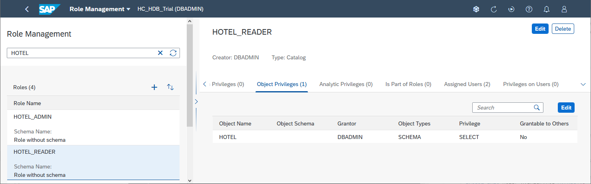
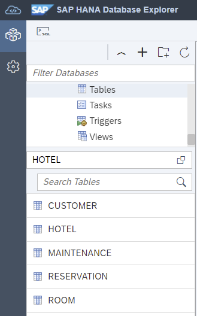
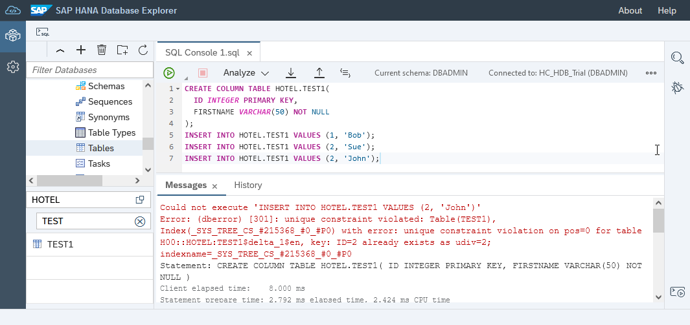
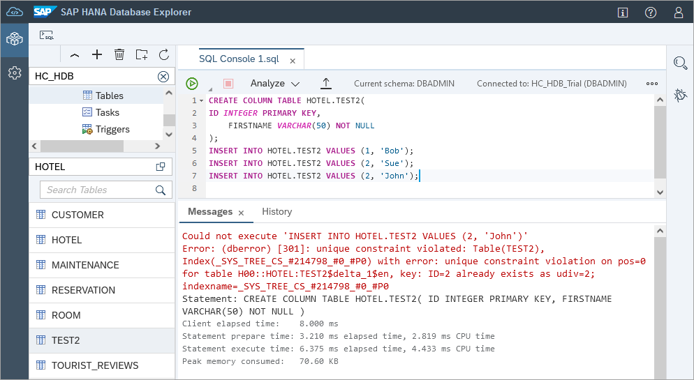
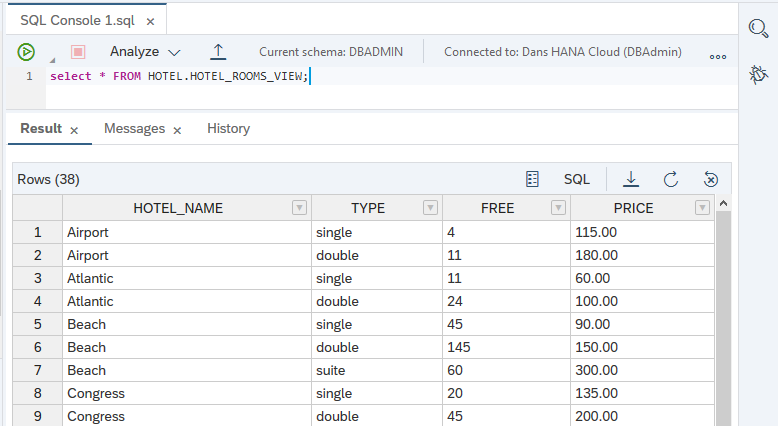
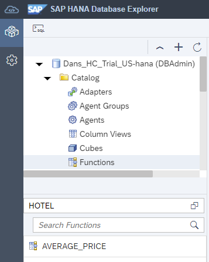
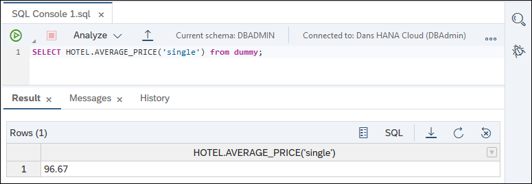
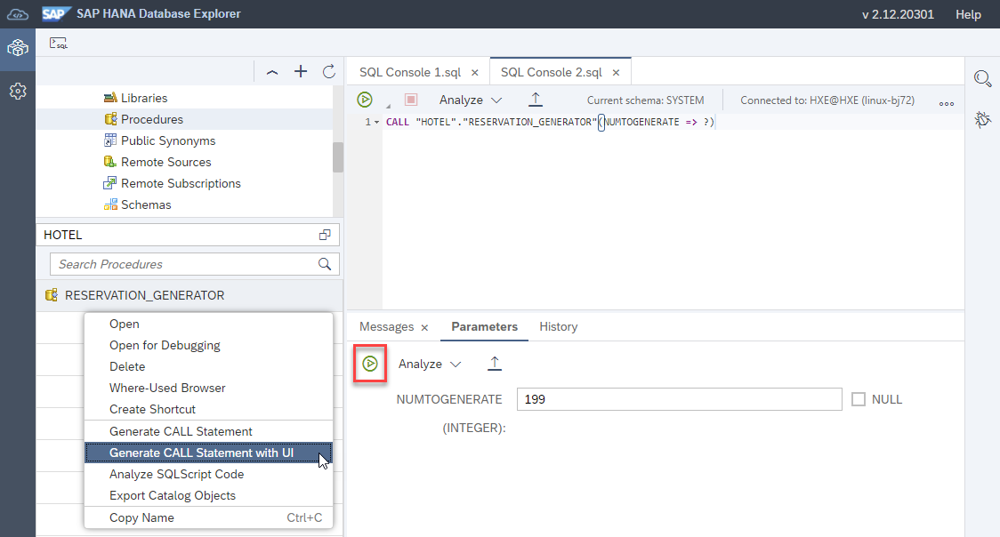

# Create Database Objects with SAP HANA Database Explorer
<!-- description --> Create a user group, users, roles, and populate a sample schema that includes tables, views, functions and procedures using the SQL console.

## Prerequisites
  - An SAP HANA database such as SAP HANA Cloud free tier, trial, or the SAP HANA, express edition that includes the SAP HANA database explorer

## You will learn
  - How to create a user group, users, roles, and a schema
  - How to create tables and import data using insert statements
  - How to create views, functions, and stored procedures

## Intro
The following steps will create a sample hotel dataset using create and insert statements.  The next tutorial will demonstrate some of the ways these objects can be exported or imported.

---

### Create a usergroup, users, roles, and a schema


1. In the SAP HANA database explorer, select the database HC_HDB and open a SQL console. 

    

    Notice that the user in the SQL console is DBADMIN if using SAP HANA Cloud, or SYSTEM if using an on-premise SAP HANA database.  In this step we will create a new user, USER1 that will be used throughout the rest of the tutorials in this tutorial group.

2. Execute the below SQL.

    ```SQL
    CREATE USERGROUP HOTEL_USER_GROUP SET PARAMETER 'minimal_password_length' = '8', 'force_first_password_change' = 'FALSE';
    CREATE USER USER1 PASSWORD Password1 no force_first_password_change SET USERGROUP HOTEL_USER_GROUP;
    CREATE USER USER2 PASSWORD Password2 no force_first_password_change SET USERGROUP HOTEL_USER_GROUP;
    --SELECT * from "PUBLIC"."M_EFFECTIVE_PASSWORD_POLICY" where USER_NAME = 'USER1';
    --SELECT * FROM USERS;

    GRANT CREATE SCHEMA TO USER1;
    --GRANT ROLE ADMIN TO USER1;
    CREATE ROLE HOTEL_ADMIN;
    CREATE ROLE HOTEL_READER;

    GRANT TRUST ADMIN TO HOTEL_ADMIN; -- required to create a PSE
    GRANT CERTIFICATE ADMIN TO HOTEL_ADMIN; --required to create a certificate
    GRANT CREDENTIAL ADMIN TO HOTEL_ADMIN; --required to create a credential
    GRANT EXPORT TO HOTEL_ADMIN; --required to enable export of data
    GRANT IMPORT TO HOTEL_ADMIN; --required to enable import of data
    GRANT CREATE REMOTE SOURCE TO HOTEL_ADMIN; --allow setting the PSE purpose to REMOTE SOURCE and to create REMOTE SOURCES
    GRANT RESOURCE ADMIN TO HOTEL_ADMIN; --allow viewing of diagnostic files
    GRANT CATALOG READ TO HOTEL_ADMIN;   --allow access to system views
    GRANT INIFILE ADMIN TO HOTEL_ADMIN;  --allow altering of system settings

    GRANT HOTEL_ADMIN TO USER1;
    GRANT HOTEL_READER TO USER2;

    CONNECT USER1 PASSWORD Password1;
    CREATE SCHEMA HOTEL;
    GRANT ALL PRIVILEGES ON SCHEMA HOTEL TO HOTEL_ADMIN;
    GRANT SELECT ON SCHEMA HOTEL TO HOTEL_READER;

    --view the objects owned by USER1
    SELECT SCHEMA_NAME, OBJECT_NAME, OBJECT_TYPE, OWNER_NAME FROM "PUBLIC"."OWNERSHIP" WHERE OWNER_NAME = 'USER1';
    ```

    A schema provides a way to group database objects together.  
    
    Privileges can be assigned to users directly or a better practice is to assign users to a role that has a set of privileges.

    It is recommended to not use the DBADMIN user for day-to-day operations in production environments.  Having specific users for specific tasks also will aid in auditing.  For additional details see [Deactivate the DBADMIN User](https://help.sap.com/docs/HANA_CLOUD_DATABAS/f9c5015e72e04fffa14d7d4f7267d897/c511ddf1767947f0adfc9636148718d9.html).

    For additional details on the commands above consult [CREATE USERGROUP Statement](https://help.sap.com/docs/HANA_CLOUD_DATABASE/c1d3f60099654ecfb3fe36ac93c121bb/9869125ea93548009820702f5bd897d8.html), [CREATE USER Statement (Access Control)](https://help.sap.com/viewer/c1d3f60099654ecfb3fe36ac93c121bb/latest/en-US/20d5ddb075191014b594f7b11ff08ee2.html), [CREATE Role Statement](https://help.sap.com/viewer/c1d3f60099654ecfb3fe36ac93c121bb/latest/en-US/20d4a23b75191014a182b123906d5b16.html), and [GRANT Statement](https://help.sap.com/docs/HANA_CLOUD_DATABASE/c1d3f60099654ecfb3fe36ac93c121bb/20f674e1751910148a8b990d33efbdc5.html). The user USER1 will be used in the remainder of this tutorial group.

    >Users and roles can also be managed in the SAP HANA Cloud Cockpit under the User & Role Management tile.  Additional details can be found at [User and Role Management](https://help.sap.com/docs/HANA_CLOUD/9630e508caef4578b34db22014998dba/923b896cabdb415487919f28dbbc4bfd.html).

    >

3. Add another SAP HANA database connection using USER1. 

    Select the Add instance icon and provide the details to connect to your SAP HANA database.  Provide the user name of USER1 and password of Password1 as well as set the schema to be HOTEL in the advanced options. 

    Uncheck the *Verify the server's certificate using the trusted certificate below* checkbox.

    

    Open a new SQL console and notice that it using USER1 and the schema is HOTEL.

    

4. The following example demonstrates the privileges using the newly opened SQL console.  Notice that USER2 does not have the privilege  to perform an insert.

    ```SQL
    CREATE TABLE TEST(
      myValue NVARCHAR(50)
    );
    
    --USER1 has all privileges on the HOTEL schema
    SELECT * FROM TEST; --succeeds
    INSERT INTO TEST VALUES('Value1'); --succeeds
    
    --USER2 can only select
    CONNECT USER2 PASSWORD Password2;
    SET SCHEMA HOTEL;
    SELECT * FROM TEST; --succeeds
    INSERT INTO TEST VALUES('Value2'); --fails
    
    --Remove the unused table
    CONNECT USER1 PASSWORD Password1;
    SET SCHEMA HOTEL;
    DROP TABLE TEST;
    ```

5.  The following statements can be used to delete the schema and objects it contains as well as the users, user group and roles once the tutorials are complete.  

    **Do not execute the below until the tutorials are complete**.  
    
    ```SQL
    -- DO NOT EXECUTE THIS UNLESS YOU WISH TO CLEAN UP THE TUTORIAL OBJECTS
    CONNECT DBADMIN PASSWORD myPassword;
    DROP USER USER1 CASCADE;
    DROP USER USER2 CASCADE;
    DROP USERGROUP HOTEL_USER_GROUP;
    DROP ROLE HOTEL_ADMIN;
    DROP ROLE HOTEL_READER;
    ```
    

### Create and populate tables

1. Create tables that represent a basic hotel administration system by running the SQL statements below in a SQL console connected to USER1 in the schema of HOTEL.

    ```SQL
    --CONNECT USER1 PASSWORD Password1;
    --SET SCHEMA HOTEL;
    
    CREATE COLUMN TABLE HOTEL(
        hno INTEGER PRIMARY KEY,
        name NVARCHAR(50) NOT NULL,
        address NVARCHAR(40) NOT NULL,
        city NVARCHAR(30) NOT NULL,
        state NVARCHAR(2) NOT NULL,
        zip NVARCHAR(6),
        location ST_Point(4326)
    );
    
    CREATE COLUMN TABLE ROOM(
        hno INTEGER,
        type NVARCHAR(6),
        free NUMERIC(3),
        price NUMERIC(6, 2),
        PRIMARY KEY (hno, type),
        FOREIGN KEY (hno) REFERENCES HOTEL
    );

    CREATE COLUMN TABLE CUSTOMER(
        cno INTEGER PRIMARY KEY,
        title NVARCHAR(7),
        firstname NVARCHAR(20),
        name NVARCHAR(40) NOT NULL,
        address NVARCHAR(40) NOT NULL,
        zip NVARCHAR(6)
    );

    CREATE COLUMN TABLE RESERVATION(
        resno INTEGER NOT NULL GENERATED BY DEFAULT AS IDENTITY,
        rno INTEGER NOT NULL,
        cno INTEGER,
        hno INTEGER,
        type NVARCHAR(6),
        arrival DATE NOT NULL,
        departure DATE NOT NULL,
        PRIMARY KEY (
            "RESNO", "ARRIVAL"
        ),
        FOREIGN KEY(cno) REFERENCES CUSTOMER,
        FOREIGN KEY(hno) REFERENCES HOTEL
    );

    CREATE COLUMN TABLE MAINTENANCE(
        mno INTEGER PRIMARY KEY,
        hno INTEGER,
        description NVARCHAR(100),
        date_performed DATE,
        performed_by NVARCHAR(40)
    );

    ```

    > To find the newly created tables in the database browser, select the Tables folder and set the schema to **HOTEL**.  If needed, the contents of the database browser can be updated by pressing the refresh button.
    >
    >

    >---

    >Should you wish to examine the SQL of a table, it can be viewed after selecting a table's context menu **Generate CREATE Statement**.

    >

2. Execute the following SQL statements to add data into the tables in the `HOTEL` schema.

    ```SQL
    INSERT INTO HOTEL VALUES(10, 'Congress', '155 Beechwood St.', 'Seattle', 'WA', '98121', NEW ST_POINT('POINT(-122.347340 47.610546)', 4326));
    INSERT INTO HOTEL VALUES(11, 'Regency', '477 17th Avenue', 'Seattle', 'WA', '98177', NEW ST_POINT('POINT(-122.371104 47.715210)', 4326));
    INSERT INTO HOTEL VALUES(12, 'Long Island', '1499 Grove Street', 'Long Island', 'NY', '11716', NEW ST_POINT('POINT(-73.133741 40.783602)', 4326));
    INSERT INTO HOTEL VALUES(13, 'Empire State', '65 Yellowstone Dr.', 'Albany', 'NY', '12203', NEW ST_POINT('POINT(-73.816182 42.670334)', 4326));
    INSERT INTO HOTEL VALUES(14, 'Midtown', '12 Barnard St.', 'New York', 'NY', '10019', NEW ST_POINT('POINT(-73.987388 40.766153)', 4326));
    INSERT INTO HOTEL VALUES(15, 'Eighth Avenue', '112 8th Avenue', 'New York', 'NY', '10019', NEW ST_POINT('POINT(-73.982495 40.767161)', 4326));
    INSERT INTO HOTEL VALUES(16, 'Lake Michigan', '354 OAK Terrace', 'Chicago', 'IL', '60601', NEW ST_POINT('POINT(-87.623608 41.886403)', 4326));
    INSERT INTO HOTEL VALUES(17, 'Airport', '650 C Parkway', 'Rosemont', 'IL', '60018', NEW ST_POINT('POINT(-87.872209 41.989378)', 4326));
    INSERT INTO HOTEL VALUES(18, 'Sunshine', '200 Yellowstone Dr.', 'Clearwater', 'FL', '33755', NEW ST_POINT('POINT(-82.791689 27.971218)', 4326));
    INSERT INTO HOTEL VALUES(19, 'Beach', '1980 34th St.', 'Daytona Beach', 'FL', '32018', NEW ST_POINT('POINT(-81.043091 29.215968)', 4326));
    INSERT INTO HOTEL VALUES(20, 'Atlantic', '111 78th St.', 'Deerfield Beach', 'FL', '33441', NEW ST_POINT('POINT(-80.106612 26.312141)', 4326));
    INSERT INTO HOTEL VALUES(21, 'Long Beach', '35 Broadway', 'Long Beach', 'CA', '90804', NEW ST_POINT('POINT(-118.158403 33.786721)', 4326));
    INSERT INTO HOTEL VALUES(22, 'Indian Horse', '16 MAIN STREET', 'Palm Springs', 'CA', '92262', NEW ST_POINT('POINT(-116.543342 33.877537)', 4326));
    INSERT INTO HOTEL VALUES(23, 'Star', '13 Beechwood Place', 'Hollywood', 'CA', '90029', NEW ST_POINT('POINT(-118.295017 34.086975)', 4326));
    INSERT INTO HOTEL VALUES(24, 'River Boat', '788 MAIN STREET', 'New Orleans', 'LA', '70112', NEW ST_POINT('POINT(-90.076919 29.957531)', 4326));
    INSERT INTO HOTEL VALUES(25, 'Ocean Star', '45 Pacific Avenue', 'Atlantic City', 'NJ', '08401', NEW ST_POINT('POINT(-74.416135 39.361078)', 4326));
    INSERT INTO HOTEL VALUES(26, 'Delta', '110 Erb St. W', 'Waterloo', 'ON', 'N2L0C6', NEW ST_POINT('POINT(-80.528404 43.463327)', 4326));

    INSERT INTO ROOM VALUES(10, 'single', 20, 135.00);
    INSERT INTO ROOM VALUES(10, 'double', 45, 200.00);
    INSERT INTO ROOM VALUES(12, 'single', 10, 70.00);
    INSERT INTO ROOM VALUES(12, 'double', 13, 100.00);
    INSERT INTO ROOM VALUES(13, 'single', 12, 45.00);
    INSERT INTO ROOM VALUES(13, 'double', 15, 80.00);
    INSERT INTO ROOM VALUES(14, 'single', 20, 85.00);
    INSERT INTO ROOM VALUES(14, 'double', 35, 140.00);
    INSERT INTO ROOM VALUES(15, 'single', 50, 105.00);
    INSERT INTO ROOM VALUES(15, 'double', 230, 180.00);
    INSERT INTO ROOM VALUES(15, 'suite', 12, 500.00);
    INSERT INTO ROOM VALUES(16, 'single', 10, 120.00);
    INSERT INTO ROOM VALUES(16, 'double', 39, 200.00);
    INSERT INTO ROOM VALUES(16, 'suite', 20, 500.00);
    INSERT INTO ROOM VALUES(17, 'single', 4, 115.00);
    INSERT INTO ROOM VALUES(17, 'double', 11, 180.00);
    INSERT INTO ROOM VALUES(18, 'single', 15, 90.00);
    INSERT INTO ROOM VALUES(18, 'double', 19, 150.00);
    INSERT INTO ROOM VALUES(18, 'suite', 5, 400.00);
    INSERT INTO ROOM VALUES(19, 'single', 45, 90.00);
    INSERT INTO ROOM VALUES(19, 'double', 145, 150.00);
    INSERT INTO ROOM VALUES(19, 'suite', 60, 300.00);
    INSERT INTO ROOM VALUES(20, 'single', 11, 60.00);
    INSERT INTO ROOM VALUES(20, 'double', 24, 100.00);
    INSERT INTO ROOM VALUES(21, 'single', 2, 70.00);
    INSERT INTO ROOM VALUES(21, 'double', 10, 130.00);
    INSERT INTO ROOM VALUES(22, 'single', 34, 80.00);
    INSERT INTO ROOM VALUES(22, 'double', 78, 140.00);
    INSERT INTO ROOM VALUES(22, 'suite', 55, 350.00);
    INSERT INTO ROOM VALUES(23, 'single', 89, 160.00);
    INSERT INTO ROOM VALUES(23, 'double', 300, 270.00);
    INSERT INTO ROOM VALUES(23, 'suite', 100, 700.00);
    INSERT INTO ROOM VALUES(24, 'single', 10, 125.00);
    INSERT INTO ROOM VALUES(24, 'double', 9, 200.00);
    INSERT INTO ROOM VALUES(24, 'suite', 78, 600.00);
    INSERT INTO ROOM VALUES(25, 'single', 44, 100.00);
    INSERT INTO ROOM VALUES(25, 'double', 115, 190.00);
    INSERT INTO ROOM VALUES(25, 'suite', 6, 450.00);

    INSERT INTO CUSTOMER VALUES(1000, 'Mrs', 'Jenny', 'Porter', '1340 N. Ash Street, #3', '10580');
    INSERT INTO CUSTOMER VALUES(1001, 'Mr', 'Peter', 'Brown', '1001 34th St., APT.3', '48226');
    INSERT INTO CUSTOMER VALUES(1002, 'Company', NULL, 'Datasoft', '486 Maple St.', '90018');
    INSERT INTO CUSTOMER VALUES(1003, 'Mrs', 'Rose', 'Brian', '500 Yellowstone Drive, #2', '75243');
    INSERT INTO CUSTOMER VALUES(1004, 'Mrs', 'Mary', 'Griffith', '3401 Elder Lane', '20005');
    INSERT INTO CUSTOMER VALUES(1005, 'Mr', 'Martin', 'Randolph', '340 MAIN STREET, #7', '60615');
    INSERT INTO CUSTOMER VALUES(1006, 'Mrs', 'Sally', 'Smith', '250 Curtis Street', '75243');
    INSERT INTO CUSTOMER VALUES(1007, 'Mr', 'Mike', 'Jackson', '133 BROADWAY APT. 1', '45211');
    INSERT INTO CUSTOMER VALUES(1008, 'Mrs', 'Rita', 'Doe', '2000 Humboldt St., #6', '97213');
    INSERT INTO CUSTOMER VALUES(1009, 'Mr', 'George', 'Howe', '111 B Parkway, #23', '75243');
    INSERT INTO CUSTOMER VALUES(1010, 'Mr', 'Frank', 'Miller', '27 5th St., 76', '95054');
    INSERT INTO CUSTOMER VALUES(1011, 'Mrs', 'Susan', 'Baker', '200 MAIN STREET, #94', '90018');
    INSERT INTO CUSTOMER VALUES(1012, 'Mr', 'Joseph', 'Peters', '700 S. Ash St., APT.12', '92714');
    INSERT INTO CUSTOMER VALUES(1013, 'Company', NULL, 'TOOLware', '410 Mariposa St., #10', '20019');
    INSERT INTO CUSTOMER VALUES(1014, 'Mr', 'Antony', 'Jenkins', '55 A Parkway, #15', '20903');

    INSERT INTO RESERVATION VALUES(1, 100, 1000, 11, 'single', '2020-12-24', '2020-12-27');
    INSERT INTO RESERVATION VALUES(2, 110, 1001, 11, 'double', '2020-12-24', '2021-01-03');
    INSERT INTO RESERVATION VALUES(3, 120, 1002, 15, 'suite', '2020-11-14', '2020-11-18');
    INSERT INTO RESERVATION VALUES(4, 130, 1009, 21, 'single', '2019-02-01', '2019-02-03');
    INSERT INTO RESERVATION VALUES(5, 150, 1006, 17, 'double', '2019-03-14', '2019-03-24');
    INSERT INTO RESERVATION VALUES(6, 140, 1013, 20, 'double', '2020-04-12', '2020-04-30');
    INSERT INTO RESERVATION VALUES(7, 160, 1011, 17, 'single', '2020-04-12', '2020-04-15');
    INSERT INTO RESERVATION VALUES(8, 170, 1014, 25, 'suite', '2020-09-01', '2020-09-03');
    INSERT INTO RESERVATION VALUES(9, 180, 1001, 22, 'double', '2020-12-23', '2021-01-08');
    INSERT INTO RESERVATION VALUES(10, 190, 1013, 24, 'double', '2020-11-14', '2020-11-17');

    INSERT INTO MAINTENANCE VALUES(10, 24, 'Replace pool liner and pump', '2019-03-21', 'Discount Pool Supplies');
    INSERT INTO MAINTENANCE VALUES(11, 25, 'Renovate the bar area.  Replace TV and speakers', '2020-11-29', 'TV and Audio Superstore');
    INSERT INTO MAINTENANCE VALUES(12, 26, 'Roof repair due to storm', null, null);
    ```

    For additional details see [CREATE Table statement](https://help.sap.com/viewer/c1d3f60099654ecfb3fe36ac93c121bb/cloud/en-US/20d58a5f75191014b2fe92141b7df228.html) and [Insert Statement](https://help.sap.com/viewer/c1d3f60099654ecfb3fe36ac93c121bb/cloud/en-US/20f7f70975191014a76da70c9181720e.html).

 3. The data can now be queried.

    Identifiers such as table names are automatically upper cased unless they are within "".  

    ```SQL
    SELECT * FROM RoOm;  --succeeds
    SELECT * FROM "RoOm"; --fails
    SELECT * FROM "ROOM"; --succeeds
    ```

    

    For further details, consult [Identifiers and case sensitivity](https://help.sap.com/viewer/c1d3f60099654ecfb3fe36ac93c121bb/latest/en-US/209f5020751910148fd8fe88aa4d79d9.html?q=case#loio209f5020751910148fd8fe88aa4d79d9__identifiers_case).


### Explore auto-commit

Auto-commit is a setting that when enabled, causes each SQL statement to be immediately committed to the database.  When auto-commit is turned off, multiple statements can be executed and then they can all be committed together, or they can all be rolled back.  There are two auto-commit settings in an SAP HANA database.   

The first setting which can be set in the SQL console, applies to SQL statements that manipulate data such as insert, update, or delete statements.  These types of statements are known as Data Manipulation Language (DML).  The second setting can be set via SQL applies to SQL statements that modify database schema such create table statements or alter table statements.  These types of statements are known as Data Definition Language (DDL).


The following steps will demonstrate these settings.

1. Execute the following SQL statements.  By default, auto-commit is on.

    ```SQL
    CREATE COLUMN TABLE TEST1(
      ID INTEGER PRIMARY KEY,
      FIRSTNAME NVARCHAR(50) NOT NULL
    );
    INSERT INTO TEST1 VALUES (1, 'Bob');
    INSERT INTO TEST1 VALUES (2, 'Sue');
    INSERT INTO TEST1 VALUES (2, 'John');  --fails due to duplicate primary key
    --DROP TABLE TEST1;
    ```

    An error will occur, and the table TEST1 will exist with two rows.  To undo the operation, the table can be deleted.  Notice that the table TEST1 appears in the catalog browser.

    

2. In the SQL console, set auto-commit off.

    

3. Execute the following SQL statements.

    ```SQL
    CREATE COLUMN TABLE TEST2(
    ID INTEGER PRIMARY KEY,
        FIRSTNAME NVARCHAR(50) NOT NULL
    );
    INSERT INTO TEST2 VALUES (1, 'Bob');
    INSERT INTO TEST2 VALUES (2, 'Sue');
    INSERT INTO TEST2 VALUES (2, 'John');  --fails due to duplicate primary key
    --DROP TABLE TEST2;
    ```

    An error will occur, and you can then decide to undo all the inserted rows from the table TEST1 by executing a `ROLLBACK`; or you have the option to keep the successfully inserted rows by executing a `COMMIT`.

    

    Until a COMMIT is executed, the table will appear to have no rows inserted when viewed from another SQL console or database connection.

    Additional details can be found at [ROLLBACK Statement](https://help.sap.com/viewer/c1d3f60099654ecfb3fe36ac93c121bb/latest/en-US/20fcc453751910149557fc90fe781449.html) and [COMMIT Statement](https://help.sap.com/viewer/c1d3f60099654ecfb3fe36ac93c121bb/latest/en-US/20d39db97519101480e7f9b76f48c2c4.html).

3. Execute the following SQL statements.

    ```SQL
    SET TRANSACTION AUTOCOMMIT DDL OFF;
    CREATE COLUMN TABLE TEST3(
      ID INTEGER PRIMARY KEY,
      FIRSTNAME NVARCHAR(50) NOT NULL
    );
    INSERT INTO TEST3 VALUES (1, 'Bob');
    INSERT INTO TEST3 VALUES (2, 'Sue');
    SELECT * FROM TEST3;
    INSERT INTO TEST3 VALUES (2, 'John');
    --DROP TABLE TEST3;
    ```

    An error will occur and you can then decide to undo the inserted rows and the table creation by executing a `ROLLBACK;` or you have the option to keep the successfully created table and rows by executing a `COMMIT`.

    Until a COMMIT is executed, the table will not appear in another SQL console or in the catalog browser.

    >The following query can be used to determine if AUTOCOMMIT DDL is enabled.  
    >
    ```SQL
    SELECT 	key, value
    FROM m_session_context
    WHERE connection_id = current_connection
    	AND key = 'DDL_AUTO_COMMIT';
    ```

    Additional details can be found at [SET TRANSACTION AUTOCOMMIT DDL Statement](https://help.sap.com/viewer/c1d3f60099654ecfb3fe36ac93c121bb/latest/en-US/d538d11053bd4f3f847ec5ce817a3d4c.html).

4. Ensure both settings are back to their default values before continuing.

    

    ```SQL
    SET TRANSACTION AUTOCOMMIT DDL ON;
    ```


### Create a partition


Partitions can be created to divide the data in a large table into smaller parts.  

1. Execute the following SQL statement to create one partition that contains older reservations and one that contains reservations made in 2020 or later.  

    ```SQL
    ALTER TABLE RESERVATION PARTITION BY RANGE(ARRIVAL)
    ((
        PARTITION '2000-01-01' <= VALUES < '2020-01-01',
        PARTITION OTHERS
    ));
    ```

    In the example in this section, older reservation data will be stored on disk rather than in memory.  Other reasons for partitioning include load balancing across multiple hosts and the 2 billion row size limit on a non-partitioned table.  For more details see [Table Partitioning](https://help.sap.com/viewer/f9c5015e72e04fffa14d7d4f7267d897/cloud/en-US/c2ea130bbb571014b024ffeda5090764.html) and [SAP Note: 2044468 - FAQ: SAP HANA Partitioning](https://launchpad.support.sap.com/#/notes/2044468).

2. Execute the following SQL to make the partition containing older reservations  loadable from disk using [Native Storage Extensions (NSE)](https://help.sap.com/viewer/f9c5015e72e04fffa14d7d4f7267d897/cloud/en-US/786c621dd35e4534a2f955bf2f04a2e2.html).

    ```SQL
    ALTER TABLE RESERVATION ALTER PARTITION 1 PAGE LOADABLE;
    ```

    The partition information can be seen in the **Runtime Information** tab of the reservation table, which can be shown by right-clicking on the reservation table and choosing **Open**.

    

    The following select statement shows the load unit type of columns in the schema HOTEL.

    ```SQL
    SELECT TABLE_NAME, PART_ID, COLUMN_NAME, LOAD_UNIT FROM M_CS_COLUMNS WHERE SCHEMA_NAME = 'HOTEL';
    ```

    

    Notice above that the partition 1 (containing older reservations) is page loadable and partition 2 (containing recent reservations) is column loadable.  

For further information see [Reduce the Memory Footprint Using Page-Loadable Columns](https://help.sap.com/viewer/f9c5015e72e04fffa14d7d4f7267d897/cloud/en-US/786c621dd35e4534a2f955bf2f04a2e2.html) and SAP Note: [2799997 - FAQ: SAP HANA Native Storage Extension (NSE)](https://launchpad.support.sap.com/#/notes/2799997).  

Another option for data that is accessed less frequently is the SAP HANA Data Lake.  Additional information on when to use Native Store Extensions and Data Lake can be found at [Introduction to SAP HANA Cloud - Storage Options](https://help.sap.com/viewer/db19c7071e5f4101837e23f06e576495/cloud/en-US/7a27607b08ba46d5b253365e703b1c1a.html#loio7a27607b08ba46d5b253365e703b1c1a__section_storage_options).


### Create views


1. Views can be created to combine columns from multiple tables into one view or to provide access to certain columns of a table.  Executing the following SQL statements creates a view that displays all information from the reservation table. The joins allow for more information about the customer and hotel to be displayed.

    ```SQL
    CREATE OR REPLACE VIEW RESERVATION_VIEW AS
    	SELECT
    		R.RESNO,
    		H.NAME AS HOTEL_NAME,
        R.ARRIVAL,
        R.DEPARTURE,
    		CUS.TITLE,
    		CUS.FIRSTNAME,
    		CUS.NAME AS CUSTOMER_NAME,
    		CUS.ADDRESS AS CUSTOMER_ADDRESS
    	FROM RESERVATION R
    		LEFT JOIN HOTEL H ON H.HNO = R.HNO
    		LEFT JOIN CUSTOMER CUS ON CUS.CNO = R.CNO
      ORDER BY H.NAME, R.ARRIVAL DESC;
    ```

2. The result of querying `RESERVATION_VIEW` can be seen below.

    ```SQL
    SELECT * FROM RESERVATION_VIEW;
    ```

    

3. The following view displays information about hotel rooms.

    ```SQL
    CREATE OR REPLACE VIEW HOTEL_ROOMS_VIEW AS
    	SELECT
    		H.NAME AS HOTEL_NAME,
    		R.TYPE,
    		R.FREE,
    		R.PRICE
    	FROM ROOM R
    		LEFT JOIN HOTEL H ON R.HNO = H.HNO
            ORDER BY H.NAME;
    ```

    > To find the newly created views in the database browser, select the **Views** folder.
    >
    > 

4. The result of calling `HOTEL_ROOMS_VIEW` can be seen below.

    ```SQL
    SELECT * FROM HOTEL_ROOMS_VIEW;
    ```

    

    For additional details see [CREATE VIEW Statement (Data Definition)](https://help.sap.com/viewer/c1d3f60099654ecfb3fe36ac93c121bb/latest/en-US/20d5fa9b75191014a33eee92692f1702.html).


### Create functions and stored procedures


1. User-defined functions and procedures can be used to save a set of SQL statements.  Functions are considered read-only in that they cannot make modifications to the data.  Stored procedures can modify the data using DDL or DML statements.

    Execute the following SQL to create a function that calculates the average price of a specific room type.

    ```SQL
    CREATE OR REPLACE FUNCTION AVERAGE_PRICE(room_type CHAR(6))
    RETURNS avg_price NUMERIC(6, 2)
    AS
    BEGIN
        DECLARE EXIT HANDLER FOR SQLEXCEPTION avg_price := '-1';
        SELECT TO_DECIMAL(ROUND(sum(PRICE)/COUNT(*), 2, ROUND_HALF_UP)) INTO avg_price FROM ROOM WHERE TYPE = :room_type GROUP BY TYPE;
    END;
    ```

    > To find the newly created function in the database browser, select the **Functions** folder.
    >
    > 

    >---

    >Should you wish to examine the SQL of a function, it can be viewed after selecting a functions' context menu **Open**.

    >

2. An example of how to use the `Average_Price` function is shown below:

    ```SQL
    SELECT AVERAGE_PRICE('single') from dummy;
    ```

    

    For additional details see [User-Defined Functions](https://help.sap.com/viewer/d1cb63c8dd8e4c35a0f18aef632687f0/cloud/en-US/765815cd7d214ed38c190dc2f570fe39.html).

3. Functions such as the one above that return single defined values are know as scalar user defined functions.  Table user defined functions can return a tabular result set.  The following is an example of user defined function that returns results in a table format.

    ```SQL
    CREATE FUNCTION PAST_VISITS (CNO INT)
    RETURNS TABLE (FIRSTNAME NVARCHAR(20), NAME NVARCHAR(40), HOTEL_NAME NVARCHAR(50), ARRIVAL DATE, STAY_DURATION INT) LANGUAGE SQLSCRIPT AS
    BEGIN
        RETURN SELECT C.FIRSTNAME, C.NAME, H.NAME AS HOTEL_NAME, R.ARRIVAL, DAYS_BETWEEN(R.ARRIVAL, R.DEPARTURE) as STAY_DURATION
            FROM HOTEL H, RESERVATION R, CUSTOMER C
            WHERE C.CNO = R.CNO AND R.ARRIVAL <= CURRENT_DATE AND R.CNO = :CNO AND R.HNO= H.HNO
            ORDER BY R.ARRIVAL DESC;
    END;

    SELECT * FROM PAST_VISITS(1001);
    ```

4. Stored procedures can be used to save SQL statements.  They can contain control statements and can have parameters.  The following stored procedure generates and inserts reservations into the `RESERVATION` table. In order to run, a parameter must be entered that identifies the number of reservations to insert.

    ```SQL
    CREATE OR REPLACE PROCEDURE RESERVATION_GENERATOR(
        IN numToGenerate INTEGER
    )
    	LANGUAGE SQLSCRIPT AS
    BEGIN
    	USING SQLSCRIPT_PRINT AS PRTLIB;
    	DECLARE val INT :=0;
    	DECLARE stmt NVARCHAR(256) := '';
    	DECLARE rno INT :=0;
    	DECLARE cno INT :=0;
    	DECLARE hno INT :=0;
    	DECLARE roomType STRING := '';
    	DECLARE arriveDate DATE := null;
    	DECLARE arriveDateString STRING := '';
    	DECLARE departDate DATE := null;
    	DECLARE departDateString STRING := '';
    	DECLARE randomDaysFromCurrent INT :=0;
    	DECLARE randomLengthOfStay INT :=0;
    	DECLARE rType INT :=0;
    	DECLARE EXIT HANDLER FOR SQL_ERROR_CODE 301
    	SELECT ::SQL_ERROR_CODE, ::SQL_ERROR_MESSAGE FROM DUMMY;
    	WHILE (val < numToGenerate) DO
    		-- generate random room number from 100-300
    		rno := FLOOR(RAND_SECURE() * 201) + 100;
    		-- generate random customer number from 1000-1014
    		cno := FLOOR(RAND_SECURE() * 15) + 1000;
    		-- generate random hotel number from 10-26
    		hno := FLOOR(RAND_SECURE() * 17) + 10;
    		-- generate random number from 1-3 to determine room type
    		rType := FLOOR(RAND_SECURE() * 3) + 1;
    		IF (rType = 1) THEN
    			roomType := '''single''';
    		ELSEIF (rType = 2) THEN
    			roomType := '''double''';
    		ELSEIF (rType = 3) THEN
    			roomType := '''suite''';
    		END IF;

            -- generate random number of days to be used for arrival date.  
    		-- date range is one year in the past to one year in the future
    		randomDaysFromCurrent := FLOOR(RAND_SECURE() * 730) + 1 - 365;
    		arriveDate := ADD_DAYS( TO_DATE( CURRENT_DATE, 'YYYY-MM-DD' ), randomDaysFromCurrent );
    		arriveDateString := '''' || TO_NVARCHAR( arriveDate, 'YYYY-MM-DD' ) || '''';
    		-- generate a random number of days to stay
    		randomLengthOfStay := FLOOR(RAND_SECURE() * 7) + 1;
    		departDate := ADD_DAYS( arriveDate, randomLengthOfStay );
    		departDateString := '''' || TO_NVARCHAR( departDate, 'YYYY-MM-DD' ) || '''';

            -- Reservations Columns: RNO, CNO, HNO, Type, Arrival, Departure
    		stmt := 'INSERT INTO RESERVATION (RNO, CNO, HNO, TYPE, ARRIVAL, DEPARTURE) VALUES(' || rno || ',' || cno || ',' || hno || ',' || roomType || ',' || arriveDateString || ',' || departDateString || ');';
    		PRTLIB:PRINT_LINE(stmt);
    		EXEC(stmt);
    		val := val + 1;
    	END WHILE;
      PRTLIB:PRINT_LINE('Rows inserted: ' || val);
    END;
    ```

    Details on SQL Error codes such as 301 ERR_SQL_UNIQUE_VIOLATED can be found at [SAP HANA Cloud, SAP HANA Database SQL Reference Guide](https://help.sap.com/docs/HANA_CLOUD_DATABASE/c1d3f60099654ecfb3fe36ac93c121bb/20a78d3275191014b41bae7c4a46d835.html).

5. To run this procedure, execute the SQL statement below.

    ```SQL
    CALL RESERVATION_GENERATOR(NUMTOGENERATE => 100);
    ```

    

    Once the procedure has been successfully executed, notice that dates both in the past and future are generated.  

    Another way to run this procedure is to generate a CALL statement using the UI. Right-click the procedure name and select **Generate CALL Statement With UI**.  

    

    The parameters are listed in the parameters tab and once they are manually filled in or loaded from a file, the procedure can be called.

    For additional details see [Procedures](https://help.sap.com/viewer/d1cb63c8dd8e4c35a0f18aef632687f0/cloud/en-US/d43d91578c3b42b3bacfd89aacf0d62f.html).

6. Procedures can also be scheduled in SAP HANA Cloud. Schedule a job using the code provided below. 

    ```SQL
    SELECT CURRENT_DATE, CURRENT_TIME FROM DUMMY;  --be sure to schedule an event in the future
    CREATE SCHEDULER JOB GEN_RESERVATIONS_JOB CRON '2023 04 26 * 14 25 0' ENABLE PROCEDURE RESERVATION_GENERATOR PARAMETERS numtogenerate=10;
    SELECT * FROM SCHEDULER_JOBS WHERE SCHEDULER_JOB_NAME = 'GEN_RESERVATIONS_JOB';
    ```
    

    Details about the scheduled job can also be viewed including its properties, parameters, history, and CREATE statement by opening the **Job Scheduler** in the Catalog Browser and clicking on your scheduled job. Ensure you are filtering by the HOTEL schema. Additionally, you have the ability to disable/enable the scheduled job.

    
    
    For additional details see [Scheduling Administrative Tasks](https://help.sap.com/viewer/f9c5015e72e04fffa14d7d4f7267d897/latest/en-US/be4c214b87e54a08bd8047f6149645ec.html) and [CREATE SCHEDULER JOB Statement](https://help.sap.com/viewer/c1d3f60099654ecfb3fe36ac93c121bb/latest/en-US/d7d43d818366460dae1328aab5d5df4f.html).


### Knowledge check

Congratulations! You have now created tables and inserted data, as well as created partitions, views, functions, stored procedures, and scheduled jobs. 
